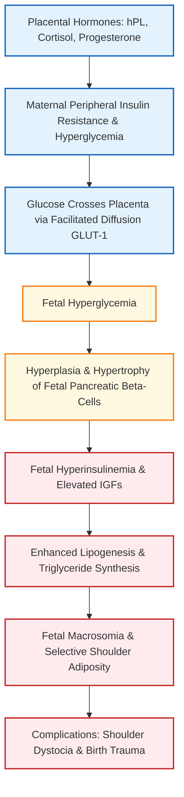
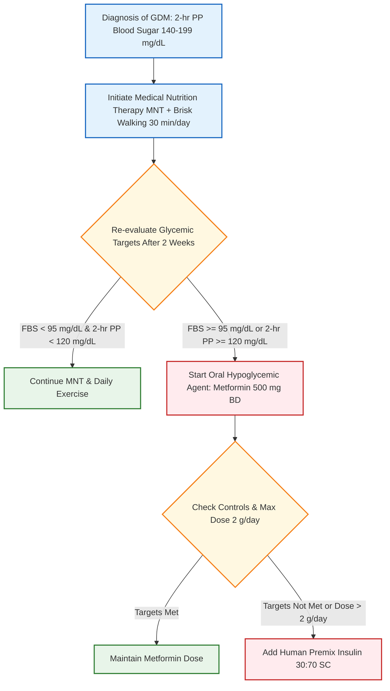

[[Medical and surgical illness]]
# Gestational Diabetes Mellitus (GDM) [⭐ High-Yield]

### Mark Weightage

- **10 Marks / Long Answer Depth** (defaulted as weightage was unspecified)

---

### 1. Definition [⭐ High-Yield]

- **Gestational Diabetes Mellitus (GDM)** is defined as **carbohydrate intolerance** of variable severity with onset or first recognition during the present pregnancy.
- It usually presents late in the **second trimester** or during the **third trimester** (typically at **24–28 weeks**) due to peak surge of placental contrainsulin hormones.
- It excludes women who had pre-existing overt diabetes prior to pregnancy, though it may resolve or persist after delivery.

---

### 2. Etiology / Causes / Risk Factors [⭐ High-Yield]

- **Diabetogenic State of Pregnancy**: Driven by placental hormones that cause marked peripheral **insulin resistance**and **\(\beta\)-cell dysfunction**:
    - **Human Placental Lactogen (hPL)** (primary hormone)
    - **Estrogen** and **Progesterone**
    - **Free Cortisol** and **Prolactin**
    - **Tumor Necrosis Factor-alpha (TNF-\(\alpha\))** (inversely correlated with insulin sensitivity)
    - Placental **insulinase** enzyme (increases insulin degradation)
- **Maternal Risk Factors**:
    - **Family history of diabetes** (parents, siblings, uncles, aunts, or grandparents)
    - **Previous birth of a macrosomic baby** (\(\mathbf{\ge 4.0\text{ kg}}\) or \(\mathbf{\ge 4.5\text{ kg}}\))
    - **Previous GDM**, unexplained **stillbirth**, **intrauterine fetal death (IUFD)**, or pancreatic islet hyperplasia on autopsy
    - **Maternal obesity** (\(\mathbf{BMI \ge 25\text{ kg/m}^2}\) or \(\mathbf{\ge 30\text{ kg/m}^2}\)) and maternal age **\(>30\text{ years}\)**
    - **Polycystic Ovarian Syndrome (PCOS)** and pre-existing **hypertension** (\(\mathbf{\ge 140/90\text{ mmHg}}\))
    - **Polyhydramnios**, **recurrent vulvovaginal candidiasis**, or persistent **glycosuria** in present pregnancy
    - High-risk ethnicity (East Asian, Pacific Islander ancestry)

---

### 3. Classification

- **Priscilla White's Classification of Diabetes in Pregnancy**:

|Class|Onset / Criteria|Fasting Plasma Glucose (FPG)|2-Hour Postprandial (PP)|Treatment Strategy|
|:--|:--|:--|:--|:--|
|**Class A1**|**Gestational Diabetes (GDM)**|**\(<105\text{ mg/dL}\)** (\(<95\text{ mg/dL}\))|**\(<120\text{ mg/dL}\)**|**Medical Nutrition Therapy (MNT) / Diet**alone|
|**Class A2**|**Gestational Diabetes (GDM)**|**\(>105\text{ mg/dL}\)**|**\(>120\text{ mg/dL}\)**|**Pharmacotherapy**(**Insulin** or **Metformin**)|
|**Class B**|Pre-gestational (Onset age \(>20\text{ yrs}\), duration \(<10\text{ yrs}\))|Elevated|Elevated|**Insulin**|
|**Class C**|Pre-gestational (Onset age \(10-19\text{ yrs}\), duration \(10-19\text{ yrs}\))|Elevated|Elevated|**Insulin**|
|**Class D**|Pre-gestational (Onset age \(<10\text{ yrs}\) or duration \(>20\text{ yrs}\))|Elevated|Elevated|**Insulin** + vascular monitoring|
|**Class F**|Pre-gestational with **Nephropathy**(proteinuria \(>500\text{ mg/24 hr}\))|Elevated|Elevated|**Insulin**|
|**Class R**|Pre-gestational with **Proliferative Retinopathy**|Elevated|Elevated|**Insulin** + Laser Photocoagulation|
|**Class H**|Pre-gestational with **Coronary Artery Disease**|Elevated|Elevated|**Insulin**|
|**Class T**|Pre-gestational after **Renal Transplant**|Elevated|Elevated|**Insulin**|

---

### 4. Pathophysiology (Pedersen Hypothesis) [⭐ High-Yield]

- **Maternal Hyperglycemia**: Contrainsulin hormones (**hPL**, **cortisol**, **progesterone**) induce peripheral insulin resistance in the mother.
- **Placental Transport**: **Maternal glucose crosses the placenta** via **facilitated diffusion (GLUT-1 transporters)**. Maternal insulin **does NOT cross the placenta**.
- **Fetal Hyperinsulinemia**: Excessive glucose influx causes **fetal hyperglycemia**, which stimulates hypertrophy and hyperplasia of **fetal pancreatic \(\beta\)-islet cells**.
- **Anabolic Growth Surge**: High **fetal insulin** and **Insulin-like Growth Factors (IGF-1 & IGF-2)** act as potent growth hormones, stimulating glucose utilization, glycogen storage, and lipolysis inhibition.
- **Adiposity & Macrosomia**: Excessive fat deposition occurs selectively around the fetal shoulders and trunk, leading to **fetal macrosomia** and **shoulder dystocia**.
- **Absence of Malformations**: In true GDM, hyperglycemia develops **after organogenesis** (\(>20-24\text{ weeks}\)), so **gross congenital anomalies (GCA) do NOT occur**.

---

### 5. Clinical Features

- **Symptoms**:
    - Most patients are **asymptomatic** and detected on routine screening.
    - Classic diabetic symptoms (when severe): **polyuria**, **polydipsia**, **polyphagia**, and **unexplained weight loss**.
    - Hypoglycemic episodes (if on treatment): **tremors**, **sweating**, **palpitations**, **extreme fatigue**, and **tingling sensation**.
- **Signs**:
    - **Symphysis-Fundal Height (SFH)** greater than period of amenorrhea (due to **macrosomia** or **polyhydramnios**).
    - Excessive maternal weight gain (\(>0.5\text{ kg/week}\)).
    - Vulvovaginal **candidiasis** (pruritus vulvae with thick curdy white discharge).

---

### 6. Diagnosis / Investigations [⭐ High-Yield]

#### Diagnostic Strategy & Timing

- **Universal Screening**: Recommended for all pregnant women between **24–28 weeks of gestation**.
- **High-Risk Screening**: Conducted at the **first antenatal visit**; if normal, repeat at **24–28 weeks**.

#### DIPSI Criteria (Government of India Recommended Single-Step Test)

- **Procedure**: Single-step non-fasting test.
    - Patient is given **\(75\text{ g}\) oral anhydrous glucose** dissolved in **\(300\text{ mL}\) water**, swallowed over **5–10 minutes**, **irrespective of time of last meal**.
    - Venous blood sample drawn at **2 hours** and measured using a plasma-calibrated glucometer.
    - If patient vomits within 30 minutes, repeat test on another day; if vomits after 30 minutes, continue test.
- **Diagnostic Cut-Off Values (2-Hour Postprandial Blood Glucose)**:
    - **\(<140\text{ mg/dL}\)**: Normal glucose tolerance (repeat at **24–28 weeks**).
    - **\(\ge 140\text{ mg/dL}\) to \(199\text{ mg/dL}\)**: Diagnosed as **Gestational Diabetes Mellitus (GDM)**.
    - **\(\ge 200\text{ mg/dL}\)**: Diagnosed as **Pre-Gestational / Overt Diabetes** (requires immediate insulin).

#### Comparison of Diagnostic Criteria for GDM

|Diagnostic Criteria|Glucose Load|Fasting Cut-Off|1-Hour Cut-Off|2-Hour Cut-Off|3-Hour Cut-Off|Diagnostic Requirement|
|:--|:--|:--|:--|:--|:--|:--|
|**DIPSI Criteria**|**\(75\text{ g}\) (Non-fasting)**|N/A|N/A|**\(\ge 140\text{ mg/dL}\)**|N/A|**Single value \(\ge 140\text{ mg/dL}\)**|
|**IADPSG Criteria**|**\(75\text{ g}\) (Fasting)**|**\(\ge 92\text{ mg/dL}\)**|**\(\ge 180\text{ mg/dL}\)**|**\(\ge 153\text{ mg/dL}\)**|N/A|**\(\ge 1\) abnormal value**|
|**Carpenter-Coustan**|**\(100\text{ g}\) (Fasting)**|**\(\ge 95\text{ mg/dL}\)**|**\(\ge 180\text{ mg/dL}\)**|**\(\ge 155\text{ mg/dL}\)**|**\(\ge 140\text{ mg/dL}\)**|**\(\ge 2\) abnormal values**|
|**NDDG Criteria**|**\(100\text{ g}\) (Fasting)**|**\(\ge 105\text{ mg/dL}\)**|**\(\ge 190\text{ mg/dL}\)**|**\(\ge 165\text{ mg/dL}\)**|**\(\ge 145\text{ mg/dL}\)**|**\(\ge 2\) abnormal values**|
|**WHO Criteria**|**\(75\text{ g}\) (Fasting)**|**\(\ge 100-125\text{ mg/dL}\)**|N/A|**\(\ge 140-199\text{ mg/dL}\)**|N/A|**2-hour value \(\ge 140\text{ mg/dL}\)**|

#### Glycemic Control Targets in Pregnancy

- **Fasting Blood Sugar (FBS)**: **\(<95\text{ mg/dL}\)**
- **1-Hour Postprandial (PP)**: **\(<140\text{ mg/dL}\)**
- **2-Hour Postprandial (PP)**: **\(<120\text{ mg/dL}\)**
- **Mean Capillary Blood Glucose**: **\(<100\text{ mg/dL}\)**
- **Glycosylated Hemoglobin (\(\text{HbA1c}\))**: **\(<6.0%\)** (\(\ge 6.5%\) indicates overt pre-gestational DM)

#### Maternal & Fetal Monitoring Investigations

- **Targeted Scan for Fetal Anomalies (TIFFA / Level II USG)**: Performed at **18–20 weeks**.
- **Serial Growth Ultrasound**: Done every 3 weeks (specifically at **28–30 weeks** and **34–36 weeks**) to monitor **fetal abdominal circumference (AC)**, **estimated fetal weight (EFW)**, **polyhydramnios**, and **placentomegaly**.
- **Fetal Echocardiography**: **NOT required in GDM** (no risk of congenital structural heart defects), performed only in Pre-GDM.
- **Urine Routine & Microscopy**: Done every trimester to rule out **asymptomatic bacteriuria**.
- **Antenatal Fetal Surveillance (Starting at 32 Weeks)**:
    - Weekly **Non-Stress Test (NST)**
    - Weekly **Biophysical Profile (BPP / BPS)**
    - **Daily Fetal Movement Count (DFMC)** / Kick Chart
    - **Umbilical Artery Doppler**: Indicated if GDM is complicated by **PIH** or **diabetic vasculopathy**.

---

### 7. Differential Diagnosis

|Feature|Gestational Diabetes Mellitus (GDM)|Pre-Gestational / Overt Diabetes|Gestational Glycosuria|
|:--|:--|:--|:--|
|**Onset**|Late 2nd or 3rd trimester (**24–28 weeks**)|Present before pregnancy or in 1st trimester (\(<20\text{ weeks}\))|Mid-pregnancy (transient)|
|**Fasting Blood Glucose**|Usually normal or mild surge (\(<126\text{ mg/dL}\))|Markedly elevated (\(\ge 126\text{ mg/dL}\))|Normal (\(<100\text{ mg/dL}\))|
|**HbA1c Level**|**\(<6.5%\)** (target \(<6.0%\))|**\(\ge 6.5%\)**|Normal (\(<5.7%\))|
|**Congenital Malformations**|**Absent** (organogenesis normal)|**Present** (6–10% risk: VSD, NTD, Caudal Regression)|**Absent**|
|**Diabetic Vasculopathy**|**Absent**|May have **Retinopathy [Class R]** or **Nephropathy [Class F]**|**Absent**|
|**Postpartum Resolution**|Resolves within **6 weeks postpartum**|**Persists permanently**|Resolves immediately after delivery|

---

### 8. Treatment / Management (Specifically at 32 Weeks) [⭐ High-Yield]

#### Protocol at 32 Weeks Gestation

- **Antenatal Surveillance**:
    - Initiate weekly **Non-Stress Test (NST)** and **Biophysical Profile (BPP)** starting at **32 weeks**.
    - Maternal blood sugar monitoring: **Weekly capillary blood glucose checks** in the 3rd trimester.
    - Serial Growth Scan: Plan at **34–36 weeks** (maintaining a minimum 3-week interval from the 28–30 week scan).

#### Non-Pharmacological Management (Medical Nutrition Therapy & Exercise)

- **Medical Nutrition Therapy (MNT)**:
    - Caloric distribution: **40% Complex Carbohydrates**, **40% Fats**, and **20% Proteins**.
    - Caloric allowance:
        - Normal weight (\(\text{BMI } 18.5-24.9\text{ kg/m}^2\)): **\(30\text{ kcal/kg/day}\)** (\(\mathbf{+350\text{ kcal/day}}\) in pregnancy)
        - Overweight (\(\text{BMI } 25-29.9\text{ kg/m}^2\)): **\(24\text{ kcal/kg/day}\)** (\(\mathbf{-500\text{ kcal/day}}\) reduction)
        - Obese (\(\text{BMI } \ge 30\text{ kg/m}^2\)): **\(12-18\text{ kcal/kg/day}\)**
    - Meal pattern: **3 main meals** (Breakfast 25%, Lunch 30%, Dinner 30%) plus **3 snacks**.
    - MNT trial given for **2 weeks**.
- **Exercise**:
    - Aerobic exercise / brisk walking for **30 minutes daily** or **10–15 minutes after each meal** to control postprandial glucose surges.

#### Pharmacological Management

- **Indications**: Failure of MNT to achieve glycemic targets after 2 weeks, or initial 2-hour PP blood sugar \(\ge 200\text{ mg/dL}\).
- **First-Line Oral Agent (Government of India Guidelines)**: **Metformin** (preferred when diagnosed \(>20\text{ weeks}\)).
- **Gold Standard Drug of Choice (DOC)**: **Human Insulin**.

#### Drug Dosage & Administration Table

|Drug|Dose|Route|Frequency|Duration|Key Caution|
|:--|:--|:--|:--|:--|:--|
|**Metformin**|Start **\(500\text{ mg/day}\)**, titrate up to **\(2\text{ g/day}\)**|Per Oral|OD or BD (with meals)|Till delivery|**Lactic acidosis**(rare), GI distress; add **insulin** if dose \(>2\text{ g/day}\) required|
|**Glyburide / Glibenclamide**|Start **\(2.5\text{ mg/day}\)**, titrate up to **\(20\text{ mg/day}\)**|Per Oral|OD or BD|Till delivery|Increased risk of **neonatal hypoglycemia**|
|**Human Premix Insulin (30:70)**(30% Regular + 70% NPH)|Dose based on 2-hr PP: \(120-160\text{ mg/dL} \rightarrow \mathbf{4\text{ U}}\); \(160-200\text{ mg/dL} \rightarrow \mathbf{6\text{ U}}\); \(>200\text{ mg/dL} \rightarrow \mathbf{8\text{ U}}\)|Subcutaneous|30 mins before breakfast OD/BD|Till delivery|Maternal **hypoglycemia**(\(<70\text{ mg/dL}\)); titrate every 3 days by \(2\text{ U}\) until targets met|

#### Obstetric Management & Delivery Timing

- **Class A1 GDM (Controlled on Diet)**: Planned delivery at **\(\ge 39\text{ weeks}\)**.
- **Class A2 GDM (Controlled on Drugs - Well Controlled)**: Planned delivery at **\(39 - 39^{+6}\text{ weeks}\)**.
- **Class A2 GDM (Suboptimally Controlled)**: Planned delivery at **\(37 - 38^{+6}\text{ weeks}\)**.
- **Mode of Delivery**: **Vaginal delivery** is preferred.
- **Indications for Cesarean Section (CS)**: Estimated fetal weight **\(\ge 4.5\text{ kg}\)** (to prevent shoulder dystocia), non-reassuring fetal status, or associated severe pre-eclampsia.

#### Intrapartum Glycemic Management Protocol

- Omit morning subcutaneous insulin / oral drugs on the day of labor induction.
- Patient kept NPO; start IV **Normal Saline (NS) at \(100\text{ mL/hr}\)**.
- Monitor capillary blood glucose hourly using a glucometer.
- If blood glucose falls **\(<70\text{ mg/dL}\)**, switch IV fluid to **5% Dextrose at \(100\text{ mL/hr}\)**.
- If blood glucose exceeds **\(>120\text{ mg/dL}\)** (or \(>110\text{ mg/dL}\)), add **Regular Short-Acting Insulin** to IV drip:
    - Blood sugar \(120-140\text{ mg/dL} \rightarrow\) Add **\(4\text{ U}\) Regular Insulin** in \(500\text{ mL}\) NS
    - Blood sugar \(140-180\text{ mg/dL} \rightarrow\) Add **\(6\text{ U}\) Regular Insulin** in \(500\text{ mL}\) NS
    - Blood sugar \(\ge 180\text{ mg/dL} \rightarrow\) Add **\(8\text{ U}\) Regular Insulin** in \(500\text{ mL}\) NS

---

### 9. Complications [⭐ High-Yield]

#### A. Maternal Complications

- **During Pregnancy**:
    - **Pre-eclampsia / Gestational Hypertension** (25% incidence)
    - **Polyhydramnios** (25–50% incidence due to fetal osmotic diuresis) \(\rightarrow\) increases risk of **Preterm Labor (PTL)**, **PPROM**, **Cord Prolapse**, and **Abruptio Placentae**
    - **Infections**: Vulvovaginal **candidiasis**, **asymptomatic bacteriuria** / UTI, and **puerperal sepsis**
    - **Diabetic Ketoacidosis (DKA)** (precipitated by hyperemesis, infection, or betamimetic tocolytics)
- **During Labor & Postpartum**:
    - Increased rate of **Cesarean Section** and **operative vaginal delivery**
    - **Perineal lacerations**, **cervical tears**, and **Postpartum Hemorrhage (PPH)** secondary to oversized baby or uterine overdistension
- **Long-Term Maternal Outcome**:
    - **50% risk of developing Type 2 Diabetes Mellitus (T2DM)** within 5–20 years
    - **50% recurrence risk** in subsequent pregnancies
    - Increased long-term risk of metabolic syndrome and cardiovascular disease

#### B. Fetal & Neonatal Complications

- **Fetal Macrosomia** (birth weight \(>4.0\text{ kg}\) or \(>90\text{th}\) percentile)
- **Shoulder Dystocia** and associated birth trauma (**Erb's palsy [C5-C6]**, **Klumpke's palsy [C8-T1]**, **clavicular/humeral fractures**)
- **Neonatal Hypoglycemia** (\(<40\text{ mg/dL}\) or \(<35\text{ mg/dL}\) within 2 hours of birth due to loss of maternal glucose supply with persistent fetal hyperinsulinemia)
- **Respiratory Distress Syndrome (RDS)**: Fetal hyperinsulinemia suppresses cortisol-mediated activation of type II pneumocytes, inhibiting **dipalmitoylphosphatidylcholine (surfactant)** production.
- **Polycythemia & Neonatal Hyperbilirubinemia**: Fetal hypoxia stimulates erythropoietin production \(\rightarrow\) **polycythemia** \(\rightarrow\) hyperviscosity \(\rightarrow\) increased RBC breakdown \(\rightarrow\) jaundice.
- **Neonatal Hypocalcemia** (\(<7\text{ mg/dL}\)) and **Hypomagnesemia** (\(<7\text{ mg/dL}\))
- **Hypertrophic Obstructive Cardiomyopathy (HOCM)**: Asymmetric hypertrophy of the interventricular septum driven by fetal insulin excess.
- **Intrauterine Fetal Death (IUFD)** / Stillbirth (due to severe hypoxia, lactic acidosis, and placental villous edema).
- **Long-Term Child Outcome**: 2-fold risk of childhood obesity, 4-fold risk of metabolic syndrome, and 1–3% risk of T2DM.
- **Important Note**: **NO Congenital Malformations** occur in true GDM.

---

### 10. Prognosis

- Excellent maternal and perinatal prognosis with tight glycemic control (perinatal mortality reduced to **\(<5%\)**).
- Postpartum reassessment: **\(75\text{ g}\) 2-hour OGTT performed at 4–12 weeks (or 6 weeks) postpartum** to confirm normal glucose tolerance or reclassify.
- Lifelong screening: Repeat \(75\text{ g}\) 2-hour OGTT **every 3 years**.

---

### 11. Clinical Pearl & Exam Trap

### Clinical Pearl

- **Glycosuria in Pregnancy**: Glycosuria is physiological in mid-pregnancy due to an increased Glomerular Filtration Rate (GFR) and lower renal threshold for glucose. However, **fasting glycosuria** or **glycosuria on \(\ge 2\) occasions after 20 weeks** is ominous and mandates immediate diagnostic testing for GDM.

### Exam Trap

- **The Mix-Up**: Confusing the occurrence of **Congenital Malformations** between Pre-Gestational Diabetes (Pre-GDM) and Gestational Diabetes Mellitus (GDM).
- **Distinguishing Fact**: Pre-GDM causes severe gross congenital anomalies (VSD, Transposition of Great Vessels, Neural Tube Defects, and **Caudal Regression Syndrome**) because hyperglycemia exists during **first-trimester organogenesis**. True GDM develops **after 24 weeks** (after organogenesis is complete), so it causes **macrosomia, RDS, and neonatal hypoglycemia**, but **NO congenital structural malformations**.

---

### 12. Diagram Guide

### Diagram 1: Pathophysiology of Fetal Macrosomia and Shoulder Dystocia (Pedersen Hypothesis)

- **Type**: Flow diagram / mechanism pathway
- **Outline shape to draw**: Central rectangular blocks connecting Maternal Blood Stream \(\rightarrow\) Placental Barrier \(\rightarrow\) Fetal Pancreas \(\rightarrow\) Fetal Adipose/Muscle Tissue
- **Labels in order**:
    1. **Maternal Hyperglycemia** — elevated blood glucose level
    2. **Facilitated Diffusion via GLUT-1** — glucose crosses placenta freely
    3. **Fetal Hyperglycemia** — stimulates fetal endo-pancreatic tissue
    4. **Fetal \(\beta\)-Islet Cell Hyperplasia** — excessive insulin synthesis
    5. **Fetal Hyperinsulinemia & Elevated IGF-1** — potent anabolic surge
    6. **Excessive Triglyceride Deposition** — selective shoulder and trunk adiposity causing **Macrosomia**
- **Arrows/connections**: Maternal Glucose \(\rightarrow\) Placenta \(\rightarrow\) Fetal Circulation \(\rightarrow\) Fetal Pancreas \(\rightarrow\) Insulin Surge \(\rightarrow\) Fat Deposition \(\rightarrow\) Shoulder Dystocia
- **Extra mark annotation**: _"Maternal insulin does NOT cross the placenta; endogenous fetal hyperinsulinemia is driven entirely by maternal hyperglycemia."_

---

### 13. Mnemonic / Memory Palace

#### Mnemonic: GDM-DIABETES

- **G**: **Glucose intolerance** first recognized during present pregnancy
- **D**: **DIPSI criteria** single-step test using **\(75\text{ g}\) glucose** non-fasting (\(\ge 140\text{ mg/dL}\))
- **I**: **Insulin resistance** mediated by **hPL**, progesterone, cortisol, and TNF-\(\alpha\)
- **A**: **Absence** of congenital malformations in true GDM
- **B**: **Baby complications**: **Macrosomia**, **Hypoglycemia**, **RDS**, **Polycythemia**, and **HOCM**
- **E**: **Exercise** (30 min/day) and **Medical Nutrition Therapy (MNT)** as 1st line
- **T**: **Target blood glucose**: Fasting **\(<95\text{ mg/dL}\)**, 2-hr PP **\(<120\text{ mg/dL}\)**
- **E**: **Evaluation postpartum** at 6 weeks with \(75\text{ g}\) OGTT
- **S**: **Shoulder dystocia** risk secondary to disproportionate shoulder adiposity

---

### Quick Revision

- **Definition & Timing**: Carbohydrate intolerance developing after **24–28 weeks** due to **hPL**-induced insulin resistance.
- **DIPSI Diagnosis**: **\(75\text{ g}\) non-fasting oral glucose**; 2-hour venous plasma glucose **\(\ge 140\text{ mg/dL}\)**.
- **Glycemic Targets**: Fasting **\(<95\text{ mg/dL}\)**, 1-hr PP **\(<140\text{ mg/dL}\)**, 2-hr PP **\(<120\text{ mg/dL}\)**, \(\text{HbA1c} <6.0%\).
- **32 Weeks Surveillance & Rx**: Weekly **NST/BPP**; **MNT** (40:40:20 ratio); if targets fail after 2 weeks, start **Metformin** or **Human Premix Insulin 30:70**.
- **Key Complications**: **Polyhydramnios**, **Pre-eclampsia**, **Macrosomia**, **Shoulder Dystocia**, **Neonatal Hypoglycemia**, and **RDS** (no congenital anomalies).

---

### One-Line Exam Opener

- **Gestational Diabetes Mellitus (GDM) is defined as carbohydrate intolerance of variable severity with onset or first recognition during pregnancy, primary driven by placental human placental lactogen (hPL)-induced insulin resistance, and diagnosed via DIPSI single-step testing when 2-hour plasma glucose equals or exceeds \(140\text{ mg/dL}\).**

---

💡 _Would you like me to generate practice MCQs, clinical case scenarios, or flashcards on Gestational Diabetes Mellitus to help test your recall before the exam?_