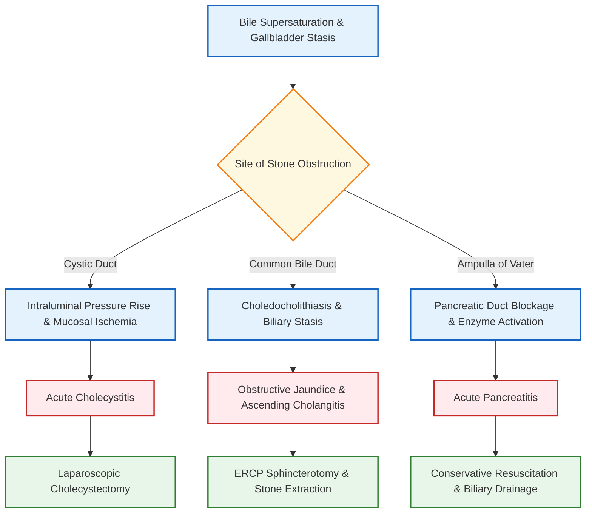

# **Gallstones (Cholelithiasis)** [⭐ High-Yield]

### 1. Definition [⭐ High-Yield]
- **Cholelithiasis** refers to the presence of solid crystalline concretions (**gallstones**) formed within the **gallbladder** or **biliary tree** due to abnormal precipitation of bile components.

---

### 2. Etiology / Causes / Risk Factors [⭐ High-Yield]
- **Disruption of Enterohepatic Circulation**: **Ileal disease or resection** (e.g., Crohn's disease, short bowel syndrome) impairs **bile acid reabsorption**, depleting the bile acid pool and causing bile supersaturation; this leads to gallstone formation in up to **45% of patients**.
- **Metabolic & Lifestyle Factors**: **Obesity** (elevated BMI) increases hepatic cholesterol synthesis and biliary cholesterol secretion.
- **Systemic Conditions**: **Cystic fibrosis** alters biliary mucus secretion and bile acid composition, predisposing to stone formation.
- **Classical Risk Factors ("4 Fs")**:
  1. **Female** gender
  2. **Fat** (obesity)
  3. **Fertile** (multiparity / estrogen therapy)
  4. **Forty** (age **>40 years**)

---

### 3. Classification
- **Cholesterol Stones**: Composed predominantly of **cholesterol**; result from cholesterol supersaturation in bile.
- **Pigment Stones**: Composed of **calcium bilirubinate**; associated with chronic hemolysis and excess unconjugated bilirubin.
- **Mixed Stones**: Composed of a mixture of **cholesterol**, **calcium salts**, and **bilirubin**; constitute the majority of clinical gallstones.

---

### 4. Pathophysiology [⭐ High-Yield]
- **Bile Supersaturation & Nucleation**: Excess **cholesterol** or **bilirubin** relative to **bile salts** and **phospholipids** leads to crystal precipitation.
- **Gallbladder Hypomotility**: Impaired **gallbladder contraction** (reduced **cholecystokinin [CCK]** responsiveness) causes bile stasis and promotes stone growth.
- **Mechanical Obstruction & Sequelae**:
  - **Cystic Duct Obstruction**: Increases intraluminal pressure, causing ischemia and **acute cholecystitis**.
  - **Common Bile Duct (CBD) Obstruction**: Causes **choledocholithiasis**, leading to **obstructive jaundice** and **ascending cholangitis**.
  - **Ampulla of Vater Obstruction**: Blocks pancreatic exocrine outflow, triggering **acute pancreatitis**.

---

### 5. Clinical Features [⭐ High-Yield]
#### Symptoms
- **Biliary Colic**: Episodic, severe **right upper quadrant (RUQ)** or epigastric pain, often precipitated by **fatty meals** and radiating to the back or right shoulder.
- **Nausea and Vomiting**: Frequently accompanies acute painful attacks.
- **Systemic Disturbance**: **Fever**, **rigors**, and **sweating** present in **acute cholecystitis** or **ascending cholangitis**.
- **Pruritus & Dark Urine**: Manifestations of **cholestatic jaundice** due to **common bile duct obstruction**.

#### Signs
- **Murphy's Sign**: Sharp inhibition of inspiration during deep palpation of the **RUQ** due to pain when the inflamed gallbladder touches the examiner's hand.
- **RUQ Tenderness & Guarding**: Localized tenderness and abdominal muscle spasm over the right hypochondrium.
- **Palpable Gallbladder**: May be felt in acute cholecystitis, gallbladder mucocele, or empyema.
- **Charcot's Triad**: Combination of **fever**, **jaundice**, and **RUQ pain** in **ascending cholangitis**.

---

### 6. Diagnosis / Investigations [⭐ High-Yield]
#### Lab Findings
- **Full Blood Count (FBC)**: **Leukocytosis** with neutrophilia indicates acute inflammation or infection.
- **Liver Function Tests (LFTs)**: Raised **alkaline phosphatase (ALP)**, **gamma-glutamyl transferase (GGT)**, and **conjugated bilirubin** signal **biliary obstruction**.
- **Serum Amylase / Lipase**: Markedly elevated if complicated by **gallstone pancreatitis**.

#### Imaging
- **Transabdominal Ultrasound (US)**: **Gold-standard initial investigation**; reveals **hyperechoic calculi** with **posterior acoustic shadowing**, gallbladder wall thickening (**>3 mm**), and pericholecystic fluid.
- **Magnetic Resonance Cholangiopancreatography (MRCP)**: **Non-invasive imaging modality** choice for detailed visualization of the biliary tree and detection of **choledocholithiasis**.
- **Endoscopic Retrograde Cholangiopancreatography (ERCP)**: Utilised primarily for **therapeutic extraction** of **CBD stones**.
- **Plain Abdominal X-Ray**: Low sensitivity; visualises only the **10–15%** of gallstones that are sufficiently **calcified / radio-opaque**.

---

### 7. Differential Diagnosis
| Feature | Acute Cholecystitis | Acute Appendicitis | Acute Pancreatitis |
| :--- | :--- | :--- | :--- |
| **Pain Location** | **Right Upper Quadrant (RUQ)** | **Right Iliac Fossa (RIF)** | **Epigastric radiating to back** |
| **Pathognomonic Sign** | **Murphy's sign positive** | **McBurney's point tenderness** | **Cullen's / Grey Turner's sign** |
| **Primary Test** | **Abdominal Ultrasound** | **Ultrasound / CT Abdomen** | **Serum Amylase / Lipase** |
| **Definitive Care** | **Laparoscopic Cholecystectomy** | **Appendectomy** | **Fluid Resuscitation & Analgesia** |

---

### 8. Treatment / Management [⭐ High-Yield]
#### Non-pharmacological
- **NPO (Nil Per Os)**: Bowel rest during acute painful crises.
- **Intravenous Hydration**: Fluid replacement to correct dehydration and maintain urine output.

#### Pharmacological
| Drug | Dose | Route | Frequency | Duration | Key Caution |
| :--- | :--- | :--- | :--- | :--- | :--- |
| **Diclofenac** | **75 mg** | **IM / Oral** | **BD** | **1–3 days** | Contraindicated in **peptic ulcer disease** or **renal impairment** |
| **Morphine** | **5–10 mg** | **IV / IM** | **Q4H PRN** | Acute pain | Monitor for **respiratory depression** |
| **Cefuroxime** | **1.5 g** | **IV** | **TDS** | **5–7 days** | Adjust dose in **renal dysfunction** |
| **Metronidazole** | **500 mg** | **IV / Oral** | **TDS** | **5–7 days** | Strictly avoid **alcohol intake** |

#### Surgical (if applicable) [⭐ High-Yield]
- **Laparoscopic Cholecystectomy**: **Definitive surgical treatment of choice** for symptomatic gallstones and acute cholecystitis.
- **ERCP Sphincterotomy & Basket Retrieval**: Indicated for **common bile duct stone extraction** prior to or alongside cholecystectomy.

---

### 9. Complications [⭐ High-Yield]
- **Acute Cholecystitis**: Acute inflammation and secondary infection of the gallbladder.
- **Empyema & Gangrene**: Suppurative gallbladder infection leading to tissue necrosis and **perforation**.
- **Choledocholithiasis & Ascending Cholangitis**: Migration of stones into the **common bile duct** causing obstruction and severe infection.
- **Acute Pancreatitis**: Obstruction of the **ampulla of Vater** by a impacted gallstone.
- **Gallstone Ileus**: Mechanical small bowel obstruction caused by erosion of a large stone through a **cholecystoduodenal fistula**.
- **Gallbladder Carcinoma**: Long-standing chronic cholelithiasis increases the risk of gallbladder malignancy.

---

### 10. Prognosis
- **Excellent**: Post-operative recovery following elective **laparoscopic cholecystectomy** is high, with complete symptom relief in **>90% of cases**.

---

### 11. Mnemonic / Memory Palace
- **Mnemonic for Risk Factors — "GALLSTONES"**:
  - **G** — **Gender (Female)**
  - **A** — **Age (>40 years)**
  - **L** — **Loss of weight (Rapid weight loss / Bariatric surgery)**
  - **L** — **Lower ileal disease (Crohn's / Ileal resection)**
  - **S** — **Sedentary lifestyle / Obesity**
  - **T** — **Triglycerides / Dyslipidemia**
  - **O** — **Estrogen exposure (Pregnancy / Oral Contraceptives)**
  - **N** — **Native American / Ethnic genetic predisposition**
  - **E** — **Excess hemolysis (Pigment stones)**
  - **S** — **Stasis of gallbladder (TPN / Fasting)**

---

### Diagram 1: Ultrasound Appearance of Gallstones
- **Type**: Labeled cross-sectional ultrasound diagram guide.
- **Outline shape to draw**: Oval representing the fluid-filled gallbladder lumen.
- **Labels in order (top-to-bottom)**:
  1. **Gallbladder Wall** — Smooth, thin hyperechoic anterior line (**<3 mm**).
  2. **An-echoic Bile Lumen** — Dark fluid cavity.
  3. **Hyperechoic Calculus** — Bright white curved structure in dependent lumen.
  4. **Posterior Acoustic Shadow** — Fan-shaped dark area distal to stone.
- **Arrows/connections**: Ultrasound Beam → Wall → An-echoic Lumen → Hyperechoic Stone → Posterior Acoustic Shadow.
- **One annotation worth extra marks**: *"Clean posterior acoustic shadowing differentiates a true dense calculus from soft tissue mucosal polyps."*

---

### Clinical Pearl
- Order an **abdominal ultrasound** in any patient with postprandial RUQ pain; the presence of **hyperechoic foci with posterior acoustic shadowing** confirms gallstones, while **gallbladder wall thickening (>3 mm)** and **pericholecystic fluid** confirm acute cholecystitis.

---

### Exam Trap
- **The Mix-Up**: Confusing **biliary colic** with **acute cholecystitis**.
- **Distinguishing Fact**: **Biliary colic** pain is self-limiting (lasting **<6 hours**), without fever or systemic signs, and lacks gallbladder wall thickening; **acute cholecystitis** presents with persistent pain (**>6 hours**), **fever**, **leukocytosis**, and a positive **Murphy's sign**.

---

### Quick Revision
- **Gallstones (cholelithiasis)** are formed by crystallization of **cholesterol**, **pigment**, or **mixed** components in bile.
- **Ileal resection / disease** causes gallstones in **~45% of patients** due to impaired **bile acid reabsorption**.
- **Transabdominal ultrasound** is the gold-standard initial imaging modality demonstrating **hyperechoic stones with posterior acoustic shadowing**.
- **Laparoscopic cholecystectomy** is the definitive surgical management, while **ERCP** is required for **CBD stone extraction**.

---

### One-Line Exam Opener
- **Gallstone disease (cholelithiasis)** is a common hepatobiliary disorder caused by bile supersaturation and gallbladder stasis, presenting classically with right upper quadrant biliary colic or acute cholecystitis, and definitively treated via laparoscopic cholecystectomy.

---

🩺 Would you like to review a detailed breakdown of **Acute Cholecystitis**, or shall I generate a set of **flashcards or a practice quiz** on this topic to test your recall?