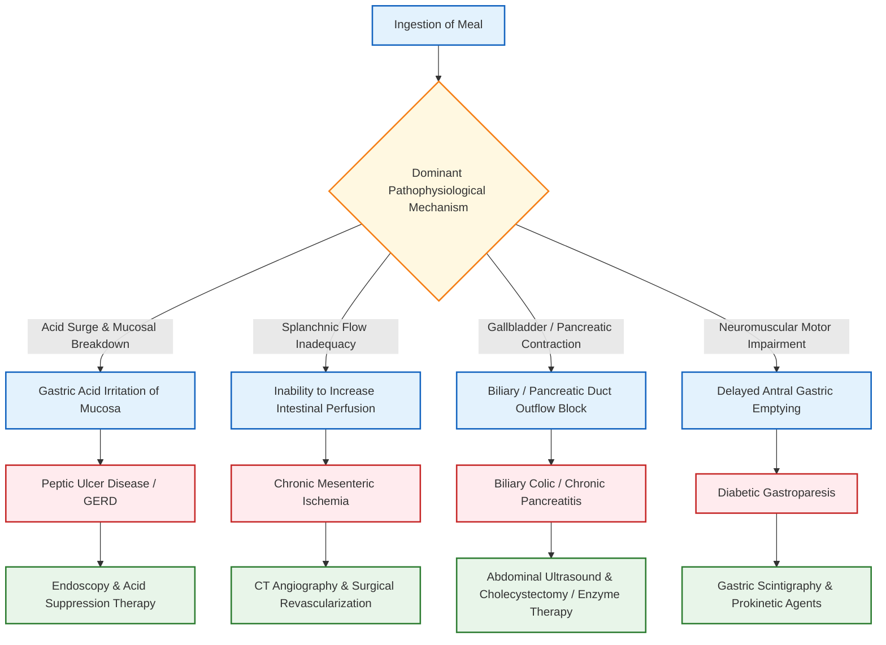

# **Postprandial Abdominal Pain (Abdominal Pain After Eating): Differential Diagnosis** [⭐ High-Yield]

### 1. Definition [⭐ High-Yield]
- **Postprandial Abdominal Pain** refers to abdominal pain, aching, or burning discomfort that is provoked or exacerbated specifically by the ingestion of food.

---

### 2. Etiology / Causes / Risk Factors [⭐ High-Yield]
- **Biliary Tree & Gallbladder Etiologies**:
  - **Biliary Colic**: Episodic **right upper quadrant (RUQ)** or epigastric pain precipitated by **fatty meals** due to transient cystic duct impaction.
  - **Acute Cholecystitis**: Persistent RUQ pain following meal ingestion accompanied by fever and systemic inflammation.
- **Upper Gastrointestinal Etiologies**:
  - **Peptic Ulcer Disease (PUD)**: **Gastric ulcers** characteristically cause pain **15–30 minutes after eating** as gastric acid secretion surges; **duodenal ulcers** cause pain **2–3 hours postprandially** or when fasting, often relieved by food intake.
  - **Gastro-oesophageal Reflux Disease (GERD) / Esophagitis**: Postprandial retrosternal burning pain aggravated by supine posture or meal ingestion.
  - **Diabetic Gastroparesis**: Autonomic neuropathy causing delayed gastric emptying, presenting with postprandial abdominal fullness, early satiety, chronic nausea, and vomiting of undigested food.
- **Vascular Etiologies**:
  - **Chronic Mesenteric Ischemia ("Abdominal Angina")**: Atherosclerotic narrowing of splanchnic vessels (celiac axis, superior mesenteric artery) causing severe, dull epigastric/periumbilical pain **15–45 minutes after meals** due to increased intestinal metabolic demand, leading to **"food fear"** and profound weight loss.
- **Pancreatic Etiologies**:
  - **Chronic Pancreatitis**: Recurrent or persistent epigastric pain radiating to the back, exacerbated by eating (especially fatty foods) or alcohol ingestion.
- **Functional Etiologies**:
  - **Postprandial Distress Syndrome (PDS) / Functional Dyspepsia**: Bothersome postprandial fullness and early satiety without structural abnormality.

---

### 3. Pathophysiology [⭐ High-Yield]
- **Gastric Acid Surge & Mucosal Damage**: Ingestion of food triggers **gastrin** release, stimulating parietal cells to secrete hydrochloric acid, which irritates exposed mucosal defects in **gastric ulceration** or **esophagitis**.
- **Splanchnic Mismatch & Ischemia**: Postprandial hyperemia increases splanchnic oxygen demand; fixed arterial stenoses prevent flow augmentation, triggering intestinal ischemia (**abdominal angina**).
- **Neuromuscular Dysmotility**: Autonomic nerve damage in diabetes impairs gastric antral motility and pyloric relaxation, delaying food clearance.
- **Biliary / Pancreatic Outflow Obstruction**: CCK-mediated gallbladder contraction against an obstructed duct raises intraluminal pressure, provoking **biliary colic**.

---

### 4. Clinical Features [⭐ High-Yield]
#### Symptoms
- **Abdominal Pain / Discomfort**:
  - **Gastric Ulcer**: Epigastric burning occurring **15–30 minutes** post-meal.
  - **Biliary Colic**: RUQ / Epigastric episodic severe aching triggered by **fatty meals**.
  - **Chronic Mesenteric Ischemia**: Severe periumbilical/epigastric dull ache **15–45 minutes** post-meal, lasting **1–2 hours**.
- **Early Satiety & Postprandial Fullness**: Prominent in **diabetic gastroparesis** and **functional dyspepsia**.
- **Vomiting**: Undigested food material passed hours after ingestion in **gastroparesis**.
- **Systemic Manifestations**: Marked weight loss and **"food fear"** in mesenteric ischemia.

#### Signs
- **Epigastric Tenderness**: Localized tenderness on deep palpation in **PUD** or **gastritis**.
- **Murphy's Sign**: Positive in acute cholecystitis.
- **Abdominal Bruit**: Epigastric vascular bruit heard in **chronic mesenteric ischemia**.
- **Nutritional Wasting**: Muscle wasting, loose skin folds, and scaphoid abdomen in severe **mesenteric ischemia** or **gastric malignancy**.

---

### 5. Diagnosis / Investigations [⭐ High-Yield]
#### Lab Findings
- **Full Blood Count (FBC)**: Detects **microcytic hypochromic anemia** from chronic occult bleeding in PUD or gastric carcinoma.
- **HbA1c & Blood Glucose**: Confirms underlying poorly controlled diabetes mellitus in suspected **gastroparesis**.
- **Serum Amylase & Lipase**: Evaluates acute flares of **chronic pancreatitis**.

#### Imaging & Endoscopy
- **Upper Gastrointestinal Endoscopy (OGD)**: **Gold-standard diagnostic test** for visualizing gastric/duodenal ulcers, reflux esophagitis, and taking mucosal biopsies.
- **Abdominal Ultrasound**: First-line imaging to detect **gallstones**, gallbladder wall thickening, and biliary dilatation.
- **CT Angiography of Abdomen**: **Modality of choice** for chronic mesenteric ischemia; demonstrates stenosis/occlusion of the celiac trunk or superior mesenteric artery.
- **99m-Technetium Solid-Phase Gastric Emptying Scintigraphy**: **Gold-standard investigation** for diabetic gastroparesis; confirms delayed retention of a solid test meal at **4 hours**.

---

### 6. Differential Diagnosis [⭐ High-Yield]
| Clinical Feature | Biliary Colic | Gastric Peptic Ulcer | Chronic Mesenteric Ischemia | Diabetic Gastroparesis | Chronic Pancreatitis |
| :--- | :--- | :--- | :--- | :--- | :--- |
| **Pain Onset** | **30–60 mins** after fatty meals | **15–30 mins** after meals | **15–45 mins** after meals | Postprandial fullness / nausea | **15–30 mins** after meals |
| **Pain Location** | **Right Upper Quadrant** | Epigastrium | Epigastric / Periumbilical | Epigastrium / Diffuse | Epigastrium radiating to back |
| **Key Associated Feature** | Radiation to right shoulder | Relieved by antacids | **Profound weight loss & "food fear"** | Vomiting of undigested food | Steatorrhoea & diabetes |
| **Definitive Investigation** | **Abdominal Ultrasound** | **Upper GI Endoscopy** | **CT Angiography** | **99m-Tc Gastric Emptying Scan** | **CT / Endoscopic Ultrasound** |

---

### 7. Treatment / Management [⭐ High-Yield]
#### Non-pharmacological
- **Dietary Modifications**: Small, low-fat, low-residue, frequent meals to minimize biliary contraction and gastric retention.
- **Postural Hygiene**: Avoid lying flat within **2–3 hours** of eating in GERD.

#### Pharmacological
| Drug | Dose | Route | Frequency | Duration | Key Caution |
| :--- | :--- | :--- | :--- | :--- | :--- |
| **Omeprazole** | **20–40 mg** | **Oral** | **OD** | **4–8 weeks** | Long-term use linked to **C. difficile** & hypomagnesemia |
| **Metoclopramide** | **10 mg** | **Oral / IV** | **TDS (before meals)** | **<5 days** | Risk of **extrapyramidal side-effects** |
| **Domperidone** | **10 mg** | **Oral** | **TDS (before meals)** | Short-term | Monitor for **QT-interval prolongation** |
| **Erythromycin** | **250 mg** | **Oral** | **TDS** | **1–2 weeks** | Risk of **tachyphylaxis** & GI cramps |

#### Surgical / Interventional
- **Laparoscopic Cholecystectomy**: Surgical care of choice for recurrent **biliary colic**.
- **Splanchnic Revascularization**: Endovascular stenting or surgical bypass for **chronic mesenteric ischemia**.

---

### 8. Complications [⭐ High-Yield]
- **Peptic Ulcer Perforation & Bleeding**: Gastric ulcer erosion causing peritonitis or upper GI hemorrhage.
- **Severe Malnutrition / Intestinal Failure**: Extreme food avoidance in mesenteric ischemia leading to severe weight loss.
- **Diabetic Glycemic Instability**: Unpredictable food absorption in gastroparesis causing severe hypoglycemia.
- **Acute-on-Chronic Bowel Infarction**: Thrombosis of stenosed mesenteric vessels leading to bowel gangrene.

---

### 9. Prognosis
- **PUD & GERD**: Excellent recovery (**>90%**) with acid suppression and *H. pylori* eradication.
- **Chronic Mesenteric Ischemia**: High mortality if untreated due to risk of bowel necrosis, but revascularization restores normal eating capacity.

---

### 10. Mnemonic / Memory Palace
- **Mnemonic for Postprandial Pain Etiologies — "POSTPRANDIAL"**:
  - **P** — **Peptic ulcer disease (Gastric vs Duodenal)**
  - **O** — **Oesophagitis / GERD**
  - **S** — **Splanchnic ischemia (Mesenteric angina)**
  - **T** — **Tumour (Gastric / Pancreatic cancer)**
  - **P** — **Pancreatitis (Chronic)**
  - **R** — **Reflux disease**
  - **A** — **Adverse food reaction / Lactose intolerance**
  - **N** — **Neuro-enteric dysmotility (Diabetic gastroparesis)**
  - **D** — **Dyspepsia (Functional / Postprandial distress syndrome)**
  - **I** — **Impaction of gallstone (Biliary colic)**
  - **A** — **Abdominal angina**
  - **L** — **Luminal stricture**

---

### Diagram 1: Splanchnic Blood Supply and Mesenteric Ischemia
- **Type**: Flow diagram and vessel guide.
- **Outline shape to draw**: Inverted Y-junction representing the abdominal aorta and its major visceral branches.
- **Labels in order (top-to-bottom)**:
  1. **Abdominal Aorta** — Primary trunk.
  2. **Celiac Axis** — Supplies stomach, liver, and spleen.
  3. **Superior Mesenteric Artery (SMA)** — Supplies small intestine and ascending colon.
  4. **Inferior Mesenteric Artery (IMA)** — Supplies descending colon.
- **Arrows/connections**: Food Ingestion → Increased Visceral Metabolic Demand → Fixed SMA/Celiac Stenosis → Splanchnic Ischemia → Postprandial Pain ("Abdominal Angina").
- **One annotation worth extra marks**: *"Splanchnic ischemia requires occlusion of at least 2 of the 3 major visceral arteries due to extensive collateral circulation."*

---

### Clinical Pearl
- Always consider **chronic mesenteric ischemia ("abdominal angina")** in an elderly patient with widespread vascular disease who presents with severe **postprandial pain**, **fear of eating**, and **unexplained rapid weight loss**.

---

### Exam Trap
- **The Mix-Up**: Swapping the postprandial timing of **gastric** versus **duodenal ulcers**.
- **Distinguishing Fact**: Pain from a **gastric ulcer** is triggered **almost immediately (15–30 mins) after eating** and worsened by food; pain from a **duodenal ulcer** occurs **2–3 hours postprandially** or when hungry, and is classically **relieved by food intake**.

---

### Quick Revision
- **Gastric ulcer pain** occurs **15–30 mins** after food; **duodenal ulcer pain** occurs **2–3 hours** postprandially.
- **Chronic mesenteric ischemia** presents with **abdominal angina** (postprandial pain), **"food fear"**, and **severe weight loss**.
- **Diabetic gastroparesis** causes postprandial fullness, early satiety, and vomiting of undigested food due to **autonomic neuropathy**.
- **99m-Tc gastric emptying scintigraphy** is the gold-standard test for **gastroparesis**.

---

### One-Line Exam Opener
- **Postprandial abdominal pain** is a critical clinical symptom indicating a broad spectrum of gastrointestinal, hepatobiliary, and vascular disorders, ranging from benign peptic ulcer disease to life-threatening chronic mesenteric ischemia.

---

🩺 Would you like to review a detailed management breakdown of **Peptic Ulcer Disease** or **Chronic Mesenteric Ischemia**, or shall we create a set of **flashcards or a practice quiz** on this topic?