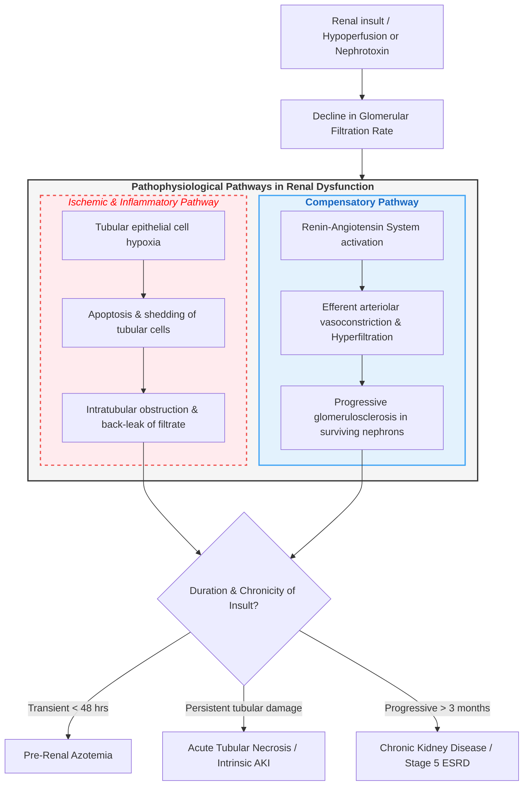

# Renal Failure (Acute Kidney Injury & Chronic Kidney Disease)

---

### 1. Definition [⭐ High-Yield]
- **Acute Kidney Injury (AKI)** is defined as a sudden and potentially reversible reduction in **renal function** occurring over **hours, days, or weeks**, accompanied by the accumulation of nitrogenous waste products and often a decline in **urine volume**.
- **Chronic Kidney Disease (CKD)** is defined as an **irreversible deterioration in renal function** developing over **months or years**, resulting in the progressive loss of **excretory, metabolic, and endocrine functions** of the kidney.
- **End-Stage Renal Disease (ESRD)** represents **Stage 5 CKD**, defined by an **estimated Glomerular Filtration Rate (eGFR) < 15 mL/min/1.73 m²**, where long-term survival requires **Renal Replacement Therapy (RRT)**.

---

### 2. Etiology / Causes / Risk Factors [⭐ High-Yield]
- **Causes of Acute Kidney Injury (AKI)**:
  - **Pre-Renal Causes (Renal Hypoperfusion)**: **Hypovolaemia** (**haemorrhage**, **vomiting**, **diarrhoea**, **burns**), **hypotension**, **sepsis**, **congestive cardiac failure**, **renal artery occlusion**, and drugs disrupting renal autoregulation (**ACE inhibitors**, **ARBs**, **NSAIDs**).
  - **Intrinsic Renal Causes**:
    - **Acute Tubular Necrosis (ATN)**: Prolonged ischaemia or nephrotoxins (**aminoglycosides**, **radiographic contrast media**, **rhabdomyolysis**, **myoglobinuria**).
    - **Acute Interstitial Nephritis (AIN)**: Drug-induced hypersensitivity (**penicillins**, **proton pump inhibitors**, **NSAIDs**).
    - **Glomerular Disease**: **Rapidly Progressive Glomerulonephritis (RPGN)**, **ANCA-associated vasculitis**, **Anti-GBM disease**.
  - **Post-Renal Causes (Urinary Tract Obstruction)**: **Benign prostatic enlargement**, **prostate/cervical cancer**, **bilateral renal calculi**, **retroperitoneal fibrosis**, and **urethral strictures**.
- **Causes of Chronic Kidney Disease (CKD)**:
  - **Diabetic Nephropathy** (**20–40%** of cases).
  - **Chronic Tubulo-Interstitial Diseases** (**20–30%** of cases).
  - **Glomerular Diseases** (**10–20%**, e.g., **IgA nephropathy**).
  - **Hypertension / Renovascular Disease** (**5–20%**).
  - **Autosomal Dominant Polycystic Kidney Disease (ADPKD)**.

---

### 3. Classification [⭐ High-Yield]
- **Classification of AKI (by Anatomical Site & Pathophysiology)**:
  1. **Pre-Renal Azotaemia**: Intact tubular architecture with functional response to hypoperfusion.
  2. **Intrinsic Renal Injury**: Direct parenchymal cell damage (tubular, glomerular, or interstitial).
  3. **Post-Renal Azotaemia**: Obstruction distal to the renal parenchyma.
  - Stratified clinically by **KDIGO**, **AKIN**, and **RIFLE** diagnostic criteria.
- **K/DOQI Staging of Chronic Kidney Disease (by eGFR in mL/min/1.73 m²)**:
  - **Stage 1**: **eGFR ≥ 90** with demonstrated kidney damage (**proteinuria** or **structural abnormality**).
  - **Stage 2**: **eGFR 60–89** (Mild CKD).
  - **Stage 3A**: **eGFR 45–59** (Mild to moderate CKD).
  - **Stage 3B**: **eGFR 30–44** (Moderate to severe CKD).
  - **Stage 4**: **eGFR 15–29** (Severe CKD).
  - **Stage 5**: **eGFR < 15** (Kidney Failure / ESRD).

---

### 4. Pathophysiology [⭐ High-Yield]

1. **Pre-Renal Hypoperfusion**: Decreased **renal blood flow** impairs **hydrostatic pressure** in glomerular capillaries, reducing **GFR** while tubular reabsorptive mechanisms remain intact to conserve salt and water.
2. **Acute Tubular Necrosis (ATN)**: Uncorrected hypoperfusion or toxic insults cause **ischemic/toxic injury to proximal tubule and thick ascending limb cells**, leading to loss of cell polarity, apoptosis, cell shedding into the tubular lumen, **luminal obstruction**, and **back-leak of glomerular filtrate**.
3. **Chronic Nephron Loss & Hyperfiltration**: Permanent loss of functioning nephrons triggers adaptive **intraglomerular hypertension and hyperfiltration** in remaining nephrons (mediated by **angiotensin II**), eventually inducing secondary **glomerulosclerosis** and **tubulointerstitial fibrosis**.
4. **Uraemic Syndrome**: Failure of renal clearance leads to systemic accumulation of urea, creatinine, organic acids, **hyperkalaemia**, **hyperphosphataemia**, **metabolic acidosis**, and impaired production of **erythropoietin** and **1,25-dihydroxyvitamin D**.

---

### 5. Clinical Features [⭐ High-Yield]

#### Symptoms
- **Urine Output Alterations**: **Oliguria** (**< 400 mL/24 hrs**) or **anuria** (**< 100 mL/24 hrs**) in acute cases; **nocturia** and **polyuria** (early loss of concentrating ability in CKD).
- **Uraemic Symptoms**: **Nausea**, **vomiting**, **anorexia**, **weight loss**, **intractable pruritus**, **hiccups**, and **taste disturbance**.
- **Fluid Overload Symptoms**: **Breathlessness (dyspnoea)** and **orthopnoea** secondary to **pulmonary oedema**.
- **Neurological Symptoms**: **Tiredness**, **lethargy**, **muscular twitching**, **restless legs**, **confusion**, **seizures**, and **coma** in advanced uraemia.

#### Signs
- **Cardiovascular & Respiratory**: **Hypertension**, **raised Jugular Venous Pressure (JVP)**, **bilateral basal lung crepitations**, **pericardial friction rub** (**uraemic pericarditis**), and **Kussmaul breathing** (deep respiration in severe **metabolic acidosis**).
- **Cutaneous & Musculoskeletal**: **Pallor** (due to **renal anaemia**), **yellowish skin complexion**, **bruising**, **excoriation marks**, and **'brown line' nail pigmentation**.
- **Fluid Retention**: **Peripheral pitting oedema** (**ankle** and **sacral oedema**), **ascites**, and **pleural effusion**.
- **Neurological Signs**: **Asterixis (flapping tremor)**, **diminished deep tendon reflexes**, and **peripheral neuropathy**.

---

### 6. Diagnosis / Investigations [⭐ High-Yield]

#### Lab Findings
- **Serum Biochemistry**:
  - Elevated **serum creatinine** and **serum urea**.
  - **Disproportionate rise in urea relative to creatinine** indicates pre-renal azotaemia.
- **Electrolytes & Acid-Base**:
  - **Hyperkalaemia** (**serum K+ > 6.5 mmol/L** requires emergency intervention).
  - **Hyponatraemia**, **hyperphosphataemia**, **hypocalcaemia**, and elevated **parathyroid hormone (PTH)**.
  - **Metabolic Acidosis**: Reduced **serum bicarbonate** (**< 22 mmol/L**) with increased anion gap.
- **Haematology**: **Normochromic normocytic anaemia** (due to **erythropoietin deficiency**).
- **Urinalysis & Microscopy**:
  - **Pre-Renal AKI**: **Bland urine sediment**, **Urine Na < 20 mmol/L**, **Fractional Excretion of Na (FeNa) < 1%**.
  - **Acute Tubular Necrosis (ATN)**: **"Muddy brown" granular casts**, **Urine Na > 40 mmol/L**, **FeNa ≥ 1%**.
  - **Glomerulonephritis**: **Dysmorphic erythrocytes**, **red cell casts**, and heavy **proteinuria**.

#### Imaging & Renal Biopsy
- **Renal Ultrasound**:
  - **Bilateral small shrunken kidneys** (**< 9 cm**) indicate chronicity (**CKD**).
  - Identifies **hydronephrosis** and **pelvicalyceal dilation** in post-renal obstruction.
- **Renal Biopsy**: Indicated for unexplained AKI/CKD, **nephritic/nephrotic syndrome**, or suspicion of **rapidly progressive glomerulonephritis**.
  - *Contraindications*: **Uncontrolled hypertension**, **bleeding diathesis**, **solitary kidney**, or **small shrunken kidneys**.

---

### 7. Differential Diagnosis [⭐ High-Yield]

| Feature | Pre-Renal AKI | Intrinsic AKI (ATN) | Post-Renal AKI | Chronic Kidney Disease (CKD) |
| :--- | :--- | :--- | :--- | :--- |
| **History** | **Vomiting**, **diarrhoea**, **haemorrhage**, **sepsis**, **NSAID/ACEi use** | **Prolonged shock**, **aminoglycoside**, **contrast dye**, **rhabdomyolysis** | **Prostatic symptoms**, **pelvic mass**, **renal colic** | History of **diabetes**, **hypertension** over years |
| **Urine Sodium (UNa)** | **< 20 mmol/L** | **> 40 mmol/L** | Variable | Variable |
| **FeNa (%)** | **< 1%** | **≥ 1%** | Variable | **> 1%** |
| **Urine Microscopy** | **Bland sediment**, hyaline casts | **"Muddy brown" granular casts**, tubular cells | Normal or **microscopic haematuria** | Broad waxy casts, **proteinuria** |
| **Urea:Creatinine Ratio** | **Markedly elevated** | **Normal** | Normal | Normal |
| **Renal Ultrasound** | **Normal kidney size** & cortex | **Normal kidney size**, hyperechoic | **Hydronephrosis / urinary tract dilation** | **Small, shrunken kidneys (< 9 cm)** |

---

### 8. Treatment / Management [⭐ High-Yield]

#### Non-pharmacological
- **Fluid Balance Management**: Restrict daily fluid intake to **previous day's urine output + 500 mL** (for insensible loss) in fluid-overloaded patients.
- **Dietary Restrictions**: Limit dietary **sodium** (**50–80 mmol/day**) and restrict **potassium** and **phosphate** intake.
- **Lifestyle Modifications**: **Smoking cessation**, weight management, and avoiding nephrotoxic over-the-counter medications (**NSAIDs**).

#### Pharmacological (Dosage Table)

| Drug | Dose | Route | Frequency | Duration | Key Caution |
| :--- | :--- | :--- | :--- | :--- | :--- |
| **Calcium Gluconate** | **10 mL 10%** | **IV** | Single dose over **5–10 mins** | Acute emergency | Myocardial membrane stabilization; does not lower serum K+ |
| **Insulin (Soluble) + Dextrose** | **10 units** in **50 mL 50% Dextrose** | **IV** | Over **15–30 mins** | Acute emergency | Monitor **blood glucose** hourly to avoid hypoglycaemia |
| **Furosemide** | **40–240 mg** | **IV / Oral** | **Daily or Twice daily** | As required | High doses required in renal failure; risk of ototoxicity |
| **Ramipril** | **2.5–10 mg** | **Oral** | **Daily** | Long-term | Contraindicated if baseline **K+ > 5.5 mmol/L** or bilateral renal artery stenosis |
| **Sodium Bicarbonate** | **1 g** or **100 mmol** | **Oral / IV** | **8-hourly / Infusion** | Titrated to **HCO3 > 22 mmol/L** | Risk of **sodium overload** and pulmonary oedema |
| **Atorvastatin** | **20–80 mg** | **Oral** | **Daily** | Indefinitely | Cardiovascular risk reduction in CKD |
| **Epoetin (Recombinant EPO)** | Not specified in source — verify with standard guideline | **Subcutaneous** | **1–3 times weekly** | Long-term | Target Hb **10–12 g/dL**; risk of worsening hypertension |

#### Surgical / Renal Replacement Therapy (RRT)
- **Indications for Urgent Dialysis (AEIOU Criteria)**:
  - **A (Acidosis)**: Severe metabolic acidosis (**pH < 7.1** or **H+ > 79 nmol/L**).
  - **E (Electrolytes)**: Refractory **hyperkalaemia (> 6.5 mmol/L)** with ECG changes.
  - **I (Ingestion / Toxins)**: Overdose of dialysable toxins (e.g., lithium, ethylene glycol).
  - **O (Overload)**: Intractable **pulmonary oedema** resistant to diuretics.
  - **U (Uraemia)**: **Uraemic pericarditis**, **uraemic encephalopathy**, or severe uraemic bleeding.
- **Modalities of RRT**:
  - **Intermittent Haemodialysis (HD)**: Most common modality; requires **arteriovenous fistula (AVF)** or **dual-lumen central line**.
  - **Continuous Venovenous Haemofiltration (CVVH)**: Preferred in haemodynamically unstable critically ill patients in ICCU/ITU.
  - **Peritoneal Dialysis (PD)**: Utilises peritoneal membrane via **Tenckhoff catheter**.
  - **Renal Transplantation**: Definite treatment of choice for **ESRD**.
- **Post-Renal Obstruction Surgical Relief**: Bladder catheterisation, **ureteric stenting**, or **percutaneous nephrostomy**.

---

### 9. Complications [⭐ High-Yield]
- **Cardiovascular & Respiratory**: **Acute pulmonary oedema**, **severe hypertension**, **uraemic pericarditis**, **pericardial effusion**, and accelerated **atherosclerosis**.
- **Electrolyte & Metabolic**: Life-threatening **hyperkalaemia**, **severe anion-gap metabolic acidosis**, **hyperphosphataemia**, and **hypocalcaemia**.
- **Hematologic**: **Renal anaemia** (due to **erythropoietin deficiency** and **uraemic bone marrow suppression**) and **uraemic bleeding diathesis** (due to **platelet dysfunction**).
- **Bone & Mineral Disorder**: **Renal Osteodystrophy** (secondary **hyperparathyroidism**, osteomalacia, and osteitis fibrosa cystica due to reduced **1,25-dihydroxyvitamin D** and phosphate retention).
- **Neurological**: **Uraemic encephalopathy**, **seizures**, **asterixis**, and **peripheral neuropathy**.

---

### 10. Prognosis
- **AKI Prognosis**: In uncomplicated AKI, renal recovery is high; in AKI associated with **sepsis and multi-organ failure**, mortality ranges between **50–70%**.
- **CKD Prognosis**: Cardiovascular disease is the leading cause of death in CKD patients prior to reaching **ESRD**. Survival on maintenance dialysis is strongly influenced by age and comorbidities like **diabetes mellitus**.

---

### 11. Mnemonic / Memory Palace

#### Acronym Mnemonic: **R-E-N-A-L F-A-I-L-U-R-E**
- **R**: **Reduced eGFR** (**< 15 mL/min/1.73 m²** in Stage 5 ESRD)
- **E**: **Electrolyte disturbance** (**Hyperkalaemia > 6.5 mmol/L**)
- **N**: **Normochromic normocytic anaemia** (Erythropoietin deficit)
- **A**: **Azotaemia** (Rise in serum urea and creatinine)
- **L**: **Lung oedema & pericarditis** (Fluid overload & uraemic rub)
- **F**: **Fluid retention** (Pitting ankle/sacral oedema & raised JVP)
- **A**: **Acidosis** (Metabolic acidosis with low bicarbonate)
- **I**: **Indications for dialysis** (**AEIOU** emergency criteria)
- **L**: **Loss of bone density** (Secondary hyperparathyroidism / Renal osteodystrophy)
- **U**: **Uraemic symptoms** (Pruritus, nausea, vomiting, asterixis)
- **R**: **Replacement therapy** (**Haemodialysis**, **Peritoneal Dialysis**, **Transplant**)
- **E**: **Etiology categorization** (**Pre-renal**, **Intrinsic Renal**, **Post-renal**)

---

### Diagram 1: Segmental Nephron Vulnerability and Pathophysiology of Acute Tubular Necrosis [⭐ High-Yield]
- **Type**: Labeled nephron schematic
- **Outline shape to draw**: Loop-shaped renal nephron with glomerulus, proximal tubule, loop of Henle, distal tubule, and collecting duct.
- **Labels in order**:
  1. **Glomerulus**: Site of afferent vasoconstriction (NSAIDs) and efferent vasodilation (ACE inhibitors).
  2. **Proximal Convoluted Tubule**: High metabolic rate; primary site of **ischemic and nephrotoxic tubular necrosis**.
  3. **Thick Ascending Limb of Henle**: Vulnerable medullary hypoxia zone.
  4. **Distal Tubule & Collecting Duct**: Site of **"muddy brown" cast aggregation** and luminal obstruction.
- **Arrows / Connections**: Hypoperfusion / Toxin → Proximal tubular cell necrosis → Shedding of debris → Intratubular cast obstruction → Increased intratubular pressure → Reduced GFR.
- **One High-Yield Annotation**: Highlight **loss of proximal tubular cell brush border** as the earliest histopathological hallmark of ATN.

---

### Clinical Pearl
- In any patient presenting with **complete anuria** (**< 100 mL/24 hrs**), **pre-renal hypoperfusion** is extremely unlikely; clinicians must immediately exclude **complete bilateral urinary tract obstruction**, **acute bilateral renal artery occlusion**, or **severe rapidly progressive crescentic glomerulonephritis**.

---

### Exam Trap
- **Differentiating Pre-Renal Azotaemia from Acute Tubular Necrosis (ATN)**:
  - **Pre-Renal Azotaemia**: Tubular cells are intact and actively reabsorb sodium and water: **Urine Sodium < 20 mmol/L**, **FeNa < 1%**, **Urea:Creatinine ratio is high**, and urinalysis is **bland**.
  - **ATN**: Tubular cell necrosis impairs sodium reabsorption: **Urine Sodium > 40 mmol/L**, **FeNa ≥ 1%**, **Urea:Creatinine ratio is normal**, and urinalysis shows pathognomonic **"muddy brown" granular casts**.

---

### Quick Revision
- **Definition**: AKI is sudden reversible loss of function; CKD is progressive irreversible loss over months/years (Stage 5 ESRD = **eGFR < 15 mL/min/1.73 m²**).
- **Classification**: **Pre-renal** (hypoperfusion), **Intrinsic** (ATN/AIN/GN), and **Post-renal** (obstruction).
- **Pathognomonic Urine Casts**: **"Muddy brown" granular casts** in ATN; **red cell casts** in Glomerulonephritis.
- **Emergency Dialysis Indications (AEIOU)**: **Acidosis**, **Electrolyte crisis (K+ > 6.5)**, **Ingestion**, **Overload (pulmonary oedema)**, **Uraemia (pericarditis/encephalopathy)**.
- **First-Line Hyperkalaemia Management**: **10 mL 10% Calcium Gluconate IV** to stabilize the myocardium.

---

### One-Line Exam Opener
- Renal failure is a medical emergency characterized by a profound reduction in glomerular filtration rate, leading to severe disruptions in fluid-electrolyte balance, metabolic acidosis, nitrogenous waste retention, and endocrine dysfunction.