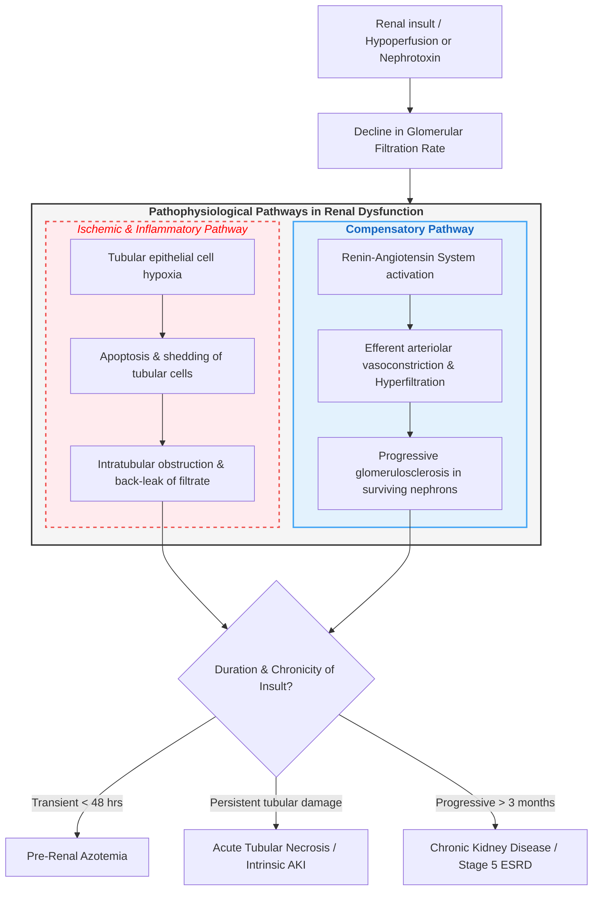

### Pathophysiology Flowchart of Renal Failure

- **Trigger & Initial Insult**: **Renal hypoperfusion** or **nephrotoxic exposure** causes an immediate decrease in **Glomerular Filtration Rate (GFR)**.
- **Ischaemic & Inflammatory Pathway**: Severe tubular hypoxia leads to **cell apoptosis**, detachment, and **shedding into the luminal space**, causing **intratubular obstruction** and **back-leak of filtrate**.
- **Compensatory Pathway**: Activation of the **Renin-Angiotensin System** leads to **angiotensin II-mediated efferent arteriolar vasoconstriction** to maintain intraglomerular pressure, which over time drives **hyperfiltration** and secondary **glomerulosclerosis** in surviving nephrons.
- **Outcome Stratification**: Transient hypoperfusion resolves as **Pre-Renal Azotemia**, persistent tubular injury manifests as **Acute Tubular Necrosis (Intrinsic AKI)**, and long-standing nephron loss over > 3 months progresses to **Chronic Kidney Disease / Stage 5 ESRD**.