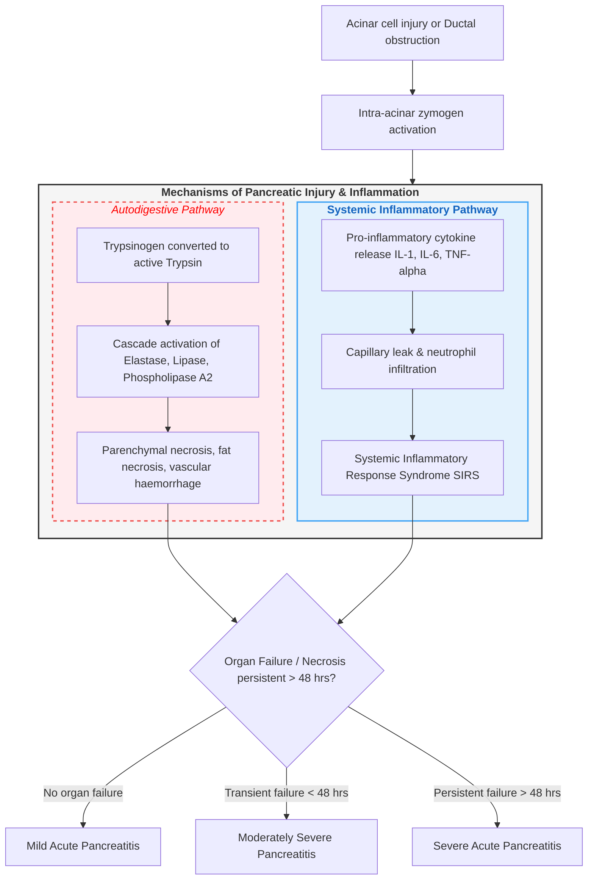

# Acute Pancreatitis

---

### 1. Definition [⭐ High-Yield]
- **Acute Pancreatitis** is defined as an acute inflammatory condition of the pancreas characterised by **autodigestion of pancreatic parenchyma** by prematurely activated **pancreatic digestive enzymes**.
- Clinically defined by meeting at least **two of the following three criteria**:
  1. **Acute, severe, persistent epigastric pain** often radiating straight through to the back.
  2. **Serum amylase or serum lipase activity ≥ 3 times the upper limit of normal (ULN)**.
  3. **Characteristic imaging findings** of acute pancreatitis on **Contrast-Enhanced Computed Tomography (CECT)**, **Magnetic Resonance Imaging (MRI)**, or **transabdominal ultrasound**.

---

### 2. Etiology / Causes / Risk Factors [⭐ High-Yield]
- **Major Causes (account for > 80% of cases)**:
  - **Gallstones** (**35–50%**): Impaction of gallstone/biliary sludge in the **ampulla of Vater** causing ductal obstruction and biliopancreatic reflux.
  - **Alcohol Excess** (**20–35%**): Direct acinar toxicity, increased ductal permeability, and formation of intraductal protein plugs.
- **Mnemonic for Complete Etiology: G-E-T S-M-A-S-H-E-D**:
  - **G**: **Gallstones**
  - **E**: **Ethanol (Alcohol)**
  - **T**: **Trauma** (blunt abdominal trauma, surgical injury)
  - **S**: **Steroids**
  - **M**: **Mumps** and other infections (**Coxsackie B**, **Cytomegalovirus**, **Mycoplasma**)
  - **A**: **Autoimmune pancreatitis** (**IgG4-related disease**)
  - **S**: **Scorpion sting** (*Tityus trinitatis* venom)
  - **H**: **Hyperlipidaemia** (triglycerides **> 10 mmol/L** or **> 1000 mg/dL**), **Hypercalcaemia** (e.g., **primary hyperparathyroidism**)
  - **E**: **ERCP** (post-procedure incidence **1–3%**)
  - **D**: **Drugs** (**azathioprine**, **thiazides**, **furosemide**, **sodium valproate**, **tetracyclines**, **estrogens**)

---

### 3. Classification [⭐ High-Yield]
- **Revised Atlanta Classification (by Severity)**:
  1. **Mild Acute Pancreatitis**: Absence of **organ failure** and absence of **local or systemic complications**.
  2. **Moderately Severe Acute Pancreatitis**: Presence of **transient organ failure** (resolves within **48 hours**) and/or **local or systemic complications** without persistent organ failure.
  3. **Severe Acute Pancreatitis**: **Persistent organ failure** (**> 48 hours**) affecting single or multiple organ systems (**respiratory**, **cardiovascular**, or **renal**).
- **Morphological Classification**:
  - **Interstitial Oedematous Pancreatitis**: Homogeneous pancreatic parenchymal enhancement on CECT without necrosis.
  - **Necrotising Pancreatitis**: Non-enhancement of pancreatic parenchyma and/or peripancreatic tissue indicating **necrosis**.

---

### 4. Pathophysiology [⭐ High-Yield]

1. **Initiating Insult**: Ductal obstruction or direct acinar cell toxin causes **impaired zymogen exocytosis** and intracellular fusion of zymogen granules with lysosomes.
2. **Intra-Acinar Trypsinogen Activation**: Lysosomal enzyme **cathepsin B** cleaves **trypsinogen into active trypsin**, overwhelming intracellular protective antiproteases (**SPINK1**).
3. **Autodigestive Enzyme Cascade**: Active trypsin activates other proenzymes:
   - **Phospholipase A2**: Destroys cell membranes causing **pancreatic parenchymal necrosis**.
   - **Elastase**: Digests vascular elastate causing **intra-abdominal haemorrhage**.
   - **Lipase**: Hydrolyses retroperitoneal fat causing **fat necrosis** and **calcium saponification**.
4. **Systemic Inflammatory Response (SIRS)**: Release of **TNF-α**, **IL-1**, **IL-6**, and **IL-8** triggers endothelial injury, increased capillary permeability, intravascular volume depletion, and **multi-organ failure**.

---

### 5. Clinical Features [⭐ High-Yield]

#### Symptoms
- **Severe Epigastric Pain**: Constant, boring, severe pain; radiates **straight through to the back** in **50%** of patients; rapid onset; exacerbated by supine posture and **partially relieved by leaning forward**.
- **Nausea and Profuse Vomiting**: Persistent dry retching that **does not relieve the pain**.
- **Abdominal Distension**: Secondary to paralytic **ileus**.
- **Systemic Symptoms**: Fever, breathlessness, confusion, and anxiety.

#### Signs
- **Abdominal Examination**: Epigastric tenderness, localized guarding, rigidity, and **absent or hypoactive bowel sounds**.
- **Haemorrhagic Ecchymotic Signs** (rare, indicates severe necrotising pancreatitis):
  - **Cullen’s Sign**: Blue-purple ecchymosis around the **periumbilical area** (due to hemoperitoneum tracking via falciform ligament).
  - **Grey Turner’s Sign**: Blue-red-purple discoloration in the **flanks** (due to retroperitoneal blood tracking).
  - **Fox’s Sign**: Ecchymosis over the **infra-inguinal / thigh** region.
- **Hemodynamic Instability**: **Tachycardia**, **hypotension (SBP < 90 mmHg)**, **pallor**, **cold clammy extremities**, and **oliguria**.
- **Jaundice**: Indicates **choledocholithiasis** or extrinsic biliary obstruction from pancreatic head edema.

---

### 6. Diagnosis / Investigations [⭐ High-Yield]

#### Lab Findings
- **Serum Amylase**: **Rises in 2–12 hours**, **peaks at 12–24 hours**, and **normalizes in 3–5 days**; value **≥ 3 times ULN** is diagnostic.
- **Serum Lipase**: More sensitive and specific than amylase; **remains elevated for 8–14 days**.
- **Inflammatory & Biochemical Markers**:
  - **C-Reactive Protein (CRP)**: **CRP > 150 mg/L at 48 hours** is an independent marker of severe necrotising pancreatitis.
  - **Full Blood Count**: **Leucocytosis (> 15 × 10⁹/L)** and **haemoconcentration (haematocrit > 44%)**.
  - **Renal & Metabolic**: **Raised urea (> 16 mmol/L)**, **elevated creatinine**, **hypocalcaemia (< 2.0 mmol/L)** (fat saponification), and **hyperglycaemia (> 10 mmol/L)**.

#### Severity Scoring Systems
- **Modified Glasgow / Imrie Criteria** (Score **≥ 3 within 48 hours** indicates severe pancreatitis):
  - **P**aO2 **< 8 kPa (60 mmHg)**
  - **A**ge **> 55 years**
  - **N**eutrophils (WBC **> 15 × 10⁹/L**)
  - **C**alcium **< 2.0 mmol/L**
  - **R**enal (Urea **> 16 mmol/L**)
  - **E**nzymes (LDH **> 600 U/L** or AST/ALT **> 200 U/L**)
  - **A**lbumin **< 32 g/L**
  - **S**ugar (Glucose **> 10 mmol/L**)

#### Imaging
- **Transabdominal Ultrasound**: First-line imaging to detect **gallstones**, **biliary sludge**, or **common bile duct dilation**.
- **Contrast-Enhanced CT (CECT) Abdomen**: Gold standard; optimal at **72 hours post-onset** to quantify **pancreatic necrosis** and calculate the **Balthazar CT Severity Index (CTSI)**.
- **MRCP**: Preferred non-invasive imaging to detect occult **choledocholithiasis** or **pancreatic duct disruption**.

---

### 7. Differential Diagnosis [⭐ High-Yield]

| Feature | Acute Pancreatitis | Perforated Peptic Ulcer | Acute Cholecystitis / Cholangitis | Acute Mesenteric Ischaemia |
| :--- | :--- | :--- | :--- | :--- |
| **Pain Character** | **Severe boring epigastric pain radiating to back**; relieved sitting forward | **Sudden onset, board-like generalized abdominal pain** | **Right upper quadrant colicky pain** radiating to scapula | **Excruciating pain out of proportion to physical exam findings** |
| **Physical Signs** | Epigastric tenderness, guarding, **Cullen/Grey Turner signs** | **Board-like rigidity**, loss of liver dullness | **Murphy’s sign positive**, Charcot's triad (fever, jaundice, RUQ pain) | Minimal early tenderness, abdominal distension, rectal bleeding |
| **Biomarkers** | **Serum Amylase & Lipase ≥ 3x ULN** | Mildly elevated serum amylase | Normal or mildly elevated amylase | Normal early; elevated **serum lactate** late |
| **Diagnostic Imaging** | **Ultrasound** (gallstones) / **CECT abdomen** | **Erect Chest X-ray** showing **free air under diaphragm** | **Ultrasound** showing gallbladder wall thickening & stones | **CT Angiography** showing mesenteric vessel occlusion |

---

### 8. Treatment / Management [⭐ High-Yield]

#### Non-pharmacological
- **Aggressive Goal-Directed Fluid Resuscitation**: Administer **Ringer’s lactate** or **0.9% Normal Saline** at **200–500 mL/hr** (target **2.5–4 L in first 24 hours**) to maintain urine output **> 0.5 mL/kg/hr** and haematocrit **< 44%**.
- **Early Nutritional Support**:
  - **Mild Pancreatitis**: Early **oral feeding** (low-fat solid or liquid diet) as soon as pain and nausea improve.
  - **Severe Pancreatitis**: **Enteral nutrition** via **nasogastric or nasojejunal tube** starting within **48–72 hours** (preferred over Total Parenteral Nutrition to preserve gut mucosal barrier).
- **Hemodynamic & Vital Signs Monitoring**: Continuous monitoring in **Intensive Care Unit (ICCU/HDU)** for severe cases.

#### Pharmacological (Dosage Table)

| Drug | Dose | Route | Frequency | Duration | Key Caution |
| :--- | :--- | :--- | :--- | :--- | :--- |
| **Morphine** | Not specified in source — verify with standard guideline | **IV** | Titrated as needed | Acute phase | Effective analgesia; titrate carefully to avoid respiratory depression |
| **Pethidine** | Not specified in source — verify with standard guideline | **IV / IM** | Titrated 3–4 hourly | Acute phase | Alternative analgesic; caution regarding neurotoxicity/seizures in renal impairment |
| **Meropenem** | **1 g** | **IV** | **8-hourly** | **7–14 days** | Reserved strictly for **infected pancreatic necrosis**; NOT for routine prophylaxis |
| **Omeprazole** | **40 mg** | **IV / Oral** | **Daily** | Acute phase | Stress ulcer prophylaxis and suppression of gastric acid |
| **Ondansetron** | **4–8 mg** | **IV** | **8-hourly** | As needed | Antiemetic control; monitor for **QT prolongation** |
| **Enoxaparin** | **40 mg (0.4 mL)** | **Subcutaneous** | **Daily** | Inpatient stay | Venous thromboembolism prophylaxis in critical illness |

#### Surgical / Interventional
- **ERCP with Endoscopic Sphincterotomy**: Indicated within **24–72 hours** for **gallstone pancreatitis with acute cholangitis** or persistent bile duct obstruction.
- **Laparoscopic Cholecystectomy**: Recommended **during the same hospital admission** for mild gallstone pancreatitis to prevent recurrence.
- **Step-Up Approach for Infected Necrosis**:
  1. Percutaneous or endoscopic catheter drainage.
  2. **Minimally Invasive Retroperitoneal Necrosectomy (VARD)** if non-responsive to drainage.

---

### 9. Complications [⭐ High-Yield]
- **Local Complications**:
  - **Acute Peripancreatic Fluid Collection (APFC)**: Develops within **< 4 weeks**; homogeneous fluid without defined wall.
  - **Pancreatic Pseudocyst**: Well-defined fibrous/granulation wall containing pancreatic juice; develops **> 4 weeks** post-onset.
  - **Acute Necrotic Collection (ANC)** & **Walled-Off Necrosis (WON)**.
  - **Infected Pancreatic Necrosis**: Secondary bacterial infection (**E. coli**, **Klebsiella**, **Pseudomonas**); major cause of late mortality (**> 2 weeks**).
  - **Pancreatic Pseudoaneurysm**: Erosion into **splenic artery** causing catastrophic gastrointestinal bleeding.
- **Systemic Complications**:
  - **Acute Respiratory Distress Syndrome (ARDS)**: Microvascular pulmonary permeability injury.
  - **Acute Kidney Injury (AKI)**: Prerenal hypovolaemic necrosis.
  - **Disseminated Intravascular Coagulation (DIC)** & **Cardiogenic / Septic Shock**.

---

### 10. Prognosis
- **Overall Mortality**: Approximately **5%** for all cases of acute pancreatitis.
- **Mild Pancreatitis**: Excellent prognosis with mortality **< 1%**.
- **Severe Necrotising Pancreatitis**: Mortality increases to **20–30%**, and exceeds **50%** if **infected pancreatic necrosis** and multi-organ failure supervene.

---

### 11. Mnemonic / Memory Palace

#### Acronym Mnemonic: **P-A-N-C-R-E-A-S**
- **P**: **Pain** (epigastric, boring, radiating to back, relieved leaning forward)
- **A**: **Amylase & Lipase elevation** (**≥ 3 times ULN**)
- **N**: **Necrosis** (pancreatic parenchymal non-enhancement on CECT)
- **C**: **Cullen’s sign** & **Calcium drop** (**hypocalcaemia < 2.0 mmol/L**)
- **R**: **Ringer’s lactate fluid resuscitation** (200–500 mL/hr) & **Revised Atlanta classification**
- **E**: **ERCP indication** (gallstone pancreatitis with acute cholangitis)
- **A**: **ARDS** & **AKI** (systemic organ failure complications)
- **S**: **SIRS** & **Step-up necrosectomy approach**

---

### Diagram 1: Local Peripancreatic Fluid Collections and Pseudocyst Formation
- **Type**: Cross-sectional anatomical relationship diagram
- **Outline shape to draw**: C-loop of duodenum surrounding pancreatic head, body, and tail, with stomach positioned anteriorly.
- **Labels in order**:
  1. **Pancreatic Head & Body**: Area showing patchy non-enhancing **parenchymal necrosis**.
  2. **Lesser Sac**: Site of **Acute Peripancreatic Fluid Collection (APFC)** posterior to the stomach.
  3. **Pancreatic Pseudocyst**: Encapsulated fluid collection with a **thick fibrous wall** adjacent to the posterior gastric wall (**> 4 weeks** duration).
  4. **Trans-gastric Cystgastrostomy Route**: Stent connection between posterior stomach wall and pseudocyst.
- **Arrows / Connections**: Acinar activation → Extravasation of pancreatic juice into lesser sac → Fibrous tissue encapsulation → Pseudocyst formation → Endoscopic trans-gastric drainage.
- **One High-Yield Annotation**: Note that **pancreatic pseudocysts lack a true epithelial lining** (lined by granulation and fibrous tissue) and require **> 4 weeks** to mature before intervention.

---

### Clinical Pearl
- **Serum amylase levels do NOT correlate with the clinical severity of acute pancreatitis**; a patient with mild interstitial pancreatitis may present with amylase > 5000 U/L, whereas a patient with massive fatal pancreatic necrosis may present with normal or near-normal amylase due to complete destruction of enzyme-producing acinar tissue or delayed presentation (> 4 days).

---

### Exam Trap
- **Differentiating Acute Pancreatitis Amylase Elevation from Other Abdominal Emergencies**:
  - **Acute Pancreatitis**: Serum amylase and lipase are **≥ 3 times ULN**, accompanied by elevated lipase persisting for 8–14 days.
  - **Perforated Peptic Ulcer / Intestinal Ischaemia / Salivary Gland Disease**: Serum amylase may be mildly elevated (**< 3 times ULN**), but **serum lipase remains strictly normal**.

---

### Quick Revision
- **Diagnostic Triad**: Epigastric pain radiating to back + **Amylase/Lipase ≥ 3x ULN** + CECT/Ultrasound findings (2 of 3 required).
- **Etiology**: **Gallstones (40%)** and **Alcohol (30%)** are responsible for > 80% of cases (**GET SMASHED**).
- **First-Line Resuscitation**: Early goal-directed **intravenous fluid resuscitation** with **Ringer's lactate** (200–500 mL/hr).
- **Severity Stratification**: **Glasgow score ≥ 3** or **CRP > 150 mg/L at 48 hours** predicts severe disease.
- **Infected Necrosis Management**: **Step-up approach** utilizing percutaneous/endoscopic drainage prior to surgical necrosectomy.

---

### One-Line Exam Opener
- Acute pancreatitis is an acute inflammatory disease of the pancreas triggered by premature intra-acinar zymogen activation and autodigestion, manifesting on a clinical spectrum from mild self-limiting interstitial edema to life-threatening necrotising pancreatitis with systemic organ failure.