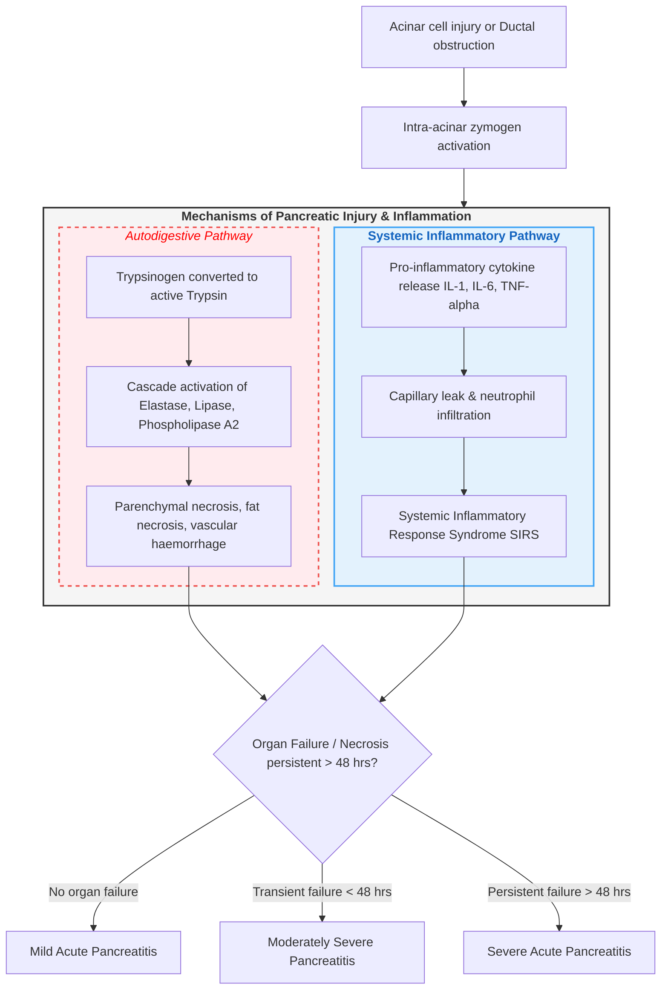

### Pathophysiology Flowchart of Acute Pancreatitis

- **Initiating Insult**: **Gallstone ampullary obstruction** or **alcohol toxicity** leads to impaired zymogen exocytosis and intracellular fusion of zymogen granules with lysosomes.
- **Intra-Acinar Enzyme Activation**: Lysosomal **cathepsin B** converts **trypsinogen to active trypsin**, triggering cascade activation of **elastase**, **lipase**, and **phospholipase A2**.
- **Autodigestion & Tissue Injury**: Activated enzymes digest pancreatic tissue, producing **parenchymal necrosis**, **retroperitoneal fat saponification**, and **vascular hemorrhage**.
- **Systemic Cytokine Release**: Pro-inflammatory cytokines (**TNF-α**, **IL-1**, **IL-6**) induce endothelial injury, capillary permeability, and **Systemic Inflammatory Response Syndrome (SIRS)**.
- **Severity Stratification**: Categorized into **Mild** (no organ failure), **Moderately Severe** (transient organ failure < 48 hours), or **Severe Acute Pancreatitis** (persistent organ failure > 48 hours).