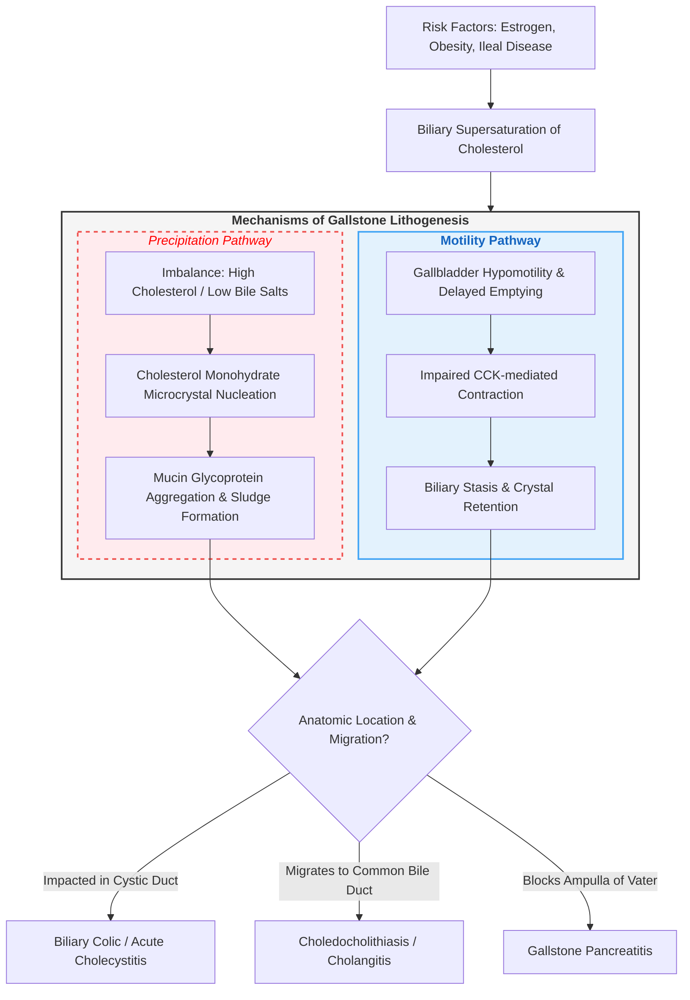

# Cholelithiasis (Gallstones)

---

### 1. Definition [⭐ High-Yield]
- **Cholelithiasis** is defined as the presence of **solid crystalline deposits (calculi)** formed within the **gallbladder**.
- Arises due to a chronic biochemical imbalance in bile composition, leading to **supersaturation**, **crystallization**, and **stone aggregation**.

---

### 2. Etiology / Causes / Risk Factors [⭐ High-Yield]
- **Classic Epidemiological Risk Factors (The 5 'F's)**:
  - **Female sex** (estrogen increases biliary cholesterol secretion)
  - **Forty** (age **> 40 years**)
  - **Fat** (**Obesity**, BMI **> 30 kg/m²**)
  - **Fertile** (Multiparity, pregnancy, oral contraceptive pill usage)
  - **Fair** (More prevalent in Caucasian populations)
- **Acquired Risk Factors for Cholesterol Stones**:
  - **Terminal Ileal Disease or Resection** (e.g., **Crohn's disease**): Disrupts **enterohepatic circulation of bile salts**, reducing bile salt pool and precipitating cholesterol.
  - **Rapid Weight Loss & Bariatric Surgery**: Increases biliary cholesterol saturation and gallbladder stasis.
  - **Cystic Fibrosis**: Disrupted biliary secretions lead to viscous bile and stone formation.
  - **Drugs**: **Fibrates** (inhibit bile acid synthesis), **ceftriaxone** (biliary pseudolithiasis), **estrogens**.
- **Risk Factors for Pigment Stones**:
  - **Black Pigment Stones**: **Chronic intravascular haemolysis** (**sickle cell anaemia**, **thalassaemia**, **hereditary spherocytosis**) and **liver cirrhosis** (excess unconjugated bilirubin).
  - **Brown Pigment Stones**: **Chronic biliary tract infection and stasis** (*Escherichia coli*, *Clonorchis sinensis*, *Fasciola hepatica* producing bacterial **β-glucuronidase**).

---

### 3. Classification [⭐ High-Yield]
- **Cholesterol Stones** (**80%** of all calculi):
  - Composed of **> 50% crystalline cholesterol monohydrate**.
  - Typically **yellow-green**, large, solitary or multiple, radiolucent on plain X-ray.
- **Pigment Stones** (**20%** of all calculi):
  - Composed of **calcium bilirubinate** and polymerised bilirubin salts (**< 20% cholesterol**).
  - **Black Pigment Stones**: Small, dark, hard, brittle; form in sterile gallbladder bile due to excess unconjugated bilirubin.
  - **Brown Pigment Stones**: Soft, greasy, earthy-brown; form primarily in bile ducts secondary to stasis and bacterial infection.
- **Mixed Stones**:
  - Composed of cholesterol, bile pigments, calcium carbonate, and calcium palmitate; often multiple and faceted.

---

### 4. Pathophysiology [⭐ High-Yield]

1. **Bile Supersaturation**: Hepatic secretion of excess **cholesterol** relative to **bile salts** and **lecithin (phospholipids)** overcomes the solubilising capacity of bile micelles.
2. **Nucleation & Crystal Growth**: Supersaturated cholesterol precipitates out of solution as **cholesterol monohydrate microcrystals**, accelerated by **gallbladder mucin hypersecretion**.
3. **Gallbladder Hypomotility**: Delayed gallbladder emptying and prolonged transit time allow microcrystals to aggregate into **biliary sludge** and mature **gallstones**.
4. **Calculus Migration**: Contraction triggered by **cholecystokinin (CCK)** pushes stones into the **cystic duct** or **common bile duct**, causing mechanical obstruction.

---

### 5. Clinical Features [⭐ High-Yield]

#### Symptoms
- **Asymptomatic** (**80%** of patients): Incidental finding on abdominal imaging.
- **Biliary Colic**:
  - Severe, constant, cramping pain in the **epigastrium** or **Right Upper Quadrant (RUQ)**.
  - Pain typically radiates to the **right scapula** or **interscapular region** (referred via phrenic and splanchnic nerves).
  - Onset occurs **30–60 minutes after a fatty meal**; lasts **30 minutes to 6 hours** before gradually subsiding.
  - Associated with **nausea** and **vomiting**.
- **Acute Cholecystitis Symptoms**: Persistent pain lasting **> 6 hours**, accompanied by **fever**, **chills**, and systemic toxicity.

#### Signs
- **RUQ Tenderness & Localized Guarding**: Tender on deep palpation over the gallbladder area.
- **Murphy’s Sign Positive**: Pathognomonic for **acute cholecystitis** — sudden arrest of deep inspiration due to severe pain when the examiner's fingers press under the right costal margin during inspiration.
- **Boas’ Sign Positive**: Area of hyperaesthesia beneath the **right scapula** (D7–D9 dermatomes).
- **Courvoisier’s Law / Sign**: In a patient with jaundice, a **palpably enlarged, non-tender gallbladder** is unlikely to be due to gallstones (more suggestive of malignant obstruction, e.g., pancreatic head carcinoma).
- **Jaundice, High Fever & Rigors**: Indicates **choledocholithiasis** or **acute ascending cholangitis** (**Charcot’s Triad** / **Reynolds’ Pentad**).

---

### 6. Diagnosis / Investigations [⭐ High-Yield]

#### Lab Findings
- **Full Blood Count**: **Leucocytosis with neutrophilia** in **acute cholecystitis** or **cholangitis**.
- **Liver Function Tests (LFTs)**:
  - **Normal LFTs** in uncomplicated cholelithiasis and simple biliary colic.
  - Elevated **Alkaline Phosphatase (ALP)**, **Gamma-Glutamyl Transferase (GGT)**, and **Conjugated Bilirubin** indicate **biliary tree obstruction (choledocholithiasis)**.
  - Mild transient rise in **transaminases (ALT/AST)** during acute ductal passage.
- **Serum Amylase & Lipase**: Checked routinely to rule out **gallstone-induced acute pancreatitis** (elevated **≥ 3 times ULN**).

#### Imaging
- **Transabdominal Ultrasound (USG) Abdomen**:
  - **First-line imaging investigation of choice** (**sensitivity > 95%**).
  - **Findings**: **Intraluminal hyperechoic foci** displaying **posterior acoustic shadowing** and demonstrating gravity-dependent movement with patient repositioning.
  - **USG Signs of Acute Cholecystitis**: **Gallbladder wall thickening (> 3 mm)**, **pericholecystic fluid**, and **sonographic Murphy’s sign**.
- **Magnetic Resonance Cholangiopancreatography (MRCP)**: Non-invasive gold standard imaging for visualizing **common bile duct stones (choledocholithiasis)**.
- **Endoscopic Ultrasound (EUS)**: High-resolution evaluation for small choledocholithiasis or ampullary lesions.
- **CT Abdomen**: Useful for evaluating complications like **gallbladder perforation**, **emphysematous cholecystitis**, or **intra-abdominal abscesses**.

---

### 7. Differential Diagnosis [⭐ High-Yield]

| Feature | Cholelithiasis / Biliary Colic | Acute Cholecystitis | Peptic Ulcer Disease | Acute Pancreatitis |
| :--- | :--- | :--- | :--- | :--- |
| **Pain Site & Duration** | **RUQ / Epigastrium**; lasts **< 6 hours** | **RUQ**; persistent **> 6 hours** | Epigastric burning/gnawing; episodic | Epigastric boring; persistent |
| **Radiation** | **Right scapula / interscapular** | **Right shoulder / scapula** | Back (if posterior penetration) | **Straight through to back** |
| **Fever & Inflammatory Markers** | **Absent**; WBC normal | **Present**; high WBC & CRP | Absent (unless perforated) | **Present**; high CRP |
| **Physical Exam Sign** | Localized RUQ tenderness | **Murphy’s sign positive** | Epigastric tenderness | Epigastric guarding, **Cullen/Grey Turner signs** |
| **Diagnostic Imaging / Biomarker** | **USG: Hyperechoic focus with posterior acoustic shadow** | **USG: Wall thickening > 3 mm & pericholecystic fluid** | Upper GI Endoscopy | **Serum Amylase & Lipase ≥ 3x ULN** |

---

### 8. Treatment / Management [⭐ High-Yield]

#### Non-pharmacological
- **Asymptomatic Gallstones**: **Observation & reassurance** (routine prophylactic cholecystectomy is NOT indicated).
- **Dietary Modification**: Low-fat diet to prevent CCK-triggered gallbladder contraction.
- **NPO (Nil Per Os)** and **intravenous rehydration** during acute pain episodes.

#### Pharmacological (Dosage Table)

| Drug | Dose | Route | Frequency | Duration | Key Caution |
| :--- | :--- | :--- | :--- | :--- | :--- |
| **Ursodeoxycholic Acid (UDCA)** | **8–10 mg/kg/day** | **Oral** | **Twice daily** | **6–24 months** | Only for small radiolucent cholesterol stones (**< 5–10 mm**) in functioning gallbladder; high recurrence rate |
| **Diclofenac** | **75 mg** | **IM / Oral** | Single dose / **Twice daily** | Acute biliary colic | **Avoid in peptic ulcer**, active GI bleeding, severe renal impairment |
| **Morphine** | Not specified in source — verify with standard guideline | **IV** | As required | Acute severe pain | May cause sphincter of Oddi spasm; titrate carefully |
| **Hyoscine Butylbromide** | **20 mg** | **IV / Oral** | **8-hourly** | As required | Antispasmodic for smooth muscle contraction; caution in glaucoma/prostatic hypertrophy |
| **Ceftriaxone** | **1–2 g** | **IV** | **Daily** | **7–10 days** | Empirical coverage in acute cholecystitis / cholangitis |
| **Metronidazole** | **500 mg** | **IV / Oral** | **8-hourly** | **7–10 days** | Added to cover anaerobic biliary pathogens |

#### Surgical / Interventional
- **Laparoscopic Cholecystectomy**:
  - **Gold-standard surgical treatment of choice** for **symptomatic cholelithiasis**.
  - **Acute Cholecystitis**: Early laparoscopic cholecystectomy recommended **within 72 hours of admission**.
- **Endoscopic Retrograde Cholangiopancreatography (ERCP)**:
  - Indicated for **choledocholithiasis**: **Endoscopic sphincterotomy and stone extraction** using a retrieval balloon or basket prior to or alongside cholecystectomy.

---

### 9. Complications [⭐ High-Yield]
- **In the Gallbladder**:
  - **Acute Cholecystitis**: Secondary bacterial infection (*E. coli*, *Klebsiella*, *Enterococcus*).
  - **Chronic Cholecystitis**: Fibrotic shrunken gallbladder ("porcelain gallbladder" with increased risk of malignancy).
  - **Empyema & Mucocele of Gallbladder**: Pus or clear fluid accumulation secondary to cystic duct obstruction.
  - **Gangrene & Perforation**: Ischaemic wall necrosis leading to peritonitis.
  - **Gallbladder Carcinoma**: Long-standing large calculi (> 3 cm) increase malignancy risk.
- **In the Bile Ducts**:
  - **Choledocholithiasis**: Migration into the common bile duct causing obstructive jaundice.
  - **Acute Ascending Cholangitis**: Life-threatening infection of obstructed bile ducts.
- **In the Gastrointestinal Tract**:
  - **Gallstone Pancreatitis**: Impaction at the ampulla of Vater causing pancreatic zymogen activation.
  - **Gallstone Ileus**: Erosion of a large stone through a **cholecystoduodenal fistula**, obstructing the gastrointestinal tract (typically at the **terminal ileum**).
  - **Mirizzi Syndrome**: Extrinsic compression of the common hepatic duct by a stone impacted in the cystic duct neck.

---

### 10. Prognosis
- **Asymptomatic Stones**: Annual risk of developing symptoms is **1–2% per year**.
- **Symptomatic Patients**: Excellent recovery post-cholecystectomy; **laparoscopic cholecystectomy** carries a surgical mortality of **< 0.5%**.

---

### 11. Mnemonic / Memory Palace

#### Acronym Mnemonic: **G-A-L-L-S-T-O-N-E-S**
- **G**: **Gallbladder ultrasound** (**1st-line investigation of choice**)
- **A**: **Asymptomatic in 80%**
- **L**: **Laparoscopic Cholecystectomy** (**Gold-standard treatment**)
- **L**: **Lipid / Cholesterol supersaturation**
- **S**: **Scapular radiation of pain** (Boas' sign)
- **T**: **Terminal ileal disease** (Crohn's causing bile acid malabsorption)
- **O**: **Obesity & 5 F's risk factors**
- **N**: **Nausea & vomiting after fatty meals**
- **E**: **ERCP for common bile duct stones**
- **S**: **Sonographic Murphy’s sign**

---

### Diagram 1: Anatomic Sites of Gallstone Impaction and Clinical Sequelae
- **Type**: Anatomical flow diagram
- **Outline Shape to Draw**: Biliary tree (gallbladder, cystic duct, common hepatic duct, common bile duct, and pancreatic duct entering duodenum).
- **Labels in Order**:
  1. **Gallbladder Fundus/Body**: Site of stone formation (asymptomatic cholelithiasis).
  2. **Cystic Duct Neck (Hartmann's Pouch)**: Site of impaction causing **biliary colic** or **acute cholecystitis**.
  3. **Common Bile Duct (CBD)**: Site of stone migration causing **choledocholithiasis**, **biliary colic**, and **obstructive jaundice**.
  4. **Ampulla of Vater / Hepatopancreatic Ampulla**: Site of obstruction causing **gallstone pancreatitis** and **acute ascending cholangitis**.
- **Arrows / Connections**: Gallbladder → Cystic Duct → Common Bile Duct → Ampulla of Vater → Duodenum.
- **One High-Yield Annotation**: Highlight that **ERCP with sphincterotomy** is the treatment of choice for stones in the **Common Bile Duct**.

---

### Clinical Pearl
- A patient presenting with **biliary colic** who develops **persistent fever, leucocytosis, and fixed RUQ tenderness** has crossed the threshold from simple mechanical obstruction to **acute cholecystitis**, requiring urgent intravenous antibiotics and early surgical evaluation.

---

### Exam Trap
- **Courvoisier’s Law Confusion**:
  - **Jaundice + Palpable Non-Tender Gallbladder** = **Malignant obstruction** (e.g., Head of Pancreas Carcinoma or Cholangiocarcinoma).
  - **Gallstones** do NOT usually cause a palpable gallbladder because chronic inflammation causes a fibrotic, shrunken, non-distensible gallbladder wall.

---

### Quick Revision
- **Etiology**: **5 F's** (Female, Forty, Fat, Fertile, Fair) & **Ileal resection/Crohn's**.
- **Gold Standard Diagnostic Tool**: **Abdominal Ultrasound** showing hyperechoic foci with acoustic shadowing.
- **Gold Standard Treatment**: **Laparoscopic Cholecystectomy** for symptomatic gallbladder stones.
- **Ductal Stone Management**: **ERCP with endoscopic sphincterotomy** for CBD stones.
- **Major Triad for Cholangitis**: **Charcot's Triad** (Fever + Jaundice + RUQ Pain).

---

### One-Line Exam Opener
- Cholelithiasis is a common hepatobiliary disorder characterized by the formation of cholesterol or pigment crystalline calculi within the gallbladder secondary to bile supersaturation, gallbladder hypomotility, and nucleation.

---

💡 *Would you like me to generate flashcards or a practice quiz on Biliary Tract Disorders to test your recall on gallstone complications and management?*