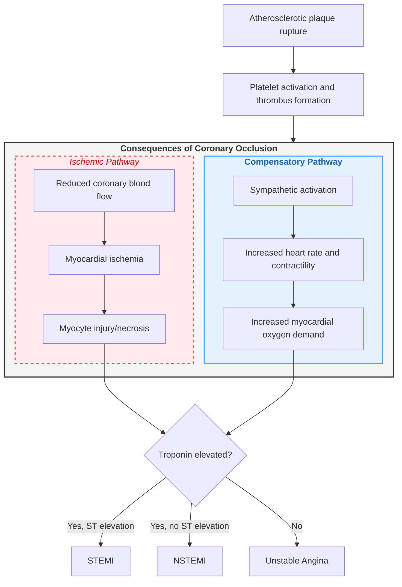

````

```mermaid
flowchart TB
    A[Atherosclerotic plaque rupture] --> B[Platelet activation and thrombus formation]
    B --> Outer

    subgraph Outer [<b>Consequences of Coronary Occlusion</b>]
        subgraph Ischemia [<i style='color:red;'>Ischemic Pathway</i>]
            C[Reduced coronary blood flow] --> D[Myocardial ischemia]
            D --> E[Myocyte injury/necrosis]
        end

        subgraph Compensate [<b style='color:#1565c0;'>Compensatory Pathway</b>]
            F[Sympathetic activation] --> G[Increased heart rate and contractility]
            G --> H[Increased myocardial oxygen demand]
        end
    end

    E --> I{Troponin elevated?}
    H --> I
    I -->|Yes, ST elevation| J[STEMI]
    I -->|Yes, no ST elevation| K[NSTEMI]
    I -->|No| L[Unstable Angina]

    style Outer fill:#f5f5f5,stroke:#333,stroke-width:2px
    style Ischemia fill:#ffebee,stroke:#ef5350,stroke-width:2px,stroke-dasharray: 5 5
    style Compensate fill:#e3f2fd,stroke:#42a5f5,stroke-width:2px
```
````


```mermaid
flowchart TB
    A[Atherosclerotic plaque rupture] --> B[Platelet activation and thrombus formation]
    B --> Outer

    subgraph Outer [<b>Consequences of Coronary Occlusion</b>]
        subgraph Ischemia [<i style='color:red;'>Ischemic Pathway</i>]
            C[Reduced coronary blood flow] --> D[Myocardial ischemia]
            D --> E[Myocyte injury/necrosis]
        end

        subgraph Compensate [<b style='color:#1565c0;'>Compensatory Pathway</b>]
            F[Sympathetic activation] --> G[Increased heart rate and contractility]
            G --> H[Increased myocardial oxygen demand]
        end
    end

    E --> I{Troponin elevated?}
    H --> I
    I -->|Yes, ST elevation| J[STEMI]
    I -->|Yes, no ST elevation| K[NSTEMI]
    I -->|No| L[Unstable Angina]

    style Outer fill:#f5f5f5,stroke:#333,stroke-width:2px
    style Ischemia fill:#ffebee,stroke:#ef5350,stroke-width:2px,stroke-dasharray: 5 5
    style Compensate fill:#e3f2fd,stroke:#42a5f5,stroke-width:2px
```