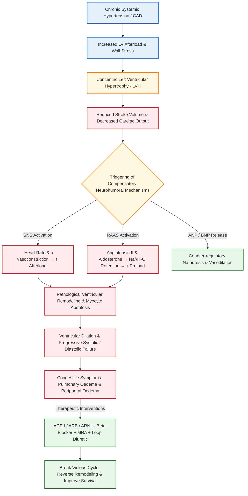

[[C16-Cardiology]]
# Chronic Heart Failure / Congestive Cardiac Failure (with Hypertension)

## 1. Definition [⭐ High-Yield]

**Heart Failure (HF)**, often termed **Congestive Cardiac Failure (CCF)**, is a clinical syndrome that develops when the heart cannot maintain an adequate cardiac output to satisfy the metabolic demands of peripheral tissues, or can do so only at the expense of an elevated ventricular filling pressure.

In clinical practice, heart failure is diagnosed when a patient with structural or functional heart disease develops symptoms (e.g., breathlessness, fatigue) and signs (e.g., elevated jugular venous pressure, pulmonary crepitations, peripheral oedema) of low cardiac output, pulmonary congestion, or systemic venous congestion at rest or during exertion.

- **Systolic Dysfunction (HFrEF):** Characterized by impaired myocardial contractility and ejection fraction (EF <40%), where the dilated ventricle cannot generate sufficient wall tension to eject blood effectively.
- **Diastolic Dysfunction (HFpEF):** Characterized by a stiff, non-compliant ventricular wall with impaired relaxation during diastole, resulting in elevated filling pressures despite a preserved ejection fraction (EF ≥50%). **Long-standing hypertension** is the single most common cause of left ventricular hypertrophy (LVH) and subsequent diastolic heart failure.

---

## 2. Etiology / Causes / Risk Factors [⭐ High-Yield]

### A. Causes of Heart Failure

1. **Pressure Overload (Ventricular Outflow Obstruction):**
    - **Left Heart Failure:** **Systemic Hypertension** (most frequent hypertensive cause), Aortic Stenosis.
    - **Right Heart Failure:** Pulmonary Hypertension, Pulmonary Valve Stenosis.
2. **Myocardial Disease / Impaired Contractility:**
    - Coronary Artery Disease (CAD) and Myocardial Infarction (MI) — segmental loss of functioning myocardium.
    - Myocarditis, Dilated Cardiomyopathy (DCM) — global systolic dysfunction.
3. **Volume Overload (Ventricular Inflow / Valvular Regurgitation):**
    - Mitral Regurgitation, Aortic Regurgitation, Ventricular Septal Defect (VSD).
4. **Restricted Filling / Diastolic Impairment:**
    - Left Ventricular Hypertrophy (secondary to chronic hypertension).
    - Constrictive Pericarditis, Restrictive Cardiomyopathy, Cardiac Tamponade.
5. **Arrhythmias:**
    - Tachycardiomyopathy / Prolonged Tachycardia (e.g., Atrial Fibrillation with rapid ventricular response).
    - Complete Heart Block / Severe Bradycardia.
6. **High-Output Cardiac Failure (Non-Cardiac Causes):**
    - Severe Anaemia, Thyrotoxicosis, Beri-beri (Thiamine deficiency), Arteriovenous fistulae.

### B. Cardiovascular Risk Factors for Hypertensive Heart Failure

- Age >55 years in men, >65 years in women.
- Long-standing uncontrolled Blood Pressure (Clinic BP ≥140/90 mmHg or ABPM ≥135/85 mmHg).
- Co-existing Diabetes Mellitus, Dyslipidaemia, Smoking, Obesity (BMI ≥30 kg/m²), and Chronic Kidney Disease (CKD).

---

## 3. Factors Acutely Decompensating Chronic Stable Heart Failure [⭐ High-Yield]

Patients with chronic heart failure often follow a relapsing-remitting course. A stable patient can rapidly decompensate into acute heart failure or pulmonary oedema due to specific precipitating factors:

### Mnemonic: "HEART FAILURES"

- **H** — **Hypertension (Uncontrolled):** Sudden spike in afterload.
- **E** — **Endocrine / Metabolic stress:** Thyrotoxicosis, pregnancy, severe anaemia, fever.
- **A** — **Arrhythmias:** Sudden onset of Atrial Fibrillation (AF) with loss of atrial kick and rapid heart rate.
- **R** — **Reduction of therapy:** Inappropriate cessation or non-adherence to prescribed diuretics or ACE inhibitors.
- **T** — **Treatment with cardiotoxic / offending drugs:**
    - Drugs with negative inotropic activity (e.g., starting β-blockers at standard doses without titration, verapamil, diltiazem).
    - Drugs causing sodium and water retention (e.g., NSAIDs, glucocorticoids, fludrocortisone).
- **F** — **Fluid / Salt overload:** Excessive intravenous fluid administration, high dietary sodium intake.
- **A** — **Acute Myocardial Ischaemia or Infarction:** Segmental loss of contractility.
- **I** — **Intercurrent Illness / Infection:** Respiratory tract infection (pneumonia), urinary tract infection, sepsis.
- **L** — **Lung pathology:** Pulmonary Embolism (PE).
- **U** — **Uraemia / Renal dysfunction:** Acute kidney injury or worsening CKD.
- **R** — **Restlessness / Emotional & Physical Stress:** Excessive physical exertion.
- **E** — **Electrolyte imbalance:** Hypokalaemia or hypomagnesaemia triggering arrhythmias.
- **S** — **Silent Valvular Dysfunction:** Acute papillary muscle rupture or chordal rupture.

---

## 4. Classification

### A. NYHA Functional Classification (Based on Exercise Tolerance)

- **Class I:** Cardiac disease present, but **no limitation** of physical activity. Ordinary physical activity does not cause undue fatigue, palpitation, or dyspnoea.
- **Class II:** **Slight limitation** of physical activity. Comfortable at rest, but ordinary physical activity results in fatigue, palpitation, or dyspnoea.
- **Class III:** **Marked limitation** of physical activity. Comfortable at rest, but less than ordinary activity causes fatigue, palpitation, or dyspnoea.
- **Class IV:** **Inability to carry out any physical activity** without discomfort. Symptoms of heart failure are present even at rest.

### B. Pathophysiologic / Anatomical Classification

1. **Left-Sided vs Right-Sided vs Biventricular Failure:**
    - **Left Heart Failure:** Passive congestion of pulmonary circulation leading to pulmonary oedema and reduced systemic output.
    - **Right Heart Failure:** Reduction in RV output with elevated right atrial and systemic venous pressure, producing peripheral oedema, hepatomegaly, and ascites.
    - **Biventricular Failure:** Combined features of left and right heart failure.
2. **Systolic Failure (HFrEF) vs Diastolic Failure (HFpEF):**
    - **Systolic Failure (EF <40%):** Pump failure due to impaired myocardial contractility.
    - **Diastolic Failure (EF ≥50%):** Impaired ventricular relaxation and filling due to a stiff, hypertrophied ventricle (e.g., hypertensive heart disease).
3. **Forward Failure vs Backward Failure:**
    - **Forward Failure:** Symptoms due to inadequate systemic tissue perfusion (fatigue, weakness, oliguria).
    - **Backward Failure:** Symptoms due to blood pooling in venous beds behind the failing ventricle (pulmonary oedema, peripheral oedema).

---

## 5. Pathophysiology (with Flowchart) [⭐ High-Yield]

### Pathogenetic Sequence

1. **Initial Cardiac Burden (e.g., Chronic Hypertension):**
    - Hypertension increases left ventricular afterload (pressure overload).
    - To maintain cardiac output against high systemic vascular resistance, the left ventricle undergoes **concentric left ventricular hypertrophy (LVH)**.
2. **Transition from Adaptation to Failure:**
    - Over time, progressive myocyte hypertrophy is accompanied by interstitial fibrosis, capillary-to-myocyte mismatch, and myocyte apoptosis.
    - Ventricular compliance falls, leading to elevated left ventricular end-diastolic pressure (LVEDP).
3. **Activation of Compensatory Neurohumoral Systems:**
    - **Sympathetic Nervous System (SNS):** Decreased stroke volume triggers reflex adrenergic discharge → ↑ Heart rate and ↑ myocardial contractility, but α-mediated vasoconstriction increases afterload and myocardial work.
    - **Renin-Angiotensin-Aldosterone System (RAAS):** Reduced renal blood flow stimulates renin secretion:
        - **Angiotensin II:** Potent vasoconstrictor (increases afterload) and direct driver of pathological myocyte remodeling and fibrosis.
        - **Aldosterone:** Promotes renal Na⁺ and H₂O retention (increases preload and circulatory volume), K⁺/Mg²⁺ loss, and myocardial fibroblast proliferation.
    - **Vasopressin (ADH) & Endothelin-1:** Promote free water retention, hyponatraemia, and systemic arterial vasoconstriction.
    - **Counter-regulatory Peptides (ANP & BNP):** Released from stretched atria and ventricles to promote natriuresis, diuresis, and vasodilation, but their effects are ultimately overwhelmed by RAAS/SNS hyperactivation.
4. **Laplace Law and Vicious Cycle:** \[\text{Wall Tension} = \frac{\text{Intraventricular Pressure} \times \text{Ventricular Radius}}{\text{Wall Thickness}}\] As the ventricle dilates, the intraventricular radius increases. To generate the same systolic pressure, the failing ventricle must generate much higher wall tension, demanding greater oxygen consumption and setting up a self-perpetuating vicious cycle of progressive dilation and decline. (See **Diagram 1**).

### Pathophysiology Flowchart



---

## 6. Clinical Features

### A. Left Heart Failure (LVF)

#### Symptoms

- **Exertional Dyspnoea:** Earliest symptom due to pulmonary venous congestion and reduced lung compliance.
- **Orthopnoea:** Dyspnoea occurring when lying flat, relieved by sitting or standing (due to redistribution of fluid from lower extremities into thoracic circulation).
- **Paroxysmal Nocturnal Dyspnoea (PND):** Sudden awakening at night with severe breathlessness and suffocation, forcing the patient to sit upright or go to an open window.
- **Cough:** Dry or productive of frothy, pink blood-tinged sputum.
- **Low Output Symptoms:** Fatigue, listlessness, cold peripheries, confusion, and oliguria.
- Shortness of breath
- Pedal edema

#### Signs

- **General:** Tachypnoea, central cyanosis, cool clammy extremities, low or elevated BP.
- **Cardiovascular:** Tachycardia, displaced hyperdynamic/sustained apex beat (cardiomegaly), **Third Heart Sound (S₃ gallop)** due to rapid early diastolic filling into a volume-overloaded ventricle, **Fourth Heart Sound (S₄)** due to atrial contraction into a stiff LV (hypertension).
- **Respiratory:** Fine inspiratory crackles (crepitations) at lung bases (or throughout lung fields in acute pulmonary oedema) and expiratory wheeze ("cardiac asthma").

### B. Right Heart Failure (RVF)

#### Symptoms

- Dependent swelling of feet, ankles, or sacrum.
- Right upper quadrant abdominal discomfort (secondary to hepatic capsule stretching from liver congestion).
- Abdominal distension (ascites) and anorexia/nausea (gastrointestinal mucosal congestion).

#### Signs - (all right side)

- **Elevated Jugular Venous Pressure (JVP):** Prominent 'a' wave (if in sinus rhythm) or irregular 'v' waves (triscuspid regurgitation / AF).
- **Hepatomegaly:** Tender, smooth enlargement of the liver (**Nutmeg liver**).
- **Dependent Pitting Oedema:** Ankle/pretibial oedema in ambulatory patients; sacral/thigh oedema in bed-bound patients.
- **Serous Effusions:** Ascites and pleural effusions (right-sided > left-sided).
- **Cardiovascular:** Right ventricular heave, loud P₂ (pulmonary hypertension). (See **Diagram 2**).

---

## 7. Diagnosis / Investigations

### A. Laboratory Investigations

- **Serum Biomarkers (BNP / ==NT-proBNP==):** B-type Natriuretic Peptide is released by ventricular myocytes under increased wall stretch.
    - **Diagnostic Utility:** High sensitivity; a ==normal BNP (<100 pg/mL)== has a high negative predictive value to rule out heart failure.
    - **Prognostic Utility:** Serial levels monitor response to therapy and disease progression.
- **Renal Function Tests & Electrolytes:** Serum urea and creatinine (detects prerenal azotemia/cardiorenal syndrome); Hyponatraemia (marker of severe advanced HF and excess ADH secretion); Hypokalaemia or Hyperkalaemia.
- **Full Blood Count (FBC):** Identifies anaemia (precipitant or aggravator) or leucocytosis (infection).
- **Liver Function Tests (LFTs):** Elevated bilirubin, ALT, AST, and prolonged prothrombin time due to hepatic venous congestion.
- **Thyroid Function Tests (TFTs), Fasting Glucose, Lipid Profile:** Exclude secondary precipitants (thyrotoxicosis, diabetes, dyslipidaemia).

### B. Electrocardiogram (ECG)

- Detects left ventricular hypertrophy (LVH) using voltage criteria (e.g., Sokolow-Lyon criteria in hypertension).
- Identifies prior myocardial infarction (pathological Q waves), ischaemic ST-T wave changes, bundle branch block (especially Left Bundle Branch Block — LBBB), and arrhythmias (Atrial Fibrillation).

### C. Chest X-Ray (CXR)

- **Cardiomegaly:** Cardiothoracic ratio >0.50 on PA view.
- **Pulmonary Venous Congestion:** Prominence and distension of upper lobe blood vessels (stag-antler sign).
- **Interstitial Oedema:** Septal lines or **Kerley B lines** (short horizontal lines at lung bases).
- **Alveolar Oedema:** Hazy opacification spreading bilaterally from hilar regions in a "==bat-wing" or "butterfly" distribution.==
- **Pleural Effusions:** Usually bilateral or right-sided.

### D. Echocardiography (Gold Standard Bedside Investigation)

- Confirms diagnosis and categorises HF into **HFrEF** (EF <40%) vs **HFpEF** (EF ≥50%).
- Evaluates ==left ventricular wall thickness== (concentric hypertrophy in hypertension), chamber dimensions, regional wall motion abnormalities (CAD), valvular stenosis/regurgitation, and diastolic filling parameters.

### E. Advanced Imaging

- **Cardiac MRI:** Gold standard for accurate measurement of ventricular volumes, ejection fraction, and tissue characterisation (myocardial fibrosis/scarring).

---

## 8. Differential Diagnosis

|Feature|Chronic Heart Failure (CCF)|Chronic Obstructive Pulmonary Disease (COPD)|Cirrhosis of Liver|Nephrotic Syndrome|
|:--|:--|:--|:--|:--|
|**Primary Pathology**|Cardiac pump failure|Chronic airflow limitation|Hepatic parenchymal failure & portal HTN|Glomerular podocyte injury|
|**Dyspnoea**|Exertional, Orthopnoea, PND present|Exertional, no prominent orthopnoea|Absent unless massive ascites|Absent unless severe hydrothorax|
|**JVP**|Elevated with prominent waves|Normal or elevated in cor pulmonale|Normal or low|Normal|
|**Auscultation**|Bi-basal fine crackles, S₃/S₄ gallop|Expiratory wheeze, quiet breath sounds|Normal lung sounds|Normal or dull at bases (effusion)|
|**Oedema Distribution**|Dependent (ankles/sacrum)|Ankle oedema only in cor pulmonale|Predominantly ascites; leg oedema late|Generalized, facial/periorbital early|
|**Serum Albumin**|Normal (unless cardiac cachexia)|Normal|Markedly Reduced (<3.0 g/dL)|Severely Reduced (<2.5 g/dL)|
|**Chest X-Ray**|Cardiomegaly, Kerley B lines, alveolar haze|Hyperinflated lungs, flat diaphragms|Normal lungs|Normal heart size, pleural effusions|

---

## 9. Treatment / Management (Rationale & Specific Drug Details) [⭐ High-Yield]

### A. General & Lifestyle Measures

- **Dietary Salt Restriction:** Limit sodium intake to <2.0 g/day (<5.0 g NaCl/day or 50–80 mmol/day).
- **Fluid Restriction:** Limit fluids to 1.5–2.0 L/day in severe hyponatraemia.
- **Weight Monitoring:** Daily weighing; sudden weight gain (>1.5–2 kg over 2 days) signals fluid retention requiring diuretic adjustment.
- **Lifestyle:** Smoking cessation, complete abstinence from alcohol (mandatory in alcoholic cardiomyopathy), influenza and pneumococcal vaccination, light aerobic exercise within symptom limits.

---

### B. Pharmacotherapy in Chronic Heart Failure with Hypertension

#### 1. Angiotensin-Converting Enzyme (ACE) Inhibitors

- **Drug Names:** Enalapril, Ramipril, Lisinopril.
- **Mechanism of Action:** (KDT Textbook p. 530, 564; Davidson p. 464). Inhibits ACE, preventing the conversion of Angiotensin I to Angiotensin II. This produces arteriolar and venodilation (reduces afterload and preload), suppresses aldosterone secretion (prevents Na⁺/H₂O retention), decreases sympathetic output, and inhibits Ang II-mediated myocyte hypertrophy, apoptosis, and myocardial fibrosis. Also inhibits kininase II, raising vasodilatory bradykinin and nitric oxide (NO) levels.
- **Dose & Route:**
    - **Enalapril:** Initial 2.5 mg PO BD; target maintenance dose 10–20 mg PO BD.
    - **Ramipril:** Initial 1.25–2.5 mg PO OD; target maintenance dose 10 mg PO OD.
    - **Lisinopril:** Initial 2.5 mg PO OD; target maintenance dose 20–35 mg PO OD.
- **Frequency:** Once or twice daily (oral).
- **Key Features:** First-line disease-modifying therapy for all grades of HFrEF (NYHA I–IV). Reduces mortality by ~20% and decreases hospitalisation. Highly effective in hypertensive patients with LVH, co-existing diabetes, or CKD.
- **Side Effects:** Dry persistent cough (up to 10–15%, due to bradykinin accumulation), first-dose hypotension, hyperkalaemia, acute drop in GFR, angioedema, skin rash, dysgeusia.
- **When to Start / Stop:**
    - _Start:_ In all stable HFrEF patients with Systolic BP >100 mmHg.
    - _Monitoring:_ Check serum ==K⁺ and renal function (urea/creatinine)== before starting and 1–2 weeks after initiation or dose escalation.
    - _Stop / Hold:_ Do NOT start if baseline K⁺ >5.5 mmol/L. Stop/reduce dose if K⁺ >6.0 mmol/L or if serum creatinine rises by >30% (or GFR drops >25%). Temporarily stop during acute gastrointestinal illness causing dehydration ("sick-day rules"). Contraindicated in bilateral renal artery stenosis and pregnancy.

#### 2. Angiotensin Receptor Blockers (ARBs)

- **Drug Names:** Losartan, Candesartan, Valsartan.
- **Mechanism of Action:** Selectively block the AT₁ subtype of Angiotensin II receptors, blocking all AT₁-mediated vasoconstriction, aldosterone release, and cardiac remodeling without affecting bradykinin breakdown.
- **Dose & Route:**
    - **Candesartan:** Initial 4 mg PO OD; target 32 mg PO OD.
    - **Valsartan:** Initial 40 mg PO BD; target 160 mg PO BD.
    - **Losartan:** Initial 25–50 mg PO OD; target 100 mg PO OD.
- **Frequency:** Once or twice daily (oral).
- **Key Features:** First-line alternative for patients unable to tolerate ACE inhibitors due to dry cough or angioedema.
- **Side Effects:** Hypotension, hyperkalaemia, renal dysfunction (cough is absent).
- **When to Start / Stop:** Same initiation and laboratory monitoring parameters as ACE inhibitors.

#### 3. Angiotensin Receptor-Neprilysin Inhibitor (ARNI)

- **Drug Name:** Sacubitril + Valsartan (Entresto / Vymada).
- **Mechanism of Action:** Dual-action molecule:
    - _Sacubitril:_ Inhibits Neprilysin (neutral endopeptidase), preventing the degradation of endogenous natriuretic peptides (ANP, BNP), bradykinin, and adrenomedullin → increases blood levels of NPs → causes vasodilation, natriuresis, diuresis, and anti-remodeling.
    - _Valsartan:_ Selectively blocks AT₁ receptors.==(to prevent action of angiotensin 2)==
- **Dose & Route:** 24/26 mg, 49/51 mg, or 97/103 mg PO BD (commonly available as 50 mg, 100 mg, and 200 mg combination tablets).
- **Frequency:** Twice daily (oral).
- **Key Features:** Landmark PARADIGM-HF trial demonstrated a **20% additional reduction in cardiovascular death or HF hospitalisation** compared to Enalapril alone. Replaces ACEI or ARB in symptomatic HFrEF (NYHA Class II–IV).
- **Side Effects:** Symptomatic hypotension, hyperkalaemia, mild impairment of renal function, angioedema.
- **When to Start / Stop:** Indicated in stable HFrEF patients remaining symptomatic on ACEI/ARB. **Mandatory 36-hour washout period** required after stopping an ACE inhibitor before starting Sacubitril-Valsartan to prevent severe angioedema.

#### 4. Beta-Adrenoceptor Blockers (β-Blockers)

- **Drug Names:** Bisoprolol, Carvedilol, Metoprolol Succinate SR, Nebivolol.
- **Mechanism of Action:** Antagonises chronic sympathetic hyperactivation → reduces heart rate, lowers myocardial oxygen demand, inhibits reflex-induced myocyte apoptosis, prevents pathological ventricular remodeling, and suppresses malignant ventricular arrhythmias.
    - _Carvedilol:_ Non-selective β + selective α₁ blocker (causes additional arteriolar vasodilation).
    - _Nebivolol:_ Selective β₁ blocker + stimulates endothelial NO synthase (vasodilation).
- **Dose & Route:**
    - **Bisoprolol:** Initial 1.25 mg PO OD; target 10 mg PO OD.
    - **Carvedilol:** Initial 3.125 mg PO BD; target 25–50 mg PO BD.
    - **Metoprolol SR:** Initial 12.5–25 mg PO OD; target 200 mg PO OD.
- **Frequency:** Once or twice daily (oral).
- **Key Features:** **Reduces all-cause mortality by ~33%** (superior to ACEIs alone) and prevents sudden cardiac death.
- **Side Effects:** Bradycardia, hypotension, cold extremities, bronchospasm (avoid non-selective β-blockers in asthma), fatigue, transient initial fluid retention.
- **When to Start / Stop:**
    - _Start:_ ONLY in clinically stable, non-decompensated patients with no fluid overload. Must be initiated at a very low dose and titrated upwards slowly over 8–12 weeks ("start low, go slow").
    - _Stop:_ **Strictly contraindicated in acute decompensated heart failure** or cardiogenic shock. Temporarily withhold or reduce dose during acute decompensation, and re-institute once compensated.

#### 5. Mineralocorticoid Receptor Antagonists (MRAs)

- **Drug Names:** Spironolactone, Eplerenone.
- **Mechanism of Action:** Competitive antagonists of aldosterone at the mineralocorticoid receptor in the late distal tubule/collecting duct. Blocks aldosterone-mediated Na⁺/H₂O retention, prevents myocardial and vascular fibroblast proliferation (anti-fibrotic/anti-remodeling), and prevents urinary K⁺ and Mg²⁺ wasting.
- **Dose & Route:**
    - **Spironolactone:** 12.5–25 mg PO OD (max 50 mg/day).
    - **Eplerenone:** 25–50 mg PO OD.
- **Frequency:** Once daily (oral).
- **Key Features:** Added to ACEI/ARB + β-blocker in moderate-to-severe HFrEF (NYHA Class II–IV) or post-MI LV dysfunction (RALES and EPHESUS trials). Significant mortality and morbidity reduction.
- **Side Effects:** Hyperkalaemia, gynaecomastia, impotence, menstrual irregularities (with Spironolactone due to progesterone/androgen receptor binding; avoided by selective Eplerenone).
- **When to Start / Stop:**
    - _Start:_ In symptomatic HFrEF despite ACEI/ARB and β-blocker.
    - _Stop:_ Avoid if baseline serum K⁺ >5.0 mmol/L or severe renal impairment (creatinine >2.5 mg/dL or eGFR <30 mL/min).

#### 6. Loop & Thiazide Diuretics

- **Drug Names:** Furosemide, Torsemide, Metolazone.
- **Mechanism of Action:**
    - _Furosemide / Torsemide:_ Inhibits Na⁺/K⁺/2Cl⁻ cotransporter in thick ascending limb of Henle's loop → causes rapid natriuresis and diuresis → reduces blood volume, lowers preload and ventricular filling pressures, and relieves pulmonary/systemic congestion.
    - _Metolazone:_ Thiazide-like diuretic inhibiting Na⁺/Cl⁻ cotransporter in distal convoluted tubule; acts synergistically with loop diuretics to overcome diuretic resistance.
- **Dose & Route:**
    - **Furosemide:** 20–80 mg PO OD/BD (or 50–100 mg IV in acute pulmonary oedema).
    - **Metolazone:** 2.5–5 mg PO OD (used as add-on 30 minutes before furosemide).
- **Frequency:** Once or twice daily.
- **Key Features:** Provides rapid, dramatic relief of dyspnoea and congestive symptoms. **Does NOT improve long-term survival**.
- **Side Effects:** Hypokalaemia, hyponatraemia, hypovolaemia, hypotension, prerenal azotemia, metabolic alkalosis, hyperuricaemia.
- **When to Start / Stop:** Used in all symptomatic heart failure with fluid retention. Titrate down to lowest maintenance dose once dry weight is achieved to avoid excessive volume depletion and reflex RAAS activation.

#### 7. Other Adjunctive Agents

- **Ivabradine (5–7.5 mg PO BD):** Selective \(I_f\) current inhibitor in SA node. Slows heart rate **==without negative inotropy==**. Indicated in stable HFrEF in sinus rhythm with HR ≥70 bpm despite maximum tolerated β-blocker dose (SHIFT trial).
- **Digoxin (0.125–0.25 mg PO OD):** Inhibits Na⁺/K⁺ ATPase (positive inotropy) and increases vagal tone (slows AV conduction). Indicated in HFrEF co-existing with Atrial Fibrillation or severe symptomatic HFrEF despite optimal therapy. Reduces hospitalisations, no mortality benefit.


SGLT2 inhibitor - 
- Dapaglifozin
- Empaglifozin
- 
---

### C. Device & Interventional Therapy

- **Cardiac Resynchronisation Therapy (CRT / CRT-D):** Biventricular pacing indicated in patients with NYHA Class II–IV, LVEF ≤35%, sinus rhythm, and Left Bundle Branch Block (LBBB with QRS >130–150 ms) to restore ==synchronous ventricular contraction, improve symptoms, and reduce mortality.==
- **Implantable Cardioverter-Defibrillator (ICD):** Recommended for primary or secondary prevention of sudden cardiac death from ventricular tachycardia/fibrillation in patients with LVEF ≤35%.

---

### D. Antihypertensive Strategy in Patients with Co-existing Heart Failure

- **Target Blood Pressure:** <130/80 mmHg (or <140/90 mmHg in elderly patients).
- **Optimal Regimen:** **ACEI / ARB / ARNI + Beta-blocker + MRA + Diuretic** — this combination controls elevated blood pressure while simultaneously reversing LV remodeling and lowering heart failure mortality.
- **Drugs to Avoid in Hypertensive HF:**
    - **Rate-limiting Calcium Channel Blockers (Verapamil & Diltiazem):** Potent negative inotropes that precipitate acute heart failure. Dihydropyridines like Amlodipine (5–10 mg OD) are neutral and safe if additional BP control is required.
    - **NSAIDs & Centrally Acting Sympatholytics:** Cause fluid retention and blunt response to ACEIs/diuretics.

---

## 10. Complications [⭐ High-Yield]

1. **Acute Decompensated Heart Failure & Acute Pulmonary Oedema:** Sudden fluid shift into alveoli leading to acute respiratory distress and hypoxia.
2. **Cardiorenal Syndrome / Renal Failure:** Low cardiac output reduces renal perfusion, aggravated by aggressive diuresis or ACEI/ARB therapy.
3. **Electrolyte Disturbances:** Hypokalaemia/hypomagnesaemia (loop diuretics) or hyperkalaemia (ACEI/ARB + MRA combination); severe hyponatraemia indicates advanced disease.
4. **Cardiac Arrhythmias & Sudden Death:** Atrial Fibrillation occurs in ~20% of patients. Ventricular tachycardia and ventricular fibrillation account for sudden cardiac death in up to 50% of HF patients.
5. **Thromboembolism:** Deep vein thrombosis (DVT), pulmonary embolism (PE), or embolic stroke secondary to stasis in dilated chambers or AF.
6. **Congestive Hepatomegaly & Cardiac Cirrhosis:** Chronic venous stasis leads to centrilobular necrosis, bridging fibrosis, and jaundice.
7. **Cardiac Cachexia:** Severe loss of muscle and fat tissue caused by anorexia, intestinal malabsorption from mucosal congestion, and elevated inflammatory cytokines.

---

## 11. Prognosis

Untreated or advanced heart failure carries a grave outlook: approximately **50% of patients with severe left ventricular dysfunction die within 2 years** of diagnosis, primarily from pump failure or sudden malignant ventricular arrhythmias.

### Adverse Prognostic Indicators

- NYHA Functional Class IV.
- Markedly reduced LVEF (<20–25%).
- Persistent hyponatraemia (<130 mEq/L).
- Markedly elevated baseline BNP / NT-proBNP levels.
- Co-existing renal dysfunction, anaemia, or frequent ventricular arrhythmias.

---

## 12. Mnemonic / Memory Palace

### Memory Palace: "The Railway Station Journey" (11 Mandatory Facts of Heart Failure Management)

To recall the 11 key management principles under exam stress, visualize walking through a bustling central train station:

1. **Entrance Ticket Counter (Salt Restriction):** A huge banner displaying **"<5 g Salt/day"** hanging over the ticket window (Dietary sodium limitation <50–80 mmol/day).
2. **Station Master’s Office (ACE Inhibitor - Enalapril):** The Station Master is drinking **ACE-tea** while carefully adjusting a dial from **2.5 mg up to 20 mg** (Start low, titrate high for 20% mortality reduction).
3. **Coughing Passenger on Platform 1 (ARB - Candesartan):** A passenger coughing violently from ACE-tea is handed a **Candy bar (Candesartan 4–32 mg)** as a smooth alternative.
4. **Dual Locomotive Engine (ARNI - Sacubitril/Valsartan):** A modern high-speed train named **"Entresto-200"**pulling two connected engines (PARADIGM-HF: 20% mortality edge over Enalapril, requires 36-hr washout).
5. **Slowly Accelerating Train (Beta-Blockers - Bisoprolol):** A train driver starting the engine at a crawl (**Bisoprolol 1.25 mg**) and taking 12 weeks to reach full speed (**10 mg**), with a sign: **"Never start during an acute wreck!"**(33% mortality drop; strictly contraindicated in acute decompensation).
6. **Potassium Guard at the Gate (MRA - Spironolactone):** A guard testing every passenger's blood for **K⁺ <5.0 mEq/L** before allowing **Spironolactone 25 mg** onto the train (Prevents cardiac fibrosis).
7. **Emergency Water Hose (Loop Diuretic - Furosemide):** Firefighters spraying a **40–80 mg Furosemide hose** to quickly clear flooding on the tracks (Symptomatic relief, no mortality benefit).
8. **Station Clock ticking at 70 bpm (Ivabradine):** A large station clock ticking at **≥70 bpm** in sinus rhythm, receiving an **Ivabradine brake**.
9. **Old Heart-Rate Monitor (Digoxin):** An old vintage radio playing an irregular rhythm (Atrial Fibrillation) tuned with **Digoxin 0.25 mg**.
10. **Biventricular Electrical Cables (CRT-D):** High-voltage electrical wires with **3 leads pacing both tracks** (CRT-D for LBBB with QRS >130 ms).
11. **Red Danger Sign on Verapamil Box (Exam Trap):** A bright red warning box over **Verapamil / Diltiazem** stating **"DO NOT LOAD ON HEART FAILURE TRAINS"** (Severe negative inotropes).

---

## 13. Clinical Pearl

> **Clinical Pearl:** In chronic heart failure with hypertension, ACE inhibitors (or ARNIs) and Beta-blockers form the dual "disease-modifying anchor". While ACE inhibitors are started early in any stable patient, **Beta-blockers must NEVER be started during acute fluid overload or decompensation**. Always achieve a dry, compensated state using diuretics first, then introduce Bisoprolol or Carvedilol at a tiny dose, titrating upward every 2–4 weeks.

---

## 14. Exam Trap

### Exam Trap

- **The Mix-Up:** Confusing the role of Beta-blockers in _Chronic Stable Heart Failure_ versus _Acute Decompensated Heart Failure / Pulmonary Oedema_.
- **Distinguishing Fact:**
    - In **Chronic Stable Heart Failure**, β-blockers (Bisoprolol, Carvedilol, Metoprolol SR) are life-saving drugs that reduce mortality by 33% and prevent sudden cardiac death.
    - In **Acute Decompensated Heart Failure**, β-blockers are **DANGEROUS and CONTRAINDICATED**. Their acute negative inotropic effect depresses cardiac contractility further, precipitating cardiogenic shock. Stop or hold β-blockers during acute crises, restore compensation with IV furosemide, oxygen, and nitrates, and re-introduce β-blockers only when the patient is clinically dry and stable.

---

## 15. Diagram Guides

### Diagram 1 : Starling's Law Curves in Normal and Failing Heart

_(Reference in text: See Section 5 - Pathophysiology)_

- **Type:** Ventricular Performance Graph (Cardiac Output vs Preload / LVEDP).
- **Outline Shape to Draw:** Standard rectangular plot axes (Y-axis: Cardiac Output / Stroke Volume; X-axis: Preload / LVEDP / Ventricular Filling Pressure).
- **Labels & Curves in Order (Top to Bottom):**
    1. **Curve A (Normal Heart):** Steep, rising curve showing a marked increase in stroke volume with increasing preload.
    2. **Curve B (Mild Heart Failure):** Shifted downwards and to the right.
    3. **Curve C (Moderate Heart Failure):** Flattened, depressed curve.
    4. **Curve D (Severe Heart Failure):** Very low, flat curve operating near horizontal; high filling pressures produce congestive symptoms without boosting output.
    5. **Horizontal Dotted Line:** Threshold for Congestive Symptoms / Pulmonary Oedema (LVEDP >18–20 mmHg).
    6. **Green Vertical / Upward Arrow:** Shift achieved by Inotropes, ACE inhibitors, or Vasodilators (moves performance curve Upwards and to the Left).
- **Connections:** Preload reduction by Diuretics moves point leftward along Curve D, relieving congestion without dropping cardiac output.
- **Extra Mark Annotation:** _"Patients with severe heart failure operate beyond the steep portion of Starling curve; reducing preload with diuretics lowers pulmonary capillary pressure dramatically without sacrificing cardiac output."_.

```
  Cardiac Output /
  Performance
      │        /  Curve A (Normal)
      │       /  
      │      /    Curve B (Mild HF)
      │     /────
      │    /      Curve C (Moderate HF)
      │   /──────
      │  /        Curve D (Severe HF)
      ├─/───────────────────────────── [Congestion Threshold: >18 mmHg]
      └────────────────────────────── Preload / LVEDP
```

---

### Diagram 2 : Clinical Manifestations of Left vs Right Heart Failure

_(Reference in text: See Section 6 - Clinical Features)_

- **Type:** Dual Human Silhouette Diagram (Comparing LHF vs RHF).
- **Outline Shape to Draw:** Two side-by-side human body outlines.
- **Labels in Order:**
    - **Left Silhouette (Left Heart Failure - Pulmonary Focus):**
        1. Brain — Hypoxic encephalopathy / confusion.
        2. Heart — Displaced hyperdynamic apex beat, S₃/S₄ gallop rhythm.
        3. Lungs — Bi-basal inspiratory crepitations, expiratory wheeze, pulmonary oedema.
        4. Symptoms Callout — Exertional dyspnoea, Orthopnoea, PND, cough with pink frothy sputum.
    - **Right Silhouette (Right Heart Failure - Systemic Venous Focus):**
        1. Neck — Elevated Jugular Venous Pressure (JVP).
        2. Liver — Tender Congestive Hepatomegaly (Nutmeg liver).
        3. Peritoneal Cavity — Ascites.
        4. Lower Extremities — Dependent bilateral pitting pedal/sacral oedema.
- **Arrows / Connections:** Arrow from LV failure leading into pulmonary hypertension, subsequently driving RV failure (Biventricular Failure).
- **Extra Mark Annotation:** _"Isolated Right HF is most commonly caused by Left HF; pure isolated Right HF without pulmonary congestion indicates Cor Pulmonale or Tricuspid valve disease."_.

---

### Quick Revision

- **Heart Failure Definition:** Clinical syndrome due to inadequate cardiac output or elevated filling pressures, categorized into HFrEF (EF <40%) and HFpEF (EF ≥50%); chronic hypertension is the leading cause of diastolic HF.
- **Pathophysiology:** Initial pressure/volume overload triggers SNS and RAAS hyperactivation; while initially compensatory, chronic elevation drives myocyte apoptosis, interstitial fibrosis, and vicious ventricular dilation.
- **Four Cornerstone Disease-Modifying Drugs:** ACEI / ARB / ARNI + Beta-blocker + MRA + SGLT2i. All four improve long-term survival in HFrEF.
- **Symptomatic Relief Only:** Loop diuretics (Furosemide) rapidly relieve congestion and pulmonary oedema but do NOT confer mortality benefit.
- **Acute Decompensation Precipitants:** Uncontrolled HTN, myocardial ischaemia, AF, non-adherence, infections, and NSAIDs/negative inotropes.

---

### One-Line Exam Opener

> **Chronic heart failure in a hypertensive patient represents a complex neurohumoral clinical syndrome where compensatory sympathetic and renin-angiotensin-aldosterone system hyperactivation progressively transforms adaptive left ventricular hypertrophy into maladaptive ventricular remodeling, congestive failure, and elevated cardiovascular mortality.**

---

🧭 _Would you like to review a detailed management pathway for acute pulmonary oedema (ICU setting), or explore a comparison of specific anti-hypertensive drug choices in heart failure with co-existing chronic kidney disease?_