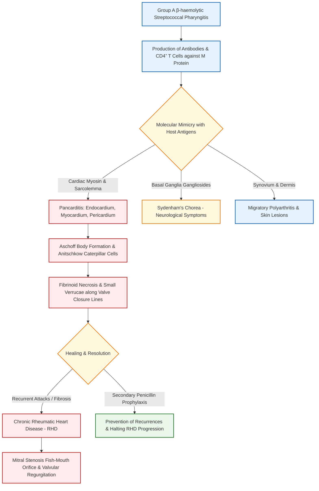

[[C16-Cardiology]]
# Acute Rheumatic Fever

## 1. Definition [⭐ High-Yield]

**Acute Rheumatic Fever (ARF)** is an acute, immunologically mediated, multisystem non-suppurative inflammatory disease that develops 2–3 weeks following an episode of Group A β-haemolytic Streptococcal (GABHS) pharyngitis.

The disease is characterized by autoimmune inflammatory lesions involving the heart (pancarditis), joints (migratory polyarthritis), central nervous system (Sydenham's chorea), skin (erythema marginatum), and subcutaneous tissue (subcutaneous nodules).

**Rheumatic Heart Disease (RHD)** is the chronic, deforming valvular sequela of acute rheumatic carditis, characterized by progressive leaflet fibrosis, commissural fusion, and valvular stenosis or regurgitation (predominantly affecting the mitral valve).

---

## 2. Etiology / Causes / Risk Factors [⭐ High-Yield]

### A. Causative Agent

- **Group A β-haemolytic Streptococcus (_Streptococcus pyogenes_):** Specifically rheumatogenic strains characterized by abundant capsular M protein (e.g., M types 1, 3, 5, 6, 18, 24).
- **Site of Preceding Infection:** **Exclusively Streptococcal Pharyngitis / Tonsillitis**. Streptococcal skin infections (e.g., pyoderma/impetigo) trigger post-streptococcal glomerulonephritis (PSGN) but do **NOT** trigger acute rheumatic fever.

### B. Host & Environmental Risk Factors

- **Age Group:** Peak incidence occurs in children aged **5–15 years**; rare in children <3 years and adults >30 years.
- **Attack Rate:** Approximately **3%** of individuals with untreated or inadequately treated GABHS pharyngitis develop ARF.
- **Environmental & Socioeconomic Factors:** Overcrowding, poverty, poor housing, and inadequate healthcare access significantly increase transmission and incidence.
- **Genetic Susceptibility:** Strong association with specific HLA class II alleles (e.g., HLA-DR4, HLA-DR2, HLA-DR7) influencing autoantibody formation.

---

## 3. Classification / Clinical Subtypes

1. **Primary ARF:** Initial attack of acute rheumatic fever following GABHS pharyngitis.
2. **Recurrent ARF:** Subsequent attacks occurring in a patient with a documented history of prior ARF or established Rheumatic Heart Disease (RHD).
3. **Anatomical / Organ-Specific Subtypes:**
    - **Rheumatic Carditis (Pancarditis):** Endocarditis (valvulitis), Myocarditis, and Pericarditis.
    - **Rheumatic Arthritis:** Migratory polyarthritis of large joints.
    - **Sydenham's Chorea (Chorea Minor / St. Vitus Dance):** Neurological involvement of basal ganglia.
    - **Dermatological Forms:** Erythema marginatum and Subcutaneous nodules.

---

## 4. Pathophysiology (with Flowchart) [⭐ High-Yield]

### Pathogenetic Sequence

1. **Streptococcal Pharyngitis & Antigen Presentation:**
    - Infection with rheumatogenic Group A Streptococcus induces an immune response against bacterial antigens, notably the **M protein** and N-acetylglucosamine.
2. **Molecular Mimicry (Cross-Reactive Autoimmunity):**
    - Structural homology exists between streptococcal M protein and human host tissue proteins:
        - **Heart:** Cardiac myosin, tropomyosin, sarcolemmal membrane proteins, and vimentin.
        - **Brain:** Gangliosides in basal ganglia neurons.
        - **Joints & Skin:** Synovial and dermal proteoglycans.
    - Autoreactive B cells produce cross-reactive IgG/IgM antibodies, and CD4⁺ T cells become activated.
3. **Endocardial & Valvular Injury:**
    - Cross-reactive antibodies bind to valvular endothelial cells, activating complement and upregulating vascular cell adhesion molecule-1 (VCAM-1).
    - Infiltration of CD4⁺ T lymphocytes and macrophages into the avascular valve interstitium induces local tissue destruction and cytokine release (IFN-γ, TNF-α).
4. **Pathognomonic Histopathological Features:**
    - **Aschoff Bodies:** Pathognomonic granulomatous foci present in the myocardium, endocardium, and pericardium (pancarditis).
    - **Anitschkow Cells ("Caterpillar Cells"):** Plump, activated histiocytes/macrophages with abundant cytoplasm and central round-to-ovoid nuclei containing condensed, wavy, ribbon-like chromatin.
    - **Aschoff Giant Cells:** Multinucleated giant cells formed by fused Anitschkow cells surrounding a central zone of fibrinoid collagen necrosis.
    - **Verrucae:** Small (1–2 mm), warty, firm, non-friable fibrinoid vegetations along the lines of closure of valve leaflets (predominantly mitral and aortic). (See **Diagram 2**).
    - **MacCallum Plaques:** Subendocardial irregular map-like thickenings in the posterior wall of the left atrium caused by regurgitant jet streams.

### Pathophysiology Flowchart



---

## 5. Clinical Features [⭐ High-Yield]

### A. Major Clinical Manifestations (Jones Major Criteria)

1. **Carditis (50–70% of cases) [⭐ High-Yield]:**
    
    - **Pancarditis:** Involves endocardium, myocardium, and pericardium.
    - **Endocarditis (Valvulitis):** Persistent sinus tachycardia disproportionate to fever.
        - **Mitral Regurgitation (MR):** High-pitched pansystolic murmur at the apex radiating to the axilla.
        - **Carey Coombs Murmur:** Soft, mid-diastolic apical murmur due to inflammation and edema of mitral valve leaflets during acute valvulitis.
        - **Aortic Regurgitation (AR):** Early diastolic blowing murmur at the left sternal border.
    - **Myocarditis:** Soft S₁, S₃ gallop rhythm, cardiac enlargement, and acute congestive heart failure (dyspnoea, orthopnoea, hepatomegaly, basal crepitations).
    - **Pericarditis:** Retrosternal chest pain aggravated by inspiration, pericardial friction rub, and pericardial effusion.
2. **Migratory Polyarthritis (75% of cases):**
    
    - Earliest major manifestation.
    - Asymmetric, painful, red, swollen, and warm inflammation affecting **large joints** (knees, ankles, elbows, wrists) in quick succession ("flitting" pattern).
    - Highly sensitive to Aspirin/NSAIDs (resolves within 24–48 hours) and heals **without residual joint deformity**.
3. **Sydenham's Chorea / Chorea Minor / St. Vitus Dance (10–15% of cases):**
    
    - Delayed presentation (1–6 months post-infection); predominantly affects females.
    - Involuntary, rapid, purposeless, non-rhythmic choreiform movements of face, hands, and feet.
    - **Clinical Signs:** "Milkmaid's grip" (relapsing/remitting hand squeezes), "Pronator sign" (evagination of palms on overhead extension), "Darting tongue" (inability to maintain tongue protrusion).
4. **Erythema Marginatum (<5% of cases):**
    
    - Highly specific cutaneous rash.
    - Non-pruritic, erythematous macules or papules with central clearing and raised, pink serpiginous borders.
    - Located on the trunk and proximal limbs; **spares the face**; transient and brought out by heat.
5. **Subcutaneous Nodules (2–10% of cases):**
    
    - Small (0.5–2 cm), firm, painless, mobile nodules over extensor surfaces of joints (elbows, knees, wrists) or bony prominences (occiput, spine).
    - Strongly correlated with severe, chronic carditis.

### B. Minor Clinical Manifestations

- **Fever:** Typically ≥38.5°C in low-risk populations; ≥38.0°C in high-risk populations.
- **Arthralgia:** Polyarthralgia in low-risk populations; monoarthralgia in high-risk populations.
- **Systemic Features:** Anorexia, lethargy, abdominal pain, epistaxis, and pallor.

---

## 6. Diagnosis / Investigations (Revised Jones Criteria) [⭐ High-Yield]

### A. Laboratory Investigations

1. **Evidence of Preceding Streptococcal Infection [⭐ High-Yield]:**
    - **Anti-Streptolysin O (ASO) Titres:** Elevated or rising titre (>200 IU/mL in adults; >300 IU/mL in children).
    - **Anti-DNase B Titres:** Preferred test if ASO is normal or in delayed presentations like Sydenham's chorea.
    - **Throat Swab Culture / Rapid Antigen Detection Test (RADT):** Positive for Group A Streptococcus in 10–25% of cases (often negative by the time ARF manifests).
2. **Acute Phase Reactants:**
    - **Erythrocyte Sedimentation Rate (ESR):** Markedly elevated (≥60 mm/1st hr in low-risk; ≥30 mm/1st hr in high-risk populations).
    - **C-Reactive Protein (CRP):** Elevated (≥3.0 mg/dL).
3. **Full Blood Count (FBC):** Leukocytosis with neutrophilia and mild normocytic normochromic anaemia.

### B. Imaging & Cardiac Diagnostic Tests

- **Electrocardiogram (ECG):** Prolonged PR interval (first-degree AV block) relative to age and heart rate; ST-T wave changes.
- **Chest X-Ray:** Cardiomegaly (cardiothoracic ratio >0.50) and pulmonary venous congestion in active carditis with heart failure.
- **Echocardiography (Doppler Echo) [Gold Standard]:** Essential for identifying subclinical or clinical carditis. Detects mitral regurgitation (dilated annulus, anterior leaflet prolapse), aortic regurgitation, and pericardial effusion.

---

### C. 2015 Revised Jones Criteria (AHA Criteria)

#### Population Risk Stratification

- **Low-Risk Population:** ARF incidence <2 per 100,000 school-aged children per year.
- **Moderate / High-Risk Population:** ARF incidence ≥2 per 100,000 per year (e.g., endemic regions in India, Asia, Africa, Indigenous populations).

|Diagnostic Category|Low-Risk Population|Moderate / High-Risk Population|
|:--|:--|:--|
|**Major Criteria**|• Carditis (Clinical or Subclinical)• Polyarthritis• Chorea• Erythema marginatum• Subcutaneous nodules|• Carditis (Clinical or Subclinical)• Monoarthritis / Polyarthritis / Polyarthralgia• Chorea• Erythema marginatum• Subcutaneous nodules|
|**Minor Criteria**|• Polyarthralgia• Fever (≥38.5°C)• ESR ≥60 mm/hr and/or CRP ≥3.0 mg/dL• Prolonged PR interval on ECG|• Monoarthralgia• Fever (≥38.0°C)• ESR ≥30 mm/hr and/or CRP ≥3.0 mg/dL• Prolonged PR interval on ECG|

#### Requirements for Diagnosis

1. **Initial / Primary ARF:**
    - **2 Major criteria** OR **1 Major + 2 Minor criteria** **PLUS** **Evidence of preceding GABHS infection**.
2. **Recurrent ARF:**
    - **2 Major** OR **1 Major + 2 Minor** OR **3 Minor criteria** **PLUS** **Evidence of preceding GABHS infection**.
3. **Exceptions (Diagnosis made WITHOUT mandatory GABHS proof):**
    - Isolated Sydenham's chorea.
    - Indolent / Insidious carditis presenting months after pharyngitis.

---

## 7. Differential Diagnosis

|Feature|Acute Rheumatic Fever|Juvenile Idiopathic Arthritis (JIA)|Infective Endocarditis|Septic Arthritis|
|:--|:--|:--|:--|:--|
|**Joint Pattern**|Migratory polyarthritis of large joints|Persistent, non-migratory poly/oligoarthritis|Arthralgia or immune-complex monoarthritis|Single monoarthritis (knee/hip)|
|**Response to Aspirin**|Dramatic (resolves in 24–48 hours)|Partial / Slow response|Ineffective|Ineffective|
|**Carditis / Murmurs**|Pancarditis; dynamic MR/AR murmurs|Pericarditis possible; no valvulitis|Large friable vegetations, valve destruction|Absent|
|**Streptococcal Serology**|Elevated ASO / Anti-DNase B titres|Negative|Negative|Negative|
|**Blood Cultures**|Negative|Negative|Positive for bacteria|Positive in septicemia|
|**Synovial Fluid**|Inflammatory, sterile|Inflammatory, sterile|Sterile|Purulent, WBC >50,000/μL, organisms present|

---

## 8. Treatment / Management (Rationale & Specific Drug Details) [⭐ High-Yield]

### A. General Measures & Rest

- **Strict Bed Rest:** Essential to reduce cardiac workload and alleviate joint pain.
- **Duration:**
    - _Arthritis alone:_ 2 weeks bed rest followed by 2 weeks indoor ambulation.
    - _Carditis without Heart Failure:_ 4 weeks bed rest followed by 4 weeks ambulation.
    - _Carditis with Heart Failure:_ Strict bed rest until heart failure is controlled and ESR normalizes, followed by prolonged gradual mobilization.

---

### B. Eradication of Streptococcal Infection (Primary Prophylaxis)

Given immediately upon diagnosis to eliminate residual Group A Streptococci from the pharynx.

#### 1. Benzathine Penicillin G

- **Mechanism of Action:** (KDT Textbook p. 720). Beta-lactam antibiotic. Inhibits bacterial cell wall synthesis by binding to Penicillin-Binding Proteins (PBPs) and preventing peptidoglycan cross-linking, leading to cell lysis.
- **Dose & Route:**
    - **Patients >27 kg:** 1.2 million Units IM as a single dose.
    - **Patients ≤27 kg:** 600,000 Units IM as a single dose.
- **Frequency:** Single administration.
- **Side Effects:** Pain at injection site, hypersensitivity reactions (urticaria, anaphylaxis).
- **When to Start / Stop:** Administered immediately at diagnosis.

#### 2. Oral Phenoxymethylpenicillin (Penicillin V)

- **Dose & Route:** 250 mg PO QID (or 500 mg PO BD) for 10 days.
- **Alternative in Penicillin Allergy:** Oral Erythromycin (250 mg PO QID for 10 days) or Azithromycin (500 mg PO OD for 5 days).

---

### C. Anti-inflammatory Therapy for Arthritis and Carditis

#### 1. Aspirin (Acetylsalicylic Acid)

- **Mechanism of Action:** Irreversibly inhibits Cyclooxygenase (COX-1 and COX-2) enzymes, suppressing prostaglandin synthesis and resolving joint inflammation.
- **Dose & Route:** 75–100 mg/kg/day PO in 4 divided doses (maximum 3–4 g/day).
- **Frequency:** 4 times daily (oral).
- **Indication / Features:** First-line drug for acute migratory polyarthritis and mild carditis (without cardiomegaly or heart failure). Produce rapid, complete joint relief within 24–48 hours.
- **Side Effects:** Tinnitus, gastric irritation/ulceration, hyperventilation, hepatic toxicity, Reye's syndrome in children with concurrent viral infection.
- **Duration:** Continued for 2–4 weeks until joint symptoms resolve and ESR drops, then tapered over 2–4 weeks.

#### 2. Prednisolone (Glucocorticoids)

- **Mechanism of Action:** Binds to intracellular glucocorticoid receptors, repressing NF-κB transcription, inhibiting inflammatory cytokines (IL-1, IL-6, TNF-α), and suppressing phospholipase A₂.
- **Dose & Route:** 1.0–2.0 mg/kg/day PO (maximum 60 mg/day).
- **Frequency:** Once daily or in divided doses (oral).
- **Indication / Features:** Mandatory for **moderate-to-severe carditis** (cardiomegaly, congestive heart failure, pericarditis).
- **Side Effects:** Cushingoid features, hypertension, hyperglycaemia, fluid retention, susceptibility to infection, peptic ulceration.
- **Duration:** Continued for 2–3 weeks until clinical signs of carditis settle and ESR normalizes, then tapered over 2–4 weeks while overlapping with Aspirin (75 mg/kg/day) for 2–3 weeks to prevent rebound flares.

---

### D. Management of Heart Failure in Rheumatic Carditis

- **Diuretics:** **Furosemide** (1–2 mg/kg/day IV/PO) to reduce volume overload and pulmonary congestion.
- **ACE Inhibitors:** Enalapril or Ramipril to reduce afterload.
- **Emergency Surgery:** Urgent mitral valve repair or replacement if life-threatening acute heart failure occurs due to fulminant chordal rupture or severe valvular regurgitation.

---

### E. Secondary Prophylaxis (Prevention of Recurrent ARF) [⭐ High-Yield]

Continuous antibiotic administration is mandatory to prevent recurrent GABHS pharyngitis and progressive valvular damage.

```
                     ┌──────────────────────────────────────────────┐
                     │     BENZATHINE PENICILLIN G (IM)             │
                     │  1.2 Million Units IM every 3-4 weeks        │
                     └──────────────────────┬───────────────────────┘
                                            │
               ┌────────────────────────────┼────────────────────────────┐
               ▼                            ▼                            ▼
┌────────────────────────────┐ ┌────────────────────────────┐ ┌────────────────────────────┐
│   ARF WITHOUT CARDITIS     │ │ARF WITH CARDITI  │ │ ARF WITH CARDITIS &  │
│                            ││  (NO RESIDUAL DISEASE)     │ │ RESIDUAL RHD /                                                                  SURGERY     │
│  5 Years OR until age 21   │ │  10 Years OR until age 21  │ │ 10 Years OR                                                                  until age 40   │
│  (Whichever is longer)     │ │  (Whichever is longer)     │ │ (Lifelong in                                                                 severe cases) │
└────────────────────────────┘ └────────────────────────────┘ └────────────────────────────┘
```

#### Regimens

1. **Benzathine Penicillin G (Drug of Choice):** 1.2 million Units IM every 3 to 4 weeks (every 3 weeks in high-risk areas).
2. **Oral Penicillin V (In patients refusing injections):** 250 mg PO BD.
3. **Oral Sulfadiazine (In Penicillin allergy):** 1.0 g PO OD (or 500 mg if <27 kg).
4. **Oral Erythromycin (In Penicillin allergy):** 250 mg PO BD.

---

## 9. Complications [⭐ High-Yield]

1. **Chronic Rheumatic Heart Disease (RHD):** Fibrotic scarring of valves leading to Mitral Stenosis ("fish-mouth" or "button-hole" orifice), Mitral Regurgitation, Aortic Regurgitation, and Aortic Stenosis.
2. **Infective Endocarditis:** Deformed, scarred heart valves serve as niduses for bacterial colonization.
3. **Acute Heart Failure & Pulmonary Oedema:** Caused by fulminant myocarditis or acute severe mitral/aortic regurgitation.
4. **Atrial Fibrillation & Thromboembolism:** Secondary to marked left atrial enlargement in chronic mitral stenosis, predisposing to stroke.
5. **Conduction Blocks:** AV nodal conduction delay or complete heart block secondary to junctional Aschoff body formation.

---

## 10. Prognosis

- **Arthritis and Chorea:** Excellent prognosis; complete resolution without permanent joint or neurological deficits.
- **Carditis:** Prognosis depends on the severity of the initial carditis, presence of cardiac enlargement, and adherence to continuous secondary penicillin prophylaxis.
- **Mortality:** Approximately 1% of patients die during acute fulminant carditis; long-term morbidity is driven by progressive RHD.

---

## 11. Mnemonic / Memory Palace

### Mnemonic for Jones Major Criteria: "JONES"

- **J** — **J**oints (Migratory Polyarthritis)
- **O** — **O**-shaped Heart (Carditis / Pancarditis)
- **N** — **N**odules (Subcutaneous nodules)
- **E** — **E**rythema marginatum
- **S** — **S**ydenham's chorea

### Memory Palace: "The Grand Cathedral Walkway" (Order of ARF Diagnosis & Management)

Visualize walking through a historic cathedral:

1. **The Entrance Archway (Strep Throat):** Red, inflamed throat curtain (**GABHS pharyngitis** 2–3 weeks prior).
2. **The Leaning Bell Tower (Migratory Polyarthritis):** A massive bell swaying from the **knee to ankle to wrist**, showing painful flitting swelling that straightens completely when given an **Aspirin tablet**.
3. **The Cathedral Organ (Carditis & Carey Coombs):** Organ pipes humming with a **mid-diastolic Carey Coombs rumble** and a fast heartbeat (**tachycardia**).
4. **The Dancing Choir Girl (Sydenham's Chorea):** A choir girl making involuntary, jerky movements, clutching her music sheet with a **milkmaid's grip**.
5. **The Stained Glass Window (Erythema Marginatum):** Wavy, pink, serpiginous ring patterns stained on the glass with clear centers.
6. **The Marble Pillar Base (Subcutaneous Nodules):** Firm, hard, painless marble bumps along the pillar edges (**extensor surface nodules**).
7. **The Syringe Guard at the Exit (Secondary Prophylaxis):** A guard holding a **1.2 Million Unit Penicillin syringe**, stamping a calendar for **every 3 weeks**.

---

## 12. Clinical Pearl

> **Clinical Pearl:** The response of rheumatic migratory polyarthritis to Aspirin/NSAIDs is so rapid and complete (usually within 24 to 48 hours) that if a patient's joint pain and fever fail to improve significantly within 48 hours of starting therapeutic doses of Aspirin, the diagnosis of Acute Rheumatic Fever should be strongly questioned, and alternative diagnoses (e.g., Septic arthritis, Juvenile Idiopathic Arthritis, or Post-Streptococcal Reactive Arthritis) must be aggressively investigated.

---

## 13. Exam Trap

### Exam Trap

- **The Mix-Up:** Confusing the triggers and sequelae of **Post-Streptococcal Glomerulonephritis (PSGN)** versus **Acute Rheumatic Fever (ARF)**.
- **Distinguishing Fact:**
    - **Acute Rheumatic Fever:** Occurs **ONLY** following Group A Streptococcal **pharyngitis / tonsillitis**. Streptococcal skin infections (impetigo) do **NOT** cause rheumatic fever.
    - **Post-Streptococcal Glomerulonephritis:** Can occur following **BOTH** streptococcal pharyngitis **AND**streptococcal skin infections (impetigo/pyoderma).

---

## 14. Diagram Guides

### Diagram 1 : Microscopic Structure of an Aschoff Body

_(Reference in text: See Section 4 - Pathophysiology)_

- **Type:** Microscopic Histopathological Diagram.
- **Outline Shape to Draw:** Oval / circular interstitial nodule located between myocardial muscle fibers.
- **Labels in Order:**
    1. **Central Fibrinoid Necrosis:** Eosinophilic acellular core of damaged collagen.
    2. **Anitschkow Cells ("Caterpillar Cells"):** Plump macrophages with abundant cytoplasm and central elongated nuclei containing a wavy ribbon of chromatin.
    3. **Aschoff Giant Cells:** Multinucleated giant cells with irregular nuclear borders.
    4. **Lymphocytic Infiltrate:** T lymphocytes (CD4⁺) and plasma cells surrounding the lesion.
    5. **Adjacent Myocardiocytes:** Normal or degenerating cardiac muscle fibers.
- **Arrows / Connections:** Arrow pointing from Anitschkow cell nucleus detailing the "caterpillar" longitudinal ribbon view.
- **Extra Mark Annotation:** _"Aschoff bodies are pathognomonic for rheumatic carditis and occur in all three layers of the heart (pancarditis)."_.

---

### Diagram 2 : Morphologic Comparison of Heart Valve Vegetations

_(Reference in text: See Section 4 - Pathophysiology)_

- **Type:** Comparative Valve Anatomy Diagram.
- **Outline Shape to Draw:** Four valve leaflet profiles side by side.
- **Labels in Order:**
    1. **Acute Rheumatic Fever (ARF):** Small (1–2 mm), firm, warty, non-friable verrucae lined up strictly **along the line of closure** of valve leaflets.
    2. **Infective Endocarditis (IE):** Large, bulky, irregular, friable vegetations extending onto chordae tendineae with leaflet destruction.
    3. **Non-Bacterial Thrombotic Endocarditis (NBTE):** Small, bland, non-destructive vegetations attached along closure lines.
    4. **Libman-Sacks Endocarditis (LSE in SLE):** Medium-sized vegetations on **both upper and under surfaces**of valve leaflets.
- **Extra Mark Annotation:** _"Rheumatic verrucae form along lines of valve closure due to mechanical contact trauma overlaid by fibrinoid deposition."_.

---

### Quick Revision

- **Etiology:** Non-suppurative delayed autoimmune sequela occurring 2–3 weeks post Group A Streptococcal pharyngitis (M protein cross-reactivity).
- **Diagnosis:** Revised Jones Criteria requires 2 Major OR 1 Major + 2 Minor criteria PLUS mandatory evidence of preceding GABHS infection (elevated ASO / Anti-DNase B).
- **Pathognomonic Pathology:** Aschoff bodies with Anitschkow "caterpillar" cells and small verrucae along valve closure lines.
- **Anti-inflammatory Choice:** Aspirin for migratory polyarthritis alone; Prednisolone for moderate-to-severe carditis with cardiomegaly/heart failure.
- **Secondary Prophylaxis:** Benzathine Penicillin G 1.2 million Units IM every 3–4 weeks to prevent recurrent attacks and progressive RHD.

---

### One-Line Exam Opener

> **Acute rheumatic fever is an immunologically mediated multisystem inflammatory disorder triggered by Group A β-haemolytic streptococcal pharyngitis, where molecular mimicry between bacterial M protein and host tissues drives pancarditis, migratory polyarthritis, and progressive chronic rheumatic valvular heart disease.**

---

🧭 _Would you like to explore the surgical management of severe Rheumatic Mitral Stenosis (balloon mitral valvulotomy vs valve replacement) or detail the diagnostic workup for Infective Endocarditis on a rheumatic valve?_