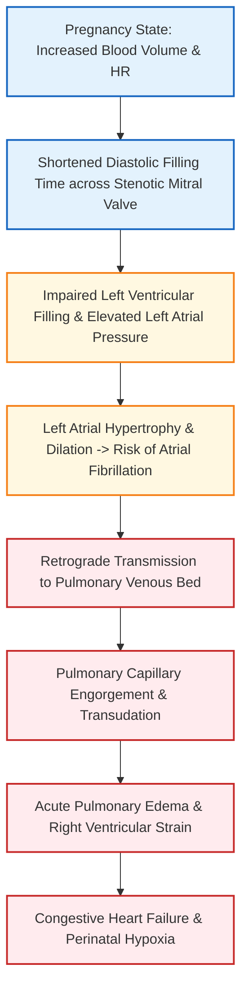

[[Medical and surgical illness]]
# Cardiovascular Changes During Pregnancy & Intrapartum Management of Rheumatic Heart Disease [⭐ High-Yield]

### Mark Weightage

- **10 Marks / Long Answer Depth**

---

### 1. Introduction & Overview [⭐ High-Yield]

- Pregnancy induces profound physiological adaptations in the cardiovascular system to meet the increased metabolic demands of the mother and growing fetoplacental unit.
- These hyperdynamic circulatory changes begin as early as 5 weeks of gestation, peak during the third trimester (28–34 weeks), surge further during labor, and return to non-pregnant baseline by 4–6 weeks postpartum.
- While a healthy heart easily accommodates this increased workload, a heart compromised by **Rheumatic Heart Disease (RHD)**—predominantly **Mitral Stenosis (MS)**—may decompensate, leading to congestive heart failure (CHF) or acute pulmonary edema.

---

### 2. Physiological Cardiovascular Changes During Pregnancy [⭐ High-Yield]

#### A. Hemodynamic Changes

1. **Blood Volume**:
    
    - Begins to rise at 6 weeks, expands rapidly, and reaches a peak of **40–50% above non-pregnant levels (1500 mL increase)** at **30–34 weeks**.
    - **Plasma Volume**: Expands by **40–50% (1250 mL)**.
    - **Red Blood Cell (RBC) Mass**: Expands by **20–30% (350 mL)** under erythropoietin stimulation.
    - **Physiological Anemia**: Disproportionate plasma expansion over RBC mass leads to hemodilution (fall in hematocrit and hemoglobin concentration, though total hemoglobin mass increases).
2. **Cardiac Output (CO)**:
    
    - formula: **CO = Stroke Volume (SV) × Heart Rate (HR)**.
    - Starts increasing from 5 weeks, peaking at **+40–50% (6.25 L/min)** at **30–34 weeks**.
    - **Stroke Volume (SV)** increases by **27%** (due to increased end-diastolic volume).
    - **Heart Rate (HR)** increases by **15–20 beats/min (+17%)**.
    - **Intrapartum Surge**: CO increases by an additional **+50% during labor contractions** and surges up to **+70–80% in the immediate postpartum period** due to uterine autotransfusion (squeezing 400–500 mL of blood back into maternal systemic circulation).
3. **Systemic & Pulmonary Vascular Resistance**:
    
    - **Systemic Vascular Resistance (SVR)**: Decreases by **21%** due to the smooth muscle relaxant effect of progesterone, vascular endothelial prostacyclin (PGI₂), nitric oxide (NO), and relaxin.
    - **Pulmonary Vascular Resistance (PVR)**: Decreases by **34%**.
4. **Blood Pressure (BP)**:
    
    - **Systolic BP**: Unaffected or slight drop.
    - **Diastolic BP & Mean Arterial Pressure (MAP)**: Drop by **5–10 mmHg** during mid-pregnancy (2nd trimester) due to reduced SVR, then gradually return to pre-pregnant levels near term.
5. **Venous Pressure**:
    
    - **Upper extremity / Antecubital venous pressure**: Remains unchanged.
    - **Femoral venous pressure**: Significantly raised from 8–10 cm H₂O to **20–25 cm H₂O in supine position**(and up to 80–100 cm H₂O standing) due to mechanical compression of the inferior vena cava (IVC) and common iliac veins by the gravid uterus (dextrorotated). This accounts for physiological pedal edema, varicose veins, and hemorrhoids.
6. **Supine Hypotension Syndrome (Aortocaval Compression)**:
    
    - In late pregnancy, lying supine causes the gravid uterus to compress the IVC, reducing venous return and cardiac output. In 10% of women, this causes severe hypotension, bradycardia/tachycardia, dizziness, and syncope, which is immediately relieved by turning to the **left lateral position**.

#### Summary Table of Hemodynamic Parameters in Normal Pregnancy

|Parameter|Non-Pregnant Value|Term Pregnancy Value|Net Change|
|:--|:--|:--|:--|
|**Total Blood Volume**|4000 mL|5500 mL|**+30% to +50% (+1500 mL)**|
|**Plasma Volume**|2500 mL|3750 mL|**+40% to +50% (+1250 mL)**|
|**Red Cell Volume**|1400 mL|1750 mL|**+20% to +30% (+350 mL)**|
|**Cardiac Output (CO)**|4.5 L/min|6.25 L/min|**+40% to +50%**|
|**Stroke Volume (SV)**|65 mL|75 mL|**+27%**|
|**Heart Rate (HR)**|70 bpm|85–90 bpm|**+15 to +20 bpm (+17%)**|
|**Systolic Blood Pressure**|120 mmHg|Unchanged|**Minimal change**|
|**Diastolic Blood Pressure**|80 mmHg|70–75 mmHg|**↓ 5–10 mmHg in 2nd trimester**|
|**Systemic Vascular Resistance (SVR)**|Standard|Reduced|**↓ 21%**|
|**Pulmonary Vascular Resistance (PVR)**|Standard|Reduced|**↓ 34%**|
|**Femoral Venous Pressure**|8–10 cm H₂O|20–25 cm H₂O|**↑ 100% to 150%**|
|**Central Venous Pressure (CVP) / PCWP**|3.6 mmHg / 7.5 mmHg|Unchanged|**No significant change**|

---

#### B. Anatomical & Auscultatory Changes

1. **Anatomical Displacement**:
    
    - Diaphragm is elevated by 4 cm due to uterine expansion.
    - The heart is pushed **upward and outward with slight rotation to the left**.
    - **Apex beat** shifts to the 4th intercostal space, 2.5 cm lateral to the mid-clavicular line.
    - Radiography shows mild apparent cardiomegaly and straightening of the left cardiac border.
2. **Auscultatory Findings**:
    
    - **First Heart Sound (S1)**: Loud with prominent splitting.
    - **Second Heart Sound (S2)**: Normal.
    - **Third Heart Sound (S3)**: Present in >80% of pregnant women due to rapid early diastolic filling.
    - **Murmurs**:
        - **Systolic Ejection Murmur** (Grade <3/6): Audible at the left sternal border / pulmonary area due to decreased blood viscosity and hyperdynamic blood flow across aortic/pulmonary valves.
        - **Mammary Souffle**: Continuous soft hissing murmur over the 2nd–3rd intercostal spaces due to augmented internal mammary vessel blood flow.
3. **Electrocardiography (ECG) Changes**:
    
    - Left axis deviation.
    - Q wave in leads II, III, and aVF.
    - Flat or inverted T waves in lead III and V1–V3.
    - Benign atrial/ventricular extrasystoles.

---

### 3. Classification of Heart Disease in Pregnancy [⭐ High-Yield]

#### A. NYHA Functional Classification

|Class|Definition / Functional Capacity|Risk Status|
|:--|:--|:--|
|**NYHA Class I**|Unrestricted physical activity; ordinary physical activity causes no discomfort or fatigue.|Low risk (Mortality <1%)|
|**NYHA Class II**|Slight limitation of physical activity; comfortable at rest, but ordinary activity causes dyspnea/fatigue.|Low risk (Mortality <1%)|
|**NYHA Class III**|Marked limitation of physical activity; comfortable at rest, but less-than-ordinary activity causes symptoms.|High risk (Mortality 5–15%)|
|**NYHA Class IV**|Inability to carry out any physical activity without discomfort; dyspnea/angina present even at rest.|Extreme risk / Pregnancy Contraindicated|

#### B. WHO Risk Classification of Cardiovascular Disease in Pregnancy

|Category|Risk Profile|Clinical Conditions|Management Plan|
|:--|:--|:--|:--|
|**WHO Class I**|No detectable risk of maternal mortality; mild morbidity.|Uncomplicated small ASD/VSD, PDA, Mitral Valve Prolapse (MVP).|Cardiology review 1–2 times during pregnancy.|
|**WHO Class II/III**|Moderate to high increase in maternal mortality and morbidity.|Mild MS, Uncorrected cyanotic lesions, Mechanical heart valves, Fontan circulation.|Cardiology review every trimester / 1–2 months.|
|**WHO Class IV**|**Extremely high risk of maternal mortality; Pregnancy is CONTRAINDICATED**.|Severe Mitral Stenosis, Pulmonary Arterial Hypertension (Eisenmenger syndrome), Severe Aortic Stenosis, LVEF <30%, Marfan syndrome with aortic dilatation >45 mm.|MTP advised in 1st trimester; if pregnancy continues, admit throughout.|

---

### 4. Pathophysiology of Rheumatic Heart Disease (Mitral Stenosis) in Pregnancy [⭐ High-Yield]

- **Rheumatic Heart Disease** (predominantly **Mitral Stenosis - 80%**) is the most common acquired cardiac lesion in pregnancy.
- **Normal Mitral Valve Area**: 4–6 cm². Stenosis is symptomatic when area is <2.5 cm², and severe when **<1.5 cm²**(or <1.0 cm²).
- **Pathophysiological Cascade**:
    1. Pregnancy causes a **50% increase in blood volume & cardiac output** combined with **physiological tachycardia**.
    2. Tachycardia shortens the **diastolic filling time** across the narrowed mitral valve.
    3. Left atrial pressure rises dramatically to force blood into the left ventricle, causing **Left Atrial Enlargement**.
    4. Elevated left atrial pressure transmits retrogradely to pulmonary veins and capillaries, producing **Pulmonary Venous Congestion and Pulmonary Edema**.
    5. Long-term backpressure leads to **Reactive Pulmonary Arterial Hypertension (PAH)** and eventual **Right Ventricular Failure**.



---

### 5. Clinical Features

#### A. Symptoms

- **Progressive Dyspnea** (exertional or at rest).
- **Orthopnea** and **Paroxysmal Nocturnal Dyspnea (PND)**.
- **Nocturnal Cough** with frothy hemoptysis.
- **Palpitations** (due to tachycardia or atrial fibrillation).
- **Fatigue and Syncope**.

#### B. Pathological Signs (Indicating True Heart Disease)

- **Cyanosis and Clubbing**.
- **Engorged / Elevated Jugular Venous Pressure (JVP)**.
- **Diastolic Murmur**: Mid-diastolic rumbling murmur with presystolic accentuation at the apex (hallmark of Mitral Stenosis).
- **Loud Grade >3/6 Systolic Murmur** associated with a thrill.
- **Loud S2 with prominent splitting / Pulmonary component (P2)**.
- **Basal Pulmonary Rales / Crepitations** (indicating pulmonary congestion).
- **Cardiac enlargement / Cardiomegaly** beyond physiological limits.

---

### 6. Diagnosis & Investigations [⭐ High-Yield]

- **Echocardiography with Color Flow Doppler (Investigation of Choice)**:
    - Confirms valve anatomy, quantifies valve area (Normal: 4–6 cm²; Moderate: 1.5–2.5 cm²; Severe: <1.5 cm² or <1.0 cm²).
    - Assesses left atrial size, transvalvular gradient, presence of thrombus, ejection fraction (LVEF), and pulmonary artery systolic pressure.
- **Electrocardiography (ECG)**:
    - Detects bi-atrial enlargement, left ventricular hypertrophy, and dysrhythmias (e.g., Atrial Fibrillation).
- **Chest X-Ray (with Abdominal Lead Shielding)**:
    - Indicated only if failure is suspected; shows cardiomegaly, prominent pulmonary pulmonary conus, and pulmonary venous congestion (Kerley B lines).
- **Routine Antenatal Labs**:
    - Hemoglobin & Hematocrit (to rule out anemia which aggravates heart strain).
    - Urine routine (to exclude UTI and pre-eclampsia).

---

### 7. Differential Diagnosis

|Parameter / Finding|Physiological Changes of Pregnancy|Pathological Rheumatic Heart Disease (Mitral Stenosis)|
|:--|:--|:--|
|**Dyspnea**|Mild, exertional, non-progressive|Severe, progressive, orthopnea, PND present|
|**Jugular Venous Pressure (JVP)**|Normal|**Elevated**|
|**Diastolic Murmur**|**NEVER physiological (Always absent)**|**Mid-diastolic rumbling murmur present**|
|**Systolic Murmur**|Grade <3 soft ejection murmur at left sternal border|Grade >3 loud systolic murmur with thrill|
|**Heart Sounds**|Loud S1, S3 present, physiological splitting|Tapping S1, Loud P2, Opening Snap|
|**Apex Beat**|Shifted to 4th ICS lateral to MCL|Tapping apex beat, RV heave present|
|**Pulmonary Rales**|Absent|Present at lung bases (Pulmonary edema)|
|**Cyanosis / Clubbing**|Absent|May be present|

---

### 8. Management During Pregnancy (Antenatal Care)

- **Multidisciplinary Team**: Combined supervision by Obstetrician, Cardiologist, Anesthetist, and Neonatologist.
- **Rheumatic Fever Prophylaxis**: **Injection Benzathine Penicillin 1.2 million units IM every 3–4 weeks**throughout pregnancy and puerperium.
- **Medical Therapy**:
    - **Beta-blockers (Metoprolol / Atenolol)**: Given to control heart rate and prolong diastolic filling time.
    - **Diuretics (Frusemide)**: Used cautiously to relieve pulmonary congestion.
    - **Digoxin**: Used if atrial fibrillation or heart failure occurs.
    - **Anticoagulation (Heparin / LMWH)**: Mandatory if atrial fibrillation or prior thromboembolism is present.
- **Surgical Intervention (Percutaneous Balloon Mitral Valvotomy - PBMV)**:
    - Indicated if patient remains in severe NYHA Class III/IV or refractory heart failure despite optimal medical management.
    - Ideal timing: **Second trimester (14–18 weeks)**.

---

### 9. Intrapartum Management of Pregnancy Complicated with Rheumatic Heart Disease [⭐ High-Yield]

```
flowchart TD

classDef primary fill:#e3f2fd,stroke:#1565c0,stroke-width:2px
classDef danger fill:#ffebee,stroke:#c62828,stroke-width:2px
classDef success fill:#e8f5e9,stroke:#2e7d32,stroke-width:2px
classDef warning fill:#fff8e1,stroke:#f57f17,stroke-width:2px

A[Patient with RHD / Mitral Stenosis Enters Labor]:::primary --> B[First Stage: Semi-Recumbent / Left Lateral Position + O2 5-6 L/min]:::primary
B --> C[Epidural Analgesia + Restrict IV Fluids <= 75 mL/hr + IE Prophylaxis]:::success
C --> D{Monitor HR, BP, SpO2 & Pulmonary Rales}:::warning
D -->|"HR > 110 bpm or Pulmonary Congestion"| E[Digitalization: Inj Digoxin 0.5 mg IV + Inj Frusemide 20-40 mg IV]:::danger
D -->|"Stable Parameters"| F[Second Stage: Prophylactic Forceps / Vacuum Delivery]:::success
F --> G[Avoid Maternal Bearing Down / Pushing Effort]:::success
G --> H[Third Stage: AMSTL with IV Oxytocin 10 IU Drip]:::success
H --> I[STRICTLY CONTRAINDICATE Ergometrine / Methylergometrine]:::danger
I --> J[Postpartum: Observe in ICU for 24-48 Hours]:::primary
```

#### A. Decision on Mode of Delivery

- **Vaginal Delivery is PREFERRED**: Spontaneous labor onset is ideal.
- **Cesarean Section (CS)**: Performed ONLY for obstetric indications, OR specific cardiac indications:
    - Coarctation of aorta
    - Acute aortic dissection or dilated aortic root >4 cm / Marfan syndrome
    - Severe symptomatic aortic stenosis
    - Patient on oral Warfarin therapy within 2 weeks of labor (risk of fetal intracranial hemorrhage)
    - Refractory heart failure

#### B. First Stage of Labor

1. **Positioning**: Patient should be in **semi-recumbent position with left lateral tilt** to prevent IVC compression and minimize sudden venous return changes.
2. **Oxygenation**: Administer humidified oxygen at **5–6 L/min** via face mask.
3. **Pain Relief (Analgesia)**: **Continuous Epidural Analgesia** is the gold standard. It abolishes pain-induced sympathetic drive, reduces maternal heart rate, and prevents blood pressure surges.
4. **Fluid Management**: **STRICT IV fluid restriction to ≤75 mL/hr** (using Normal Saline or Ringer's Lactate) to avoid acute pulmonary edema.
5. **Infective Endocarditis (IE) Prophylaxis**:
    - Administered at labor onset / membrane rupture:
        - **Inj. Ampicillin 2 g IV + Inj. Gentamicin 1.5 mg/kg IV** (or Inj. Ceftriaxone 1 g IV).
        - If Penicillin-allergic: **Inj. Clindamycin 600 mg IV** or Inj. Vancomycin 1 g IV.
6. **Cardiovascular Monitoring**:
    - Continuous pulse oximetry, ECG, and blood pressure monitoring.
    - Hourly lung base auscultation for crepitations.
    - If pulse rate exceeds **>110 beats/min** in between contractions or signs of pulmonary congestion develop, initiate **rapid digitalization with IV Digoxin 0.5 mg** and **IV Frusemide 20–40 mg**.

#### C. Second Stage of Labor

1. **Curtail Maternal Pushing**: **Maternal bearing-down efforts are strictly avoided** because Valsalva maneuvers increase intra-thoracic pressure and cause sharp fluctuations in cardiac venous return.
2. **Assisted Operative Delivery**: Perform **prophylactic Low Forceps or Vacuum (Ventouse) delivery** as soon as full cervical dilatation is achieved to shorten the second stage.
3. Episiotomy should be performed under adequate local/epidural infiltration to minimize distress.

#### D. Third Stage of Labor

1. **Active Management of Third Stage of Labor (AMSTL)**:
    - Administer **Injection Oxytocin 10 IU slow IV or IM / IV infusion**.
2. **STRICT CONTRAINDICATION**:
    - **Methylergometrine / Ergometrine is STRICTLY CONTRAINDICATED**.
    - _Reason_: Ergometrine causes severe tetanic uterine contraction and peripheral venoconstriction, resulting in a sudden, massive autotransfusion surge of 400–500 mL blood into the central circulation, throwing the patient into fatal acute pulmonary edema.
3. **Diuretic Therapy**: Administer **Inj. Frusemide 20–40 mg IV** immediately after delivery to promote diuresis and unload the heart.
4. **Post-delivery Positioning**: Keep the patient propped up with legs dependent (lower than heart level) to pool blood in lower limbs and decrease sudden venous return.

#### E. Postpartum Care

- The **first 24–48 hours postpartum** represent the most critical window for heart failure due to mobilization of extravascular edema and autotransfusion.
- Intensive ICU/HDUK monitoring of vital signs, fluid balance, and SpO₂ for at least 24–48 hours.
- **Breastfeeding**: Allowed in compensated RHD; only contraindicated if severe Class IV heart failure is present.
- **Contraception**: **Barrier methods (condoms)** or **Progestin-Only Pills (POP) / Levonorgestrel IUD** are safe. Estrogen-containing combined oral contraceptives are contraindicated due to thromboembolic risk. Puerperal sterilization can be performed under local anesthesia after stabilization.

---

### 10. Drug Dosage Table (DOSAGE RULE)

|Name|Mechanism of Action|Dose|Route|Frequency|Features / Indications|Side Effects|When to Start / Stop|
|:--|:--|:--|:--|:--|:--|:--|:--|
|**Benzathine Penicillin**|Inhibits bacterial cell wall synthesis by binding to PBPs.|1.2 million units (12 Lakh U)|Intramuscular (IM)|Every 3–4 weeks|Secondary prophylaxis for Rheumatic Fever.|Anaphylaxis, hypersensitivity reaction.|Start at diagnosis of RHD; continue throughout pregnancy & postpartum.|
|**Metoprolol**|Selective β₁-adrenergic blocker; reduces heart rate & SA node firing, prolonging diastolic filling time.|25–50 mg|Per Oral (PO)|BD (twice daily)|Control rate in Mitral Stenosis & sinus tachycardia.|Bradycardia, hypotension, bronchospasm, fatigue.|Start when HR >90 bpm in MS; stop postpartum after stabilization.|
|**Digoxin**|Inhibits Na⁺/K⁺-ATPase pump; positive inotrope, negative chronotrope via vagal stimulation.|0.5 mg loading, then 0.25 mg maintenance|Slow IV / PO|OD / BD|Atrial fibrillation with fast ventricular response, acute CHF.|Arrhythmias, nausea, vomiting, yellow vision (xanthopsia).|Start upon tachycardia/AF or heart failure; titrate according to response.|
|**Frusemide (Furosemide)**|Loop diuretic; inhibits Na⁺-K⁺-2Cl⁻ cotransporter in thick ascending Limb of Henle.|20–40 mg (up to 80 mg)|Slow IV / PO|OD / PRN|Acute pulmonary edema, fluid overload.|Hypokalemia, hyponatremia, hypotension, dehydration.|Start intrapartum/postpartum if crepitations/pulmonary edema appear.|
|**Oxytocin**|Stimulates G-protein coupled oxytocin receptors on myometrium causing rhythmic contractions.|10 IU (in 500 mL NS infusion at 10–20 drops/min)|IV Infusion / IM|Intrapartum / Third stage|Drug of choice for PPH prevention in cardiac disease.|Hypotension (if given fast IV bolus), water intoxication.|Start in 3rd stage after baby delivery; stop after uterine contraction secured.|

---

### 11. Complications [⭐ High-Yield]

#### A. Maternal Complications

- **Acute Pulmonary Edema** (leading cause of maternal mortality in Mitral Stenosis).
- **Congestive Heart Failure (CHF)**.
- **Cardiac Arrhythmias** (Atrial Fibrillation, Paroxysmal Supraventricular Tachycardia).
- **Systemic Thromboembolism** (stroke, arterial occlusion secondary to LA thrombus).
- **Infective Endocarditis**.
- **Maternal Mortality** (highest during labor and 1st week postpartum).

#### B. Fetal & Neonatal Complications

- **Prematurity & Preterm Labor**.
- **Intrauterine Growth Restriction (IUGR)** (due to chronic maternal hypoxia and reduced uterine perfusion).
- **Intrauterine Fetal Death (IUFD) / Stillbirth**.
- **Birth Asphyxia**.

---

### 12. Prognosis

- Maternal outcome is directly related to **NYHA Functional Class** at presentation and adequacy of glycemic/hemodynamic monitoring.
- In NYHA Class I and II, maternal mortality is **<1%**.
- In NYHA Class III and IV, maternal mortality rises significantly to **5–15%** (and up to 50% in presence of Pulmonary Hypertension / Eisenmenger syndrome).
- Pregnancy does not alter the long-term survival of a woman with RHD provided she survives the pregnancy itself.

---

### 13. Clinical Pearl & Exam Trap

### Clinical Pearl

- **Auscultating Murmurs in Pregnancy**: A soft **systolic ejection murmur** (Grade <3/6) at the left sternal border is a **normal physiological finding** present in >90% of pregnant women due to hyperdynamic circulation. However, **ANY DIASTOLIC MURMUR** (such as the mid-diastolic rumbling murmur of Mitral Stenosis) is **ALWAYS PATHOLOGICAL** and demands immediate Echocardiography.

### Exam Trap

- **The Mix-Up**: Administering **Methylergometrine (Methergine)** for active management of the third stage of labor (AMSTL) or PPH management in a patient with heart disease.
- **Distinguishing Fact**: In normal patients, ergometrine is a standard uterotonic. But in heart disease, **Methylergometrine is ABSOLUTELY CONTRAINDICATED**. It produces tetanic uterine contraction and severe venoconstriction, causing a sudden, massive autotransfusion surge of 400–500 mL blood into systemic circulation, triggering fatal acute pulmonary edema. **Oxytocin is the DRUG OF CHOICE**.

---

### 14. Diagram Guide

### Diagram 1: Hemodynamic Changes in Cardiac Output During Pregnancy, Labor, and Delivery

- **Type**: Line graph / Flow chart
- **Outline shape to draw**: X-axis representing Gestational Age (Weeks: 0, 12, 28, 32, Labor, Postpartum) and Y-axis representing Cardiac Output (L/min).
- **Labels in order**:
    1. **Baseline Non-Pregnant CO** — 4.5 L/min
    2. **First Trimester Rise** — begins by 5 weeks
    3. **Peak Plateau (30–34 Weeks)** — 6.25 L/min (+40% to +50%)
    4. **First Stage Labor Peak** — +50% increase over pre-labor values during contractions
    5. **Immediate Postpartum Spike (10–30 mins)** — +70% to +80% surge due to uterine autotransfusion
    6. **Return to Normal** — drops within 1 hour, normalizes by 2–4 weeks postpartum
- **Arrows/connections**: Upward curving line from 5 weeks to 32 weeks → sharp spike during labor contractions → highest peak immediately after placenta delivery → step-wise drop in puerperium.
- **Extra mark annotation**: _"The immediate postpartum period (10–30 mins post-delivery) carries the single highest risk of sudden cardiac failure due to autotransfusion of 400–500 mL of uterine blood."_

---

### 15. Mnemonic / Memory Palace

#### Mnemonic: HEART-LABOR (Intrapartum Management Protocol)

- **H**: **Header elevation** — Semi-recumbent position with left lateral tilt
- **E**: **Epidural analgesia** — Gold standard for pain relief to prevent tachycardia
- **A**: **Antibiotic prophylaxis** — Inj. Ampicillin + Gentamicin against Infective Endocarditis
- **R**: **Restrict fluids** — IV fluids restricted to ≤75 mL/hr to prevent pulmonary edema
- **T**: **Two-stage shortening** — Cut short 2nd stage using prophylactic Forceps/Vacuum
- **L**: **Avoid Loading / Ergometrine** — Ergometrine strictly contraindicated; use Oxytocin
- **A**: **Avoid bearing down** — Prevent pushing in 2nd stage
- **B**: **Beta-blockers / Digoxin** — Keep heart rate <90 bpm
- **O**: **Oxygenation** — Humidified O₂ at 5–6 L/min
- **R**: **Recovery monitoring** — ICU/HDU monitoring for 24–48 hours postpartum

---

### Quick Revision

- **Peak Hemodynamic Strain**: Cardiac output & blood volume peak at **30–34 weeks (+40–50%)**, surge further during **labor (+50%)**, and reach maximum spike **immediately postpartum (+70%)** due to autotransfusion.
- **Diagnostic Golden Rule**: **Diastolic murmurs are ALWAYS pathological** in pregnancy and indicate organic heart disease (e.g., Mitral Stenosis).
- **First Stage Management**: Semi-recumbent left lateral position, continuous O₂ (5–6 L/min), continuous **Epidural analgesia**, strict **IV fluid restriction (≤75 mL/hr)**, and **IE antibiotic prophylaxis**.
- **Second & Third Stage Management**: Cut short 2nd stage with **prophylactic Forceps/Vacuum** (no bearing down). AMSTL with **Oxytocin ONLY**; **Ergometrine is STRICTLY CONTRAINDICATED**.
- **Postpartum Care**: Monitor closely in ICU for 24–48 hours; administer IV Frusemide to manage autotransfusion fluid shifts.

---

### One-Line Exam Opener

- **Pregnancy induces a hyperdynamic circulatory state characterized by a 40–50% surge in blood volume and cardiac output peaking at 30–34 weeks, necessitating strict intrapartum management in Rheumatic Heart Disease—comprising continuous epidural analgesia, fluid restriction, operative shortening of the second stage, and oxytocin-only third stage management to prevent acute pulmonary failure.**

---

💡 _Would you like me to generate practice MCQs, clinical case scenarios, or flashcards on Heart Diseases in Pregnancy to test your recall before the exam?_