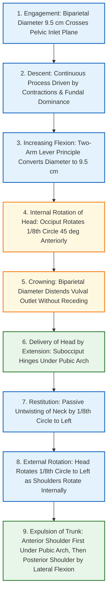
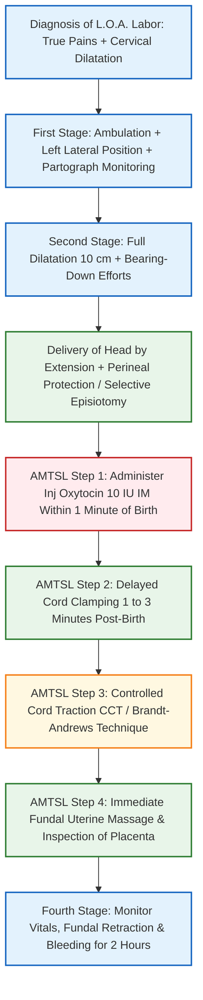

[[C13- Normal labour]]
# Mechanism of Normal Labor & Management of Left Occipito-Anterior (L.O.A.) Position [⭐ High-Yield]

### Mark Weightage

- **10 Marks / Long Answer Depth**

---

### 1. Definition [⭐ High-Yield]

- **Normal Labor (Eutocia)**: A series of continuous events taking place in the female genital organs in an effort to expel the viable products of conception (fetus, placenta, and membranes) out of the womb through the vagina into the outer world.
    - **Criteria for Normal Labor**:
        1. Spontaneous in onset and at term (**37 to 41 weeks + 6 days**).
        2. **Vertex presentation**.
        3. Without undue prolongation.
        4. Natural termination with minimal assistance (spontaneous vaginal delivery).
        5. Without any maternal or fetal complications.
- **Left Occipito-Anterior (L.O.A.) Position**:
    - The **first vertex position**, where the fetal occiput lies in the left anterior quadrant of the maternal pelvis, pointing toward the left iliopubic eminence.
    - It is the most common vertex position at engagement, accounting for ~13–70% of presentations, as the left oblique diameter of the pelvis is less encroached upon than the right oblique diameter (which is encroached by the rectum).
    - **Denominator**: Occiput.
    - **Presenting Part**: Vertex (bounded by anterior fontanelle, posterior fontanelle, and parietal eminences).
    - **Engaging Diameters**:
        - **Anteroposterior**: Suboccipitobregmatic (**9.5 cm**) in well-flexed head, or Suboccipitofrontal (**10.0 cm**) in slight deflexion.
        - **Transverse**: Biparietal diameter (**9.5 cm**).

---

### 2. Etiology / Factors Favoring L.O.A. Position

- **Fetal Accommodation (Ovoid Concept)**: At term, the flexed fetus forms an ovoid with a long axis of ~25 cm, adapting to the longitudinal ovoid shape of the uterine cavity (longitudinal lie).
- **Pelvic Architecture**: The gynecoid pelvis offers maximum space in the oblique diameters at the inlet.
- **Dextrorotation of Uterus**: The uterus is rotated to the right, which disfavors posterior and right-sided positions.
- **Sigmoid Colon**: Occupies the left posterior quadrant of the pelvic inlet, preventing the broad occiput from comfortably occupying the left posterior space and favoring anterior rotation into the left anterior quadrant (L.O.A.).

---

### 3. Classification [⭐ High-Yield]

#### A. Stages of Labor

|Stage|Commencing Boundary|Terminating Boundary|Mean Duration (Primigravida)|Mean Duration (Multipara)|Key Physiological Events|
|:--|:--|:--|:--|:--|:--|
|**First Stage**|Onset of true regular labor pains|Full dilatation of cervix (**10 cm**)|**12 hours** (WHO limit: 20 hrs)|**6 hours** (WHO limit: 14 hrs)|Cervical effacement, dilatation, and formation of lower segment.|
|**Second Stage**|Full dilatation of cervix (**10 cm**)|Complete expulsion of the fetus|**2 hours** (WHO limit: 3 hrs)|**30 minutes** (WHO limit: 2 hrs)|Fetal descent, cardinal mechanism movements, and bearing-down expulsion.|
|**Third Stage**|Complete expulsion of the fetus|Expulsion of placenta and membranes|**15 minutes**(reduced to **5 mins**with AMTSL)|**15 minutes**(reduced to **5 mins**with AMTSL)|Placental separation and expulsion; myometrial vascular clamping.|
|**Fourth Stage**|Expulsion of placenta and membranes|1–2 hours post-delivery observation|**1–2 hours**|**1–2 hours**|Monitoring maternal vitals, uterine retraction, and prevention of PPH.|

#### B. Classification of Vertex Positions

|Position|Abbreviation|Frequency|Description|
|:--|:--|:--|:--|
|**Left Occipito-Anterior (1st Vertex)**|**L.O.A.**|**Most Common (~13–70%)**|Occiput points toward left iliopubic eminence.|
|**Right Occipito-Anterior (2nd Vertex)**|**R.O.A.**|~10%|Occiput points toward right iliopubic eminence.|
|**Right Occipito-Posterior (3rd Vertex)**|**R.O.P.**|~7%|Occiput points toward right sacroiliac joint.|
|**Left Occipito-Posterior (4th Vertex)**|**L.O.P.**|~3%|Occiput points toward left sacroiliac joint.|
|**Left Occipito-Transverse**|**L.O.T.**|Common at engagement|Sagittal suture lies in transverse diameter.|
|**Right Occipito-Transverse**|**R.O.T.**|Common at engagement|Sagittal suture lies in transverse diameter.|

---

### 4. Pathophysiology & Mechanism of Labor in L.O.A. Position [⭐ High-Yield]

- **Definition**: The series of passive adaptation movements executed by the fetal head and body during its passage through the maternal birth canal.
- **Plane of Engagement**: Left oblique pelvic diameter (**12 cm**), extending from the left sacroiliac joint to the right iliopubic eminence.
- **Engaging Diameters**:
    - Suboccipitobregmatic diameter (**9.5 cm**) or Suboccipitofrontal diameter (**10.0 cm**).
    - Biparietal diameter (**9.5 cm**) entering the transverse dimension.

#### Detailed Cardinal Movements (Sequential Steps in L.O.A.)

1. **Engagement**:
    
    - Passage of the widest transverse diameter of the head (Biparietal diameter **9.5 cm**) through the plane of the pelvic inlet.
    - **Asynclitism**:
        - _Anterior Asynclitism (Naegele's Obliquity)_: Sagittal suture lies closer to the sacral promontory; anterior parietal bone becomes the leading part (more common in multiparae).
        - _Posterior Asynclitism (Litzmann's Obliquity)_: Sagittal suture lies closer to the symphysis pubis; posterior parietal bone becomes leading (more common in primigravidae).
        - Lateral flexions glide parietal bones past pelvic landmarks to convert back into **synclitism** as engagement completes.
2. **Descent**:
    
    - Continuous movement throughout labor, accelerated in the second stage by uterine contractions, amniotic fluid pressure, and maternal voluntary bearing-down effort.
3. **Flexion**:
    
    - As the descending head meets resistance from the unyielding cervix, pelvic sidewalls, and levator ani pelvic floor, flexion increases.
    - **Two-Arm Lever Mechanics**: The occipito-atlantal joint acts as a fulcrum. The short arm extends from fulcrum to occiput, while the long arm extends from fulcrum to chin. Resistance causes the long arm to ascend and short arm to descend, substituting the occipitofrontal diameter (**11.5 cm**) with the smaller suboccipitobregmatic diameter (**9.5 cm**).
4. **Internal Rotation of the Head**:
    
    - Occiput rotates **1/8th of a circle (45°)** anteriorly from the left iliopubic eminence to lie directly behind the symphysis pubis.
    - **Hart's Rule (Pelvic Floor Slope)**: The two halves of the levator ani form a V-shaped gutter sloping downward and forward. The well-flexed occiput strikes the left slope first; elastic recoil pushes it forward to the midline.
    - **Torsion of Neck**: The head rotates 45°, but the shoulders only rotate 22.5° into the left oblique diameter, leaving a residual neck torsion of **1/8th of a circle**.
5. **Crowning**:
    
    - The largest biparietal diameter (**9.5 cm**) stretches the vulval ring and remains visible at the introitus without receding between contractions.
6. **Delivery of the Head by Extension**:
    
    - The flexed head descends until the subocciput hinges under the pubic arch.
    - Direct upward extension sweeps the occiput, forehead, face, and chin successively over the perineum.
7. **Restitution**:
    
    - Visible passive movement of the head caused by untwisting of the neck sustained during internal rotation.
    - The occiput turns **1/8th of a circle (45°)** back to the left, pointing toward the maternal left thigh.
8. **External Rotation**:
    
    - Visible external movement of the head resulting from the internal rotation of the shoulders inside the pelvis.
    - As the anterior shoulder rotates 45° internally from the oblique to the anteroposterior diameter behind the symphysis, the head turns another **1/8th of a circle (45°)** to the left.
    - The occiput now points directly toward the maternal left thigh.
9. **Expulsion of Shoulders and Trunk**:
    
    - Further descent brings the anterior shoulder to escape under the pubic arch first.
    - The posterior shoulder sweeps over the perineum, and the rest of the trunk is expelled by **lateral flexion** of the fetal spine.

---

### 5. Clinical Features & Diagnosis of L.O.A. Position [⭐ High-Yield]

#### A. Symptoms

- Regular, painful uterine contractions increasing in frequency, duration, and intensity.
- Expulsion of blood-stained cervical mucus plug (**show**).
- Spontaneous rupture of membranes (drainage of liquor).

#### B. Abdominal Examination (Leopold Maneuvers in L.O.A.)

- **First Leopold (Fundal Grip)**: Broad, soft, irregular mass (breech) occupying the fundus.
- **Second Leopold (Lateral / Umbilical Grip)**:
    - **Left Side**: Smooth, continuous, resistant convex curve representing the **fetal back** placed anteriorly near the midline.
    - **Right Side**: Irregular, knob-like small parts (fetal limbs).
    - **Anterior Shoulder**: Felt as a prominent landmark in the lower left quadrant near the midline.
- **Third Leopold (Pawlik's Grip)**: Hard, globular, ballotable cephalic pole at the pelvic inlet.
- **Fourth Leopold (First Pelvic Grip)**:
    - Examining fingers diverge if head is engaged.
    - The **sincipital cephalic prominence** is felt on the right side (same side as limbs) at a higher level than the occiput, confirming a well-flexed head.

#### C. Auscultation

- **Fetal Heart Sounds (FHS)**: Heard loudest in the **left lower quadrant** of the abdomen, along the line connecting the umbilicus to the left anterior superior iliac spine (spinoumbilical line).

#### D. Vaginal Examination (PV Findings in L.O.A.)

- **Sagittal Suture**: Lies in the **left oblique diameter** of the pelvis.
- **Posterior Fontanelle (Saggital-Lambdoid junction)**: Triangular, small, 3 suture lines meeting; felt **anteriorly near the left iliopubic eminence**.
- **Anterior Fontanelle (Bregma)**: Diamond-shaped, 4 suture lines meeting; felt **posteriorly near the right sacroiliac joint** at a higher level due to flexion.

---

### 6. Investigations [⭐ High-Yield]

- **Bedside Ultrasonography (Gold Standard)**: Confirms cephalic presentation, occipito-anterior position (fetal orbits facing posteriorly toward maternal sacrum), amniotic fluid index (AFI), estimated fetal weight (EFW), and placental location.
- **Cardiotocography (CTG) / Electronic Fetal Monitoring (EFM)**: Continuous tracking of baseline fetal heart rate (110–160 bpm), variability (5–25 bpm), accelerations, and absence of decelerations.
- **Partograph / WHO Labor Care Guide**: Graphic record of cervical dilatation, head descent, uterine contractions, vitals, and fetal status to detect labor protraction or arrest early.

---

### 7. Differential Diagnosis

|Diagnostic Parameter|Left Occipito-Anterior (L.O.A.)|Right Occipito-Anterior (R.O.A.)|Left Occipito-Posterior (L.O.P.)|True Labor vs False Labor|
|:--|:--|:--|:--|:--|
|**Fetal Back Position**|Left anterior quadrant|Right anterior quadrant|Left posterior quadrant / flank|**True**: Regular, painful contractions.|
|**FHS Maximum Intensity**|Left spinoumbilical line|Right spinoumbilical line|Left flank (hard to locate)|**False**: Irregular, painless/discomfort.|
|**Posterior Fontanelle**|Near **left iliopubic eminence**|Near **right iliopubic eminence**|Near **left sacroiliac joint**|**True**: Cervical effacement & dilatation.|
|**Anterior Fontanelle**|Higher, near right SI joint|Higher, near left SI joint|Easily felt, lower level (deflexed)|**False**: No cervical change.|

---

### 8. Management of Labor in L.O.A. Position [⭐ High-Yield]

#### A. First Stage Management

1. **Supportive Care**: Continuous emotional support by a chosen labor companion, encouraging environment, maintaining privacy.
2. **Posture & Ambulation**: Encourage walking about if membranes are intact; adopt **left lateral recumbent position**in bed to avoid aortocaval compression and optimize uterine blood flow.
3. **Nutrition & Hydration**: Withhold solid food in active labor due to delayed gastric emptying; allow clear fluids / oral isotonic drinks. Start IV Ringer's Lactate (100–125 mL/hr) if labor is prolonged or regional anesthesia used.
4. **Monitoring (Partograph)**: Track cervical dilatation (alert/action lines), head descent, contraction frequency/intensity, FHS every 30 mins, and maternal vitals every 1–4 hours.

#### B. Second Stage Management (Conduction of Delivery)

1. **Position**: Dorsal lithotomy or semi-recumbent position with 15° lateral tilt.
2. **Bearing-down Efforts**: Encourage voluntary pushing only during uterine contractions once cervix is fully dilated (10 cm).
3. **Perineal Protection (Ritgen's Maneuver)**:
    - As head crowns, control speed of extension by pressing flexed vertex downward with left hand.
    - Forward pressure applied via sterile towel over perineum onto fetal chin to deliver head slowly in between contractions, preventing perineal lacerations.
4. **Episiotomy**: Perform selective mediolateral episiotomy under local anesthesia when perineum is fully stretched at crowning to prevent 3rd/4th-degree tears.

#### C. Third Stage Management (Active Management - AMTSL Protocol) [⭐ High-Yield]

AMTSL reduces Postpartum Hemorrhage (PPH) by **60%** and shortens third stage duration to **5 minutes**.

1. **Uterotonic Administration**: Give **Injection Oxytocin 10 IU IM** (or slow IV) within **1 minute of fetal birth**, after ruling out an undiagnosed second twin by abdominal palpation.
2. **Delayed Cord Clamping (DCC)**: Delay clamping for **1 to 3 minutes** post-delivery to increase infant iron stores and prevent neonatal anemia.
3. **Controlled Cord Traction (CCT / Brandt-Andrews Technique)**:
    - Performed only during a strong uterine contraction when uterus is hard.
    - Place one hand above symphysis pubis pushing lower segment upward and backward (counter-traction to prevent inversion).
    - Other hand holds clamped cord, exerting steady downward and backward traction along pelvic axis.
    - As placenta emerges, twist in a cupped fashion to peel membranes intact.
4. **Fundal Massage & Inspection**:
    - Massage uterine fundus immediately post-delivery until hard.
    - Inspect maternal/fetal placental surfaces for missing lobes and check soft tissue canal for tears.

#### D. Fourth Stage Management

- Monitor pulse, BP, fundal height/firmness, and vaginal bleeding every 15 minutes for the first hour and every 30 minutes for the second hour.

---

### 9. Drug Dosage Table (DOSAGE RULE)

|Name|Mechanism of Action|Dose|Route|Frequency|Features|Side Effects|When to Start / Stop|
|:--|:--|:--|:--|:--|:--|:--|:--|
|**Oxytocin**|Binds G-protein coupled oxytocin receptors on myometrium → raises intracellular Ca²⁺ → rhythmic contractions.|**10 IU**|Intramuscular (IM) or slow IV infusion|Single stat dose|**Gold standard uterotonic for AMTSL**; safe in hypertension.|Rapid IV bolus causes transient hypotension and water intoxication.|Give within 1 minute of fetal delivery; stop after third stage.|
|**Methylergometrine (Methergine)**|Partial agonist at α-adrenergic & dopaminergic receptors → sustained tetanic uterine contraction.|**0.2 mg**|Slow IV or IM|Single stat dose|Highly potent uterotonic. **STRICTLY CONTRAINDICATED in Hypertension, Pre-Eclampsia, Eclampsia, & Cardiac Disease**.|Nausea, vomiting, severe hypertension, vasoconstriction.|Give after fetal delivery if oxytocin unavailable and BP normal.|
|**Misoprostol**|Synthetic PGE₁ analogue; binds myometrial EP₂/EP₃ receptors → increases baseline smooth muscle tone.|**600 µg**(or 800–1000 µg rectal for PPH)|Oral / Sublingual / Rectal|Single stat dose|Thermostable alternative in rural settings.|Self-limiting shivering, pyrexia, diarrhea.|Give immediately post-birth when parenteral oxytocics unavailable.|

---

### 10. Complications [⭐ High-Yield]

#### A. Maternal Complications

- **Perineal Lacerations**: 1st to 4th-degree tears if delivery is uncontrolled.
- **Postpartum Hemorrhage (PPH)**: From uterine atony or soft tissue trauma.
- **Maternal Exhaustion & Dehydration**.

#### B. Fetal Complications

- **Caput Succedaneum**: Edematous, diffuse, cross-suture swelling of fetal scalp tissue over presenting part; self-resolves in 24–48 hours.
- **Cephalhematoma**: Subperiosteal blood collection limited by suture lines.
- **Fetal Distress / Intrapartum Asphyxia**: Secondary to cord compression or uterine hyperstimulation.

---

### 11. Prognosis

- **Spontaneous Vaginal Delivery Rate**: **>90%** in L.O.A. position with normal pelvis.
- **Maternal & Fetal Prognosis**: Excellent (Eutocia).

---

### 12. Clinical Pearl & Exam Trap

### Clinical Pearl

- **The Living Ligatures**: The myometrium contains interlacing criss-cross muscle fibers in its middle layer (Figure-of-8 arrangement). As these fibers contract and permanently retract in the third stage, they act as **"living ligatures"**to physically clamp the maternal blood vessels passing through them, securing definitive physiological hemostasis.

### Exam Trap

- **The Mix-Up**: Confusing **Restitution** with **External Rotation**.
- **Distinguishing Fact**: **Restitution** is the initial 45° untwisting of the _fetal neck_ occurring immediately after head delivery (head turns back toward left side). **External Rotation** is the subsequent 45° turning of the _head_ in the same direction caused by the internal rotation of the _fetal shoulders_ inside the pelvis.

---

### 13. Diagram Guides

### Diagram 1: Mechanism of Extension in L.O.A. Position

- **Type**: Labeled sagittal anatomical diagram
- **Outline shape to draw**: Maternal pelvic sagittal outline showing symphysis pubis anteriorly, sacral curve posteriorly, and vulval outlet inferiorly.
- **Labels in order**:
    1. **Symphysis Pubis** — anterior bony fulcrum
    2. **Subocciput** — hinged under pubic arch
    3. **Stretched Perineal Body** — posterior soft tissue boundary
    4. **Direction of Extension Arrow** — upward and forward sweep of chin
    5. **Birth Sequence** — Vertex → Forehead → Face → Chin
- **Arrows/connections**: Downward Descent → Subocciput Hinges Under Pubic Arch → Upward Extension Sweep over Perineum.
- **Annotation**: _"Delivery of the head in vertex presentation occurs by extension around the subocciput fulcrum."_

---

### Diagram 2: Controlled Cord Traction (Brandt-Andrews Technique) in AMTSL

- **Type**: Clinical procedural guide
- **Outline shape to draw**: Abdomino-pelvic section showing contracted uterine fundus, lower segment, and umbilical cord at introitus.
- **Labels in order**:
    1. **Abdominal Hand (Suprapubic Counter-Traction)** — pushes lower segment upward and backward toward umbilicus
    2. **Vaginal Hand (Cord Traction)** — holds clamped cord, exerting steady downward/backward traction along pelvic axis
    3. **Contracted Fundus** — firm, hard ball above pelvis
- **Arrows/connections**: Abdominal Hand (Upward/Backward ↑) ↔ Cord Hand (Downward/Backward ↓)
- **Annotation**: _"Counter-traction by the abdominal hand prevents acute uterine inversion during controlled cord traction."_

---

### 14. Mnemonic / Memory Palace

#### Mnemonic: EVERY-DAY-FINE-KIDS-CAN-DO-EVERYTHING-EASILY (Cardinal Movements)

- **E**: **Engagement** (biparietal diameter 9.5 cm enters inlet plane)
- **D**: **Descent** (continuous throughout labor)
- **F**: **Flexion** (increasing flexion via two-arm lever)
- **I**: **Internal rotation** (occiput turns 45° anteriorly via levator ani gutter)
- **C**: **Crowning** (biparietal diameter distends vulval outlet)
- **E**: **Extension** (head delivered by extension over perineum)
- **R**: **Restitution** (untwisting of neck by 45°)
- **E**: **External rotation** (head turns another 45° as shoulders rotate)
- **E**: **Expulsion** (delivery of shoulders and trunk by lateral flexion)

---

### Quick Revision

- **L.O.A. Position**: Occiput in left anterior quadrant; most common normal vertex position (>90% spontaneous vaginal delivery).
- **Engaging Diameters**: Suboccipitobregmatic (**9.5 cm**) AP and Biparietal (**9.5 cm**) transverse in left oblique pelvic diameter (**12 cm**).
- **Leopold Signatures**: Back on left anteriorly; FHS loudest on left spinoumbilical line; sinciput felt higher on right side.
- **Vaginal Exam**: Sagittal suture in left oblique; posterior fontanelle anteriorly near left iliopubic eminence.
- **AMTSL Protocol**: Oxytocin 10 IU IM within 1 min, Delayed Cord Clamping (1–3 mins), Controlled Cord Traction (Brandt-Andrews), and Immediate Fundal Massage.

---

### One-Line Exam Opener

- **Left Occipito-Anterior (L.O.A.) is the most common normal vertex presentation, engaging in the left oblique pelvic diameter with a suboccipitobregmatic diameter of 9.5 cm, undergoing a systematic sequence of cardinal movements—engagement, descent, flexion, internal rotation (45°), crowning, extension, restitution, external rotation, and lateral flexion expulsion—managed intrapartum with partographic vigilance and Active Management of the Third Stage of Labor (AMTSL) to ensure a safe eutocic delivery.**

---

💡 _Would you like me to generate practice MCQs, clinical case scenarios, or flashcards on the Mechanism of Normal Labor and L.O.A. management to help test your recall before the exam?_