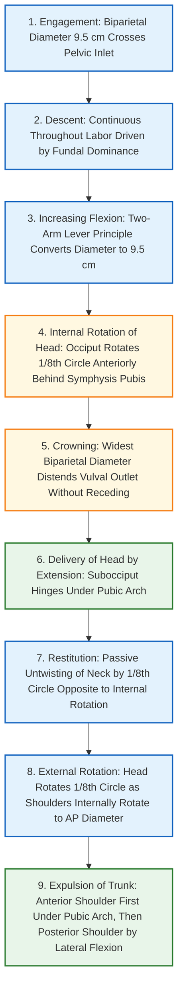
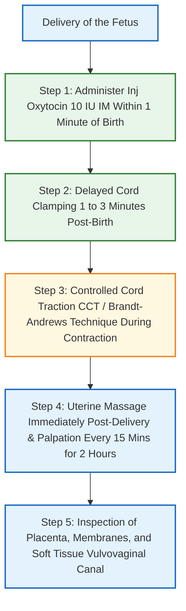

[[C13- Normal labour]]
# Normal Labor: Definition, Mechanism, and Third Stage Management [⭐ High-Yield]

### Mark Weightage

- **10 Marks / Long Answer Depth**

---

### 1. Definition & Criteria for Normal Labor (Eutocia) [⭐ High-Yield]

- **Labor**: A series of continuous events taking place in the female genital organs in an effort to expel the viable products of conception (fetus, placenta, and membranes) out of the womb through the vagina into the outer world.
- **Normal Labor (Eutocia)**: Labor is designated as normal if it strictly fulfills all the following five criteria:
    1. **Spontaneous in onset** and at term (**37 to 41 weeks + 6 days** of gestation).
    2. **Vertex presentation** (occiput as the denominator).
    3. **Without undue prolongation** (completed within physiological time limits).
    4. **Natural termination with minimal aids** (spontaneous vaginal delivery).
    5. **Without any complications** affecting the health of the mother and/or the fetus.
- **Abnormal Labor (Dystocia)**: Any deviation from the definition of normal labor (malpresentation, prolonged labor, instrumental delivery, or maternal/fetal complications).

---

### 2. Onset Factors & Physiology of Normal Labor

- Initiated by a complex cascade of maternal, fetal, and endocrine triggers:
    - **Progesterone Withdrawal**: Shift in the estrogen-to-progesterone ratio enhances myometrial responsiveness.
    - **Uterine Stretch & Myometrial Gap Junctions**: Uterine distension increases gap junction density (Connexin-43) and oxytocin receptor concentration.
    - **Fetal Hypothalamic-Pituitary-Adrenal (HPA) Axis Activation**: Fetal CRH → ACTH → Cortisol surge promotes placental conversion of progesterone to estrogen.
    - **Prostaglandin Synthesis**: PGF₂α and PGE₂ synthesis in decidua and membranes induces cervical softening (ripening) and myometrial contractions.
- **Uterine Polarity**: Coordinated wave of contraction starting from the **cornual pacemakers** (near tubal ostia) spreading downward. While the upper active segment contracts, retracts, and shortens, the lower passive segment and cervix dilate in response.
- **Retraction**: Permanent shortening of myometrial smooth muscle fibers following contraction, preventing relaxation back to original length, which drives progressive fetal descent and clamps uterine vessels ("living ligatures").

---

### 3. Stages of Labor [⭐ High-Yield]

|Stage of Labor|Commencing Event|Terminating Event|Mean Duration (Primigravida)|Mean Duration (Multipara)|Key Physiological Events|
|:--|:--|:--|:--|:--|:--|
|**First Stage**|Onset of true regular labor pains|Full dilatation of cervix (**10 cm**)|**12 hours** (WHO limit: 20 hrs)|**6 hours** (WHO limit: 14 hrs)|Cervical effacement and dilatation; formation of lower segment.|
|**Second Stage**|Full dilatation of cervix (**10 cm**)|Complete expulsion of the fetus|**2 hours** (ACOG limit: 3 hrs with epidural)|**30 minutes** (ACOG limit: 2 hrs with epidural)|Descent, cardinal movements, and birth of baby via bearing-down.|
|**Third Stage**|Complete expulsion of the fetus|Expulsion of placenta and membranes|**15 minutes**(reduced to **5 mins**with AMTSL)|**15 minutes** (reduced to **5 mins** with AMTSL)|Placental separation and expulsion; myometrial vascular clamping.|
|**Fourth Stage**|Expulsion of placenta and membranes|End of **1 to 2 hours**post-delivery observation|**1 to 2 hours**|**1 to 2 hours**|Monitoring maternal vitals, uterine retraction, and PPH prevention.|

---

### 4. Mechanism of Normal Labor (Series of Events in Vertex Presentation) [⭐ High-Yield]

- **Definition**: The series of passive adaptation movements executed by the fetal presenting part during its passage through the maternal birth canal.
- **Default Position**: **Left Occipitoanterior (L.O.A.)** or Left Occipitolateral (L.O.L.).
- **Engaging Diameters**:
    - **Anteroposterior**: Suboccipitobregmatic (**9.5 cm**) when head is well flexed, or Suboccipitofrontal (**10.0 cm**) in slight deflexion.
    - **Transverse**: Biparietal diameter (**9.5 cm**).

#### Detailed Cardinal Movements (Sequential Order)

1. **Engagement**:
    - The passage of the widest transverse diameter of the fetal presenting part (Biparietal diameter **9.5 cm**) through the plane of the pelvic inlet.
    - **Asynclitism**: Deflection of the sagittal suture relative to the pelvic inlet planes.
        - _Anterior Asynclitism (Naegele's Obliquity)_: Sagittal suture lies closer to the sacral promontory; anterior parietal bone is felt predominantly (more common and advantageous).
        - _Posterior Asynclitism (Litzmann's Obliquity)_: Sagittal suture lies closer to symphysis pubis.
2. **Descent**:
    - Continuous process throughout labor driven by uterine contractions, amniotic fluid pressure, and maternal bearing-down efforts.
3. **Flexion**:
    - As the descending head meets resistance from the cervix, pelvic sidewalls, and pelvic floor, flexion increases.
    - **Mechanics (Two-Arm Lever Theory)**: The occipito-atlantal joint acts as the fulcrum. The short arm extends from fulcrum to occiput, and long arm extends from fulcrum to chin. Resistance causes the long arm to ascend and short arm to descend, converting the engaging diameter from occipitofrontal (**11.5 cm**) to suboccipitobregmatic (**9.5 cm**).
4. **Internal Rotation of the Head**:
    - The occiput turns forward toward the symphysis pubis through **1/8th of a circle** in L.O.A. (or **2/8ths of a circle** in L.O.L.).
    - **Governing Factors (Hart's Rule & Levator Ani Gutter)**: The slope of the pelvic floor formed by levator ani muscles directs the leading well-flexed part (occiput) forward toward the midline.
5. **Crowning**:
    - The movement where the maximum biparietal diameter (**9.5 cm**) stretches the vulval ring and remains visible at the vaginal introitus without receding in between contractions.
6. **Extension**:
    - The flexed head descends until the subocciput hinges under the lower border of the symphysis pubis.
    - The head is delivered by **extension** over the stretched perineum, born in sequence: vulval emergence of vertex, forehead, face, and chin. (See Diagram 1).
7. **Restitution**:
    - Visible passive movement of the head due to untwisting of the neck sustained during internal rotation. The head rotates **1/8th of a circle** in the direction opposite to internal rotation (occiput points to the maternal left thigh in L.O.A.).
8. **External Rotation**:
    - Visible external movement of the head resulting from the internal rotation of the fetal shoulders inside the pelvis. As the shoulders rotate from the oblique diameter to the anteroposterior diameter of the outlet, the head turns another **1/8th of a circle** in the same direction as restitution.
9. **Expulsion of Trunk and Shoulders**:
    - Further descent brings the anterior shoulder to escape below the symphysis pubis first.
    - The posterior shoulder sweeps over the perineum, and the rest of the trunk is expelled rapidly by **lateral flexion** of the fetal spine.

---

### 5. Management of the Third Stage of Labor [⭐ High-Yield]

- The third stage is the most critical period of labor; an uneventful first and second stage can rapidly turn life-threatening due to **Postpartum Hemorrhage (PPH)**.
- **Physiology of Separation**: Retraction reduces the placental site area by 75%, shearing the inelastic placenta through the spongy layer of decidua basalis.
- **Mechanism of Separation**:
    - _Schultze Mechanism (Central - 80%)_: Retroplacental hematoma forms centrally; placenta delivers like an inverted umbrella with fetal surface presenting first; minimal external bleeding until delivery.
    - _Mathews-Duncan Mechanism (Marginal - 20%)_: Separation starts at lower margin; blood escapes externally throughout; maternal surface presents first.

#### Active Management of Third Stage of Labor (AMTSL) Protocol

AMTSL is universally recommended by WHO and national guidelines to reduce PPH by **60%**, decrease blood loss to **1/5th**, and shorten duration from 15 minutes to **5 minutes**.

1. **Uterotonic Administration (Within 1 Minute)**:
    - Administer **Injection Oxytocin 10 IU IM** (or 10 IU slow IV infusion) immediately within 1 minute of birth after ruling out an undiagnosed second twin.
    - _Alternatives_: Oral Misoprostol **600 µg** or Inj. Methergine **0.2 mg IM** (if oxytocin unavailable and BP normal).
2. **Delayed Cord Clamping (DCC)**:
    - Delay clamping of the umbilical cord for **1 to 3 minutes** post-delivery (or until pulsations cease).
    - _Benefits_: Increases infant iron stores, protects against neonatal anemia, and reduces intraventricular hemorrhage in preterms.
3. **Controlled Cord Traction (CCT / Brandt-Andrews Technique)**:
    - Performed only during a strong uterine contraction when the uterus is hard and contracted.
    - Place one hand (palmar surface) on the lower uterine segment above the symphysis pubis, exerting upward and backward counter-traction to prevent uterine inversion.
    - The other hand holds the clamped cord at the vulva, exerting steady, gentle downward and backward traction along the axis of the pelvic inlet. (See Diagram 2).
    - As the placenta emerges at the introitus, hold it in both hands and twist slowly in a cupped fashion to peel off the membranes intact.
4. **Immediate Uterine Massage & Vigilance**:
    - Massage the uterine fundus immediately following placental delivery until firmly contracted and hard.
    - Palpate fundus every 15 minutes for the first 2 hours (Fourth Stage) to ensure persistent retraction.
5. **Inspection of Placenta and Genital Tract**:
    - Inspect the maternal surface for missing cotyledons/succenturiate lobes and fetal surface for membrane completeness.
    - Inspect cervix, vagina, and perineum to rule out traumatic tears and repair episiotomy/lacerations under aseptic conditions.

---

### 6. Differential Diagnosis: True Labor Pains vs False Labor Pains

|Diagnostic Feature|True Labor Pains|False Labor Pains (Braxton Hicks)|
|:--|:--|:--|
|**Pain Character**|Rhythmic, painful, originating in lower back and radiating to abdomen/thighs.|Irregular, spasmodic, confined strictly to lower abdomen.|
|**Contraction Pattern**|Progressive increase in frequency, intensity, and duration over time.|Non-progressive, static, and intermittent.|
|**Cervical Changes**|**Progressive effacement and dilatation of the cervix**.|**No cervical effacement or dilatation**.|
|**Show (Mucus Plug)**|**Present** (blood-tinged cervical mucus plug expelled).|**Absent**.|
|**Effect of Sedation / Rest**|Unaffected; labor continues to progress.|Relieved by rest, warm baths, or mild sedatives.|
|**Bag of Membranes**|Becomes tense during uterine contractions.|Remains flaccid; no tension on membranes.|

---

### 7. Drug Dosage Table (AMTSL Uterotonics)

|Name|Mechanism of Action|Dose|Route|Frequency|Features / Side Effects|When to Start / Stop|
|:--|:--|:--|:--|:--|:--|:--|
|**Oxytocin**|Binds G-protein coupled oxytocin receptors on myometrium → raises intracellular Ca²⁺ → rhythmic contractions.|**10 IU**|Intramuscular (IM preferred) or slow IV infusion|Single dose within 1 min of birth|**First-line drug of choice for AMTSL**; safe in pre-eclampsia; rapid IV bolus causes transient hypotension.|Administer within 1 minute of birth of fetus; stop after third stage secured.|
|**Methylergometrine (Methergine)**|Partial agonist at α-adrenergic and dopaminergic receptors → sustained tetanic uterine contraction.|**0.2 mg**|Slow IV or IM|Single dose|Rapid onset; **STRICTLY CONTRAINDICATED in Hypertension, Pre-eclampsia, Eclampsia, and Cardiac Disease**.|Administer after delivery of fetus if Oxytocin unavailable and BP normal.|
|**Misoprostol**|Synthetic PGE₁ analogue; binds myometrial EP₂/EP₃ receptors → increases baseline smooth muscle tone.|**600 µg**(or 800–1000 µg rectal for PPH)|Oral / Sublingual / Rectal|Single dose|High thermostability; key alternative in LMI/rural settings; causes self-limiting pyrexia and shivering.|Administer immediately post-birth when parenteral oxytocics unavailable.|

---

### 8. Complications of the Third Stage of Labor [⭐ High-Yield]

- **Postpartum Hemorrhage (PPH)**: Blood loss **≥500 mL** following vaginal delivery; primary cause is myometrial atony (80% cases).
- **Retained Placenta**: Non-expulsion of placenta within 30 minutes of birth; requires manual removal under general anesthesia.
- **Uterine Inversion**: Rare life-threatening emergency where the uterine fundus collapses into the cavity/vagina due to improper CCT on an uncontracted uterus or fundal pressure.
- **Lacerations & Hematomas**: Cervical, vaginal, or complete perineal tears (CPT).

---

### 9. Clinical Pearl & Exam Trap

### Clinical Pearl

- **The Living Ligatures**: The myometrium contains interlacing criss-cross muscle fibers in the middle layer (Figure-of-8 arrangement). As these fibers contract and permanently retract in the third stage, they act as **"living ligatures"**to physically clamp the maternal blood vessels passing through them, achieving definitive physiological hemostasis.

### Exam Trap

- **The Mix-Up**: Administering **Inj. Methergine** upon delivery of the anterior shoulder when an undiagnosed second twin is present.
- **Distinguishing Fact**: Uterotonic administration in AMTSL must occur **ONLY AFTER ruling out an undiagnosed second twin** via abdominal palpation. Giving Methergine before the birth of a second twin causes uterine tetany and immediate fetal asphyxia/trapping.

---

### 10. Diagram Guide

### Diagram 1: Extension Movement in the Mechanism of Normal Labor

- **Type**: Labeled sagittal anatomical diagram
- **Outline shape to draw**: Maternal pelvic sagittal plane showing symphysis pubis anteriorly, sacral hollow posteriorly, and vulval outlet inferiorly.
- **Labels in order**:
    1. **Symphysis Pubis** — anterior bony fulcrum
    2. **Subocciput** — arrested under symphysis pubis
    3. **Stretched Perineum** — posterior soft tissue curve
    4. **Direction of Extension Arrow** — upward and forward sweep of chin
    5. **Sequence of Delivery** — Vertex → Forehead → Face → Chin
- **Arrows/connections**: Downward descent → Subocciput hinges under Pubic Arch → Upward extension sweep over perineum.
- **Annotation**: _"Delivery of the head in vertex presentation occurs by extension around the subocciput fulcrum."_

---

### Diagram 2: Controlled Cord Traction (Brandt-Andrews Technique) in AMTSL

- **Type**: Clinical procedural guide
- **Outline shape to draw**: Abdomino-pelvic section showing contracted uterine fundus, lower uterine segment, and umbilical cord at introitus.
- **Labels in order**:
    1. **Abdominal Hand (Suprapubic Counter-Traction)** — pushes lower uterine segment upward and backward toward the umbilicus
    2. **Vaginal Hand (Cord Traction)** — holds clamped cord, exerting steady downward and backward traction along pelvic axis
    3. **Contracted Fundus** — firm, hard ball above pelvic brim
- **Arrows/connections**: Abdominal Hand (Upward/Backward ↑) ↔ Cord Hand (Downward/Backward ↓)
- **Annotation**: _"Counter-traction by the abdominal hand prevents acute uterine inversion during controlled cord traction."_

---

### 11. Mnemonic / Memory Palace

#### Mnemonic: DELIVER-AMTSL

- **D**: **Delivery of head by extension** (subocciput acts as fulcrum under pubic arch)
- **E**: **Engagement** (biparietal diameter 9.5 cm crosses inlet plane)
- **L**: **Living ligatures** (interlacing myometrial fibers clamp uterine blood vessels)
- **I**: **Internal rotation** (occiput rotates 1/8th circle anteriorly via levator ani slope)
- **V**: **Vertex presentation** (suboccipitobregmatic diameter 9.5 cm presenting)
- **E**: **External rotation** (head turns 1/8th circle as shoulders internally rotate)
- **R**: **Restitution** (passive untwisting of fetal neck by 1/8th circle)
- **A**: **Administer Oxytocin 10 IU IM** within 1 minute of fetal birth
- **M**: **Massage uterine fundus** immediately following placental delivery
- **T**: **Traction on cord (Controlled)** with suprapubic counter-traction (Brandt-Andrews)
- **S**: **Separation of placenta** (Schultze central vs Mathews-Duncan marginal)
- **L**: **Late / Delayed cord clamping** (1 to 3 minutes post-delivery)

---

### Quick Revision

- **Normal Labor Criteria**: Spontaneous at term (37–42 wks), vertex presentation, normal duration, spontaneous delivery, no complications.
- **Cardinal Movements**: Engagement → Descent → Flexion → Internal Rotation (1/8th) → Crowning → Extension → Restitution → External Rotation → Expulsion.
- **AMTSL Steps**:
    1. Oxytocin 10 IU IM within 1 min.
    2. Delayed cord clamping (1–3 mins).
    3. Controlled Cord Traction (Brandt-Andrews) during contraction with counter-traction.
    4. Immediate fundal massage.
- **AMTSL Impact**: Reduces PPH risk by **60%** and shortens third stage to **5 minutes**.
- **Hemostasis Mechanism**: Myometrial contraction and retraction function as **"living ligatures"**.

---

### One-Line Exam Opener

- **Normal labor (eutocia) is the spontaneous, term expulsion of a vertex-presenting fetus through a systematic sequence of cardinal movements—engagement, descent, flexion, internal rotation, extension, restitution, and external rotation—followed by active management of the third stage (AMTSL) using oxytocin 10 IU IM, delayed cord clamping, and controlled cord traction to prevent postpartum hemorrhage.**

---

💡 _Would you like me to generate practice MCQs, clinical case scenarios, or flashcards on Normal Labor and AMTSL to help test your recall before the exam?_