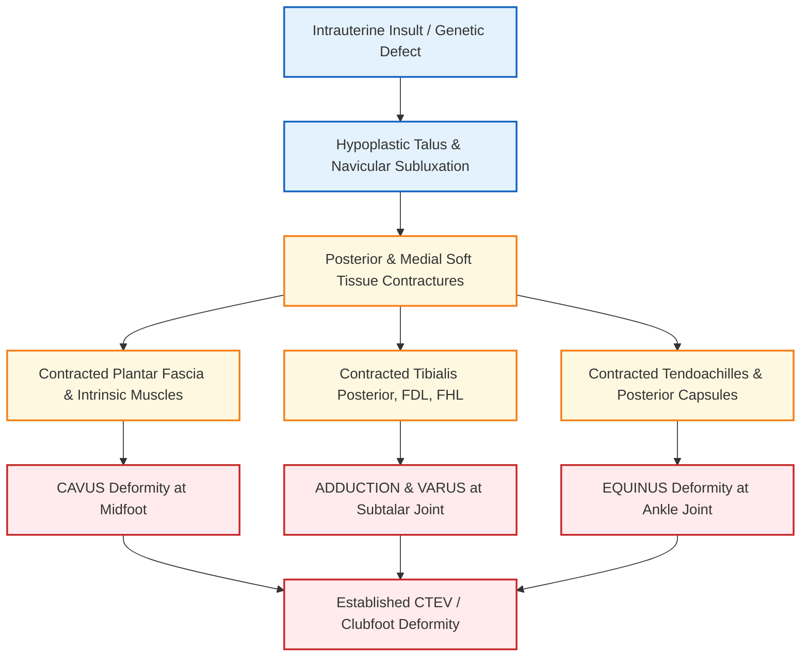
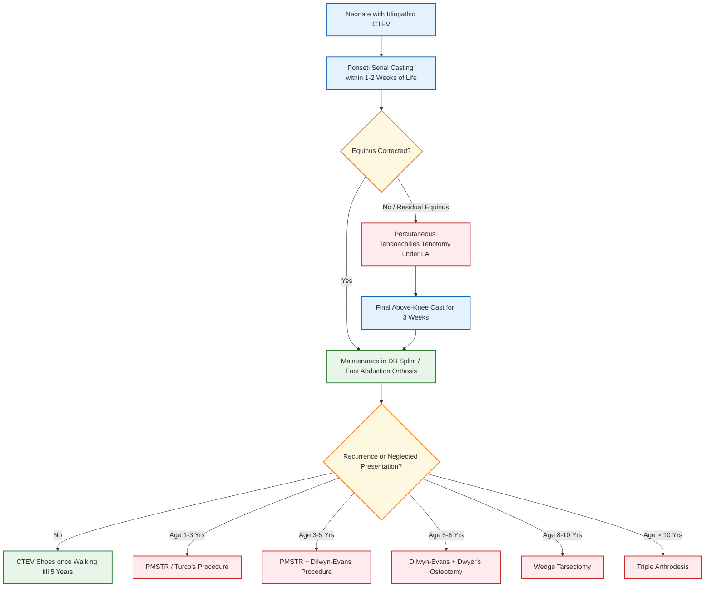

**Mark Weightage: Defaulted to 10 Marks / Long Answer (LAQ) Depth (5-page answer sheet calibration)**

# Congenital Talipes Equinovarus (CTEV / Clubfoot) [⭐ High-Yield]

---

### 1. Definition [⭐ High-Yield]

- **Congenital Talipes Equinovarus (CTEV)**, commonly termed **Clubfoot** (due to its resemblance to a golf club), is the **most common congenital deformity** of the leg, ankle, and foot.
- **Incidence**: **1 in 1000 live births**.
- **Gender Ratio**: **Males > Females** (**2:1** ratio).
- **Bilateral Involvement**: Occurs in **50%–60% of cases**.
- **Associated Factors**: More frequent in **1st born children** and infants with **fetal malpresentation (e.g., breech)**.

---

### 2. Etiology / Causes / Risk Factors

- **Primary / Congenital CTEV (Idiopathic)**: Accounts for the vast majority of cases (**most common type**).
    - **Mechanical Theory**: Raised **intrauterine pressure** forces the fetal foot against the uterine wall.
    - **Ischaemic Theory**: **Ischaemia of calf muscles** during intrauterine life causes localized muscular contractures.
    - **Genetic Theory**: Defective early embryonic germ plasm development.
- **Secondary CTEV (Neuromuscular & Syndromic)**:
    - **Spina Bifida / Myelomeningocele**: Paralytic muscle imbalance.
    - **Arthrogryposis Multiplex Congenita (AMC)**: Primary muscular fibrosis leading to severe rigid contractures.
    - **Cerebral Palsy**, **Poliomyelitis**, and **Freidreich's Ataxia**.

---

### 3. Classification [⭐ High-Yield]

- **Etiological Classification**:
    1. **Primary Clubfoot**: **Idiopathic**, present since birth, normal neurological examination, good prognosis.
    2. **Secondary Clubfoot**: Associated with **neuromuscular disorders** or syndromes; poorer prognosis.
- **Clinical / Rigidity Spectrum**:
    1. **Supple**: Deformity can be fully corrected passively to normal position.
    2. **Rigid**: Deformities cannot be manually corrected.
    3. **Resistant**: Fails to respond to serial manipulation and **POP casting**.
    4. **Neglected**: Untreated for **> 1 year** after birth.
    5. **Relapsed**: Deformity recurs after initial complete correction.

---

### 4. Pathophysiology & Primary Deformities [⭐ High-Yield]

- **The Four Primary Deformities (Mnemonic: CAVE)**:
    1. **C - Cavus**: Exaggeration of the **medial longitudinal arch** at the **midfoot (talonavicular joint)**.
    2. **A - Adduction**: Forefoot adducted at the **talonavicular & midtarsal joints**.
    3. **V - Varus**: Heel inverted and adducted at the **subtalar (talocalcaneal) joint**.
    4. **E - Equinus**: Fixed **plantarflexion** at the **ankle (tibiotalar) joint**.
- **Associated Deformity**: **Internal rotation of the tibia**.
- **Structural Pathoanatomy**:
    - **Bones**: **Hypoplastic talus** with neck angulated downwards and medially; **small calcaneum** concave medially; **talonavicular joint dislocation**.
    - **Contracted Tendons (Posterior & Medial)**: **Tendoachilles**, **Tibialis posterior** (**most important muscle in pathology**), **Flexor digitorum longus (FDL)**, and **Flexor hallucis longus (FHL)**.
    - **Contracted Ligaments & Capsules**: **Posterior ankle & subtalar joint capsules**, **talonavicular ligament**, **spring ligament**, superficial **deltoid ligament**, and **plantar fascia**.

---

### 5. Clinical Features [⭐ High-Yield]

- **Symptoms**:
    - Visible foot deformity present from birth.
    - Painless in infants and young children.
    - Abnormal gait, difficulty in wearing footwear, and pain over lateral aspect of foot in late/walking cases.
- **Signs on Examination**:
    - **Foot Position**: Fixed **Equinus**, **Varus**, **Adduction**, and **Cavus**.
    - **Foot & Heel Size**: **Affected foot is smaller** in length and width; **heel is small, empty, and chubby**.
    - **Skin Creases & Dimples**: Deep skin creases on the **posterior aspect of heel** and **medial side of sole**; **dimples** on the lateral aspect of ankle.
    - **Bony Prominences**: **Head of talus** and **lateral malleolus** felt prominently on the outer convex aspect of foot.
    - **Secondary Soft Tissue Changes**: Calf muscle wasting, callosities, and adventitious bursae over the lateral border of foot in late presenters.
    - **Screening Test (Dorsiflexion Test)**:
        - Normal newborn: Dorsum of foot easily touches the anterior surface of the tibia.
        - **CTEV newborn**: **Dorsiflexion is impossible**, even with firm manual pressure.

---

### 6. Diagnosis / Investigations [⭐ High-Yield]

- **Clinical Assessment**: Diagnosis is primarily clinical; detailed spinal and neurological exam is essential to rule out secondary causes.
- **Imaging (Radiographs)**:
    - **Views**: Anteroposterior (AP) and Lateral radiographs of the foot taken in maximum achievable corrected position.
    - **Kite's Angle (Talocalcaneal Angle)**:
        - Definition: Angle formed between the long axis of the talus and the calcaneum.
        - Normal Value: **20° – 40°** (or **> 35°**).
        - **CTEV Finding**: **Reduced / Angle approaches 0°** (talus and calcaneum become parallel).

---

### 7. Differential Diagnosis

|Feature|Primary CTEV|Secondary CTEV|Congenital Vertical Talus|
|:--|:--|:--|:--|
|**Etiology**|Idiopathic|Spina bifida, AMC, Neuromuscular|Primary congenital tarsal malformation|
|**Foot Sole Appearance**|Concave medial border|Variable|**Convex sole (Rocker-bottom foot)**|
|**Heel Position**|Small, elevated (Equinus)|Atrophic|Fixed Equinus with Valgus|
|**Neurological Exam**|**Normal**|**Deficits present (motor/sensory)**|Normal|
|**Talonavicular Joint**|Medial dislocation|Medial dislocation|**Dorsal dislocation of navicular on talus**|
|**Prognosis**|**Good**|**Poor / High recurrence rate**|Poor with closed reduction|

---

### 8. Treatment / Management [⭐ High-Yield]

#### A. Non-Pharmacological / Conservative Management

- **Timing**: Treatment MUST begin in the **first 1–2 weeks of life**.
- **Ponseti Method (Gold Standard Serial Casting)**:
    - **Sequence of Correction**: **C → A & V → E** (**Cavus** first, then **Adduction & Varus**, lastly **Equinus**).
    - **Fulcrum**: Pressure applied over the **head of the talus** (NEVER on calcaneocuboid joint).
    - **Cast Details**: **Above-knee POP cast** with knee in 90° flexion, changed every **5–7 days** for **6–8 weeks**.
    - **Percutaneous Tendoachilles Tenotomy**: Required in **> 80% cases** to correct residual equinus before final cast application.
- **Comparison: Ponseti vs. Kite's Method**:

|Feature|Ponseti Method|Kite's Method|
|:--|:--|:--|
|**Fulcrum**|**Head of Talus**|Calcaneocuboid Joint|
|**Order of Correction**|**Cavus → Adduction/Varus → Equinus**|Adduction → Inversion → Equinus|
|**Cast Type**|**Above-knee cast**|Below-knee cast|
|**Total Duration**|**6–8 weeks**|6–9 months|

- **Maintenance of Correction**:
    - **Denis-Browne (DB) Splint / Foot Abduction Orthosis (FAO)**: Worn **23 hours/day** for 3 months, then **at night till 3–5 years** of age.
    - **CTEV Shoes**: Used once child starts walking (features: **straight inner border**, **outer shoe raise**, **no heel**).

#### B. Pharmacological Treatment

### Dosage Rule

|Drug|Dose|Route|Frequency|Duration|Key Caution|
|:--|:--|:--|:--|:--|:--|
|**Local Anaesthetic (Lignocaine 1%)**|**3–5 mg/kg**|Subcutaneous infiltration|Single dose prior to tenotomy|Single application|Avoid intra-vascular injection; monitor max dose limit|
|**Analgesic (Paracetamol syrup)**|**10–15 mg/kg**|Oral|6–8 hourly as needed|**24–48 hours**post-tenotomy|Avoid exceeding **60 mg/kg/day**|

_(Note: Primary management of CTEV is physical/surgical; systemic medications are non-essential)._

#### C. Surgical Management (Age-Wise Protocol for Neglected / Relapsed Cases)

1. **Age 1 – 3 Years**: **PMSTR (Postero-Medial Soft Tissue Release) / Turco's Procedure**.
    - Posterior release: Lengthening of **Tendoachilles (Z-plasty)** + posterior capsule release of ankle and subtalar joints.
    - Medial release: Lengthening of **3 tendons** (**Tibialis posterior**, **FDL**, **FHL**) + release of **3 ligaments**(**Talonavicular**, **Spring**, **Deltoid**) + release of **3 capsules/structures**.
2. **Age 3 – 5 Years**: **PMSTR + Dilwyn-Evans Procedure** (calcaneocuboid joint resection and fusion for lateral column shortening).
3. **Age 5 – 8 Years**: **Dilwyn-Evans Procedure + Dwyer's Osteotomy** (open-wedge calcaneal osteotomy to correct heel varus).
4. **Age 8 – 10 Years**: **Wedge Tarsectomy** (dorsolateral bony wedge removal from midtarsal area).
5. **Age > 10 Years**: **==Triple Arthrodesis==** (fusion of **Subtalar**, **Talonavicular**, and **Calcaneocuboid** joints).
6. **Severe Rigid / Relapsed Cases**: **Joshi's External Stabilization System (JESS)** / **Ilizarov Technique**.

---

### 9. Complications [⭐ High-Yield]

- **Rocker-Bottom Foot**: Occurs due to forceful dorsiflexion against a tight tendoachilles without releasing equinus, breaking the foot through the midtarsal joint.
- **Recurrence / Relapse**: **Equinus is the first deformity to recur**.
- **Plaster / Cast Complications**: Pressure sores, skin necrosis, overcrowded toes, and overcrowding vascular compromise.
- **Pseudoarthrosis**: Occurs if **Triple Arthrodesis** is performed under **10 years of age** before tarsal bones ossify.

---

### 10. Prognosis

- **Idiopathic Supple CTEV**: **Excellent (> 90% success rate)** when Ponseti casting is initiated within the 1st week of life.
- **Secondary / Syndromic CTEV**: **Poor prognosis** with high rate of rigidity, operative failure, and relapses.

---

### 11. Mnemonic / Memory Palace

#### Mnemonic: CAVE & 3-3-3 Rule

- **Deformity Sequence**: **C**avus, **A**dduction, **V**arus, **E**quinus.
- **PMSTR Rule of 3s**: **3 Tendons** (TA, Tib Post, FDL/FHL), **3 Ligaments** (Talonavicular, Spring, Deltoid), **3 Capsules/Deep Ligaments** released on medial side.

#### Memory Palace: The Footwear Factory Walkway

1. **Entrance Gate (Neonate)**: A tiny baby holding a **Golf Club** (**Clubfoot, 1 in 1000**).
2. **Room 1 - The CAVE**: Inside a dark cave, a calf is squeezed (**Ischaemic theory**) under high pressure (**Mechanical theory**).
3. **Room 2 - The Alignment Bench**: A worker bends the foot using **Talus Head as Fulcrum** (**Ponseti Method**).
4. **Room 3 - The Shoe Rack**: Shoes with **Straight inner borders** and **Outer raises** but **No heels** (**CTEV Shoes**).
5. **Room 4 - The Clock Tower**: Clocks marked **1-3 yrs (PMSTR)**, **3-5 yrs (Evans)**, **5-8 yrs (Dwyer)**, **8-10 yrs (Wedge Tarsectomy)**, **>10 yrs (Triple Arthrodesis)**.

---

### Clinical Pearl

- Always correct **Cavus** first by elevating the 1st ray (supinating forefoot) to align the forefoot with the hindfoot before abducting the foot under the talus head; trying to abduct without correcting cavus exacerbates the deformity.

---

### Exam Trap

- **The Confusion**: Confusing **Kite's Method** with **Ponseti Method** or confusing **CTEV** with **Congenital Vertical Talus (CVT)**.
- **Distinguishing Facts**:
    - **Ponseti vs. Kite**: Ponseti uses the **head of talus** as fulcrum; Kite uses the **calcaneocuboid joint**.
    - **CTEV vs. CVT**: CTEV has a **concave sole with fixed equinus/varus**; CVT presents with a **rocker-bottom (convex) sole with fixed dorsiflexion of forefoot and valgus**.

---

### Diagram Guide

### Diagram 1: Deformities in CTEV (CAVE)

- **Type**: Line diagram / Clinical presentation outline.
- **Outline shape to draw**: Outline of foot viewed from posterior and medial aspects.
- **Labels in order (proximal to distal)**:
    1. **Ankle Joint** — Plantarflexion (**Equinus**).
    2. **Subtalar Joint** — Inversion (**Varus**).
    3. **Midfoot / Arch** — High exaggerated arch (**Cavus**).
    4. **Forefoot** — Medial inward deviation (**Adduction**).
- **Arrows/connections**: Ankle (Equinus) → Heel (Varus) → Midfoot (Cavus) → Forefoot (Adduction).
- **Extra Mark Annotation**: "Kite's Angle (Talocalcaneal angle) reduced towards 0° (Talus & Calcaneum become parallel on X-ray)".

### Diagram 2: CTEV Shoe Modifications

- **Type**: Equipment / Orthosis design diagram.
- **Outline shape to draw**: Sole and side profile of a modified child shoe.
- **Labels in order**:
    1. **Straight Inner Border** — Prevents forefoot adduction.
    2. **Outer Shoe Raise** — Prevents heel/foot inversion (varus).
    3. **Absence of Heel** — Prevents ankle equinus.
- **Extra Mark Annotation**: "Used after child starts walking until 5 years of age".

---

### Quick Revision

- **CTEV Deformity**: **CAVE** (**C**avus, **A**dduction, **V**arus, **E**quinus) with **internal tibial rotation**.
- **Gold Standard Treatment**: **Ponseti Method** of serial casting (order **C → A/V → E**, fulcrum = **Head of Talus**) started in 1st–2nd week of life.
- **X-Ray Hallmark**: **Reduced Kite's angle (< 20°)** with parallel talus and calcaneum.
- **Surgical Benchmark**: **PMSTR (1-3 yrs)** → **Dilwyn-Evans (3-5 yrs)** → **Dwyer (5-8 yrs)** → **Wedge Tarsectomy (8-10 yrs)** → **Triple Arthrodesis (> 10 yrs)**.
- **Splint Maintenance**: **Denis-Browne splint** (23 hours/day initially) followed by **CTEV shoes**.

---

### One-Line Exam Opener

- **Congenital Talipes Equinovarus (CTEV) is a complex congenital foot deformity characterized by midfoot cavus, forefoot adduction, heel varus, and ankle equinus (CAVE), best managed non-operatively in neonates using the Ponseti serial casting technique.**

---

👟 _Would you like me to create a flashcard deck or a practice quiz based on this CTEV answer to test your recall for the exam?_