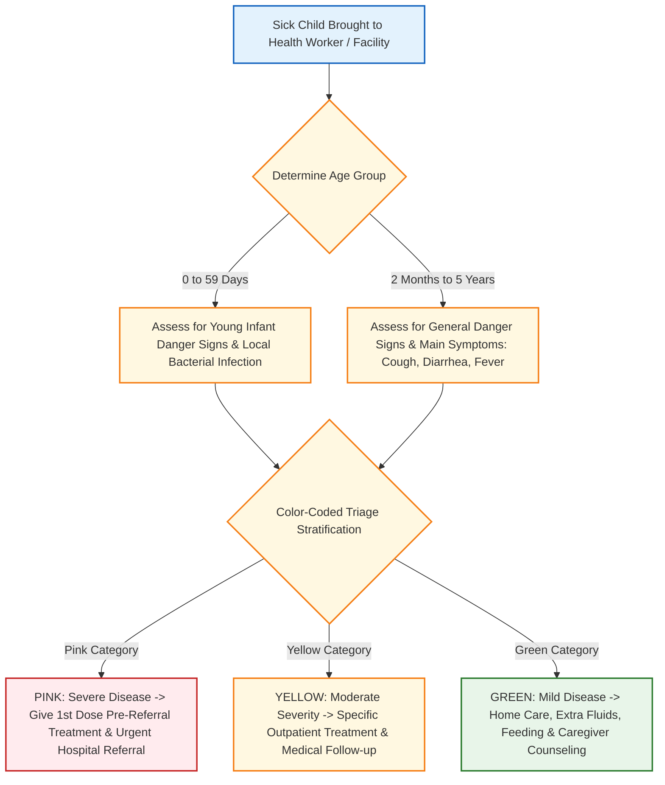

**(Mark-Weightage Calibration: Defaulting to 10 Marks / Long Answer Depth)**

# Integrated Management of Neonatal and Childhood Illness (IMNCI) — Components and Role in Reducing Mortality [⭐ High-Yield]

### 1. Definition [⭐ High-Yield]

- **Integrated Management of Neonatal and Childhood Illness (IMNCI)** is an evidence-based, integrated clinical and public health strategy developed jointly by the WHO and UNICEF, adapted by the Government of India in 2003, to significantly reduce under-5 child mortality, morbidity, and disability in developing nations.
- It integrates preventive, promotive, and curative care, shifting the pediatric clinical approach from single-disease diagnosis to holistic, symptom-based case management of sick neonates and young children.

---

### 2. Etiology / Major Causes of Under-5 Mortality Addressed [⭐ High-Yield]

- In India, the Under-5 Mortality Rate (**U5MR**) is **32 per 1000 live births**, with the Neonatal Mortality Rate (**NMR**) contributing **20 per 1000 live births** (accounting for **~63–71%** of all under-5 deaths).
- IMNCI directly targets the predominant causes of under-5 child mortality:
    1. **Neonatal Period (<28 Days)**: Prematurity (**27%**), neonatal sepsis and infections (**13%**), birth asphyxia and trauma (**11%**), and congenital malformations (**9%**).
    2. **Post-Neonatal Period (2 Months to 5 Years)**: Pneumonia (**11%**), diarrheal diseases (**9%**), malaria, measles, and severe acute malnutrition (**SAM**).
    3. **Underlying Risk Factor**: Undernutrition is an underlying risk factor associated with approximately **45%** of all under-5 child deaths.

---

### 3. Classification / Core Components of IMNCI [⭐ High-Yield]

IMNCI is structured around three mutually reinforcing core components:

1. **Component 1: Improving Health Worker Skills (Clinical Case Management)**:
    - Systematic training of healthcare personnel (doctors, ANMs, ASHAs, Anganwadi Workers) in evidence-based algorithms for assessment, color-coded triage, pre-referral treatment, and counseling.
2. **Component 2: Improving Health System Capabilities & Infrastructure**:
    - Strengthening primary health care facilities (PHC, CHC, FRU) by ensuring a continuous supply of essential pediatric drugs, vaccines, ORS, zinc, equipment, supervision, and functional emergency referral transport.
3. **Component 3: Improving Family and Community Health Practices (Community IMNCI / C-IMNCI)**:
    - Empowering families through community health workers (ASHA, AWW) during Home-Based Newborn Care (**HBNC**) and Home-Based Care for Young Child (**HBYC**) visits.
    - Focuses on key household practices: exclusive breastfeeding up to 6 months, timely complementary feeding, handwashing, home management of diarrhea/fever, and early recognition of red-flag danger signs.

---

### 4. Pathophysiology / Operational Flowchart of IMNCI [⭐ High-Yield]

---

### 5. Clinical Features / Assessment & Triage System [⭐ High-Yield]

IMNCI divides children into two distinct age tiers for clinical evaluation:

#### A. Age Categories

1. **Young Infants**: Birth up to 2 months (**0 to 59 days**).
2. **Older Infants & Children**: 2 months up to 5 years (**2 to 59 months**).

#### B. General Danger Signs (Children 2 Months to 5 Years) [⭐ High-Yield]

The presence of **ANY single general danger sign** requires immediate classification as a severe illness, urgent pre-referral stabilization, and emergency referral to a hospital:

1. **Inability to drink or breastfeed**
2. **Vomiting everything**
3. **Convulsions** during the current illness
4. **Lethargic or unconscious** state

#### C. Severe Danger Signs in Young Infants (0 to 59 Days) [⭐ High-Yield]

1. Convulsions or abnormal movements.
2. Fast breathing (respiratory rate **≥60 breaths/min**).
3. Severe chest indrawing.
4. Temperature instability: Fever (**≥37.5°C**) or hypothermia (**<35.5°C**).
5. Poor feeding / inability to suck.
6. Movement only when stimulated or no movement at all (lethargy).
7. Umbilical redness extending to skin or severe skin pustules.
8. Yellow soles (severe jaundice).

---

### 6. Diagnosis / Color-Coded Triage Table [⭐ High-Yield]

IMNCI uses a symptom-based, action-oriented **color-coded classification matrix** rather than explicit lab-based diagnoses:

|Color Category|Severity Level|Required Action & Management|Example: Respiratory Illness (Pneumonia)|
|:--|:--|:--|:--|
|**Pink (Red)**|**Severe Disease / Life-Threatening**|Immediate pre-referral treatment (1st dose IV/IM antibiotic, oxygen, sugar bolus); urgent referral to higher hospital|**Severe Pneumonia / Very Severe Disease**: SpO₂ <90%, chest indrawing, or general danger signs present.|
|**Yellow**|**Moderate Severity / Specific Treatment**|Specific medical treatment at primary facility (oral antibiotics, ORS + Zinc, antimalarial); caregiver guidance for outpatient care|**Pneumonia**: Fast breathing or chest indrawing with normal SpO₂ → Oral Amoxicillin for 5 days.|
|**Green**|**Mild Illness / Low Risk**|No specific medical drugs required; manage at home with guidance on fluids, feeding, and red-flag danger signs|**No Pneumonia (Cough/Cold)**: Normal breathing rate and no chest indrawing → Home Paracetamol + supportive care.|

---

### 7. Differential Comparison: Facility-Based IMNCI vs. Community IMNCI

|Feature|**Facility-Based IMNCI (F-IMNCI)**|**Community IMNCI (C-IMNCI)**|
|:--|:--|:--|
|**Primary Level**|First referral level facilities (CHC, FRU, District Hospitals)|Community level & Primary Health Centers (ANM, ASHA, AWW)|
|**Target Population**|Sick neonates and children requiring inpatient care|Healthy and sick infants/children at household level|
|**Key Focus**|Inpatient management of birth asphyxia, severe sepsis, SAM, shock, severe dehydration|Early identification of illness, HBNC/HBYC home visits, counseling, prompt referral|
|**Care Providers**|Medical officers, pediatricians, trained staff nurses|ANMs, Accredited Social Health Activists (ASHA), Anganwadi Workers|

---

### 8. Treatment / Management Strategy & Key Interventions [⭐ High-Yield]

IMNCI follows a structured 5-step clinical approach: **Assess → Classify → Identify Treatment → Treat → Counsel Mother**:

1. **Assessment & Risk Stratification**:
    - Evaluate general danger signs, main symptoms (cough, diarrhea, fever, ear issues), nutritional status (MUAC, weight-for-height), and immunization history.
2. **Specific Condition Protocols**:
    - **Severe Pneumonia (Pink)**: Administer 1st dose parenteral antibiotic (Ampicillin + Gentamicin), deliver oxygen, and execute urgent hospital referral.
    - **Diarrheal Dehydration**:
        - _Plan A (No Dehydration)_: Home fluids + Low-osmolarity ORS + Zinc supplementation for 14 days.
        - _Plan B (Some Dehydration)_: ORS **75 mL/kg** administered over 4 hours at the facility.
        - _Plan C (Severe Dehydration)_: Urgent IV fluid resuscitation with Ringer Lactate or 0.9% Normal Saline (**100 mL/kg**).
    - **Severe Acute Malnutrition (SAM)**:
        - _Uncomplicated SAM_: Supervised home management with Ready-to-Use Therapeutic Food (**RUTF**), oral amoxicillin, and Vitamin A.
        - _Complicated SAM_: Inpatient facility admission for stabilization (F-75 diet, infection treatment, electrolyte correction).

---

### 9. Role of IMNCI in Reducing Under-5 Mortality [⭐ High-Yield]

IMNCI serves as a cornerstone strategy for achieving National Health Policy targets (**U5MR <23 per 1000** and **NMR <16 per 1000** live births) through:

- **Integrated Overlapping Coverage**: Simultaneously addresses the top childhood killers (pneumonia, diarrhea, sepsis, asphyxia, malnutrition) rather than treating isolated symptoms.
- **Early Care-Seeking & Triage**: Trains ASHAs and ANMs to identify illness early during routine home visits (HBNC/HBYC), preventing progression to irreversible septic shock or severe asphyxia.
- **Reduction in Irrational Drug Use**: Standardized algorithms ensure antibiotics are reserved strictly for true bacterial infections (yellow/pink classifications), reducing polypharmacy and drug resistance.
- **Nutritional Support & Immunity**: Direct linkage with Infant and Young Child Feeding (**IYCF**) guidelines, exclusive breastfeeding, complementary feeding, and vitamin A supplementation reduces undernutrition-related mortality.
- **Strengthened Referral Chain**: Pre-referral stabilization (e.g., single dose antibiotic, sugar bolus for hypoglycemia) improves survival during transport to referral centers.

---

### 10. Complications / Pitfalls Addressed by IMNCI

- Delayed referral of severe neonatal sepsis and acute respiratory distress.
- Missed severe acute malnutrition and severe anemia in children presenting with acute infectious illnesses.
- Dehydration mortality due to delayed initiation of oral rehydration therapy at home.

---

### 11. Mnemonic / Memory Palace

#### Mnemonic: I-M-N-C-I

- **I** - **Integrated strategy**: Combines preventive, promotive, and curative care for under-5 children
- **M** - **Major killers targeted**: Pneumonia, diarrhea, sepsis, asphyxia, measles, malnutrition
- **N** - **Neonates (<2 months) & Children (2m to 5y)**: Dual age group evaluation protocol
- **C** - **Color-coded triage**: **Pink** (Referral), **Yellow** (Facility Rx), **Green** (Home Care)
- **I** - **Improved health worker skills**: Training ASHAs, ANMs, and doctors for early intervention

---

### Clinical Pearl

> **General danger signs take precedence over everything.** In any child aged 2 months to 5 years presenting with a cough or fever, if they cannot drink/breastfeed, vomit everything, have convulsions, or are lethargic, classify immediately as **PINK (Severe Disease)** and administer pre-referral care before immediate transfer.

---

### Exam Trap

- **The Mix-up**: Confusing the cut-off for fast breathing in young infants vs. older infants under IMNCI.
- **Distinguishing Fact**: Fast breathing thresholds under IMNCI are strictly age-dependent:
    - **<2 months**: **≥60 breaths/min**
    - **2–12 months**: **≥50 breaths/min**
    - **12–50 months**: **≥40 breaths/min**

---

### Diagram 1: IMNCI Case Management Algorithm & Triage Pyramid

- **Type**: Labeled tri-level triage flowchart.
- **Outline shape to draw**: Tri-level inverted pyramid divided into three distinct color zones.
- **Labels in order**:
    1. **Top Red/Pink Zone**: **Pink (Severe Disease)** — Emergency pre-referral treatment + Urgent hospital referral.
    2. **Middle Yellow Zone**: **Yellow (Moderate Disease)** — Specific outpatient treatment + Oral drugs + Facility follow-up.
    3. **Bottom Green Zone**: **Green (Mild Disease)** — Home care + Feeding guidance + Caregiver counseling on danger signs.
- **Arrows/connections**: Patient Assessment → Identify Danger Signs → Triage into Pink / Yellow / Green → Execute Action Protocol.
- **Extra Mark Annotation**: Checking for **General Danger Signs** in children 2 months to 5 years is mandatory before evaluating individual symptoms.

---

### Quick Revision

- **Age Groups**: Young infants (**0–59 days**) and children (**2–59 months**).
- **Three Core Components**: Worker skills, health system infrastructure, family/community practices.
- **Four General Danger Signs**: Inability to feed, vomiting everything, convulsions, lethargy/unconsciousness.
- **Color Triage System**: **Pink** (urgent hospital referral), **Yellow** (facility outpatient Rx), **Green** (home management).
- **Key Impact**: Reduces under-5 mortality by simultaneously addressing pneumonia, diarrhea, sepsis, and malnutrition.

---

### One-Line Exam Opener

- **IMNCI is an integrated public health strategy designed by WHO/UNICEF to reduce under-5 childhood mortality by combining color-coded clinical triage of major pediatric illnesses with health system strengthening and community-based health promotion.**