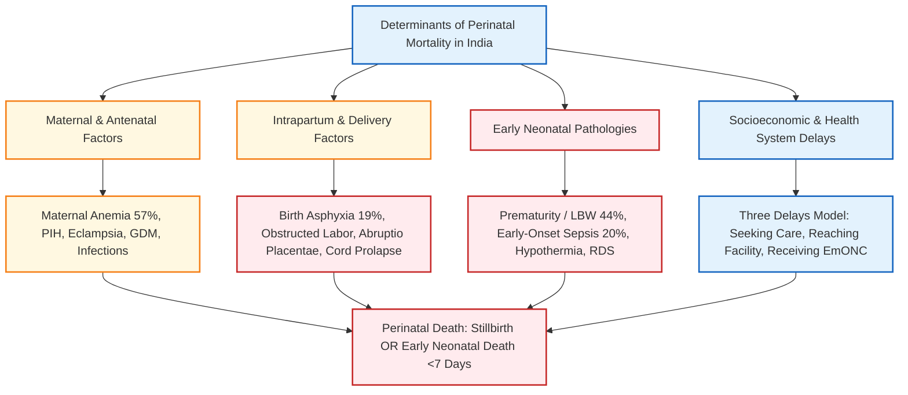
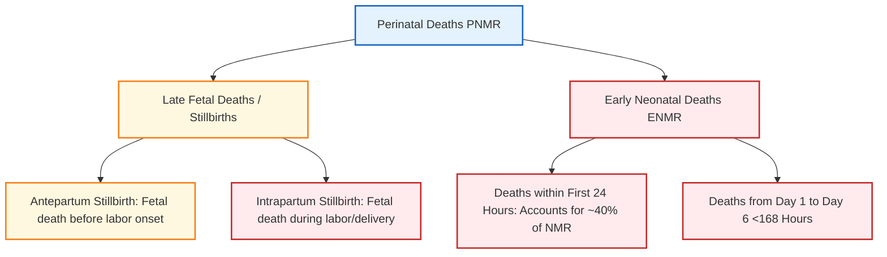
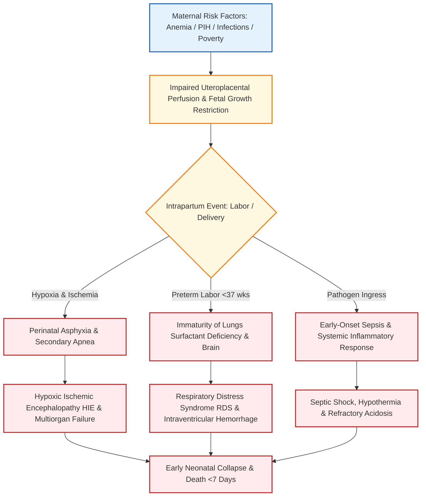
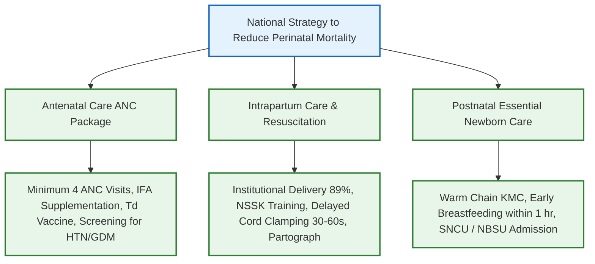

# Perinatal Mortality Rate and Factors Responsible in India [⭐ High-Yield]

### 1. Definition [⭐ High-Yield]

- **Perinatal Period**: Extends from the **22nd completed week of gestation** (154 days, when fetal weight is normally **≥500 g**) and ends at **less than 7 completed days of life** (<168 hours post-delivery).
- **WHO Standard Definition for International Comparison**: Extends from the **28th week of gestation** (fetal weight **≥1000 g**) to **less than 7 days of life**.
- **Perinatal Mortality Rate (PNMR)**: Defined as the total number of perinatal deaths (late fetal deaths / stillbirths after 22 or 28 weeks of gestation plus early neonatal deaths occurring during the first week of life) per **1000 total births** (or per 1000 live births).
- **Mathematical Ratio Designation**: It is designated technically as a ratio because the numerator (stillbirths + early neonatal deaths) includes stillbirths, whereas the standard denominator is live births.

\[\text{Perinatal Mortality Rate (PNMR)} = \frac{\text{Stillbirths } (\ge 28 \text{ wks}) + \text{ Early Neonatal Deaths } (<7 \text{ days})}{\text{Total Live Births}} \times 1000\]

- **Current Epidemiological Indices in India (SRS Data)**:
    - **Under-5 Mortality Rate (U5MR)**: **32 per 1000 live births**.
    - **Infant Mortality Rate (IMR)**: **28 per 1000 live births**.
    - **Neonatal Mortality Rate (NMR)**: **20 per 1000 live births** (accounts for **63%** of U5MR and **71%** of infant deaths).
    - **Early Neonatal Mortality Rate (ENMR)**: **15 per 1000 live births** (accounts for **75%** of all neonatal deaths).
    - **Late Neonatal Mortality Rate (LNMR)**: **5 per 1000 live births**.

---

### 2. Etiology / Factors Responsible for Perinatal Mortality in India [⭐ High-Yield]

Perinatal mortality in India is multifactorial, stemming from an interplay of medical, obstetric, neonatal, socioeconomic, and health-system factors.

#### A. Direct Medical & Neonatal Causes [⭐ High-Yield]

1. **Prematurity and Low Birth Weight (LBW)** (**44%** of neonatal deaths):
    - Preterm infants (**<37 weeks gestation**) have immature surfactant production leading to **Respiratory Distress Syndrome (RDS)**, fragile germinal matrix vessels predisposing to **Intraventricular Hemorrhage (IVH)**, and poor subcutaneous fat causing severe **hypothermia**.
    - LBW infants (**<2500 g**) constitute nearly one-third of all births in India but account for **three-fourths of total neonatal deaths**.
2. **Perinatal / Birth Asphyxia and Trauma** (**19%** of neonatal deaths):
    - Failure to initiate or sustain spontaneous breathing at birth.
    - Caused by intrapartum hypoxia, prolonged/obstructed labor, cord compression, abruptio placentae, and improper resuscitation, leading to **Hypoxic Ischemic Encephalopathy (HIE)** and multiorgan failure.
3. **Early-Onset Neonatal Sepsis (EOS) & Infections** (**20%** of neonatal deaths):
    - Manifests within the first **72 hours of life**.
    - Primary pathogens in India: _**Klebsiella pneumoniae**_ (most common), _Acinetobacter_, and _Staphylococcus aureus_.
    - Transmitted vertically due to maternal chorioamnionitis, prolonged rupture of membranes (**PROM >18 hours**), foul-smelling liquor, or unsterile delivery practices.
4. **Congenital Anomalies** (**11%** of neonatal deaths):
    - Major structural malformations such as **Neural Tube Defects (NTDs)** (anencephaly, meningomyelocele), congenital heart diseases (transposition of great arteries, VSD), and diaphragmatic hernia.

#### B. Maternal and Antenatal Risk Factors [⭐ High-Yield]

- **Maternal Anemia & Undernutrition**: Over **57%** of adolescent girls and pregnant women in India are anemic, impairing placental oxygen transfer and causing Intrauterine Growth Restriction (IUGR) and preterm birth.
- **Hypertensive Disorders of Pregnancy**: Pregnancy-Induced Hypertension (PIH) and eclampsia impair uteroplacental blood flow, leading to placental insufficiency, abruptio placentae, and stillbirth.
- **Uncontrolled Maternal Diabetes**: Overt or gestational diabetes mellitus increases risks of fetal macrosomia, birth trauma, sacral agenesis, RDS, and sudden late third-trimester intrauterine fetal death.
- **Maternal Infections**: TORCH infections (Toxoplasmosis, Rubella, CMV, HSV), syphilis, malaria, and urinary tract infections trigger preterm labor and congenital damage.
- **Extreme Maternal Age & High Parity**: Teenage pregnancies (**<18 years**) and pregnancies in women **>35 years**significantly elevate perinatal mortality.

#### C. Intrapartum and Delivery-Related Factors

- **Home Deliveries without Skilled Birth Attendants (SBA)**: Delay in managing intrapartum complications.
- **Unsafe Cord and Thermal Care**: Non-use of sterile blades, applying cow dung/surma to the umbilical stump, and failure to dry and wrap the baby immediately, leading to fatal hypothermia and neonatal tetanus.
- **Obstetric Emergencies**: Cord prolapse, uterine rupture, malpresentations (breech), and shoulder dystocia causing birth trauma (brachial plexus injuries, skull fractures).

#### D. Socioeconomic & Health-System Factors ("The Three Delays Model")

1. **First Delay**: Delay in deciding to seek medical care due to illiteracy, poverty, lack of awareness of danger signs, and gender discrimination.
2. **Second Delay**: Delay in reaching a health facility due to poor road infrastructure, lack of emergency transport, and geographic isolation in rural/tribal belts.
3. **Third Delay**: Delay in receiving adequate emergency obstetric and newborn care (EmONC) at the health facility due to shortage of trained manpower, lack of functional radiant warmers/oxygen, or delayed referral to Special Newborn Care Units (SNCUs).

---

### 3. Classification of Perinatal Deaths [⭐ High-Yield]

Perinatal mortality is classified based on the timing of death relative to birth:

1. **Fetal Deaths / Stillbirths**:
    - **Antepartum Stillbirths (Macerated)**: Fetal death occurring in utero prior to the onset of labor (caused by chronic placental insufficiency, severe anemia, TORCH infections).
    - **Intrapartum Stillbirths (Fresh)**: Fetal death occurring during labor and delivery (caused by acute asphyxia, cord prolapse, obstructed labor).
2. **Early Neonatal Deaths (ENMD)**:
    - Deaths occurring during the first **7 completed days of life** (**0 to 6 days**).
    - **Critical Period**: **40% of all neonatal deaths occur within the first 24 hours of life**, half within 72 hours, and three-fourths within the first week.

---

### 4. Pathophysiology [⭐ High-Yield]

- **Perinatal Hypoxia Cascade**: Intrapartum interruption of placental blood flow causes severe fetal hypoxemia, hypercapnia, and metabolic acidosis (pH <7.0). This leads to progressive organ dysfunction in the brain (HIE), heart (myocardial dysfunction), kidneys (acute tubular necrosis), and lungs (persistent pulmonary hypertension).
- **Cold Stress & Metabolic Breakdown**: Preterm and asphyxiated neonates rapidly lose body heat due to a large surface area to body weight ratio and deficient brown fat. Hypothermia increases oxygen and glucose consumption, triggering pulmonary vasoconstriction, anaerobic glycolysis, severe metabolic acidosis, and death.

---

### 5. Clinical Features / Danger Signs [⭐ High-Yield]

#### A. Antepartum and Intrapartum Risk Markers

- Maternal severe anemia (Hb <7 g/dL), elevated blood pressure (BP ≥140/90 mmHg), dark vaginal bleeding (abruptio).
- Absence or decrease in fetal movements, non-reassuring fetal heart rate (bradycardia <110 bpm or tachycardia >160 bpm).
- Thick meconium-stained amniotic fluid (**MSL**) during labor.

#### B. Early Neonatal Danger Signs (Look, Listen, Feel) [⭐ High-Yield]

- **Breathing**: Respiratory rate **>60 breaths/min** (tachypnea), severe chest indrawing, grunting, gasping, or central cyanosis.
- **Neurological**: Convulsions, lethargy (movement only when stimulated or no movement), hypotonia, poor/absent Moro reflex, inability to suck/breastfeed.
- **Thermal**: Cold to touch — axillary temperature **<35.5°C** (hypothermia) or fever **>37.5°C**.
- **Systemic**: Abdominal distension, persistent vomiting, jaundice extending to soles (yellow soles) on day 1 of life.

---

### 6. Diagnosis / Investigations & Surveillance

- **Antenatal Assessment**:
    - Ultrasonography (USG) for fetal growth curves, gestational age, biophysical profile, and congenital anomaly screening.
    - Maternal Hb, blood pressure monitoring, random blood sugar (RBS), VDRL/HIV serology.
- **Intrapartum & Delivery Room Assessment**:
    - **APGAR Score**: Evaluated at **1 minute** and **5 minutes** (0–3 indicates severe asphyxia).
    - **Umbilical Cord Blood Gas**: pH <7.0 confirms profound metabolic or mixed acidemia.
- **Early Neonatal Investigations**:
    - **Sepsis Screen**: Total Leukocyte Count (TLC <5000/mm³), Absolute Neutrophil Count (ANC <1800/mm³), Immature to Total neutrophil ratio (I/T ratio >20%), C-Reactive Protein (CRP >1 mg/dL), micro-ESR (≥15 mm in 1st hr).
    - **Blood Culture**: Gold standard for confirming neonatal sepsis prior to antibiotic therapy.
    - **Radiology**: Chest X-ray for RDS (ground-glass appearance with air bronchograms) or MAS (patchy infiltrates).

---

### 7. Differential Diagnosis

|Feature|**Early Neonatal Deaths (<7 Days)** [⭐ High-Yield]|**Late Neonatal Deaths (7–28 Days)**|
|:--|:--|:--|
|**Timing**|First 7 completed days of life (<168 hours)|Day 7 to Day 28 of life|
|**Proportion of NMR**|Accounts for **~75%** of all neonatal deaths (15 per 1000)|Accounts for **~25%** of all neonatal deaths (5 per 1000)|
|**Primary Pathogens / Causes**|Prematurity (44%), Birth Asphyxia (19%), Early-Onset Sepsis (_Klebsiella_, Gram-negatives)|Late-Onset Sepsis (hospital/community-acquired), Pneumonia, Diarrhea, Tetanus|
|**Primary Prevention Strategy**|Skilled birth attendance, EmONC, **Golden Minute**resuscitation, NSSK|Home-Based Newborn Care (HBNC), exclusive breastfeeding, infection control|

---

### 8. Treatment / Prevention & Management Strategies [⭐ High-Yield]

Reducing perinatal mortality requires a continuum-of-care approach across antenatal, intrapartum, and postnatal periods:

#### A. Antenatal Interventions

- **Antenatal Care (ANC) Quality**: Minimum 4 high-quality ANC visits under **Pradhan Mantri Surakshit Matritva Abhiyan (PMSMA)**.
- **Nutritional Support**: Iron-Folic Acid (IFA) supplementation to treat maternal anemia.
- **Screening & Treatment**: Early detection and control of gestational hypertension, pre-eclampsia, diabetes, and maternal hypothyroidism.
- **Antenatal Corticosteroids**: Administration of **IV Dexamethasone / Betamethasone** to mothers in preterm labor (**<34 weeks**) to accelerate fetal lung maturation and reduce RDS and IVH mortality.

#### B. Intrapartum Interventions

- **Institutional Deliveries**: Promoting facility births (achieved **89%** in India) via **Janani Suraksha Yojana (JSY)**and **LaQshya** guidelines.
- **Navjat Shishu Suraksha Karyakram (NSSK)**: Training doctors and nurses in basic newborn resuscitation to master the **"Golden Minute"** (initiating positive pressure ventilation within 60 seconds if the baby fails to cry).
- **Delayed Cord Clamping (DCC)**: Delaying umbilical cord clamping for **30–60 seconds** in un-asphyxiated term and preterm infants to increase iron stores and reduce intraventricular hemorrhage.

#### C. Postnatal Interventions & Facility Care [⭐ High-Yield]

- **Essential Newborn Care (ENC)**: Immediate drying, maintaining the **Warm Chain**, early skin-to-skin contact, and initiating exclusive breastfeeding within **1 hour of birth**.
- **Kangaroo Mother Care (KMC)**: Prolonged skin-to-skin contact and exclusive breastfeeding for stable low birth weight (**<2000 g**) and preterm infants to prevent hypothermia, sepsis, and mortality.
- **Tiered Newborn Care Infrastructure**:
    - **Newborn Care Corner (NBCC)**: Available at all delivery points for immediate resuscitation and drying.
    - **Newborn Stabilization Unit (NBSU)**: Available at CHCs for stabilizing sick neonates **>1800 g**.
    - **Special Newborn Care Unit (SNCU)**: Dedicated 12–16 bedded neonatal units at district hospitals for sick/preterm neonates **<1800 g**.
- **Home-Based Newborn Care (HBNC)**: ASHA home visits on days **1, 3, 7, 14, 21, 28, and 42** for home deliveries (and days 3, 7, 14, 21, 28, 42 for institutional births) to identify danger signs and promote care-seeking.

---

### 9. Complications among Perinatal Survivors

- **Hypoxic Ischemic Encephalopathy (HIE)**: Cerebral edema, seizures, and severe permanent neurological sequelae.
- **Long-term Neurodevelopmental Impairments**: Dystonic or spastic quadriplegic **Cerebral Palsy**, intellectual disability, epilepsy, microcephaly, and hearing loss.
- **Retinopathy of Prematurity (ROP)**: Uncontrolled neovascularization in preterm infants exposed to hyperoxia, leading to tractional retinal detachment and permanent blindness.

---

### 10. Prognosis

- **National Health Policy (NHP 2017) Target**: Aims to reduce the Neonatal Mortality Rate (NMR) to **16 per 1000 live births** by 2025.
- Prognosis for high-risk neonates has improved dramatically with expanded SNCU networks, CPAP availability, natural surfactant replacement therapy (Beractant/Poractant), and therapeutic hypothermia (cooling to 33.5°C–34.5°C) for moderate-to-severe HIE.

---

### 11. Mnemonic / Memory Palace

#### Mnemonic: P-E-R-I-N-A-T-A-L

- **P** - **Prematurity & LBW (44%)**: Leading cause of early neonatal mortality
- **E** - **Early-Onset Sepsis (20%)**: _Klebsiella_ and Gram-negative infections within 72 hours
- **R** - **Resuscitation in Golden Minute**: Essential NSSK intervention
- **I** - **Intrapartum Asphyxia (19%)**: Leading cause of stillbirth and HIE
- **N** - **NMR 20 per 1000**: Current baseline rate in India (SRS 2020)
- **A** - **Anemia in Mother (57%)**: Major underlying driver of IUGR and preterm birth
- **T** - **Three Delays**: Decision, transport, and facility care bottlenecks
- **A** - **Anomalies Congenital (11%)**: NTDs, CHD, diaphragmatic hernia
- **L** - **Less than 7 Days**: Time window defining early neonatal mortality

---

### Clinical Pearl

> **Master the "Golden Minute."** The single most effective health-system intervention to prevent perinatal asphyxia mortality is ensuring that every birth attendant is trained to dry, stimulate, and evaluate the baby immediately—and initiate Positive Pressure Ventilation (PPV) within the first 60 seconds if the infant is not breathing or gasping.

---

### Exam Trap

- **The Mix-up**: Confusing the denominator for **Perinatal Mortality Rate (PNMR)** with **Neonatal Mortality Rate (NMR)**.
- **Distinguishing Fact**: **Neonatal Mortality Rate (NMR)** denominator is strictly **Live Births**. **Perinatal Mortality Rate (PNMR)** numerator includes **Stillbirths (≥22 or ≥28 weeks)** plus **Early Neonatal Deaths (<7 days)**, and its standard denominator is **Total Births (Live births + Stillbirths)**.

---

### Diagram 1: Components and Time-Windows of Perinatal Mortality

- **Type**: Labeled timeline and component diagram.
- **Outline shape to draw**: Continuous horizontal timeline divided into gestation weeks and postnatal days.
- **Labels in order**:
    1. **22 Weeks Gestation (≥500 g)**: Indian / WHO lower boundary for fetal viability.
    2. **28 Weeks Gestation (≥1000 g)**: Standard WHO international comparison cutoff.
    3. **Birth Event**: Dividing line between fetal and neonatal life.
    4. **Day 7 of Life (<168 hours)**: Boundary ending the Early Neonatal Period.
    5. **Day 28 of Life**: End of Neonatal Period.
- **Brackets & Connections**:
    - Bracket from **22/28 Weeks to Birth** = **Stillbirths / Fetal Deaths**.
    - Bracket from **Birth to Day 7** = **Early Neonatal Deaths**.
    - Combined Bracket (**22/28 Weeks to Day 7**) = **Perinatal Period (PNMR)**.
- **Extra Mark Annotation**: Early neonatal deaths (<7 days) constitute **75%** of all neonatal deaths in India.

---

### Quick Revision

- **PNMR Formula**: (Stillbirths ≥28 wks + Early Neonatal Deaths <7 days) ÷ Total Births × 1000.
- **Current SRS Rates in India**: NMR = **20**, ENMR = **15**, LNMR = **5**, U5MR = **32** per 1000 live births.
- **Top 3 Causes of Neonatal Death**: Prematurity/LBW (**44%**), Early-Onset Sepsis (**20%**), Birth Asphyxia (**19%**).
- **Core Prevention Interventions**: Antenatal corticosteroids (<34 wks), Golden Minute resuscitation (NSSK), KMC for LBW, and SNCU care.

---

### One-Line Exam Opener

- **The Perinatal Mortality Rate (PNMR) measures fetal and early neonatal survival from 22/28 weeks of gestation through the first week of life, serving as a critical indicator of maternal healthcare, intrapartum obstetric care, and early essential newborn care.**