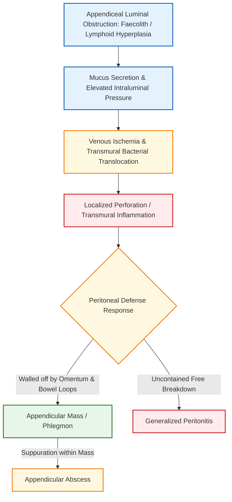

[[Appendix]]
# Appendicular Lump / Mass

**Mark-Weightage: 5 Marks**

## 1. Definition [⭐ High-Yield]

- An **appendicular mass (appendicular phlegmon)** is a localized inflammatory collection in the right iliac fossa (RIF) formed when an acutely inflamed or perforated appendix becomes walled off by the **greater omentum** and adjacent loops of small bowel or caecum.

## 2. Etiology / Causes / Risk Factors

- **Primary Initiating Event**: Acute appendicitis with localized microperforation or transmural ischemia that is successfully contained by host peritoneal defenses.
- **Causes of Luminal Obstruction**:
    - **Faecolith / Appendicolith**: Inspissated faecal matter, **calcium phosphates**, bacteria, and epithelial debris.
    - **Lymphoid Hyperplasia**: Narrowing of appendiceal lumen in young adults.
    - **Appendiceal Neoplasms**: **Low-grade Appendiceal Mucinous Neoplasm (LAMN)** or **Carcinoma of the Caecum** obstructing the appendiceal orifice, especially in patients aged **>40 years**.
- **Risk Factors for Mass Formation**:
    - Delay in patient presentation or clinical diagnosis.
    - Age **>40 years** (harbors a **29%** risk of underlying appendiceal neoplasm).
    - Immunosuppression or **diabetes mellitus**.

## 3. Classification

- **Appendiceal Inflammatory Mass Variants**:
    1. **Appendicular Phlegmon / Mass**: Non-suppurative inflammatory mass composed of matted omentum, bowel, and inflamed appendix.
    2. **Appendicular Abscess**: Localized suppurative breakdown within the phlegmon forming a frank pus collection.

## 4. Pathophysiology [⭐ High-Yield]

### Mechanism Sequence

- **Obstruction & Intraluminal Pressure**: Appendiceal luminal occlusion causes continued mucus accumulation and elevated intraluminal pressure.
- **Ischemia & Bacterial Translocation**: Impaired venous/lymphatic drainage leads to mucosal edema, ischemic necrosis, and transmural bacterial translocation.
- **Omental Wrapping & Containment**: The **greater omentum** ("policeman of the abdomen") and loops of terminal ileum adhere to the inflamed appendix, walling off peritoneal contamination to form an **appendicular mass**.

### FLOWCHART — PATHOPHYSIOLOGY OF APPENDICULAR MASS FORMATION



## 5. Clinical Features [⭐ High-Yield]

### Symptoms

- **Antecedent History of Appendicitis**: Colicky periumbilical pain that shifted to the **Right Iliac Fossa (RIF)** **2–5 days** prior.
- **Anorexia, Nausea, & Vomiting**: Classic **Murphy's sequence** following pain onset.
- **Low-Grade Fever**: Body temperature elevated to **37.2–38.5°C**.

### Signs

- **Palpable RIF Mass**: Smooth or ill-defined, tender, firm, fixed mass in the right iliac fossa.
- **McBurney's Tenderness**: Point of maximum tenderness localized over the mass or McBurney's point.
- **Muscle Guarding**: Involuntary muscular resistance overlying the RIF mass.
- **Eponymous Signs**: **Rovsing's sign**, **Psoas sign**, or **Obturator sign** may be elicited depending on appendiceal location.

## 6. Diagnosis / Investigations [⭐ High-Yield]

### Lab Findings

- **Full Blood Count (FBC)**: Leukocytosis (**>10,000/µL**) with neutrophilia ("shift to left").
- **C-Reactive Protein (CRP)**: Elevated; serial CRP measurements monitor response to conservative treatment.
- **Tumor Markers**: **CEA**, **CA 19-9**, and **CA-125** evaluated in patients aged **>40 years** to screen for underlying mucinous neoplasms.

### Imaging Modalities

- **Contrast-Enhanced CT (CECT) Scan**: Gold standard diagnostic tool (**~95% accuracy**); identifies thickened appendix (**>7 mm**), fat stranding, phlegmonous mass, or drainable fluid collections.
- **Ultrasound Abdomen / Pelvis**: First-line imaging in children and pregnant patients (**accuracy >90%**).
- **Colonoscopy**: Mandatory at **6–8 weeks** post-resolution in patients aged **>40 years** to rule out underlying **Carcinoma of the Caecum** or **LAMN**.

## 7. Differential Diagnosis — Lump in Right Iliac Fossa

|Feature|Appendicular Mass|Carcinoma of Caecum|Ileocaecal Tuberculosis|Crohn's Disease|
|:--|:--|:--|:--|:--|
|**Onset / Duration**|Acute (**2–5 days**)|Insidious (**months**)|Chronic (**months**)|Recurrent (**months–years**)|
|**Pain Character**|Initial Murphy's shift to RIF|Vague RIF discomfort|Postprandial RIF colic|Recurrent abdominal cramps|
|**Mass Characteristics**|Tender, firm, ill-defined mass|Hard, irregular, non-tender|Firm, "doughy" feel in RIF|Sausage-shaped doughy mass|
|**Diagnostic Gold Standard**|Contrast CECT scan|Colonoscopy + Biopsy|Barium follow-through / Biopsy|MRE / Colonoscopy + Biopsy|

## 8. Treatment / Management [⭐ High-Yield]

### Non-Pharmacological Management (Ochsner-Sherren Regime)

- **Rationale**: Based on the principle that inflammation is already localized; immediate surgery is technically difficult and risks damaging matted bowel or causing a faecal fistula.
- **Protocol**:
    1. **Strict NPO (Nil Per Os)** status with IV crystalloid resuscitation.
    2. **Monitoring**: 4-hourly recording of pulse rate and body temperature.
    3. **Skin Pencil Marking**: Mark the physical margins of the mass on the abdominal wall daily to monitor regression or expansion.
    4. **Fluid Balance**: Strict fluid intake and output charting.

### Pharmacological Management & Dosage Rule

- Broad-spectrum intravenous coverage against Gram-negative bacilli (_E. coli_) and anaerobes (_Bacteroides fragilis_).

|Drug|Dose|Route|Frequency|Duration|Key Caution|
|:--|:--|:--|:--|:--|:--|
|**Ceftriaxone**|**1–2 g**|IV|OD (q24h)|**5–7 days**|Monitor LFTs; check cephalosporin allergy|
|**Metronidazole**|**500 mg**|IV|TID (q8h)|**5–7 days**|Avoid alcohol; metallic taste, neuropathy|
|**Cefotaxime**|**1 g**|IV|BD/TID (q8-12h)|**5–7 days**|Adjust dose in severe renal failure|
|**Amoxicillin-Clavulanate**|**1.2 g**|IV|TID (q8h)|**5–7 days**|Risk of cholestatic jaundice; check pen-allergy|
|**Paracetamol**|**1 g**|IV|QID (q6h)|As needed|Max **4 g/day**; caution in hepatic impairment|

### Criteria for Stopping Conservative Treatment (Emergency Laparotomy)

- **A rising pulse rate**.
- **Increasing or spreading abdominal pain** / peritonitis.
- **Increasing size of the mass**.

### Abscess Drainage & Post-Resolution Workup

- **Abscess Drainage**: Localized fluid collections (**>5 cm**) managed with CT- or USG-guided percutaneous drainage.
- **Post-Resolution Protocol (At 6–8 Weeks)**:
    - Resolution occurs in **~90%** of patients.
    - **Patients >40 Years**: Mandatory follow-up **CECT/MRI scan** and **full colonoscopy** due to a **29%** incidence of underlying appendiceal neoplasms (e.g., **LAMN**).

### FLOWCHART — MANAGEMENT ALGORITHM FOR APPENDICULAR MASS

```
flowchart TD

classDef primary fill:#e3f2fd,stroke:#1565c0,stroke-width:2px
classDef danger fill:#ffebee,stroke:#c62828,stroke-width:2px
classDef success fill:#e8f5e9,stroke:#2e7d32,stroke-width:2px
classDef warning fill:#fff8e1,stroke:#f57f17,stroke-width:2px

A[Patient with RIF Appendicular Mass]:::primary --> B[Admit: NPO + IV Resuscitation + IV Ceftriaxone & Metronidazole]:::primary
B --> C[Mark Mass Margins with Skin Pencil + Baseline CECT Abdomen]:::warning
C --> D{Monitor Clinical Status & Mass Size}:::warning
D -->|Presence of Abscess >5 cm| E[CT- / USG-Guided Percutaneous Drainage]:::warning
D -->|Rising Pulse / Spreading Pain / Expanding Mass| F[Emergency Laparotomy / Surgical Intervention]:::danger
D -->|Mass Regresses & Symptoms Resolve (~90%)| G[Complete Antibiotic Course & Discharge]:::success
G --> H{Age Evaluation}:::warning
H -->|Age >40 Years| I[Mandatory 6-8 Wk Workup: Colonoscopy + Repeat CECT + CEA/CA19-9]:::warning
H -->|Age <40 Years| J[Interval Appendicectomy or Clinical Observation]:::success
I -->|Detection of LAMN / Caecal Carcinoma| K[Oncological Resection / Right Hemicolectomy]:::danger
I -->|Normal Workup| J
```

## 9. Complications

- **Appendicular Abscess**: Localized suppurative breakdown (**8%** overall).
- **Generalized Peritonitis**: Secondary to uncontained rupture of the phlegmon.
- **Faecal Fistula**: Secondary to erosion of appendiceal base or caecal wall.
- **Adhesive Intestinal Obstruction**: From dense inflammatory bowel adhesions.
- **Portal Pyaemia (Pylephlebitis)**: Septic thrombophlebitis of portal venous system.

## 10. Prognosis

- Conservative management with the Ochsner-Sherren regime successfully resolves the mass in **~90%** of cases.

## 11. Mnemonic & Memory Palace

### Mnemonic for Criteria to Stop Ochsner-Sherren Regime (P-A-M)

- **P**: **P**ulse rate rising (tachycardia)
- **A**: **A**bdominal pain increasing or spreading
- **M**: **M**ass increasing in size

### Memory Palace — "The Ochsner-Sherren Ward"

1. **Bed 1 (Skin Pencil Marking)**: A patient lies in bed with a bright blue **skin pencil line** drawn around a firm RIF mass, connected to IV **Ceftriaxone and Metronidazole**.
2. **Bed 2 (Abscess Drainage)**: A radiologist inserts a pigtail catheter under **CT guidance** into a fluid collection.
3. **Bed 3 (Failure Alarm - P-A-M)**: An alarm rings displaying a **rising pulse rate**, expanding blue pencil lines, and severe pain—triggering immediate transfer to the operating theater.
4. **Outpatient Clinic (6 Weeks Later)**: A 45-year-old patient undergoes **colonoscopy** and **CECT scan** to check for **LAMN**.

---

### Diagram Guide 1 : Ochsner-Sherren Mass Monitoring & Skin Pencil Marking

- **Type**: Labeled clinical abdominal diagram.
- **Outline Shape to Draw**: Anterior abdominal wall outline with umbilicus, ASIS, and pubic symphysis.
- **Labels in Order**:
    1. **Umbilicus** — Midline superior landmark.
    2. **Anterior Superior Iliac Spine (ASIS)** — Lateral bony landmark.
    3. **McBurney's Point** — Junction of outer 1/3 and inner 2/3 on line joining ASIS to umbilicus.
    4. **Solid Blue Line (Day 1)** — Outer physical contour of mass marked on admission.
    5. **Dotted Inner Line (Day 3)** — Regressing mass margin during successful conservative treatment.
- **Connections / Arrows**: Arrow showing inward regression vs arrow showing outward expansion (indicating failure of conservative regime).
- **Extra Mark Annotation**: "A rising pulse rate, expanding pencil margin, or spreading peritonitis mandates immediate abandonment of conservative treatment."

---

### Diagram Guide 2 : Anatomical Cross-Section of Appendicular Mass (Phlegmon)

- **Type**: Labeled anatomical cross-section.
- **Outline Shape to Draw**: Circular peritoneal cross-section in RIF.
- **Labels in Order**:
    1. **Central Inflamed Appendix** — Thickened appendix with central obstructing appendicolith.
    2. **Greater Omentum** — Adherent omental apron wrapping around the anterior border.
    3. **Coils of Terminal Ileum & Caecum** — Matted small bowel loops forming the posterior/medial borders.
    4. **Periappendiceal Fat Stranding** — Intense surrounding inflammatory changes.
- **Connections / Arrows**: Arrows indicating omental migration toward the inflamed antimesenteric appendiceal border.
- **Extra Mark Annotation**: "Inadvertent acute surgery on an appendicular mass is technically difficult and carries a high risk of faecal fistula formation."

---

### Clinical Pearl

- **Skin Pencil Border Charting**: Always mark the exact palpable outer margins of an appendicular mass with a skin pencil on admission. Re-evaluating these line boundaries twice daily provides the single most objective clinical indicator of whether the phlegmon is regressing under antibiotics or expanding into a surgical emergency.

### Exam Trap

- **Appendicular Mass vs. Carcinoma Caecum / LAMN in Patients >40 Years**:
    - **The Mix-up**: Both present as a mass in the right iliac fossa in middle-aged or elderly patients.
    - **Distinguishing Fact**: Up to **29%** of periappendicular masses/abscesses in patients aged **>40 years** harbor an underlying neoplasm (**LAMN** in **42%** of tumor cases). Never discharge a patient aged **>40 years** after mass resolution without mandatory **colonoscopy** and **repeat CECT scan** at **6–8 weeks**.

---

### Quick Revision

- An **appendicular mass** forms when an inflamed/perforated appendix is walled off by the greater omentum and adjacent bowel loops.
- First-line standard management is the conservative **Ochsner-Sherren regime** (NPO, IV fluids, IV **ceftriaxone + metronidazole**, 4-hourly vitals, and **skin pencil mass marking**).
- Criteria for stopping conservative treatment include **rising pulse rate**, **expanding mass size**, and **spreading peritonitis**.
- Conservative treatment resolves the mass in **~90%** of cases; abscess collections (**>5 cm**) require **CT-/USG-guided percutaneous drainage**.
- Post-resolution workup at **6–8 weeks** in patients **>40 years** MUST include **colonoscopy** and **repeat CECT scan** to exclude **caecal carcinoma** or **LAMN** (**29%** incidence).

### One-Line Exam Opener

- **An appendicular mass is a localized inflammatory phlegmon formed by the omental containment of acute appendicitis; it is managed primarily via the conservative Ochsner-Sherren regime, reserving emergency surgery for clinical deterioration and mandating 6–8 week colonoscopic and CT evaluation in patients aged >40 years to rule out underlying malignancy.**