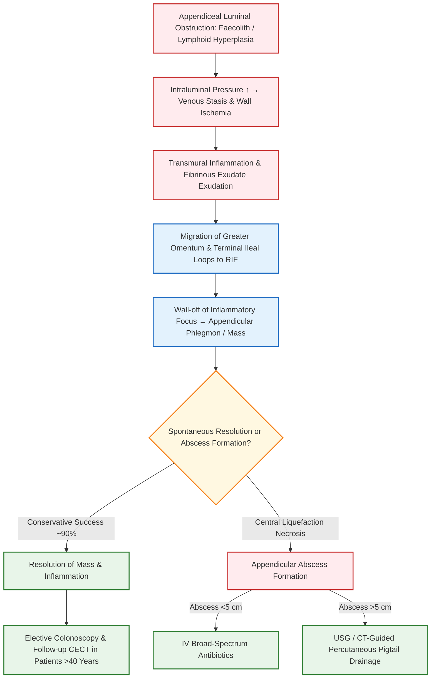

[[Appendix]]


## 1. Definition

An **appendicular mass (appendix mass)** is a localized inflammatory swelling in the right iliac fossa (RIF) that develops 3 to 5 days after an episode of acute appendicitis. It represents a protective physiological walling-off response, wherein the acutely inflamed or gangrenous vermiform appendix is completely enclosed by the **greater omentum** ("the abdominal policeman"), adherent loops of the terminal ileum, and the edematous cecal wall.

---

## 2. Etiology / Causes / Risk Factors [⭐ High-Yield]

### A. Primary Underlying Causes

- **Acute Obstructive Appendicitis:** Luminal occlusion by an **appendicolith (faecolith)**, lymphoid hyperplasia, or stricture, leading to ischemic necrosis and localized micro-perforation.
- **Delayed Presentation:** Presentation >48–72 hours after the onset of acute appendiceal inflammation allows time for protective omental wrapping.
- **Polymicrobial Infection:** Mixed aerobic and anaerobic colonic flora (predominantly _Escherichia coli_, _Bacteroides fragilis_, _Peptostreptococcus_, and _Pseudomonas_ species).

### B. Risk Factors & Predisposing Elements

- **Adult Age Group:** Well-developed greater omentum capable of migrating to and surrounding the site of peritoneal inflammation. (_In contrast, children <5 years have an underdeveloped omentum, predisposing them to diffuse peritonitis rather than mass formation_).
- **Anatomical Position:** Retrocecal or pelvic positions facilitate localized entrapment between the cecum, posterior abdominal wall, and pelvic peritoneum.
- **Prior Oral Antibiotic Use:** Inadequate or empirical outpatient antibiotic administration that partially treats ("mollifies") acute appendicitis, halting generalized spread but failing to resolve the primary focus.

---

## 3. Classification [⭐ High-Yield]

An appendicular mass represents a spectrum of localized periappendiceal pathology:

1. **Appendicular Phlegmon (Solid Mass):** A solid, non-liquefied inflammatory mass consisting of matted omentum, inflamed terminal ileal loops, cecum, and the edematous appendix without a frank pus collection.
2. **Appendicular Abscess:** Breakdown and central liquefaction necrosis within an appendix mass leading to a localized collection of pus (>5 cm or <5 cm) in the RIF, retrocecal space, or pelvis.

---

## 4. Pathophysiology (with Flowchart) [⭐ High-Yield]

1. **Luminal Obstruction & High Pressure:** Obstruction of the appendiceal lumen by a faecolith or lymphoid tissue causes continued mucus secretion, rising intraluminal pressure, and venous/lymphatic stasis.
2. **Ischemia & Bacterial Translocation:** Intraluminal bacterial overgrowth leads to transmural edema, wall ischemia, and bacterial translocation to the submucosa and serosa.
3. **Omental & Visceral Migration:** The greater omentum and adjacent loops of terminal ileum migrate toward the right iliac fossa, adhering to the inflamed serosa via sticky fibrin exudate.
4. **Localization of Sepsis:** The inflammatory process is walled off from the general peritoneal cavity, forming a localized phlegmon. If unresolved, central tissue necrosis occurs, progressing to an appendicular abscess.



---

## 5. Clinical Features

### A. Symptoms

- **Pain Shift History:** Classic history of initial dull, periumbilical colicky pain that shifted to the right iliac fossa 3–5 days prior, now persisting as a constant, dull, localized ache over a firm lump.
- **Systemic Symptoms:** Low-grade or swinging fever, malaise, lethargy, anorexia, and nausea.
- **Bowel & Urinary Disturbances:** Constipation or localized paralytic ileus; loose stools or tenesmus if the mass extends into the pelvis irritating the rectum; frequency of micturition if irritating the urinary bladder.

### B. Signs

- **Abdominal Examination:**
    - _Inspection:_ Mild fullness or asymmetry in the right iliac fossa.
    - _Palpation:_ A smooth or irregular, firm, tender, fixed or limited-mobility mass palpable in the right iliac fossa. Overlying muscle guarding and rebound tenderness are localized over the mass.
- **Vital Signs:** Mild pyrexia (37.5–38.5 °C) and moderate tachycardia (80–100 beats/min). High swinging fever with rigors (>38.5 °C) suggests abscess breakdown.
- **Digital Rectal Examination (DRE):** Tender, boggy swelling palpable on the right side of the rectovesical pouch or pouch of Douglas if the mass extends into the pelvis.

---

## 6. Diagnosis / Investigations [⭐ High-Yield]

### A. Laboratory Findings

- **Full Blood Count (FBC):** Leukocytosis (WBC 12,000–18,000/μL) with a neutrophilic "shift to the left".
- **C-Reactive Protein (CRP):** Significantly elevated; used for serial non-invasive monitoring of treatment response during conservative management.
- **Urinalysis:** May show microscopic hematuria or pyuria if the mass irritates the right ureter or bladder (excludes primary urinary tract infection).

### B. Imaging Modalities

- **Contrast-Enhanced Computed Tomography (CECT) Abdomen & Pelvis:** **Gold standard diagnostic modality**.
    - Confirms a phlegmonous periappendiceal mass or fluid collection (abscess).
    - Identifies radiopaque appendicoliths, cecal wall thickening, and mesenteric fat stranding.
    - Crucial for ruling out alternative pathologies such as cecal carcinoma, Crohn's disease, or low-grade appendiceal mucinous neoplasms (LAMNs).
- **Ultrasonography (USG) Abdomen & Pelvis:** First-line imaging in children and pregnant females; demonstrates a complex, hypoechoic mass in the RIF with loss of normal bowel architecture and localized fluid collection.

---

## 7. Differential Diagnosis

|Feature|Appendicular Mass|Cecal Carcinoma|Ileocecal Tuberculosis|Crohn's Disease (Ileitis)|Amoeboma|
|:--|:--|:--|:--|:--|:--|
|**History**|Acute onset (3–5 days) following classic appendiceal pain|Chronic, insidious (months); weight loss, weakness|Chronic history of night sweats, fever, cough|Recurrent cramping pain, chronic diarrhea, weight loss|History of blood-stained mucoid diarrhea in endemic area|
|**Mass Characteristics**|Tender, firm, ill-defined in RIF|Non-tender, hard, nodular mass in RIF|Firm, slightly tender, doughy RIF mass|Tender, sausage-shaped, doughy mass in RIF|Smooth, moderately tender mass in RIF|
|**Bowel Habits**|Constipation or mild diarrhea|Altered bowel habit / anemia|Diarrhea alternating with constipation|Recurrent watery diarrhea|Chronic mucoid bloody diarrhea|
|**Laboratory / Imaging**|Leukocytosis, elevated CRP, CECT shows phlegmon/fat stranding|Microcytic anemia, CECT shows irregular cecal wall mass|Mantoux test +, Chest X-ray lesions, CECT shows pulled-up cecum|Skip lesions, cobblestoning, transmural thickening on CECT|Stool microscopy positive for _E. histolytica_trophozoites|
|**Primary Management**|Conservative Ochsner-Sherren Regimen|Right Hemicolectomy|Anti-Tubercular Therapy (ATT) for 6 months|Biologicals (Infliximab), Steroids, Mesalamine|Anti-amoebic therapy (Metronidazole)|

---

## 8. Treatment / Management (Ochsner–Sherren Regimen) [⭐ High-Yield]

### A. The ==Ochsner–Sherren Regimen== (Conservative Non-Operative Strategy)

The standard treatment for an uncomplicated appendix mass is the conservative **Ochsner–Sherren regimen**.

- **Rationale:** The inflammatory process is already localized. Emergency operative intervention during the acute phase is technically difficult and dangerous; attempting to break down adhesions carries a high risk of iatrogenic small bowel injury, uncontrollable hemorrhage, breakdown of the edematous cecal wall, and **enterocutaneous / fecal fistula formation**.
- **Success Rate:** Approximately **90%** of cases resolve successfully without operative intervention.

#### **Protocol Steps:**

1. **Hospital Admission & Bed Rest:** Complete bed rest in a monitored surgical ward.
2. **Abdominal Skin Marking:** The outline of the palpable mass is carefully marked on the anterior abdominal wall using a skin pencil to monitor daily changes in size.
3. **Dietary Restriction & IV Fluids:** Strict NPO (Nil Per Os) initially, transitioning to clear fluids as signs improve. Intravenous isotonic saline (0.9% Normal Saline with Dextrose) to maintain urine output >30 mL/h.
4. **Vital Signs & Temperature Charting:** 4-hourly recording of pulse rate, blood pressure, and body temperature.
5. **Serial Abdominal Examinations:** Daily palpation by the same senior surgical examiner to monitor mass size and abdominal tenderness.
6. **Serial Laboratory Monitoring:** Weekly or bi-weekly CRP and white cell count measurements.
7. **Intravenous Antibiotic Therapy:** Broad-spectrum IV coverage targeting Gram-negative and anaerobic bacteria.

#### **Criteria for Stopping Conservative Treatment (Indications for Emergency Laparotomy) [⭐ High-Yield]:**

- **A rising pulse rate** (tachycardia).
- **Increasing or spreading abdominal pain** / signs of generalized peritonitis.
- **Increasing size of the mass**.
- **High swinging pyrexia with rigors** (indicates abscess transformation).

---

### B. Drug Protocols (Dosage Rule)

```
========================================================================================================================
DRUG 1: CEFTRIAXONE (3rd Generation Cephalosporin)
------------------------------------------------------------------------------------------------------------------------
• Name: Ceftriaxone
• Mechanism of Action: Bactericidal inhibition of bacterial cell wall peptidoglycan synthesis via binding to penicillin-
  binding proteins (PBPs), targeting Gram-negative colonic bacilli (E. coli, Klebsiella) (p. 64, 1343).
• Dose: 1–2 g IV.
• Route: Intravenous (IV).
• Frequency: Once daily (or 1 g IV every 12 hours in severe sepsis).
• Features: High tissue penetration; mainstay of parenteral empirical coverage in acute periappendiceal sepsis.
• Side Effects: Hypersensitivity reactions, biliary sludging, pseudomembranous colitis, diarrhea.
• When to Start / Stop: Initiate immediately upon admission for Ochsner-Sherren regimen; continue for 5–7 days until
  afebrile and mass regresses.
========================================================================================================================

========================================================================================================================
DRUG 2: METRONIDAZOLE (Nitroimidazole Anti-anaerobe)
------------------------------------------------------------------------------------------------------------------------
• Name: Metronidazole
• Mechanism of Action: Univalent reduction of its nitro group in anaerobic bacteria generates toxic cytotoxic intermediates
  that disrupt bacterial DNA chains, targeting Bacteroides fragilis and anaerobic cocci (p. 65, 1343).
• Dose: 500 mg IV (or 400 mg oral).
• Route: Intravenous (IV) infusion / Oral.
• Frequency: Every 8 hours (TDS).
• Features: Essential anti-anaerobic component in intra-abdominal abscesses and peritonitis.
• Side Effects: Metallic taste, disulfiram-like reaction with alcohol, peripheral neuropathy, nausea.
• When to Start / Stop: Start concurrently with Ceftriaxone on admission; transition to oral route once patient tolerates
  oral feeds, completing a 7–10 day total course.
========================================================================================================================
```

---

### C. Management of Appendicular Abscess & Subsequent Follow-Up

1. **Appendicular Abscess Formation:**
    - _Abscess <5 cm:_ Managed conservatively with IV broad-spectrum antibiotics.
    - _Abscess >5 cm:_ **Image-guided (USG or CT) percutaneous pigtail catheter drainage** combined with IV antibiotics.
2. **Role of Interval Appendicectomy & Malignancy Screening [⭐ High-Yield]:**
    - Routine interval appendicectomy (6–8 weeks post-resolution) is **no longer universally mandated** in all young, asymptomatic patients because recurrence rates are <10–15%.
    - **Mandatory Rule for Patients >40 Years:** Patients >40 years who present with an appendix mass or abscess must undergo **follow-up CECT / MRI at 6–8 weeks** and a **full colonoscopy**.
    - _Rationale:_ Clinical trials show up to **29% of patients >40 years** presenting with periappendicular abscess harbor an underlying appendiceal neoplasm (42% being **Low-grade Appendiceal Mucinous Neoplasms - LAMNs**) or cecal carcinoma.

---

## 9. Complications

- **Appendicular Abscess Formation:** Central liquefaction requiring percutaneous drainage.
- **Generalized Peritonitis:** Spontaneous rupture of the walled-off mass into the greater peritoneal cavity.
- **Portal Pyaemia (Pylephlebitis):** Septic thrombophlebitis of the portal venous system causing high fever, rigors, jaundice, and multiple intrahepatic liver abscesses.
- **Adhesional Small Bowel Obstruction:** Kinking or trapping of small bowel loops within periappendiceal fibrous adhesions.
- **Fecal / Enterocutaneous Fistula:** Complication of premature surgical exploration or erosion into adjacent bowel/skin.
- **Unrecognized Appendiceal / Cecal Malignancy:** Missed diagnosis of LAMN, carcinoid, or cecal adenocarcinoma.

---

## 10. Prognosis

With the Ochsner–Sherren conservative protocol, **~90% of patients recover without surgical intervention**. Mortality is <1% in uncomplicated cases, but increases in elderly patients with delayed presentation or secondary generalized peritonitis.

---

## 11. Clinical Pearl

Premature emergency surgical exploration of an established **appendicular mass** is a major surgical blunder. Attempting to dissect matted, friable bowel loops and omentum to locate the appendix in a hyperemic, infected field almost inevitably results in enterotomy, uncontrollable bleeding, or a **fecal fistula**. Always adhere to the **Ochsner-Sherren conservative regimen** with IV antibiotics; reserve emergency surgery strictly for patients who display clinical deterioration or signs of spreading peritonitis.

---

## 12. Exam Trap

### Exam Trap

- **The Mix-Up:** Assuming that every patient with an appendix mass who recovers under conservative management should simply be discharged with no further workup.
- **Distinguishing Fact:**
    - In patients **<40 years**, simple clinical follow-up is acceptable.
    - In patients **>40 years**, an appendix mass or periappendiceal collection can be the primary presentation of an underlying **cecal carcinoma** or **Low-grade Appendiceal Mucinous Neoplasm (LAMN)**. Therefore, **colonoscopy and follow-up CECT scan at 6–8 weeks are MANDATORY** to exclude malignancy before declaring the patient fully treated.

---

## 13. Diagram Guides

### Diagram 1: Anatomical Components of an Appendicular Mass

(Reference in text: "See Diagram 1")

- **Type:** Labeled cross-sectional anatomical schematic.
- **Outline shape to draw:** Circular/oval RIF peritoneal cavity with central inflamed appendix surrounded by adhering visceral structures.
- **Labels in order:**
    1. _Central Core:_ Inflamed / gangrenous vermiform appendix with appendicolith.
    2. _Anterior Layer:_ Wrapped Greater Omentum ("abdominal policeman").
    3. _Medial Boundary:_ Adherent loops of terminal ileum bound by fibrin exudate.
    4. _Lateral Boundary:_ Edematous Cecum and ascending colon.
- **Arrows/connections:** Omentum + Terminal Ileum + Cecum → Fibrinous Adhesion → Walled-off Appendicular Mass.
- **Extra-Mark Annotation:** _"The greater omentum walls off infection, converting diffuse peritonitis into a localized phlegmon."_

### Diagram 2: Ochsner–Sherren Monitoring Grid

(Reference in text: "See Diagram 2")

- **Type:** Clinical abdominal wall monitoring diagram.
- **Outline shape to draw:** Quadrants of anterior abdominal wall centered around umbilicus and right anterior superior iliac spine (ASIS).
- **Labels in order:**
    1. _McBurney's Point:_ Base of appendix position.
    2. _Skin Pencil Line:_ Drawn margin of palpable mass in RIF.
    3. _Date & Time Stamp:_ Written beside skin line to track daily regression or enlargement.
- **Arrows/connections:** Shrinking skin line → Response to conservative therapy; Expanding skin line → Trigger for emergency surgery.
- **Extra-Mark Annotation:** _"Marking the mass margin daily with a skin pencil is essential to detect progressive enlargement."_

---

## 14. Mnemonic / Memory Palace

### Mnemonic: O-C-H-S-N-E-R

(Stopping Criteria for Ochsner–Sherren Regimen / Indications for Emergency Laparotomy)

- **O** – **O**verwhelming spreading abdominal pain / Peritonitis
- **C** – **C**ontinuous rising pulse rate (Tachycardia)
- **H** – **H**igh swinging pyrexia with rigors (>38.5 °C)
- **S** – **S**ize of mass increasing on daily skin pencil tracking
- **N** – **N**ausea & persistent vomiting (Intestinal obstruction)
- **E** – **E**xpanding local rebound tenderness & guarding
- **R** – **R**efractory shock or clinical deterioration

---

### Quick Revision

- **Definition:** Localized RIF swelling forming 3–5 days post-appendicitis, comprising inflamed appendix walled off by greater omentum, terminal ileum, and cecum.
- **Ochsner–Sherren Regimen:** Conservative management (NPO, IV fluids, skin pencil marking, 4-hourly vitals, IV Ceftriaxone + Metronidazole); successful in ~90% of cases.
- **Stopping Criteria:** Rising pulse rate, increasing mass size, spreading peritonitis, high swinging fever → perform emergency laparotomy.
- **Abscess Management:** <5 cm = IV antibiotics; >5 cm = USG/CT-guided percutaneous pigtail catheter drainage.
- **Malignancy Rule:** Patients >40 years MUST undergo colonoscopy and CECT at 6–8 weeks to exclude cecal carcinoma or LAMN (present in up to 29%).

---

### One-Line Exam Opener

"An appendicular mass is a protective periappendiceal inflammatory phlegmon formed by the greater omentum and adjacent bowel loops walling off an acutely inflamed appendix, managed conservatively via the Ochsner–Sherren regimen with strict criteria for operative intervention."

---

💡 **Next Step:** Would you like to review the step-by-step surgical techniques for **Laparoscopic vs Open Appendicectomy**, or explore the classification and management of **Appendiceal Neoplasms and Pseudomyxoma Peritonei (PMP)**?