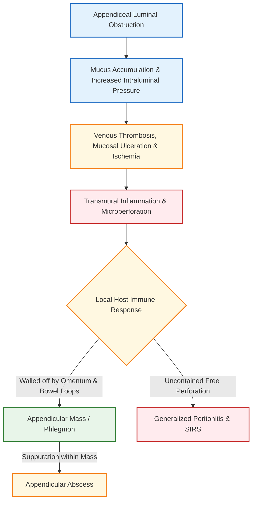
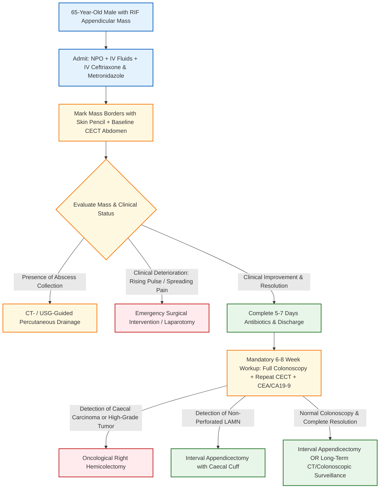

[[C47-Appendix]]
# Differential Diagnosis of Lump in Right Iliac Fossa, Clinical Features of Acute Appendicitis & Management of Appendicular Mass in Elderly

**Mark-Weightage: 10 Marks / Long Answer (Defaulted as not specified)**

## 1. Definition [⭐ High-Yield]

- **Acute Appendicitis**: Acute inflammation of the vermiform appendix, primarily initiated by luminal obstruction followed by bacterial invasion, ischemic necrosis, and potential perforation.
- **Appendicular Mass**: A localized inflammatory collection in the right iliac fossa (RIF) formed when the inflamed or perforated appendix is adherent to and walled off by the greater omentum and adjacent loops of small bowel/caecum.

## 2. Etiology / Causes / Risk Factors

- **Causes of Appendiceal Luminal Obstruction**:
    1. **Faecolith / Appendicolith**: Most common cause in adults; composed of inspissated faeces, calcium phosphate, and bacterial debris.
    2. **Lymphoid Hyperplasia**: Most common cause in children and young adults, secondary to viral infections.
    3. **Appendiceal / Caecal Neoplasms**: Carcinoma of the caecum or primary appendiceal tumors (e.g., **Low-grade Appendiceal Mucinous Neoplasm [LAMN]**), especially in patients aged **>40 years**.
    4. **Fibrotic Strictures**: Secondary to previous subacute appendicitis.
    5. **Intestinal Parasites**: _Enterobius vermicularis_ (**pinworm**) or _Ascaris lumbricoides_.
- **Risk Factors for Perforation & Mass Formation**:
    - **Age >40–65 years** (delay in presentation, higher incidence of underlying neoplasms).
    - **Diabetes mellitus** and **immunosuppression**.
    - **Obstructing faecolith** or **pelvic appendix position**.

## 3. Classification

- **Classification of Lump in Right Iliac Fossa (Anatomical / Pathological)**:
    1. **Appendiceal Origin**: Appendicular mass (phlegmon), appendicular abscess, primary appendiceal neoplasm (**LAMN**, **HAMN**, **carcinoid / NET**).
    2. **Bowel / Gastrointestinal Origin**: Carcinoma of the caecum, Ileocaecal Tuberculosis, Crohn's disease (Regional enteritis), Amoeboma, Intussusception.
    3. **Lymphatic / Mesenteric Origin**: Mesenteric adenitis, Tuberculous mesenteric lymphadenitis, Mesenteric cyst.
    4. **Retroperitoneal / Musculoskeletal Origin**: Psoas abscess, Iliac lymphadenitis, Retroperitoneal sarcoma.
    5. **Gynaecological Origin (in females)**: Tubo-ovarian abscess, Ovarian cyst/mass, Ectopic pregnancy, Endometriosis.

## 4. Pathophysiology [⭐ High-Yield]

### Mechanism of Appendicular Mass Formation

- Luminal obstruction leads to mucus accumulation and elevated intraluminal pressure.
- Obstruction of lymphatic and venous drainage causes mucosal ischemia and transmural bacterial translocation.
- Microperforation or localized gangrene triggers an intense local inflammatory exudate.
- The **greater omentum** ("policeman of the abdomen") and loops of terminal ileum migrate to wrap around the inflamed appendix, forming a contained inflammatory phlegmon (**appendicular mass**).
- If necrosis continues within the phlegmon without localized breakdown, an **appendicular abscess** ensues.

### FLOWCHART — PATHOPHYSIOLOGY OF APPENDICULAR MASS FORMATION

## 5. Clinical Features of Acute Appendicitis [⭐ High-Yield]

### Symptoms

- **Murphy's Classic Sequence**:
    1. **Periumbilical Colicky Pain**: Poorly localized midgut visceral pain (**T10 dermatome**).
    2. **Anorexia & Nausea**: Constant features; refusal of food in children.
    3. **Vomiting**: 1–2 episodes following the onset of pain.
- **Somatic Pain Shift**:
    - After **6–12 hours**, pain shifts and localizes to the **Right Iliac Fossa (RIF)** due to parietal peritoneal inflammation.
    - Pain becomes constant, sharp, and exacerbated by coughing, walking, or sudden movement.
- **Symptom Variations by Appendix Position**:
    - **Retrocaecal (74%)**: Loin pain, dysuria, minimal anterior abdominal pain ("silent appendix").
    - **Pelvic (21%)**: Suprapubic pain, tenesmus, diarrhea, urinary frequency.
    - **Postileal (0.5%)**: Diarrhea, marked retching, ill-defined periumbilical tenderness.

### Signs

- **General Assessment**: Unwell appearance, low-grade pyrexia (**37.2–37.7°C**), mild tachycardia (**80–90 bpm**).
- **Abdominal Inspection**: Limitation of respiratory movement in the lower abdomen.
- **Pointing Sign**: Patient points with one finger first to the umbilicus and then to the RIF.
- **McBurney's Point Tenderness**: Maximum tenderness at **McBurney's point** (junction of outer **1/3** and inner **2/3** of line joining ASIS to umbilicus).
- **Guarding & Rigidity**: Involuntary contraction of RIF abdominal wall muscles.
- **Rebound Tenderness**: Pain on sudden release of deep pressure or light percussion over RIF.
- **Eponymous Clinical Signs**:
    1. **Rovsing's Sign**: Deep pressure in Left Iliac Fossa (LIF) produces pain in RIF.
    2. **Psoas Sign**: Pain on passive hyperextension of right hip (indicates retrocaecal appendix irritating psoas muscle).
    3. **Obturator Sign (Zachary Cope)**: Pain on flexed right hip internal rotation (indicates pelvic appendix irritating obturator internus).
    4. **Digital Rectal Examination**: Localized tenderness in the right rectovesical pouch / pouch of Douglas.

## 6. Diagnosis / Investigations

### Lab Findings

- **Full Blood Count**: Leukocytosis (**10,000–18,000/µL**) with neutrophilia ("shift to left").
- **C-Reactive Protein (CRP)**: Elevated CRP supports active inflammation.
- **Urinalysis**: Performed routinely to exclude UTI; microscopic hematuria/pyuria can occur if bladder is irritated.
- **Serum CEA, CA 19-9, CA-125**: Indicated in elderly patients (**>40–65 years**) with RIF mass to screen for appendiceal/caecal neoplasms.

### Imaging Modalities

- **Contrast-Enhanced CT Scan (Abdomen & Pelvis)**:
    - Gold standard investigation in adults and elderly.
    - **Findings**: Thickened appendix (**>7 mm**), fat stranding, cecal pole thickening, appendicolith, or localized fluid collection/mass.
    - In a **65-year-old male**, CT is critical to distinguish an appendicular mass from **Carcinoma of the Caecum** or **LAMN**.
- **Ultrasound Abdomen / Pelvis**: Tubular non-compressible structure (**>6 mm**) with hyperechoic fat.

### Diagnostic Criteria / Scoring Systems

- **Alvarado (MANTRELS) Score Table**:

|Feature Category|Clinical Finding|Assigned Points|
|:--|:--|:--|
|**Symptoms**|Migratory RIF Pain|**1**|
||Anorexia|**1**|
||Nausea / Vomiting|**1**|
|**Signs**|Tenderness in RIF|**2**|
||Rebound Tenderness|**1**|
||Elevated Temperature (**>37.3°C**)|**1**|
|**Laboratory**|Leukocytosis (**>10,000/µL**)|**2**|
||Shift to Left (Neutrophilia)|**1**|
|**Total Score**||**10**|

- **Score Interpretation**: **1–4**: Unlikely; **5–6**: Equivocal (CT required); **7–10**: Highly predictive of acute appendicitis.

## 7. Differential Diagnosis — Lump in Right Iliac Fossa [⭐ High-Yield]

|Clinical Feature|Appendicular Mass|Carcinoma of Caecum|Ileocaecal Tuberculosis|Crohn's Disease (Regional Enteritis)|Amoeboma|Psoas Abscess|
|:--|:--|:--|:--|:--|:--|:--|
|**Typical Age**|Any age (peak **10–30 yrs**)|Elderly (**>50–65 yrs**)|Young adults (**20–40 yrs**)|Young adults (**15–35 yrs**)|Adults in endemic regions|Any age (secondary to TB/Crohn's)|
|**Onset & Duration**|Acute onset (**2–5 days**)|Insidious (**months**)|Chronic/subacute (**months**)|Chronic recurrent (**months–yrs**)|Chronic/subacute|Insidious|
|**Pain & Bowel Symptoms**|Initial Murphy's triad, persistent RIF tenderness|Vague discomfort, progressive iron-deficiency anemia|Postprandial colic, "ball of wind & gurgle" in RIF|Recurrent abdominal cramps, episodic diarrhea|Chronic blood-stained mucoid diarrhea|Back / loin pain, fixed hip flexion|
|**Physical Mass Features**|Smooth or ill-defined, tender, firm, fixed mass|Hard, irregular, nodular, non-tender mass|Firm/doughy mass, localized ascites|Thickened "doughy" sausage-shaped mass|Tender firm mass in RIF|Soft/fluctuant mass tracking under inguinal ligament|
|**Systemic Signs**|Low-grade fever (**37.2–37.7°C**), leukocytosis|Cachexia, severe anemia, weight loss|Evening pyrexia, night sweats, weight loss|Low-grade fever, weight loss, perianal fistulae|Low-grade fever, malnutrition|Hectic fever, rigors, loss of weight|
|**Diagnostic Gold Standard**|Contrast CT scan (**periappendiceal mass**)|Colonoscopy + Biopsy; CECT scan|Colonoscopy + Biopsy; Barium follow-through|Colonoscopy + Biopsy; CT enterography|Stool microscopy / serology; Colonoscopy biopsy|CECT Abdomen & Spine|

## 8. Treatment / Management of a 65-Year-Old Male Patient with Appendicular Mass [⭐ High-Yield]

### Clinical Context & Mandatory High-Yield Rule for Elderly Patients

- In a **65-year-old male**, an appendicular mass MUST be approached with high suspicion for underlying malignancy (**Carcinoma of the Caecum**, **Low-grade Appendiceal Mucinous Neoplasm [LAMN]**, or **Appendiceal Adenocarcinoma**).
- Recent randomized trials demonstrate that up to **29%** of patients aged **>40 years** presenting with periappendicular mass/abscess have an underlying appendiceal or caecal neoplasm (with **LAMN** accounting for **42%** of these).

### Phase 1: Conservative Management (Ochsner-Sherren Regime)

- **Indication**: Patient is hemodynamically stable without features of generalized peritonitis.
- **Non-Pharmacological Protocol**:
    1. **Strict NPO (Nil Per Os)** with IV crystalloid fluid resuscitation.
    2. **Monitoring**: 4-hourly pulse, blood pressure, and temperature recording.
    3. **Abdominal Charting**: Outline the physical boundaries of the RIF mass on the abdominal wall using a **skin pencil** to monitor daily regression or expansion.
    4. **Fluid Balance**: Strict intake and output charting.
- **Pharmacological Protocol & Dosage Table**:

|Drug|Dose|Route|Frequency|Duration|Key Caution|
|:--|:--|:--|:--|:--|:--|
|**Ceftriaxone**|**1–2 g**|IV|OD (q24h)|**5–7 days**|Monitor LFTs; check cephalosporin allergy|
|**Metronidazole**|**500 mg**|IV|TID (q8h)|**5–7 days**|Avoid alcohol; caution in hepatic impairment|
|**Cefotaxime**|**1 g**|IV|BD/TID (q8-12h)|**5–7 days**|Dosage adjustment in severe renal failure|
|**Amoxicillin-Clavulanate**|**1.2 g**|IV|TID (q8h)|**5–7 days**|Risk of cholestatic jaundice; check penicillin allergy|
|**Paracetamol**|**1 g**|IV|QID (q6h)|As needed|Maximum **4 g/day**; caution in liver dysfunction|

- **Imaging & Abscess Management**:
    - Urgent **Contrast-Enhanced CT (CECT) Scan**: To map the mass and exclude a drainable abscess.
    - If a fluid collection/abscess is present: Perform **radiological percutaneous CT- / USG-guided drainage**.

### Criteria for Abandoning Conservative Treatment (Emergency Laparotomy)

- **Rising pulse rate**.
- **Increasing or spreading abdominal pain** / development of generalized peritonitis.
- **Increasing size of the mass**.
- **Persistent vomiting or intestinal obstruction**.

### Phase 2: Mandatory Post-Resolution Diagnostic Workup (At 6–8 Weeks)

- In a **65-year-old male**, clinical resolution of the mass (**occurring in ~90% of cases**) MUST be followed by mandatory diagnostic evaluation at **6–8 weeks**:
    1. **Full Colonoscopy**: Mandatory to directly visualize the caecum and ileocaecal valve to exclude **Carcinoma of the Caecum**.
    2. **Repeat Contrast CT / MRI Abdomen & Pelvis**: Essential to confirm complete resolution and rule out occult appendiceal tumors (**LAMN**, **HAMN**, or **mucinous adenocarcinoma**).
    3. **Tumor Markers**: Check **CEA**, **CA 19-9**, and **CA-125**.

### Phase 3: Surgical Decision-Making

- **If Malignancy / Carcinoma Caecum / HAMN Is Confirmed**: Proceed directly to **Oncological Right Hemicolectomy** with formal D2 lymphadenectomy.
- **If Low-Grade Appendiceal Mucinous Neoplasm (LAMN) Without Perforation**: Perform **Interval Appendicectomy** with clear caecal cuff margins.
- **If Completely Benign / Resolved**: Offer **Interval Appendicectomy** or long-term surveillance with annual CECT and colonoscopy.

### FLOWCHART — MANAGEMENT ALGORITHM FOR APPENDICULAR MASS IN A 65-YEAR-OLD MALE

## 9. Complications

- **Abscess Formation**: Pelvic, paracaecal, or subphrenic abscess formation (**8%** overall, up to **30%** in perforated cases).
- **Faecal Fistula**: Secondary to erosion of caecal wall or appendiceal base necrosis.
- **Pseudomyxoma Peritonei (PMP)**: Caused by rupture of an unrecognized mucinous appendiceal neoplasm (**LAMN**), leading to mucinous ascites and omental cake.
- **Intestinal Obstruction**: Adhesive small bowel obstruction secondary to dense inflammatory adhesions.
- **Portal Pyaemia (Pylephlebitis)**: Septic thrombophlebitis of the portal venous system causing fever, rigors, and liver abscesses.

## 10. Prognosis

- Conservative resolution of appendicular mass occurs in **~90%** of patients.
- In elderly patients (**>60–65 years**), overall prognosis depends heavily on excluding underlying caecal/appendiceal neoplasms during follow-up.

## 11. Mnemonic & Memory Palace

### Mnemonic for Alvarado Diagnostic Score (MANTRELS)

- **M**: **M**igratory RIF pain (**1 point**)
- **A**: **A**norexia (**1 point**)
- **N**: **N**ausea / Vomiting (**1 point**)
- **T**: **T**enderness in RIF (**2 points**)
- **R**: **R**ebound tenderness (**1 point**)
- **E**: **E**levated temperature (**1 point**)
- **L**: **L**eukocytosis (**>10,000/µL**) (**2 points**)
- **S**: **S**hift to left (Neutrophilia) (**1 point**)

### Memory Palace — "The Geriatric Surgical Ward" (65-Year-Old Appendicular Mass Protocol)

1. **Bed 1 (Initial Admission)**: A **65-year-old male** lies in bed with a blue **skin pencil line** drawn around his right lower abdomen, receiving IV **Ceftriaxone and Metronidazole** bags.
2. **Bed 2 (CT & Drainage Station)**: A radiologist inserts a drainage needle into a fluid collection under **CT guidance**.
3. **Bed 3 (Alarm Bell - Failure Criteria)**: An alarm rings displaying a **rising pulse rate**, expanding pencil lines, and severe pain—triggering immediate transfer to the operating theater.
4. **Outpatient Clinic (6-8 Weeks Later)**: A colonoscope camera inspects the caecum alongside a CT scan screen searching for **Carcinoma of the Caecum** and **LAMN**.

---

### Diagram Guide 1 : Differential Diagnosis Map of Lump in Right Iliac Fossa

- **Type**: Schematic anatomical quadrant layout.
- **Outline Shape to Draw**: Quadrant grid representing the Right Iliac Fossa bounded by the umbilicus, ASIS, and inguinal ligament.
- **Labels in Order**:
    1. **Appendicular Mass / Abscess** — Central smooth/tender mass at McBurney's point.
    2. **Carcinoma of Caecum** — Lateral hard, nodular, non-tender mass in elderly.
    3. **Ileocaecal Tuberculosis** — Medial firm mass with "doughy" abdomen and thickened ileum.
    4. **Crohn's Disease** — Sausage-shaped mass in terminal ileum with fistulae.
    5. **Psoas Abscess** — Deep posterior mass tracking beneath the inguinal ligament.
    6. **Amoeboma** — Caecal mass with history of dysentery.
- **Connections / Arrows**: Arrows connecting organ structures (Appendix, Caecum, Terminal Ileum, Retroperitoneum) to their respective lump pathology.
- **Extra Mark Annotation**: "In patients aged >40–65 years, any persistent RIF mass must be evaluated for caecal carcinoma or appendiceal mucinous neoplasm (LAMN)."

---

### Diagram Guide 2 : Ochsner-Sherren Mass Monitoring & Skin Pencil Marking

- **Type**: Labeled clinical abdominal inspection diagram.
- **Outline Shape to Draw**: Anterior abdominal wall outline showing umbilicus, iliac crests, and pubic symphysis.
- **Labels in Order**:
    1. **Umbilicus** — Superior midline landmark.
    2. **Anterior Superior Iliac Spine (ASIS)** — Lateral anatomical landmark.
    3. **McBurney's Point** — Outer 1/3 and inner 2/3 junction.
    4. **Skin Pencil Contour Line** — Concentric solid line drawn around the palpable mass margin on Day 1.
    5. **Day 3 Regressional Line** — Dotted inner line showing shrinking mass size during successful Ochsner-Sherren regime.
- **Connections / Arrows**: Arrow showing regression of mass inward vs arrow showing outward expansion (indicating failure of conservative treatment).
- **Extra Mark Annotation**: "A rising pulse rate, spreading abdominal pain, or expanding skin pencil margin mandates immediate abandonment of conservative treatment."

---

### Clinical Pearl

- **The "29% Rule" in Elderly Appendicular Mass**: Never assume an appendicular mass in a patient aged **>40–65 years** is purely inflammatory. Up to **29%** of periappendicular masses/abscesses in this age group harbor an underlying appendiceal or caecal neoplasm (most commonly **LAMN** or **Caecal Adenocarcinoma**). Always schedule a mandatory **colonoscopy** and **repeat CECT scan** at **6–8 weeks** post-resolution.

### Exam Trap

- **Appendicular Mass vs. Carcinoma Caecum in the Elderly**:
    - **The Mix-up**: Both present as a mass in the right iliac fossa in elderly patients with anemia and fever.
    - **Distinguishing Fact**: Appendicular mass has an **acute onset (2–5 days)** with initial migratory pain, high inflammatory markers, and tender smooth margins that regress under antibiotics. Carcinoma caecum has an **insidious onset (months)** with progressive iron-deficiency anemia, altered bowel habits, and a hard, nodular, non-tender mass confirmed on colonoscopy biopsy.

---

### Quick Revision

- Differential diagnosis of RIF lump includes **appendicular mass**, **carcinoma caecum**, **ileocaecal TB**, **Crohn's disease**, **amoeboma**, and **psoas abscess**.
- Acute appendicitis presents classically with **Murphy's triad** (migratory periumbilical pain, anorexia/nausea, vomiting), **McBurney's tenderness**, **guarding**, **rebound tenderness**, and **Rovsing's/Psoas/Obturator signs**.
- Management of an appendicular mass in a **65-year-old male** begins with the conservative **Ochsner-Sherren regime** (NPO, IV fluids, IV **ceftriaxone + metronidazole**, 4-hourly pulse/temp monitoring, and **skin pencil marking**).
- Criteria for stopping conservative treatment include **rising pulse rate**, **expanding mass**, and **spreading peritonitis**.
- Mandatory post-resolution workup at **6–8 weeks** for a 65-year-old male includes **full colonoscopy** and **repeat CECT scan** to rule out underlying **carcinoma of the caecum** or **LAMN (29% incidence)**.

### One-Line Exam Opener

- **A lump in the right iliac fossa requires systematic exclusion of inflammatory, infective, and neoplastic etiologies; in a 65-year-old male presenting with an appendicular mass, initial management relies on the conservative Ochsner-Sherren regime followed by mandatory colonoscopy and CT evaluation at 6–8 weeks to rule out underlying caecal carcinoma or appendiceal neoplasm.**