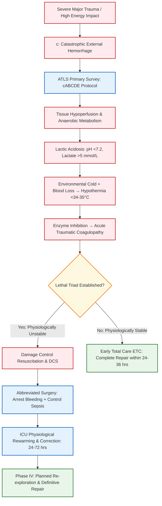

# Classification of Wounds and Principles of Management of a Severely Injured Person

## 1. Definition

A **wound** is defined as a disruption of the normal anatomical continuity and functional integrity of living skin or tissue, resulting from physical, mechanical, thermal, chemical, or biological energy transfer.

**Major Trauma / Severe Injury** is defined as physical injury to one or more body systems resulting in an **Injury Severity Score (ISS) >15**. The management of a severely injured person involves a time-critical, multidisciplinary, and systematic approach aimed at arresting catastrophic hemorrhage, securing vital functions via Advanced Trauma Life Support (ATLS) principles, avoiding the "lethal triad" of trauma, and restoring physiological stability.

---

## 2. Etiology / Causes / Risk Factors [⭐ High-Yield]

### A. Causes of Wounds & Major Trauma

- **Mechanical Trauma:** High-energy road traffic accidents (RTAs), industrial machinery injuries, falls from height, penetrating ballistic gunshot wounds (GSWs), and stab wounds.
- **Thermal & Environmental:** Flame burns, scalding, frostbite, and electrical or chemical injuries.
- **Blast & Cavitation Injuries:** High-velocity energy transfer causing tissue devitalization, suction of environmental debris, and shearing degloving injuries.
- **Bite Wounds:** Human or animal bites inoculated with polymicrobial flora.

### B. Risk Factors for Poor Trauma Outcomes & High Mortality

- **Physiological Derangements (The Lethal Triad):** Hypothermia (<34 °C or <35 °C), severe metabolic acidosis (pH <7.2, base excess deterioration, lactate >5 mmol/L), and acute traumatic coagulopathy.
- **Delayed Resuscitation:** Failure to achieve source control of bleeding within the "Golden Hour".
- **Extremes of Age & Comorbidities:** Fragility in older adults (cardiovascular disease, baseline anticoagulation) and pediatric anatomical vulnerabilities.

---

## 3. Classification of Wounds [⭐ High-Yield]

### A. US Centers for Disease Control and Prevention (CDC) Surgical Wound Classification System

- **Class I (Clean Wounds):** Uninfected operative wounds with no evidence of acute inflammation. The respiratory, alimentary, genital, or uninfected urinary tracts are not entered. Closed primarily without tension. _Surgical Site Infection (SSI) rate: 1–2%_. (Examples: Thyroidectomy, Hernioplasty, CABG).
- **Class II (Clean-Contaminated Wounds):** Operative wounds in which the respiratory, alimentary, genital, or urinary tract is entered under controlled conditions without unusual spillage or major break in sterile technique. _SSI rate: 3% with antibiotic prophylaxis, 6–9% without_. (Examples: Elective cholecystectomy, elective appendectomy, LSCS).
- **Class III (Contaminated Wounds):** Open, fresh accidental traumatic wounds; operations with major breaks in sterile technique or gross GI tract spillage; incisions with non-purulent acute inflammation. _SSI rate: 6% with prophylaxis, 20% without_. (Examples: Emergency appendectomy for acute inflammation, open cardiac massage).
- **Class IV (Dirty / Infected Wounds):** Old traumatic wounds (>6 hours old) with retained devitalized tissue, existing clinical infection, purulent discharge, or perforated abdominal viscera. _SSI rate: 7–8% with prophylaxis, 20–40% without_. (Examples: Peritonitis with fecal contamination, abscess drainage, neglected traumatic wounds).

### B. Classification by Depth of Tissue Involvement

- **Epidermal:** Involves only the epidermis (e.g., superficial abrasions).
- **Superficial Dermal:** Involves epidermis and upper papillary dermis with blister formation.
- **Deep Dermal / Partial-Thickness:** Extends into the deep reticular dermis; dermal appendages preserved.
- **Full-Thickness:** Complete destruction of epidermis, dermis, and subcutaneous tissue into muscle or bone.

### C. Classification by Mechanism & Energy Level

- **Incised Wounds:** Clean, sharp margins with minimal surrounding tissue contusion.
- **Crush & Blast Wounds:** High kinetic energy transfer causing extensive soft-tissue devitalization, cavitation, and compartment syndrome risk.
- **Degloving Injuries:** Shearing force separating skin and subcutaneous tissue from underlying fascia and blood supply (Classified as limited, non-circumferential, circumferential single-plane, or multiplanar).

### D. Classification by Mode of Closure / Healing Intention

- **Primary Intention (First Intention):** Surgical approximation of clean wound edges using sutures, staples, or clips.
- **Secondary Intention:** Wound left open to heal spontaneously via granulation tissue formation, contraction by myofibroblasts, and re-epithelialization.
- **Tertiary Intention (Delayed Primary Closure):** Heavily contaminated wounds left open initially for 3–5 days for debridement and dressings, then surgically approximated once clean and granulating.

---

## 4. Pathophysiology & Timeline Concept of Major Trauma (with Flowchart) [⭐ High-Yield]

### A. The Timeline Concept & Trimodal Distribution of Trauma Mortality

Trauma mortality occurs in a classic trimodal pattern along a precise timeline:

1. **Immediate Death (Seconds to Minutes):** Caused by massive brain injury, brainstem disruption, high spinal cord transection, or catastrophic aortic/cardiac rupture. Unpreventable by emergency medical care; best addressed by injury prevention measures.
2. **Early Death / The "Golden Hour" (Minutes to Hours):** Caused by tension pneumothorax, massive hemothorax, cardiac tamponade, severe intra-abdominal/pelvic hemorrhage, or epidural/subdural hematomas. Highly treatable through rapid ATLS assessment and Damage Control Resuscitation (DCR).
3. **Late Death (Days to Weeks):** Caused by Systemic Inflammatory Response Syndrome (SIRS), Multiple Organ Dysfunction Syndrome (MODS), acute respiratory distress syndrome (ARDS), and sepsis.

### B. The Lethal Triad of Trauma

Uncontrolled hypovolemic/hemorrhagic shock causes tissue hypoperfusion and anaerobic metabolism (lactic acidosis). Aggressive crystalloid fluid administration causes hemodilution and hypothermia. Hypothermia impairs clotting factor enzyme cascades, resulting in acute traumatic coagulopathy. This vicious circle—**Acidosis + Hypothermia + Coagulopathy**—leads to irreversible cardiovascular collapse unless interrupted by Damage Control Surgery (DCS).



---

## 5. Clinical Features

### A. Symptoms

- **Airway & Breathing:** Severe dyspnoea, choking sensation, chest wall pain, orthopnoea, or inability to speak.
- **Circulatory:** Dizziness, thirst, confusion, orthostatic lightheadedness, severe abdominal or pelvic pain.
- **Neurological:** Loss of consciousness, amnesia of trauma events, severe headache, focal numbness or weakness.

### B. Signs

- **Airway Compromise:** Stridor, gurgling, intercostal retractions, facial burn singeing, or tracheal deviation.
- **Breathing Impairment:** Asymmetric chest expansion, unilateral absence of breath sounds (pneumothorax/hemothorax), hyper-resonance (tension pneumothorax), dullness to percussion (hemothorax), or paradoxical chest wall movement (flail chest).
- **Circulatory Shock & Hemorrhage:**
    - Tachycardia (pulse >100/min), hypotension (systolic BP <90 mmHg), cool, clammy peripheries, prolonged capillary refill time (>2 seconds), oliguria (<0.5 mL/kg/h).
    - _Obvious Bleeding:_ Floor (external), Chest, Abdomen, Pelvis, Long bones ("One on the floor and four more").
    - _Pelvic Fracture Signs:_ Perineal ecchymosis, scrotal hematoma, high-riding prostate, or blood at the urethral meatus.
- **Neurological Disability:** Decreased Glasgow Coma Scale (GCS ≤8 mandates definitive airway intubation), asymmetrical or non-reactive pupils, Battle's sign (mastoid ecchymosis), or "racoon eyes" (periorbital ecchymosis indicating skull base fracture).

---

## 6. Diagnosis / Investigations [⭐ High-Yield]

### A. Emergency Bedside Point-of-Care Tests

- **Venous / Arterial Blood Gas (ABG/VBG):** Measures pH, base excess, and **venous lactate**.
    - _Lactate <2 mmol/L:_ Adequately resuscitated, suitable for Early Total Care (ETC).
    - _Lactate 2–3 mmol/L:_ Monitor trend during resuscitation.
    - _Lactate >3 to >5 mmol/L:_ Severe under-resuscitation and tissue hypoperfusion; strong indication for Damage Control Surgery (DCS).
- **eFAST (Extended Focused Assessment with Sonography for Trauma):** Bedside ultrasound evaluating 4 acoustic windows (Pericardial, Right Upper Quadrant/Morison's pouch, Left Upper Quadrant/splenorenal, Pelvis/suprapubic) plus bilateral anterior thoracic pleural spaces to detect fluid/blood and pneumothorax.
- **Point-of-Care Coagulation:** Prothrombin time (PT), INR, fibrinogen levels, and rotational thromboelastometry (ROTEM) / thromboelastography (TEG) to direct viscoelastic-guided transfusion.

### B. Radiography & Advanced Imaging

- **Trauma Series Plain Radiographs:** Supine Chest X-ray (AP view) and Pelvis X-ray (AP view) performed in the resuscitation bay. (_Note: Mechanical "springing" of the pelvis is strictly contraindicated as it disrupts established blood clots_).
- **Whole-Body Computed Tomography (WBCT):** **Gold standard imaging modality** for stable or transiently resuscitated major blunt trauma patients. Scans from head to pelvis with IV contrast in a single pass to identify occult solid organ lacerations, vascular blushes, intracranial hemorrhage, and spinal fractures.

---

## 7. Differential Diagnosis / Structural Comparison [⭐ High-Yield]

### Comparison: Early Total Care (ETC) vs Damage Control Surgery (DCS)

|Parameter / Feature|Early Total Care (ETC)|Damage Control Surgery (DCS)|
|:--|:--|:--|
|**Primary Goal**|Complete, single-stage anatomical reconstruction of all fractures/injuries within 24–36 hours|Abbreviated life- and limb-saving surgery to restore physiology over anatomy|
|**Hemodynamic Status**|Stable hemodynamics (Normal BP, HR <100/min)|Severely compromised / Unstable / Transient responder|
|**Body Temperature**|Normothermic (>35 °C)|Hypothermic (<34 °C to <35 °C)|
|**Acid-Base & Lactate**|Normal pH, Serum lactate <2 mmol/L|Acidotic (pH <7.2), Serum lactate >3–5 mmol/L|
|**Coagulation Profile**|Normal coagulation parameters|Acute traumatic coagulopathy / Massive transfusion (>10–15 units)|
|**Surgical Duration**|Prolonged definitive repair acceptable|Abbreviated (<60–90 minutes) surgical time|
|**Operative Strategy**|Intramedullary nailing, internal plate fixation, primary bowel anastomoses|Abdominal packing, vascular shunting, external fracture fixation, temporary abdominal closure|

---

## 8. Principles of Management of a Severely Injured Person [⭐ High-Yield]

Management follows a structured, priority-based algorithm derived from Advanced Trauma Life Support (ATLS) principles.

### A. Pre-Hospital Care & Triage

- **Pre-Alert Handoff (MIST Mnemonic):** **M**echanism of injury, **I**njuries identified, **S**igns/symptoms (vital signs, GCS), **T**reatment administered.
- **AMPLE Patient History:** **A**llergies, **M**edications (anticoagulants), **P**ast medical history, **L**ast meal/drink, **E**vents leading to trauma.
- **Mass Casualty Triage Categories (Color-Coded):**
    - _Red (P1 / Emergency):_ Immediate life-saving intervention required within 1 hour.
    - _Yellow (P2 / Urgent):_ Urgent care required within hours.
    - _Green (P3 / Delayed):_ Walking wounded with minor injuries.
    - _Black / Blue (P4 / Expectant & Dead):_ Unsalvageable or dead.

### B. Primary Survey (cABCDE Protocol) & Initial Resuscitation

#### **c: Control of Catastrophic External Hemorrhage**

- Direct pressure with sterile gauze packs over arterial bleeding sites.
- Apply proximal tourniquets for catastrophic limb arterial bleeding (record time of application clearly).

#### **A: Airway with Cervical Spine Protection**

- Maintain manual in-line cervical spine stabilization; apply hard cervical collar, supportive blocks, and tape.
- Clear secretions/blood using rigid suction. Perform jaw thrust or chin lift. Insert Oropharyngeal (Guedel) or Nasopharyngeal airway.
- _Definitive Airway:_ Rapid sequence induction (RSI) endotracheal intubation indicated if GCS ≤8, severe midface trauma, or airway compromise.
- _Failed Airway:_ Perform emergency **needle cricothyroidotomy** with jet ventilation, followed by formal surgical cricothyroidotomy / tracheostomy.

#### **B: Breathing and Ventilation**

- Administer high-flow 100% oxygen via non-rebreather mask.
- **Exclude and Treat 6 Immediate Life-Threatening Chest Conditions:**
    1. _Tension Pneumothorax:_ Immediate needle decompression (14G needle in 2nd intercostal space mid-clavicular line or 5th intercostal space anterior axillary line), followed by wide-bore Intercostal Chest Drain (ICD) insertion.
    2. _Open Pneumothorax (Sucking Chest Wound):_ Three-sided occlusive dressing followed by chest drain.
    3. _Massive Hemothorax (>1500 mL blood or >200 mL/h for 2–4 hrs):_ Tube thoracostomy + emergency thoracotomy.
    4. _Flail Chest:_ Analgesia, positive pressure ventilation if in respiratory failure.
    5. _Cardiac Tamponade:_ pericardiocentesis / subxiphoid pericardial window / emergency thoracotomy.
    6. _Airway Obstruction / Tracheobronchial Tree Rupture_.

#### **C: Circulation with Hemorrhage Control**

- Establish two large-bore peripheral IV lines (18G minimum); obtain intraosseous (IO) access in tibial tuberosity if peripheral lines fail.
- Draw blood for cross-match, baseline FBC, U&Es, coagulation, and lactate.
- **Pelvic Binder Application:** Apply around the greater trochanters to reduce pelvic volume in all unstable blunt trauma patients until pelvic fracture is ruled out.
- **Damage Control Resuscitation (DCR):**
    - _Permissive Hypotension:_ Target mean arterial pressure (MAP) ~50 mmHg or target systolic BP 80–90 mmHg (maintaining central pulse) until active surgical bleeding is controlled. (_Contraindicated in severe traumatic brain injury_).
    - _Balanced Massive Transfusion Protocol (MTP):_ Transfuse warmed packed red blood cells (RBC), fresh frozen plasma (FFP), and platelets in a **1:1:1 ratio**. Minimize unbuffered crystalloids to avoid hemodilution.

#### **D: Disability (Neurological Evaluation)**

- Calculate GCS score. Assess pupil size, equality, and light reactivity. Test gross motor movement in all 4 limbs. Exclude hypoglycemia.

#### **E: Exposure & Environmental Control**

- Fully undress patient to inspect for occult wounds, posterior torso injuries, or open fractures.
- Prevent and treat hypothermia using warm air blankets, overhead heaters, and warmed IV fluids/blood products.

```
========================================================================================================================
DRUG 1: TRANEXAMIC ACID (TXA)
------------------------------------------------------------------------------------------------------------------------
• Name: Tranexamic Acid (TXA)
• Mechanism of Action: Synthetic lysine analogue that competitively inhibits plasminogen activation, preventing fibrin
  degradation and stabilizing established hemostatic blood clots during acute traumatic hemorrhage.
• Dose: 1 g IV loading dose over 10 minutes, followed by a second 1 g IV infusion over 8 hours.
• Route: Intravenous (IV).
• Frequency: Administered immediately upon trauma presentation (must be given within 3 hours of injury).
• Features: Significantly reduces trauma mortality from severe bleeding; key component of Damage Control Resuscitation.
• Side Effects: Hypotension (if injected rapidly IV), nausea, diarrhea, thrombotic risk if administered inappropriately.
• When to Start / Stop: Initiate as early as possible within 3 hours of trauma in actively bleeding patients or those at
  risk of massive hemorrhage; do not initiate >3 hours post-injury.
========================================================================================================================

========================================================================================================================
DRUG 2: BROAD-SPECTRUM PROPHYLACTIC ANTIBIOTICS (e.g., Cefuroxime / Co-amoxiclav + Metronidazole)
------------------------------------------------------------------------------------------------------------------------
• Name: Amoxicillin-Clavulanate (Co-amoxiclav) OR Cefuroxime + Metronidazole
• Mechanism of Action: Beta-lactam bactericidal activity inhibiting bacterial cell wall synthesis, combined with
  nitroimidazole nitroreduction generating cytotoxic intermediates against obligate anaerobes in contaminated wounds (p. 64–65).
• Dose: Co-amoxiclav 1.2 g IV OR Cefuroxime 1.5 g IV + Metronidazole 500 mg IV.
• Route: Intravenous (IV).
• Frequency: Every 8 hours (Co-amoxiclav) or every 12 hours (Cefuroxime).
• Features: Indicated in Class II, III, and IV surgical wounds, open compound fractures, and penetrating abdominal trauma.
• Side Effects: Allergic hypersensitivity/anaphylaxis, diarrhea, Clostridium difficile colitis, drug rash.
• When to Start / Stop: Administer IV within 30–60 minutes of injury or prior to surgical skin incision; continue for 24–72
  hours depending on degree of contamination.
========================================================================================================================

========================================================================================================================
DRUG 3: TETANUS TOXOID VACCINE & TETANUS IMMUNOGLOBULIN (TIG)
------------------------------------------------------------------------------------------------------------------------
• Name: Tetanus Toxoid Absorbed Vaccine & Human Tetanus Immunoglobulin (TIG)
• Mechanism of Action: Vaccine stimulates active immunity against Clostridium tetani exotoxin (tetanospasmin);
  TIG provides immediate passive immunity by neutralizing circulating free tetanus toxin (p. 57).
• Dose: Tetanus Vaccine 0.5 mL IM; TIG 250 IU IM (increased to 500 IU if >24 hours delay or heavily contaminated).
• Route: Intramuscular (IM) at separate anatomical sites.
• Frequency: Single immediate post-exposure dose.
• Features: Mandatory in all tetanus-prone (heavily soiled, devitalized, puncture, or open compound) wounds (p. 30).
• Side Effects: Local injection site erythema, mild fever, transient soreness.
• When to Start / Stop: Administer immediately during primary/secondary wound management in high-risk or unimmunized patients.
========================================================================================================================
```

### C. Damage Control Surgery (DCS) Protocol

Indicated in patients with the "lethal triad" (pH <7.2, Temp <34 °C, Coagulopathy) or ISS >36:

- **Phase 0 (Emergency Room):** Rapid recognition of physiological exhaustion and triggering of DCS protocol.
- **Phase 1 (Emergency Operation):** Abbreviated laparotomy/thoracotomy (<60–90 mins) focusing solely on: (1) Surgical control of bleeding (liver packing, mesenteric vessel clamping, intravascular shunting) and (2) Control of contamination (resection/stapling of perforated bowel without anastomosis).
- **Temporary Abdominal Closure:** Apply a negative-pressure temporary abdominal closure system (e.g., Bogota bag, vacuum-assisted closure / VAC pump) to prevent abdominal compartment syndrome.
- **Phase 2 (ICU Resuscitation):** Transfer to ICU for 24–72 hours of intensive rewarming, correction of coagulopathy with blood products, and hemodynamic normalization.
- **Phase 3 (Re-exploration):** Return to operating room once resuscitated for removal of packs, definitive GI anastomoses, formal fracture fixation, and abdominal wall closure.

### D. Surgical Management of Traumatic Wounds

1. **Surgical Debridement:** Excise all non-viable, necrotic tissue, contaminated fat, and unviable muscle (judged by color, contractility, consistency, and capacity to bleed) until healthy bleeding tissue margins are reached.
2. **Copious Irrigation:** Irrigate wound with copious amounts (6–9 L) of warm sterile normal saline to reduce bacterial inoculum and remove particulate matter.
3. **Closure Choice:** Primary closure for clean wounds; **Secondary or Delayed Primary Closure (Tertiary Intention)** for heavily contaminated, blast, or dirty wounds.

---

## 9. Complications

- **Acute Mortality / Hypovolemic Shock:** Irreversible organ ischemia secondary to exsanguination.
- **Abdominal Compartment Syndrome (ACS):** Sustained intra-abdominal pressure >20 mmHg with new organ dysfunction caused by bowel edema, visceral swelling, or tight abdominal closure.
- **Surgical Site Infections (SSI) & Gas Gangrene:** Clostridial myonecrosis or necrotizing fasciitis secondary to retained devitalized tissue or delayed debridement.
- **Multiple Organ Dysfunction Syndrome (MODS) & ARDS:** Cytokine-mediated systemic inflammatory collapse triggered by primary tissue trauma ("first hit") and compounded by major surgery ("second hit").
- **Wound Dehiscence / Burst Abdomen:** Disruption of abdominal fascial layers occurring between Postoperative Days 5 and 8, herald by salmon-patch serosanguinous discharge.

---

## 10. Prognosis

- Survival in major trauma depends heavily on the time elapsed before hemorrhage control ("Golden Hour") and adherence to DCR principles.
- Patients successfully managed with Damage Control Surgery who survive the initial 48 hours of ICU resuscitation achieve overall survival rates exceeding 70–80%.
- Wounds closed without tension following proper debridement demonstrate predictable healing, though scar tissue never regains >80% of original uninjured skin tensile strength.

---

## 11. Clinical Pearl

In severe trauma, **physiology takes absolute precedence over anatomy**. Attempting prolonged anatomical reconstruction (e.g., complex primary bowel anastomoses or internal bone plating) in a patient suffering from the lethal triad (hypothermia, acidosis, coagulopathy) causes secondary surgical injury ("second hit"), resulting in fatal MODS. Always perform an abbreviated Damage Control Surgery, apply a temporary abdominal closure, and transfer the patient immediately to the ICU for physiological resuscitation.

---

## 12. Exam Trap

### Exam Trap

- **The Mix-Up:** Confusing the indications and resuscitation targets for **Damage Control Resuscitation (Permissive Hypotension)** vs **Traumatic Brain Injury (TBI) Management**.
- **Distinguishing Fact:**
    - _Damage Control Resuscitation (Hemorrhagic Shock):_ Deliberately maintains a **low blood pressure (Target Systolic BP 80–90 mmHg or MAP ~50 mmHg)** to prevent dislodging soft blood clots and minimize ongoing bleeding until surgical hemostasis is achieved.
    - _Traumatic Brain Injury (TBI):_ **Permissive hypotension is strictly CONTRAINDICATED.** Hypotension severely reduces Cerebral Perfusion Pressure (CPP = MAP - ICP) and worsens secondary ischemic brain injury. In TBI, Systolic BP must be maintained **≥100–110 mmHg** at all times.

---

## 13. Diagram Guides

### Diagram 1: Advanced Trauma Life Support (ATLS) Primary Survey Flow

(Reference in text: "See Diagram 1")

- **Type:** Linear flow diagram.
- **Outline shape to draw:** Sequential rectangular boxes connected by vertical arrows representing the cABCDE priorities.
- **Labels in order:**
    1. _c - Catastrophic Hemorrhage:_ Tourniquets & pressure dressings.
    2. _A - Airway & C-Spine:_ Jaw thrust, OPA, In-line spinal immobilization.
    3. _B - Breathing:_ 100% O₂, Needle decompression for tension pneumothorax.
    4. _C - Circulation:_ 2 large-bore IVs, Pelvic binder, MTP 1:1:1, Permissive hypotension.
    5. _D - Disability:_ GCS score, Pupil symmetry, Blood glucose.
    6. _E - Exposure:_ Log roll, Undress, Rewarming blanket.
- **Arrows/connections:** c → A → B → C → D → E.
- **Extra-Mark Annotation:** _"Re-evaluate cABCDE immediately if the patient deteriorates at any point during resuscitation."_

### Diagram 2: Stages of Damage Control Surgery (DCS)

(Reference in text: "See Diagram 2")

- **Type:** Multi-stage cyclic pathway diagram.
- **Outline shape to draw:** Four interconnected pathway blocks surrounding a central ICU resuscitation block.
- **Labels in order:**
    1. _Stage I (Selection):_ Identify lethal triad (Acidosis, Hypothermia, Coagulopathy) in ER.
    2. _Stage II (Abbreviated Surgery):_ Control bleeding (packing/shunts) + Control sepsis (staple bowel); apply temporary closure (Bogota bag/VAC).
    3. _Stage III (ICU Resuscitation):_ Rewarming, correct coagulopathy/lactate over 24–72 hours.
    4. _Stage IV (Definitive Surgery):_ Planned re-exploration, pack removal, anastomoses, formal closure.
- **Arrows/connections:** ER (Stage I) → Operating Room (Stage II) → ICU (Stage III) → Operating Room (Stage IV).
- **Extra-Mark Annotation:** _"Abbreviated surgical time <60–90 minutes interrupts the lethal triad cycle."_

---

## 14. Mnemonic / Memory Palace

### Mnemonic: A-M-P-L-E & C-A-M-P

(ATLS Patient History & Lethal Triad Component Checklist)

- **ATLS History (AMPLE):**
    - **A** – **A**llergies
    - **M** – **M**edications (especially anticoagulants)
    - **P** – **P**ast medical & surgical history
    - **L** – **L**ast meal or drink
    - **E** – **E**vents leading to injury
- **Lethal Triad (CAMP):**
    - **C** – **C**oagulopathy (Acute traumatic coagulopathy)
    - **A** – **A**cidosis (Lactic acidosis, pH <7.2)
    - **M** – **M**etabolic collapse
    - **P** – **P**oikilothermia / Hypothermia (<34–35 °C)

---

### Quick Revision

- **CDC Wound Classes:** Class I (Clean, 1–2% SSI), Class II (Clean-Contaminated, 3–9% SSI), Class III (Contaminated, 6–20% SSI), Class IV (Dirty, 20–40% SSI).
- **Primary Survey Sequence:** Follow cABCDE (Control catastrophic bleeding → Airway with C-spine stabilization → Breathing → Circulation with pelvic binder → Disability → Exposure & rewarming).
- **Lethal Triad:** Combination of Hypothermia, Acidosis, and Coagulopathy; mandates shifting from Early Total Care (ETC) to Damage Control Surgery (DCS).
- **Resuscitation Strategy:** Damage Control Resuscitation utilizes permissive hypotension (target MAP ~50 mmHg), 1:1:1 blood product ratio (RBC:FFP:Platelets), and IV Tranexamic Acid (1 g load + 1 g over 8 hrs within 3 hrs).
- **Imaging Gold Standard:** Whole-Body CT (head to pelvis with IV contrast) in stable/resuscitated major blunt trauma; eFAST for unstable bedside evaluation.

---

### One-Line Exam Opener

"Wound classification and major trauma management are governed by the principle that physiology overrides anatomy, utilizing the cABCDE protocol, damage control resuscitation, and abbreviated surgery to arrest hemorrhage and prevent the lethal triad of hypothermia, acidosis, and coagulopathy."

---

💡 **Next Step:** Would you like to review the specific management protocols for **Abdominal Compartment Syndrome (ACS)** and **Pelvic Fracture Stabilization (Pelvic Binder vs Extraperitoneal Packing)**, or explore the detailed steps of **Emergency Department Thoracotomy (EDT)**?