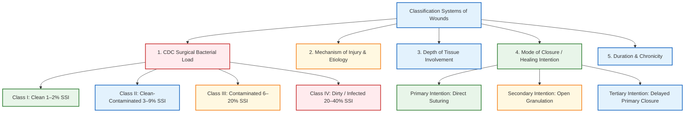

[[Wound & Wound Healing]]
# Types of Wounds

## 1. Definition

A **wound** is defined as a disruption of the normal anatomical continuity and functional integrity of living tissue, caused by physical, mechanical, thermal, chemical, or biological injury.

Wound classification is a fundamental surgical framework used to estimate the risk of Surgical Site Infection (SSI), dictate the choice of prophylactic antibiotics, determine the optimal timing and technique of wound closure, and predict overall healing outcomes.

---

## 2. Classification of Wounds [⭐ High-Yield]

Because wounds are clinically diverse, no single system encompasses all clinical context. Wounds are systematically classified according to multiple parameters:

### A. US CDC Surgical Wound Classification (Based on Bacterial Load & Contamination Risk) [⭐ High-Yield]

Established by the US Centers for Disease Control and Prevention (CDC) to stratify SSI risk and guide prophylactic antibiotic use:

- **Class I (Clean Wounds):**
    - _Definition:_ Uninfected operative wounds in which no inflammation is encountered, and the respiratory, alimentary, genital, or uninfected urinary tracts are not entered. Closed primarily.
    - _SSI Rate:_ **1–2%** (without or with antibiotics).
    - _Prophylactic Antibiotics:_ Not indicated unless a prosthetic implant/mesh is placed or consequences of infection are catastrophic.
    - _Examples:_ Thyroidectomy, Hernioplasty, Breast surgery, Coronary Artery Bypass Grafting (CABG).
- **Class II (Clean-Contaminated Wounds):**
    - _Definition:_ Operative wounds in which the respiratory, alimentary, genital, or urinary tract is entered under controlled conditions without unusual contamination or major break in sterile technique.
    - _SSI Rate:_ **3–9%** (3% with prophylaxis, 6–9% without).
    - _Examples:_ Elective cholecystectomy, elective appendicectomy, elective bowel surgery with bowel prep, Lower Segment Caesarean Section (LSCS).
- **Class III (Contaminated Wounds):**
    - _Definition:_ Open, fresh, accidental traumatic wounds (<6 hours old); operations with major breaks in sterile technique (e.g., open cardiac massage); or gross spillage from the GI tract; incisions with acute non-purulent inflammation.
    - _SSI Rate:_ **6–20%** (6% with prophylaxis, 13–20% without).
    - _Examples:_ Emergency appendicectomy for acute appendicitis, emergency cholecystectomy, open bowel surgery with spillage.
- **Class IV (Dirty / Infected Wounds):**
    - _Definition:_ Old traumatic wounds (>6 hours old) with retained devitalized tissue; operations involving existing clinical infection, purulent discharge, or perforated viscera.
    - _SSI Rate:_ **20–40%** (7–8% with therapeutic antibiotics, 20–40% without).
    - _Examples:_ Abscess drainage, perforated peritonitis with fecal contamination, gas gangrene, neglected traumatic wounds.

---

### B. Classification by Mechanism of Injury / Etiology

- **Incised Wounds:** Clean, sharp margins caused by scalpel or sharp objects; minimal surrounding contusion.
- **Lacerated / Contused Wounds:** Blunt force impact causing ragged, irregular tearing of skin with surrounding crush injury.
- **Crush / Blast Wounds:** High-energy transfer causing extensive tissue devitalization, cavitation, edema, and risk of compartment syndrome.
- **Degloving Injuries:** Avulsion of skin and subcutaneous tissue away from underlying deep fascia and blood supply due to shearing forces. Classified into:
    1. _Limited degloving_ with abrasion/avulsion.
    2. _Non-circumferential degloving_.
    3. _Circumferential single-plane degloving_.
    4. _Circumferential multiplanar degloving_.
- **Puncture / Bite Wounds:** Small entry site with deep inoculation of microbial flora (e.g., _Eikenella corrodens_ in human punches, _Pasteurella multocida_ in animal bites).
- **Thermal / Radiation / Chemical / Cold Injuries:** Burns (scalds, flame), radiation damage, or frostbite/immersion injuries.

---

### C. Classification by Depth of Tissue Involvement

- **Epidermal:** Involves only the epidermal layer; dermal appendages intact.
- **Superficial Dermal / Partial-Thickness:** Involves epidermis and upper papillary dermis; presents with blister formation.
- **Deep Dermal / Partial-Thickness:** Extends into the deep reticular dermis; preserves deep dermal appendages (hair follicles, sweat glands).
- **Full-Thickness:** Complete destruction of epidermis, dermis, and subcutaneous tissues into underlying fascia, muscle, or bone.

---

### D. Classification by Mode of Closure / Healing Intention [⭐ High-Yield]

- **Primary Intention (First Intention):**
    - _Mechanism:_ Direct surgical approximation of clean wound edges using sutures, staples, or adhesive tapes.
    - _Features:_ Minimal tissue loss, minimal granulation tissue, rapid re-epithelialisation, low scar formation.
- **Secondary Intention (Second Intention):**
    - _Mechanism:_ Wound is left open and allowed to heal spontaneously through **granulation tissue formation, wound contraction (driven by myofibroblasts), and re-epithelialisation**.
    - _Features:_ Significant soft-tissue loss, heavily contaminated/infected wounds; leads to a broader, more fibrotic scar.
- **Tertiary Intention (Delayed Primary Closure):**
    - _Mechanism:_ Heavily contaminated or untidy wounds left open initially for 3–5 days with regular debridement and dressings. Once clean and granulating without active infection, wound edges are surgically apposed.

---

### E. Classification by Duration & Chronicity

- **Acute Wounds:** Progress through the normal, orderly stages of wound healing (hemostasis → inflammation → proliferation → remodeling) within a predictable timeframe.
- **Chronic Wounds:** Wounds that fail to progress through normal healing in a timely manner, stalling in a prolonged, self-perpetuating inflammatory phase.
    - _Subtypes:_
        1. **Vascular Ulcers:** Venous stasis ulcers (most common leg ulcers), arterial ischemic ulcers.
        2. **Diabetic Foot Ulcers:** Neuropathic, neuro-ischemic, or microvascular ulcers.
        3. **Pressure Ulcers (Bedsores):** Ischemic tissue necrosis over bony prominences from sustained pressure >30 mmHg. Staged from Stage 1 (non-blanchable erythema) to Stage 4 (exposed bone/muscle).

---

## 3. Pathophysiology: Biological Phases of Wound Healing

Normal wound healing proceeds through four overlapping physiological phases:

1. **Hemostasis (0–2 Hours):** Vascular injury causes transient neurogenic vasoconstriction. Subendothelial collagen exposure triggers platelet adhesion, activation, fibrin clot formation, and release of alpha-granule growth factors (PDGF, TGF-β, VEGF).
2. **Inflammation (Days 1–4):**
    - _Early (Days 1–2):_ Neutrophils migrate to phagocytose bacteria and debris.
    - _Late (Days 2–4):_ Monocytes convert to **macrophages**—the key orchestrator releasing cytokines (TNF-α, IL-1) and growth factors (TGF-β, PDGF) to recruit fibroblasts.
3. **Proliferation (Days 3 to 2–4 Weeks):**
    - _Granulation Tissue Formation:_ Capillary sprouting (angiogenesis) + fibroblast migration.
    - _Fibroplasia:_ Deposition of disorganized **Type III collagen**.
    - _Re-Epithelialisation & Contraction:_ Keratinocyte migration + myofibroblast-driven wound edge contraction.
4. **Remodeling / Maturation (Day 21 to 1 Year+):**
    - Disorganized Type III collagen is degraded by Matrix Metalloproteinases (MMPs) and replaced by organized **Type I collagen** in a normal skin ratio of **4:1 (Type I : Type III)**.
    - _Tensile Strength:_ Reaches ~10% at 1 week, peaking at **~70–80% of uninjured skin strength by 12 weeks**(never regains 100%).

---

## 4. Differential Diagnosis (Primary vs. Secondary vs. Tertiary Closure)

|Feature|Primary Intention|Secondary Intention|Tertiary Intention (Delayed Primary)|
|:--|:--|:--|:--|
|**Wound Edges**|Directly apposed (sutured/stapled)|Widely separated / Gaping|Left open initially; apposed after 3–5 days|
|**Bacterial Contamination**|Low / Clean wounds|High / Contaminated / Tissue loss|Heavy initial contamination / Untidy wounds|
|**Granulation Tissue**|Minimal|Abundant (fills wound from base)|Moderate (formed prior to delayed closure)|
|**Role of Contraction**|Negligible|Markedly pronounced (myofibroblasts)|Minimal after delayed closure|
|**Healing Time**|Rapid (7–14 days)|Prolonged (weeks to months)|Intermediate|
|**Scar Outcome**|Fine, linear hairline scar|Broad, irregular, prominent scar|Intermediate scar width|

---

## 5. Clinical Pearl

Surgical site infection (SSI) risk correlates directly with the initial CDC wound class. In **Class I (Clean)** operations, routine prophylactic antibiotics are not indicated unless a foreign body/prosthesis/mesh is inserted. In contrast, in **Class III and IV** wounds, prophylactic or therapeutic broad-spectrum antibiotics covering Gram-positive, Gram-negative, and anaerobic organisms must be combined with proper surgical debridement, thorough irrigation, and **secondary or delayed primary closure** to prevent gas gangrene or necrotising fasciitis.

---

## 6. Exam Trap

### Exam Trap

- **The Mix-Up:** Confusing **Class III (Contaminated)** with **Class IV (Dirty)** wounds based purely on the size of the wound breach.
- **Distinguishing Fact:**
    - _Class III (Contaminated):_ Involves **acute, non-purulent inflammation**, fresh accidental trauma <6 hours old, or fresh gross GI spillage.
    - _Class IV (Dirty):_ Requires the presence of **existing clinical infection, pus, perforated viscera, or old neglected traumatic wounds >6 hours old** with retained devitalized tissue.

---

## 7. Diagram Guide

### Diagram 1: CDC Surgical Wound Classification & Infection Rates

(Reference in text: "See Diagram 1")

- **Type:** 4-Column comparative bar chart / summary diagram.
- **Outline shape to draw:** Four vertical rectangular blocks representing Class I to Class IV wounds.
- **Labels in order:**
    1. _Class I (Clean):_ Uninfected, no viscus opened → SSI Rate 1–2%.
    2. _Class II (Clean-Contaminated):_ Controlled viscus entry → SSI Rate 3–9%.
    3. _Class III (Contaminated):_ Fresh trauma, gross GI spillage, non-purulent inflammation → SSI Rate 6–20%.
    4. _Class IV (Dirty):_ Pus, perforated viscus, old trauma >6 hours → SSI Rate 20–40%.
- **Arrows/connections:** Ascending arrow along the bottom indicating: _"Increasing Bacterial Load → Increasing SSI Risk → Mandates Delayed Closure"_.
- **Extra-Mark Annotation:** _"Golden period for traumatic wound closure is <6 hours; after 6 hours, a wound is categorized as Class IV (Dirty)."_

---

## 8. Mnemonic / Memory Palace

### Mnemonic: C-C-C-D

(CDC Surgical Wound Classification)

- **C** – **C**lean (Class I: No viscus opened; SSI 1–2%)
- **C** – **C**lean-**C**ontaminated (Class II: Controlled viscus entry; SSI 3–9%)
- **C** – **C**ontaminated (Class III: Fresh trauma <6 hrs, gross GI spillage; SSI 6–20%)
- **D** – **D**irty / Infected (Class IV: Pus, perforated viscus, trauma >6 hrs; SSI 20–40%)

---

### Quick Revision

- **CDC Classification:** Class I Clean (SSI 1–2%), Class II Clean-Contaminated (SSI 3–9%), Class III Contaminated (SSI 6–20%), Class IV Dirty/Infected (SSI 20–40%).
- **Modes of Closure:** Primary (direct suturing, clean wounds), Secondary (open wound, heals via granulation/contraction), Tertiary (delayed primary closure after 3–5 days).
- **Golden Period:** Traumatic wounds <6 hours old are managed as fresh/contaminated; wounds >6 hours old are classified as dirty due to bacterial proliferation.
- **Tensile Strength:** Reaches 10% at 1 week, 70–80% maximum at 12 weeks; never regains 100% of original uninjured strength.
- **Type I vs Type III Collagen:** Proliferative phase deposits disorganized Type III collagen; remodeling replaces it with Type I collagen in a 4:1 ratio.

---

### One-Line Exam Opener

"Wound classification systematically categorizes tissue disruptions by bacterial load (CDC Class I–IV), depth, etiology, and mode of closure to guide perioperative antibiotic stewardship, surgical timing, and reconstructive management."

---

💡 **Next Step:** Would you like to review the specific management protocols for **Surgical Site Infections (SSI) & ASEPSIS scoring** or explore the steps of **Surgical Debridement and Negative Pressure Wound Therapy (NPWT)**?