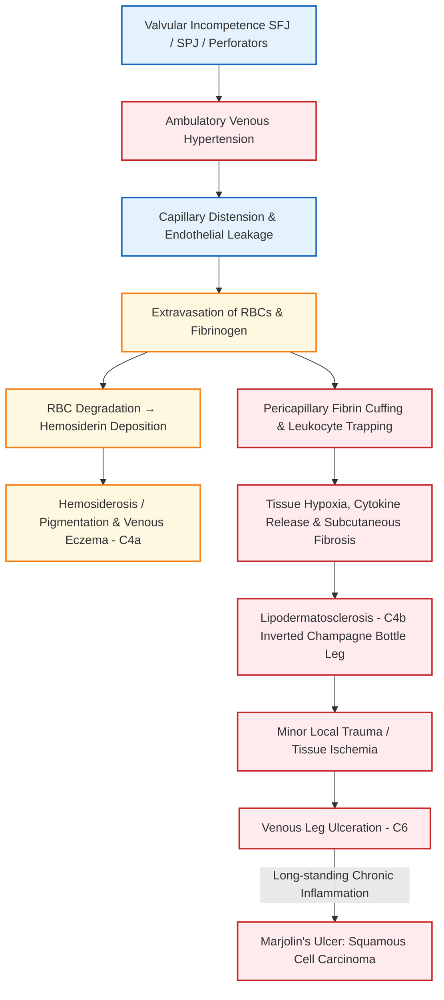

[[C15- Venous disease]]

### Definition

**Complications of varicose veins** represent the local, cutaneous, and vascular sequelae caused by persistent, untreated **ambulatory venous hypertension**. This sustained venous hypertension leads to microvascular permeability, tissue hypoxia, chronic extravasation of blood products, pericapillary fibrin cuffing, and progressive soft-tissue destruction.

---

### Pathophysiology of Complications [⭐ High-Yield]

- **Ambulatory Venous Hypertension**: Failure of superficial or perforator valves causes retrograde blood flow during calf muscle contraction, transmitting high deep venous pressure into superficial skin capillaries.
- **Pericapillary Fibrin Cuff Formation**: High pressure distends dermal capillaries → widens endothelial junctions → allows fibrinogen and plasma proteins to leak into pericapillary spaces, polymerizing into a **fibrin cuff** that impairs oxygen and nutrient diffusion.
- **Hemosiderin Deposition**: Extravasated red blood cells breakdown in the dermis, releasing **hemosiderin** and iron, which trigger chronic inflammatory cell infiltration and permanent brown skin discoloration.
- **Subcutaneous Fat Necrosis & Fibrosis**: Entrapped leukocytes release reactive oxygen species and proteolytic enzymes → produces fat necrosis, dermatosclerosis, and skin contracture (**Lipodermatosclerosis**).
- **Ulceration & Malignancy**: Hypoxic, fibrotic tissue breaks down easily upon minor trauma, forming a non-healing **venous ulcer**, which under chronic inflammatory stress may undergo malignant transformation into a **Marjolin's ulcer**.

---

### Classification of Complications [⭐ High-Yield]

#### A. Acute Complications

1. **Haemorrhage / Bleeding**: Spontaneous or traumatic rupture of thin-walled, high-pressure subcutaneous varicosities or skin 'blowouts'.
2. **Superficial Vein Thrombosis (Superficial Thrombophlebitis / SVT)**: Acute inflammation and thrombosis within a segment of a varicose vein.
3. **Subcutaneous Calcification (Phleboliths)**: Hard, palpable nodules resulting from chronic dystrophic calcification within organized thrombi.

#### B. Chronic Complications (Chronic Venous Insufficiency - CVI)

1. **Venous Edema (C3)**: Pitting ankle swelling progressing proximally.
2. **Corona Phlebectatica / Malleolar Flare (C4c)**: Fan-shaped pattern of intradermal telangiectasias around the ankle (early sign of advanced disease).
3. **Hemosiderin Pigmentation (C4a)**: Brownish skin discoloration around the gaiter region.
4. **Venous Eczema / Stasis Dermatitis (C4a)**: Erythematous, scaly, intensely pruritic skin eruption.
5. **Lipodermatosclerosis (LDS) (C4b)**: Chronic induration, subcutaneous fibrosis, and "woody" feel leading to an **"inverted champagne bottle" leg**.
6. **Atrophie Blanche (C4b)**: Porcelain-white, avascular, atrophic skin patches surrounded by hyperpigmented telangiectasias.
7. **Venous Leg Ulceration (C5 healed, C6 active)**: Full-thickness skin loss in the gaiter area.
8. **Marjolin's Ulcer [⭐ High-Yield]**: Malignant change in a chronic, long-standing venous ulcer into **Squamous Cell Carcinoma (SCC)**.

---

### Detailed Clinical Features of Complications [⭐ High-Yield]

#### 1. Venous Bleeding

- **Features**: Profuse, dark-red venous hemorrhage from a eroded varicosity.
- **Precipitating Factors**: Trivial trauma, scratching over eczema, or hot showers causing venodilatation.
- **Immediate Management**: **Elevation of the limb** above heart level and direct firm local pressure (pressure dressing). _Bleeding increases if the leg is allowed to hang down._

#### 2. Superficial Thrombophlebitis (SVT)

- **Signs & Symptoms**: Painful, tender, hard, cord-like subcutaneous swelling along the course of the GSV or SSV with overlying localized erythema and warmth.
- **Risk**: Thrombus extending within 5 cm of the Saphenofemoral Junction (SFJ) carries a risk of propagating into the deep system (DVT) and requires short-term anticoagulation.

#### 3. Lipodermatosclerosis (LDS)

- **Signs**: The skin and subcutaneous tissue of the lower calf become hyperpigmented, thickened, bound-down, and hard ("woody" feel).
- **Anatomical Deformity**: Fibrosis contracts the lower calf while the upper calf retains normal muscle bulk, producing the pathognomonic **"inverted champagne bottle" leg**. Tendo-Achilles tightness and ankle stiffness frequently develop.

#### 4. Venous Leg Ulcer (Varicose Ulcer)

- **Site [⭐ High-Yield]**: Classically located in the **gaiter area** (medial malleolus region, corresponding to Cockett's perforator sites).
- **Edge & Floor**: **Gently sloping edges**, shallow base, floor containing red granulation tissue covered by variable yellow slough and exudate.
- **Surrounding Skin**: Marked by surrounding hemosiderosis, eczema, and indurated lipodermatosclerosis.
- **Pain**: Mild to moderate, non-severe, characteristically **relieved by leg elevation** (unlike arterial ulcers which worsen on elevation).

#### 5. Marjolin's Ulcer

- **Definition**: Well-differentiated **Squamous Cell Carcinoma (SCC)** arising in a longstanding, non-healing venous ulcer.
- **Clinical Suspicion**: Any chronic ulcer showing sudden rapid growth, raised rolled/everted margins, cauliflower-like exophytic granulations, foul-smelling discharge, or new severe localized pain mandates an immediate edge biopsy.

---

### Diagnosis / Investigations

- **Duplex Ultrasound Scanning (Gold Standard / IOC)**:
    - Evaluates superficial and deep venous reflux (retrograde flow **≥0.5 seconds** in superficial system).
    - Maps location of incompetent perforators (Cockett / Boyd / Dodd) and confirms deep vein patency (rules out DVT).
- **Ankle-Brachial Pressure Index (ABPI) [⭐ High-Yield]**:
    - Mandatory before initiating compression therapy to rule out co-existing Peripheral Arterial Disease (PAD).
    - _Normal ABPI_: 0.9–1.4. _Venous Ulcer_: >0.8 (safe for high-compression 35–40 mmHg). _Mixed Ulcer_: 0.5–0.8 (modified light compression ~30 mmHg). _Severe PAD_: <0.5 (compression strictly contraindicated).
- **Wedge Edge Biopsy of Ulcer**: Indicated in chronic ulcers (>6–12 weeks) non-responsive to therapy or showing suspicious everted margins to rule out Marjolin's ulcer.

---

### Treatment / Management of Complications [⭐ High-Yield]

#### 1. Management of Active Venous Ulcers (Bisgaard Regime)

- **Elevation**: Periodic leg elevation above heart level to decrease capillary hydrostatic pressure.
- **Compression Therapy (Gold Standard for Healing)**:
    - **Four-Layer Compression Bandage**: Orthopaedic wool → Cotton crepe → Elastic bandage → Cohesive bandage (delivers **35–40 mmHg** pressure at the ankle).
    - **Class III Compression Stockings**: Exerts 25–35 mmHg pressure.
- **Superficial Venous Ablation**: Early endovenous ablation (EVLT / RFA) or saphenofemoral flush ligation + stripping halves ulcer healing time and significantly reduces 5-year recurrence rates.
- **Pharmacotherapy**: Oral **Pentoxifylline** (400 mg 8-hourly) improves microvascular perfusion and accelerates healing.

#### 2. Management of Marjolin's Ulcer

- **Surgical Treatment**: **Wide local excision** with a 2 to 3 cm clear margin.
- **Radiotherapy**: **Avoided / Not indicated** (poor response and high tissue necrosis due to underlying fibrotic avascular bed).

---

### Dosage Rule

#### 1. Pentoxifylline

- **Name**: Pentoxifylline (Trental)
- **Mechanism of Action**: Xanthine derivative; increases red blood cell deformability, lowers plasma viscosity, decreases fibrinogen, and inhibits leukocyte activation/cytokine release to enhance microvascular tissue perfusion.
- **Dose**: 400 mg
- **Dosage / Route**: Oral tablet (sustained-release)
- **Frequency**: 8-hourly (thrice daily with meals)
- **Features**: Only oral medication proven to accelerate venous ulcer healing when used as an adjunct to compression bandaging.
- **Side Effects**: Dyspepsia, nausea, dizziness, flushing.
- **When to Start / Stop**: Start upon diagnosing a active venous ulcer; continue until full ulcer re-epithelialization occurs (2–6 months).

#### 2. Sodium Tetradecyl Sulphate (Sclerosing Agent for SVT / Tributary Ablation)

- **Name**: Sodium Tetradecyl Sulphate (STS / Fibrovein)
- **Mechanism of Action**: Anionic detergent; induces endothelial destruction, intravascular thrombosis, wall fibrosis, and permanent venous obliteration.
- **Dose**: 0.2 to 1 mL per injection site (maximum total session volume = 10–12 mL foam).
- **Dosage / Route**: Direct intravenous injection (as liquid or Tessari foam 1:4 air ratio).
- **Frequency**: Single outpatient session; repeatable after 4–6 weeks.
- **Features**: Foam formulation displaces intraluminal blood, maximizing endothelial contact.
- **Side Effects**: Skin hyperpigmentation, localized phlebitis, transient visual scotomas.
- **When to Start / Stop**: Administered during elective outpatient ablation of non-healing varicosities.

---

### Clinical Pearl

When a patient presents with an acutely bleeding varicose vein, **never apply a tourniquet proximal to the site**. A proximal tourniquet blocks superficial venous return while arterial inflow continues, raising intraluminal venous pressure and worsening the bleeding. The correct immediate action is **direct local pressure and limb elevation above the level of the heart**.

---

### Exam Trap

- **The Mix-up**: Recommending radiotherapy for Marjolin's ulcer arising from a chronic venous ulcer.
- **The Distinguishing Fact**: Marjolin's ulcer occurs in a severely scarred, hypocellular, and avascular fibrotic tissue bed. **Radiotherapy is ineffective and contraindicated** because avascular tissue cannot tolerate radiation without undergoing extensive osteonecrosis/breakdown. The treatment of choice is **Wide Local Excision**.

---

### Diagram Guide

### Diagram 1: Gaiter Area Venous Ulcer and Lipodermatosclerosis

- **Type**: Labeled surface and anatomical cross-sectional diagram of the lower medial calf.
- **Outline shape to draw**: Inverted bottle-shaped lower leg ("inverted champagne bottle" deformity) with a shallow ulcer located above the medial malleolus.
- **Labels in order**:
    1. _Subcutaneous Fibrosis & Fat Necrosis_ — causing indurated, woody "inverted champagne bottle" leg shape.
    2. _Gaiter Area (Medial Malleolus Region)_ — primary site of venous ulceration (Cockett perforator zone).
    3. _Venous Leg Ulcer_ — shallow base, gently sloping edges, pale granulation tissue floor.
    4. _Hyperpigmented Margin_ — brownish hemosiderin deposition.
    5. _Incompetent Cockett Perforators_ — connecting deep posterior tibial veins to superficial posterior arch vein.
- **Arrows/connections**: High Ambulatory Venous Pressure → Incompetent Perforators → Dermal Capillary Fibrin Cuffs → Skin Breakdown / Ulceration.
- **Annotation for Extra Marks**: _"Persistent pericapillary fibrin cuffs block oxygen diffusion, causing tissue ischemia and gaiter area ulceration."_

---

### Mnemonic / Memory Palace

#### Topic Mnemonic: C-O-M-P-L-I-C-A-T-I-O-N (Varicose Vein Complications)

- **C** – **C**orona phlebectatica (malleolar flare at ankle)
- **O** – **O**edema (pitting ankle edema)
- **M** – **M**arjolin's ulcer (Squamous Cell Carcinoma in chronic ulcer)
- **P** – **P**igmentation (hemosiderin deposition)
- **L** – **L**ipodermatosclerosis (inverted champagne bottle leg)
- **I** – **I**nfection / Superficial Thrombophlebitis
- **C** – **C**alcification of veins (phleboliths)
- **A** – **A**trophie blanche (porcelain-white avascular skin patches)
- **T** – **T**rophic changes / Stasis Eczema
- **I** – **I**ncurable non-healing Ulceration (Venous ulcer)
- **O** – **O**vercoming Bleeding (haemorrhage managed by elevation)
- **N** – **N**euro-vascular changes (Achilles tendon contracture)

---

### Quick Revision

- **Primary Cause**: Persistent ambulatory venous hypertension due to superficial and perforator valvular incompetence.
- **Key Cutaneous Manifestations**: Hemosiderin pigmentation, stasis eczema, lipodermatosclerosis ("inverted champagne bottle" leg), and atrophie blanche.
- **Venous Ulcer Features**: Located in the gaiter area (medial malleolus), shallow with gently sloping edges, pale granulation floor, and relieved by leg elevation.
- **Gold Standard Management for Ulcer**: Four-layer compression bandaging (35–40 mmHg pressure at ankle) + early endovenous reflux ablation + oral Pentoxifylline.
- **Malignant Transformation**: Marjolin's ulcer (Squamous Cell Carcinoma); treated by wide local excision (Radiotherapy avoided).

---

### One-Line Exam Opener

_Complications of varicose veins are the progressive cutaneous and soft-tissue sequelae of chronic ambulatory venous hypertension, clinically manifested by hemosiderosis, lipodermatosclerosis, gaiter ulceration, and rarely Marjolin's malignant transformation._