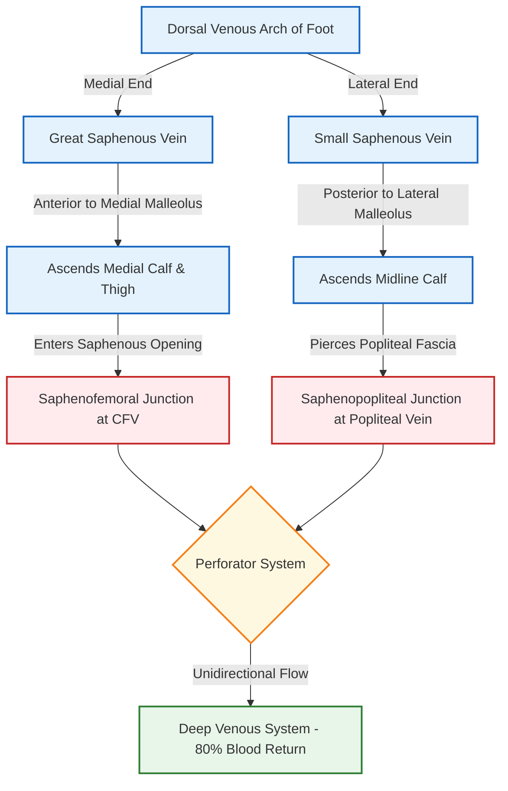
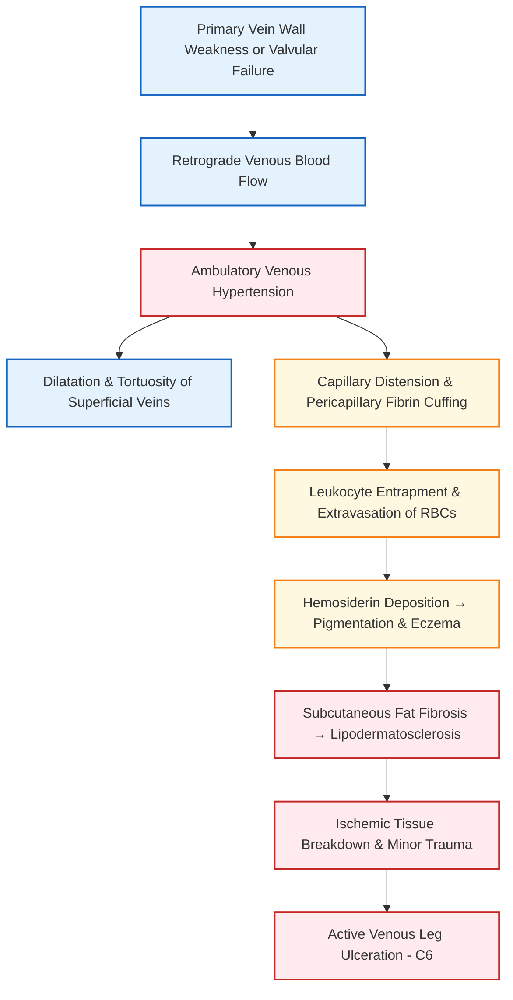
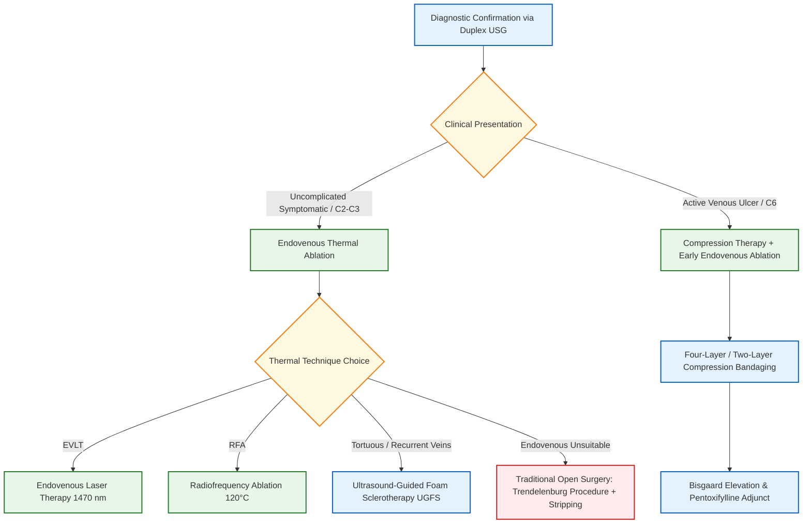

[[C15- Venous disease]]
# Venous Ulcers and Varicose Veins

### Definition [⭐ High-Yield]

- **Venous Ulcer**: A full-thickness break in the skin of the lower limb (typically in the gaiter area above the medial malleolus) that fails to heal spontaneously and is caused and propagated by chronic ambulatory venous hypertension.
- **Varicose Veins**: Subcutaneous, pathologically dilated, elongated, and tortuous veins measuring ≥3 mm in diameter with incompetent or defective valves.

---

### Etiology / Causes / Risk Factors

#### Etiology

- **Primary Varicose Veins**: Intrinsic structural weakness of the vein wall, loss of compliance, and primary valvular incompetence without preceding deep venous disease.
- **Secondary Varicose Veins**: Secondary to underlying conditions causing deep venous obstruction or high pressure:
    - Post-thrombotic limb (previous Deep Vein Thrombosis [DVT]).
    - Pelvic/abdominal mass or retroperitoneal tumor compressing iliac veins.
    - Arteriovenous (AV) fistulae (congenital or acquired).
    - Klippel-Trénaunay syndrome (mesodermal anomaly with vestigial veins and deep vein hypoplasia).

#### Risk Factors [⭐ High-Yield]

- **Female Gender**: Estrogen/progesterone soften vein walls and relax smooth muscle.
- **Increasing Age**: Structural degradation of elastin and collagen in vein walls.
- **Pregnancy**: Increased circulating volume, progesterone-induced venodilatation, and gravid uterus compressing the inferior vena cava.
- **Family History**: Strong genetic predisposition to venous wall weakness.
- **Occupation & Lifestyle**: Prolonged upright standing or sitting, obesity (increased intra-abdominal pressure), and tall height.

---

### Classification (CEAP Classification System) [⭐ High-Yield]

The standardized CEAP system categorizes chronic venous disorders based on **Clinical**, **Etiological**, **Anatomical**, and **Pathophysiological** domains:

#### 1. Clinical Classification (C)

- **C₀**: No visible or palpable signs of venous disease.
- **C₁**: Telangiectasias (spider veins, <1 mm) or reticular veins (1–2.9 mm).
- **C₂**: Varicose veins (≥3 mm).
- **C₂ᵣ**: Recurrent varicose veins.
- **C₃**: Venous edema.
- **C₄ₐ**: Skin changes due to venous disease: Pigmentation (hemosiderosis) or venous eczema.
- **C₄♭**: Advanced skin changes: Lipodermatosclerosis or atrophie blanche.
- **C₄ₚ**: Corona phlebectatica (malleolar fan-shaped flare).
- **C₅**: Healed venous ulcer.
- **C₆**: Active venous ulcer. _(Sub-classified as **S** for symptomatic or **A** for asymptomatic, e.g., C₂ₛ)_.

#### 2. Etiological Classification (E)

- **Ec**: Congenital.
- **Ep**: Primary.
- **Es**: Secondary (post-thrombotic or trauma).
- **En**: No venous cause identified.

#### 3. Anatomical Classification (A)

- **As**: Superficial veins (Great or Small Saphenous System).
- **Ap**: Perforator veins.
- **Ad**: Deep venous system.
- **An**: No venous location identified.

#### 4. Pathophysiological Classification (P)

- **Pr**: Reflux.
- **Po**: Obstruction.
- **Pr,o**: Reflux and Obstruction combined.
- **Pn**: No identifiable venous pathophysiology.

---

### Surgical Anatomy of Lower Limb Veins [⭐ High-Yield]

#### 1. Great Saphenous Vein (GSV)

- **Origin**: Formed at the inner border of the foot by the confluence of the medial end of the dorsal venous arch and the medial marginal vein.
- **Course**: Passes **anterior to the medial malleolus** (ideal site for venous cutdown), ascends along the medial aspect of the calf accompanied by the **saphenous nerve**, loops posterior to the medial condyle of the femur, and ascends the anteromedial thigh.
- **Termination**: Pierces the cribriform fascia covering the saphenous opening (**2.5 to 4 cm below and lateral to the pubic tubercle**) to drain into the Common Femoral Vein (CFV) at the **Saphenofemoral Junction (SFJ)**.
- **Tributaries at the SFJ [⭐ High-Yield]** (6 Classical Tributaries):
    1. _Superficial Epigastric Vein_ (runs superiorly).
    2. _Superficial Circumflex Iliac Vein_ (runs laterally).
    3. _Superficial External Pudendal Vein_ (runs medially).
    4. _Deep External Pudendal Vein_.
    5. _Anterior Accessory Saphenous Vein (AASV)_.
    6. _Posterior Medial Thigh Tributary_.

#### 2. Small Saphenous Vein (SSV)

- **Origin**: Arises from the lateral border of the foot by the confluence of the lateral end of the dorsal venous arch and the lateral marginal vein.
- **Course**: Passes **posterior to the lateral malleolus** accompanied by the **sural nerve**, ascends along the midline of the posterior calf between the two heads of gastrocnemius.
- **Termination**: Pierces deep popliteal fascia to drain into the Popliteal Vein at the **Saphenopopliteal Junction (SPJ)**.
- **Cranial Extension (Giacomini Vein)**: Extension of SSV above the popliteal fossa communicating with the GSV system.

#### 3. Perforating Veins (Perforators)

Valved communicating channels connecting the superficial system to the deep system through deep fascia (normal flow: **Superficial → Deep**):

- **Thigh Perforators**: _Hunterian perforators_ (mid-thigh).
- **Above-Knee Perforators**: _Dodd's perforators_ (distal thigh).
- **Below-Knee Perforators**: _Boyd's perforators_ (upper medial calf).
- **Ankle / Gaiter Perforators**: _Cockett's perforators_ (located at **5 cm, 10 cm, and 15 cm** above the medial malleolus).
- **Heel Perforators**: _May / Kuster's perforators_.

---

### Pathophysiology [⭐ High-Yield]

- **Physiological Venous Return**: Upright venous return relies on the **calf muscle pump** ("peripheral heart"), negative intrathoracic pressure during inspiration, and competent bicuspid valves ensuring unidirectional flow from superficial to deep systems.
- **Ambulatory Venous Hypertension**: Failure of SFJ, SPJ, or perforator valves causes retrograde flow of high-pressure deep venous columns into superficial veins during calf muscle contraction.
- **Microvascular Damage & Ulceration**:
    - High pressure distends dermal capillaries → widening of endothelial junctions → extravasation of fibrinogen, proteins, and RBCs into subcutaneous tissues.
    - Fibrin polymerizes into a **pericapillary fibrin cuff**, hindering oxygen/nutrient diffusion.
    - Degradation of extravasated RBCs releases **hemosiderin**, producing brown skin pigmentation.
    - Activated trapped leukocytes release reactive oxygen species and proteolytic enzymes → chronic inflammation, fat necrosis, and tissue fibrosis (**Lipodermatosclerosis**).
    - Minor trauma over this compromised, fibrotic tissue leads to full-thickness epithelial breakdown (**Venous Leg Ulcer**).

---

### Clinical Features [⭐ High-Yield]

#### Symptoms

- **Aching & Heaviness**: Dull, aching pain or heavy bursting sensation in the calf, characteristically worse towards the end of the day or after prolonged standing, and **dramatically relieved by leg elevation** or walking.
- **Itching & Restlessness**: Ankle itching (venous eczema) and nocturnal muscle cramps.
- **Cosmetic Distress**: Visible unsightly tortuous swelling.

#### Signs

- **Dilated Superficial Veins**: Tortuous, bulging subcutaneous veins ≥3 mm in GSV or SSV distribution.
- **Saphena Varix**: Smooth, compressible, non-tender swelling at the SFJ in the groin; displays a distinct fluid thrill and cough impulse, disappearing completely on lying down.
- **Corona Phlebectatica (Malleolar Flare)**: Fan-shaped pattern of intradermal telangiectasias around the ankle—an early sign of advanced venous hypertension.
- **Skin Changes of Chronic Venous Insufficiency**:
    - _Pitting Edema_: Starts around ankles, progressing proximally.
    - _Hemosiderin Pigmentation_: Brownish discoloration of gaiter skin.
    - _Venous Eczema_: Erythematous, scaly, itchy dermatitis.
    - _Lipodermatosclerosis (LDS)_: Indurated, "woody" feeling skin with subcutaneous fibrosis; upper calf remains normal while lower calf contracts, producing the pathognomonic **"inverted champagne bottle" leg**.
    - _Atrophie Blanche_: Smooth, porcelain-white atrophic skin patches surrounded by hyperpigmented margins.
- **Venous Ulcer Features**: Located in the **gaiter region** (typically above medial malleolus), shallow, with gently **sloping edges**, pale granulation tissue floor covered in slough/exudate, and surrounded by pigmented/indurated skin.

#### Clinical Tests for Venous Incompetence [⭐ High-Yield]

1. **Trendelenburg Test**:
    - _Method_: Patient lies supine, leg elevated to empty veins, tourniquet applied below SFJ (groin). Patient stands up.
    - _Interpretation_:
        - If veins fill rapidly before tourniquet release → **Incompetent Perforators**.
        - If veins remain empty but fill rapidly from above upon releasing tourniquet → **Incompetent SFJ**.
2. **Multiple Tourniquet Test**:
    - Tourniquets applied below SFJ, above knee, below knee, and above ankle to localize the exact level of incompetent perforators.
3. **Fegan's Method**:
    - Palpation of circular fascial defects ("blowouts") along the course of veins in a standing patient to mark incompetent perforator sites.
4. **Morrissey's Cough Impulse Test**:
    - Palpation of SFJ while patient coughs; palpable fluid thrill indicates **Saphena Varix / SFJ Incompetence**.
5. **Modified Perthes' Test**:
    - Tourniquet tied below SFJ; patient walks for 5 minutes.
    - _Result_: If varicosities collapse → Deep veins patent. If varicosities become more turgid and pain increases → **Deep Vein Thrombosis (DVT) / Deep Vein Occlusion** (Surgery strictly contraindicated).

---

### Diagnosis / Investigations [⭐ High-Yield]

#### Duplex Ultrasound Scanning (Investigation of Choice / Gold Standard)

Combines B-mode real-time anatomical imaging with Spectral/Color Doppler flow analysis:

- **Standard Patient Position**: Performed with patient in the **standing position** to maximize venous filling and reflux elicitation.
- **Diagnostic Criteria for Reflux**: Retrograde flow lasting **≥0.5 seconds** in superficial veins or **≥1.0 second** in deep veins following release of a manual calf squeeze or Valsalva maneuver.
- **Key Anatomical Landmarks**:
    - _"Mickey Mouse Sign"_: Transverse B-mode view at groin showing Common Femoral Artery (CFA), Common Femoral Vein (CFV), and Great Saphenous Vein (GSV).
    - _"Saphenous Eye"_: GSV enclosed between saphenous fascia and deep fascia lata in thigh.
- **Anklebrachial Pressure Index (ABPI)**:
    - Mandatory in all leg ulcer patients prior to compression therapy to rule out arterial disease.
    - _Normal_: 0.9–1.4; _Pure Venous Ulcer_: >0.8 (safe for full compression); _Mixed Ulcer_: 0.5–0.8 (modified light compression); _Severe Arterial Ischemia_: <0.5 (compression strictly contraindicated).

---

### Differential Diagnosis

|Feature|Venous Ulcer|Arterial Ulcer|Trophic (Neuropathic) Ulcer|Diabetic Ulcer|
|:--|:--|:--|:--|:--|
|**Primary Site [⭐ High-Yield]**|Gaiter area (above medial malleolus)|Toes, heel, dorsum of foot, shin|Pressure points of sole, plantar metatarsal heads|Pressure points, toes, sole|
|**Ulcer Margins**|Gently sloping edges|"Punched-out", steep vertical edges|Punched-out, hyperkeratotic rim|Punched-out, callus border|
|**Ulcer Base**|Pale granulation tissue with slough|Dry, pale, sloughy, or black necrotic tissue|Slough / deep tissue exposure|Variable slough / infected tissue|
|**Pain**|Mild, relieved by leg elevation|Severe, nocturnal rest pain, relieved by dangling leg|Painless (loss of sensation)|Painless or burning paresthesias|
|**Surrounding Skin**|Pigmentation, eczema, LDS|Shiny, cold, hairless, trophic changes|Anesthetic, dry, cracked skin|Loss of sensation, impaired pulses|
|**Peripheral Pulses**|Present and normal|Absent or diminished|Present|Diminished or absent|

---

### Treatment / Management [⭐ High-Yield]

#### 1. Conservative & Medical Management

- **Leg Elevation**: Elevating leg above heart level when resting reduces venous pooling and edema.
- **Compression Hosiery**:
    - _Class II_ (18–24 mmHg) or _Class III_ (25–35 mmHg) graduated below-knee compression stockings.
    - _Contraindication_: ABPI <0.8 or severe peripheral arterial occlusive disease.
- **Compression Bandaging for Venous Ulcers**:
    - **4-Layer Bandage System**: Orthopaedic wool → Cotton crepe → Elastic bandage → Cohesive bandage (delivers **35–40 mmHg** pressure at ankle).
- **Bisgaard Regime for Ulcers**: Education + elevation + compression bandaging + ankle mobility exercises.

#### 2. Endovenous Thermal Ablation (First-Line Treatment of Choice) [⭐ High-Yield]

Performed as ambulatory outpatient procedures under ultrasound-guided tumescent local anesthesia:

- **Endovenous Laser Therapy (EVLT)**:
    - Diode laser fiber (1470 nm wavelength) introduced percutaneously into GSV.
    - Delivers **60–80 J/cm** thermal energy, causing protein denaturation, vein wall collapse, and permanent fibrotic occlusion.
- **Radiofrequency Ablation (RFA)**:
    - ClosureFast catheter containing a 7 cm heating element heated to **120°C in 20-second cycles**.
- **Tumescent Local Anesthesia Rationale**: Injection of dilute lidocaine + epinephrine saline solution around the vein inside the saphenous sheath:
    1. Anesthetizes the treatment zone.
    2. Compresses vein wall tightly against heating catheter.
    3. Acts as a protective heat sink to prevent saphenous nerve and skin thermal injury.

#### 3. Non-Thermal / Non-Tumescent Modalities

- **Ultrasound-Guided Foam Sclerotherapy (UGFS)**:
    - **Tessari Technique**: Sclerosant (**Sodium Tetradecyl Sulphate [STS]** or Polidocanol) mixed with air in a **1:4 ratio** using two syringes and a 3-way stopcock to produce fine detergent foam.
    - Foam displaces blood and induces pan-endothelial destruction and thrombosis. Ideal for tortuous tributaries.
- **Mechanochemical Ablation (MOCA / ClariVein)**: Rotating wire damages endothelium while sclerosant is infused simultaneously.
- **Cyanoacrylate Glue (VenaSeal)**: Intraluminal embolization of GSV using medical-grade glue.

#### 4. Open Surgical Management (Trendelenburg Procedure) [⭐ High-Yield]

Indicated when endovenous techniques are unavailable or unsuitable:

1. **Groin Incision**: Oblique incision over the groin crease lateral to pubic tubercle.
2. **Flush Saphenofemoral Ligation**: Careful dissection and **flush ligation** of GSV at its junction with the Common Femoral Vein (CFV) to prevent a residual stump (which causes recurrence/saphena varix).
3. **Ligation of All 6 SFJ Tributaries**: Prevents recurrent neovascularization.
4. **GSV Stripping**: Retrograde stripping of GSV from groin **down to knee level only**.
    - _Crucial Rule_: **Never strip GSV below the knee** to avoid damaging the closely accompanying **saphenous nerve**.
5. **Hook Phlebectomy**: Stab incisions (1–2 mm) to avulse residual varicose tributaries using phlebectomy hooks.
6. **Perforator Interruption**: Subfascial Endoscopic Perforator Surgery (SEPS) or open subfascial ligation (Linton / Cockett procedure).

---

### Complications [⭐ High-Yield]

#### Complications of Untreated Disease

- **Massive Bleeding / Venous Burst**: Rupture of thin-walled varicosity; managed by direct pressure and **leg elevation**.
- **Superficial Thrombophlebitis**: Tender, painful, hard, cord-like induration over varicosities.
- **Lipodermatosclerosis & Atrophie Blanche**.
- **Chronic Non-Healing Venous Ulcers**.
- **Marjolin's Ulcer [⭐ High-Yield]**: Malignant transformation of a chronic, longstanding venous ulcer into an aggressive, well-differentiated **Squamous Cell Carcinoma (SCC)** featuring raised, everted everted edges.

#### Complications of Surgery

- **Nerve Injury [⭐ High-Yield]**:
    - _Saphenous Nerve Injury_ (7% in GSV stripping to knee): Loss of sensation along medial calf and ankle.
    - _Sural Nerve Injury_ (20% in SSV surgery): Numbness over lateral aspect of foot.
    - _Common Peroneal Nerve Injury_ (4% in SSV/popliteal fossa surgery): Causes **foot drop**.
- **Recurrent Varicose Veins**: Occurs in 10–35% of post-surgical patients due to **neovascularization** (sprouting of new valveless vessels in surgical scar tissue), incomplete junctional ligation, or missed perforators.

---

### Prognosis

Endovenous thermal ablation achieves **>95% technical closure rates** with minimal procedural morbidity. Venous leg ulcers heal effectively with compression and early endovenous ablation, but carry a **20–30% 5-year re-ulceration rate**, requiring lifelong Class II compression hosiery compliance.

---

### Dosage Rule (Sclerotherapeutic & Vasoactive Agents)

#### 1. Sodium Tetradecyl Sulphate (STS)

- **Name**: Sodium Tetradecyl Sulphate (Fibrovein)
- **Mechanism of Action**: Anionic detergent sclerosant; disrupts endothelial cell lipid membrane, inducing rapid endothelial desquamation, vein spasm, microthrombus formation, and ultimate endovenous fibrosis.
- **Dose**: 0.2 to 1 mL per injection site; maximum total session dose = **10 mL of 1% or 3% solution** (or equivalent foam).
- **Dosage / Route**: Intravascular injection (as liquid or foam via Tessari method) under direct ultrasound guidance.
- **Frequency**: Single treatment session; repeatable after 4–6 weeks if residual veins persist.
- **Features**: Formulated as foam (1:4 ratio with air) to increase surface contact area and prevent deactivation by blood proteins.
- **Side Effects**: Skin hyperpigmentation, localized superficial phlebitis, transient scotoma/visual aura, deep vein thrombosis (if extravasated into deep system), anaphylaxis.
- **When to Start / Stop**: Administer during outpatient sclerotherapy procedure; stop immediately if patient experiences visual disturbances or chest tightness.

#### 2. Pentoxifylline

- **Name**: Pentoxifylline (Trental)
- **Mechanism of Action**: Xanthine derivative; alters red blood cell deformability, lowers blood viscosity, inhibits neutrophil adhesion/activation, and reduces plasma fibrinogen levels, thereby enhancing microvascular perfusion in ulcer margins.
- **Dose**: 400 mg
- **Dosage / Route**: Oral tablet (sustained-release)
- **Frequency**: 8-hourly (400 mg thrice daily with meals)
- **Features**: Only systemic drug approved as a proven adjunct to compression bandaging for accelerating venous ulcer healing.
- **Side Effects**: Nausea, dyspepsia, dizziness, flushing, tachycardia.
- **When to Start / Stop**: Start immediately upon diagnosing a venous leg ulcer; continue until full ulcer re-epithelialization occurs (typically 2–6 months).

---

### Clinical Pearl

When examining a patient with suspected varicose veins, **always palpate peripheral arterial pulses (dorsalis pedis and posterior tibial) and check the ABPI** before prescribing compression garments or bandaging. Applying compression to a limb with unrecognized severe peripheral arterial disease (ABPI <0.5) can precipitate acute ischemic pressure necrosis and limb loss.

---

### Exam Trap

- **The Mix-up**: Stripping the Great Saphenous Vein (GSV) all the way down to the medial malleolus at the ankle under the belief that complete removal prevents recurrence.
- **The Distinguishing Fact**: Stripping the GSV below the knee dramatically increases the rate of **saphenous nerve injury (up to 20%)**, causing permanent medial leg numbness and neuralgia. **Modern surgical practice mandates stripping the GSV to knee level ONLY.**

---

### Diagram Guide

### Diagram 1: Saphenofemoral Junction (SFJ) Anatomy and Flush Ligation

- **Type**: Labeled anatomical schematic diagram.
- **Outline shape to draw**: Inverted 'Y' junction showing the Common Femoral Vein (CFV) as a large vertical trunk and the Great Saphenous Vein (GSV) entering its anteromedial wall.
- **Labels in order**:
    1. _Common Femoral Vein (CFV)_ — deep venous trunk.
    2. _Great Saphenous Vein (GSV)_ — superficial trunk entering saphenous opening.
    3. _Superficial Epigastric Vein_ — entering SFJ superiorly.
    4. _Superficial Circumflex Iliac Vein_ — entering SFJ laterally.
    5. _Superficial External Pudendal Vein_ — entering SFJ medially.
    6. _Deep External Pudendal Vein_ — entering deep aspect of SFJ.
    7. _Anterior Accessory Saphenous Vein_ — entering GSV near junction.
    8. _Posterior Medial Thigh Tributary_ — entering GSV distally.
    9. _Site of Flush Ligation Transverse Line_ — placed flush at CFV wall proximal to all tributaries.
- **Arrows/connections**: Tributary flow → SFJ → Common Femoral Vein.
- **Annotation for Extra Marks**: _"Flush ligation at the CFV margin with division of all 6 tributaries prevents residual stump formation and neovascular recurrence."_

---

### Diagram 2: Perforator System and Gaiter Area Venous Ulcer

- **Type**: Labeled cross-sectional and surface diagram of the lower medial calf.
- **Outline shape to draw**: Outline of the calf showing deep fascia separating superficial and deep compartments with connecting transverse perforators.
- **Labels in order**:
    1. _Superficial Great Saphenous Vein_ — lying outside deep fascia.
    2. _Deep Fascia of Calf_ — central structural boundary.
    3. _Posterior Tibial Veins (Deep System)_ — lying deep to fascia.
    4. _Cockett's Incompetent Perforators_ — situated at 5 cm, 10 cm, and 15 cm above medial malleolus.
    5. _Gaiter Area Venous Ulcer_ — shallow ulcer with sloping margins above medial malleolus.
    6. _Zone of Lipodermatosclerosis_ — indurated fibrotic skin surrounding ulcer.
- **Arrows/connections**: Deep System High Pressure → Incompetent Perforators → Retrograde Surge to Gaiter Skin → Tissue Breakdown / Ulcer.
- **Annotation for Extra Marks**: _"Incompetent Cockett perforators transmit high ambulatory deep venous pressure directly to the delicate dermal capillaries of the gaiter region."_

---

### Mnemonic / Memory Palace

#### Topic Mnemonic: V-A-R-I-C-O-S-E (CEAP & Clinical Signs Summary)

- **V** – **V**enous Ulcer (C6 active, C5 healed)
- **A** – **A**trophie blanche (porcelain-white scarred skin, C4b)
- **R** – **R**eflux in Duplex USG (≥0.5 s in superficial veins)
- **I** – **I**nverted champagne bottle leg (Lipodermatosclerosis, C4b)
- **C** – **C**orona phlebectatica (malleolar flare, C4c)
- **O** – **O**chsner / Trendelenburg test & Odematous ankle (C3)
- **S** – **S**aphena varix at SFJ in groin
- **E** – **E**czema and Hemosiderin Pigmentation (C4a)

---

### Quick Revision

- **Venous Ulcer Location**: Gaiter area (above medial malleolus); features sloping edges, pale granulation tissue, and surrounding hemosiderin pigmentation.
- **Gold Standard Investigation**: Duplex Ultrasound scanning in standing position demonstrating retrograde reflux ≥0.5 seconds.
- **Gold Standard Treatment**: Endovenous Thermal Ablation (EVLT / RFA) under tumescent local anesthesia.
- **Surgical Rule for GSV**: Trendelenburg flush SFJ ligation with tributary division + GSV stripping **to knee level only** (prevents saphenous nerve injury).
- **Ulcer Management Key**: 4-layer compression bandaging (35–40 mmHg pressure) + early endovenous ablation + oral Pentoxifylline.

---

### One-Line Exam Opener

_Varicose veins and venous ulcers represent the structural and soft-tissue sequelae of ambulatory venous hypertension caused by valvular incompetence of the superficial, perforating, or deep lower limb veins, characterized clinically by lipodermatosclerosis and gaiter ulceration, and managed definitively via ultrasound-guided endovenous ablation._