[[C2-Wound & Wound Healing]]

## 1. Definition

A **wound** is defined as a disruption of the normal anatomical continuity and functional integrity of living tissue, caused by physical, mechanical, thermal, chemical, or biological injury.

The **biology of wound healing** is a complex, dynamic, and highly orchestrated sequence of physiological, biochemical, and cellular processes—encompassing hemostasis, inflammation, cellular migration, proliferation, extracellular matrix (ECM) deposition, and tissue remodeling—aimed at restoring cellular continuity, barrier integrity, and structural tensile strength.

---

## 2. Classification of Wounds [⭐ High-Yield]

### A. US CDC Surgical Wound Classification System

Surgical wounds are classified based on the degree of bacterial contamination at the time of operation:

- **Class I (Clean Wounds):** Uninfected operative wounds with no signs of inflammation; the respiratory, alimentary, genital, or uninfected urinary tracts are not entered. Closed primarily. _Surgical Site Infection (SSI) rate: 1–2%_. (e.g., Hernioplasty, Thyroidectomy, CABG).
- **Class II (Clean-Contaminated Wounds):** Operative wounds in which the respiratory, alimentary, genital, or urinary tract is entered under controlled conditions without unusual spillage or contamination. _SSI rate: 3–9%_. (e.g., Elective cholecystectomy, elective appendectomy).
- **Class III (Contaminated Wounds):** Open, fresh, accidental wounds; operations with major breaks in sterile technique or gross GI tract spillage; incisions with acute non-purulent inflammation. _SSI rate: 6–20%_. (e.g., Emergency appendectomy, open cardiac massage).
- **Class IV (Dirty / Infected Wounds):** Old traumatic wounds with retained devitalized tissue, or operations involving existing clinical infection or perforated viscera. _SSI rate: 20–40%_. (e.g., Abscess drainage, perforated peritonitis).

### B. Classification by Etiology & Mechanism

- **Clean Incised Wounds:** Sharp lacerations with minimal tissue loss.
- **Crush / Blast / Contused Wounds:** High-energy transfer resulting in extensive tissue devitalization and cavitation.
- **Degloving Injuries:** Shearing forces separating skin and subcutaneous fat from underlying fascia, disrupting perforating vessels (e.g., Morel-Lavallée lesion).
- **Bites & Puncture Wounds:** Inoculated with polymicrobial flora, high risk of deep space infection.

### C. Classification by Depth

- **Epidermal:** Involves only the epidermis (e.g., simple abrasion).
- **Superficial Dermal:** Involves epidermis and upper papillary dermis.
- **Deep Dermal / Partial-Thickness:** Involves reticular dermis; preserves deep dermal appendages.
- **Full-Thickness:** Complete destruction of epidermis and dermis into subcutaneous tissue.

---

## 3. Biology & Phases of Wound Healing (with Flowchart) [⭐ High-Yield]

Normal wound healing in skin proceeds through four overlapping phases:

```mermaid
flowchart TD

classDef primary fill:#e3f2fd,stroke:#1565c0,stroke-width:2px
classDef danger fill:#ffebee,stroke:#c62828,stroke-width:2px
classDef success fill:#e8f5e9,stroke:#2e7d32,stroke-width:2px
classDef warning fill:#fff8e1,stroke:#f57f17,stroke-width:2px

A[Tissue Injury & Vascular Disruption]:::danger --> B[Phase 1: Hemostasis 0-2 Hours]:::primary
B --> C[Vasoconstriction & Subendothelial Exposure]:::primary
C --> D[Platelet Plug & Coagulation Cascade Activation]:::primary
D --> E[Fibrin Clot Formation & Alpha-Granule GF Release]:::primary
E --> F[Phase 2: Inflammation Days 1-4]:::warning
F --> G[Neutrophil Recruitment Days 1-2: Phagocytosis]:::warning
G --> H[Monocyte Migration → Macrophage Differentiation Days 2-4]:::warning
H --> I{Macrophage Growth Factors Released?}:::warning
I -->|TGFβ, PDGF, VEGF| J[Phase 3: Proliferation Days 3 to 2-4 Weeks]:::success
J --> K[Granulation Tissue: Angiogenesis + Fibroplasia]:::success
K --> L[Type III Collagen Deposition & Re-Epithelialisation]:::success
L --> M[Myofibroblast Differentiation → Wound Contraction]:::success
M --> N[Phase 4: Remodelling Day 21 to 1 Year+]:::primary
N --> O[Type III Collagen Replaced by Type I Collagen 4:1 Ratio]:::primary
O --> P[Tensile Strength Reaches Max ~80% at 12 Weeks]:::primary
```

### Phase 1: Hemostasis (Immediate, 0–2 Hours)

1. **Vascular Response:** Direct trauma triggers immediate, transient vasoconstriction of surrounding arterioles mediated by catecholamines and reflex neurogenic mechanisms.
2. **Platelet Plug Formation:** Exposure of subendothelial extracellular matrix collagen induces platelet adhesion and activation.
3. **Growth Factor Release:** Activated platelets degranulate, releasing alpha granules containing transforming growth factor beta (TGFβ), platelet-derived growth factor (PDGF), fibroblast growth factor (FGF), epidermal growth factor (EGF), and vascular endothelial growth factor (VEGF).
4. **Coagulation Cascade:** Tissue factor triggers extrinsic and intrinsic coagulation pathways, generating thrombin, which converts fibrinogen into a cross-linked fibrin clot. This clot acts as a provisional scaffold for invading cells.

### Phase 2: Inflammation (Days 1–4)

1. **Early Inflammatory Phase (Days 1–2):** Histamine and serotonin increase microvascular permeability, promoting diapedesis of polymorphonuclear leukocytes (neutrophils). Neutrophils clean the wound by phagocytosing bacteria and cell debris.
2. **Late Inflammatory Phase (Days 2–4):** Circulating blood monocytes enter the wound and differentiate into tissue **macrophages**.
3. **Central Orchestrator Role of Macrophages:** Macrophages are essential for wound healing. They release proteolytic enzymes to debride necrotic tissue and secrete crucial cytokines (IL-1, IL-6, TNFα) and growth factors (TGFβ, PDGF) that stimulate fibroblast influx, capillary sprouting, and matrix deposition.

### Phase 3: Proliferation (Days 3 to 2–4 Weeks)

1. **Granulation Tissue Formation:** Granulation tissue appears as pink, soft, granular tissue comprising proliferating capillary loops, fibroblasts, and infiltrating macrophages.
2. **Fibroplasia & Collagen Deposition:** Fibroblasts migrate along the provisional fibrin matrix and synthesize ground substance (glycosaminoglycans and proteoglycans) and **Type III collagen** (disorganized pattern).
3. **Angiogenesis:** Direct endothelial cell proliferation and capillary sprouting driven by VEGF and basic FGF.
4. **Epithelialisation:** Keratinocytes at the wound margins and intact hair follicle dermal appendages break cell-to-cell attachments and migrate across the new granulation bed.
5. **Wound Contraction:** Fibroblasts differentiate into **myofibroblasts** (contractile cells containing α-smooth muscle actin), which anchor to ECM fibers and contract to bring the wound edges closer.

### Phase 4: Remodelling / Maturation (Day 21 to 1 Year+)

1. **Collagen Maturation & Re-alignment:** Continuous collagen breakdown (by matrix metalloproteinases) and synthesis occur. Primitive Type III collagen is progressively replaced by stronger **Type I collagen** until the normal skin ratio of **4:1 (Type I : Type III collagen)** is established.
2. **Structural Alignment:** Collagen fibers cross-link and align along lines of mechanical stress.
3. **Tensile Strength Progression:**
    - _1 week:_ ~10% of normal skin strength.
    - _3 months:_ ~70–80% of uninjured skin strength (maximum achieved).
    - _Final Outcome:_ A healed scar **never regains 100%** of original uninjured skin tensile strength.

---

## 4. Types of Wound Healing [⭐ High-Yield]

### A. Primary Intention (Primary Closure)

- **Mechanism:** Wound edges are directly approximated using sutures, staples, clips, or adhesive strips shortly after injury.
- **Features:** Clean surgical wounds with minimal tissue loss.
- **Outcome:** Minimal granulation tissue required, rapid epithelialisation, minimal wound contraction, and a narrow, fine hairline scar.

### B. Secondary Intention (Secondary Healing)

- **Mechanism:** The wound is deliberately left open and allowed to heal spontaneously through the processes of **granulation, wound contraction, and re-epithelialisation**.
- **Features:** Wounds with significant soft-tissue loss, devitalized tissue, or heavy bacterial contamination.
- **Outcome:** Slower healing process, marked inflammatory phase, abundant granulation tissue, prominent myofibroblast-driven contraction, and a broader, less aesthetic scar.

### C. Tertiary Intention (Delayed Primary Closure)

- **Mechanism:** Contaminated or untidy wounds are left open initially with moist dressings or negative-pressure wound therapy (NPWT).
- **Features:** After 3–5 days of debridement and topical therapy, once bacterial load is controlled and healthy granulation tissue appears, the wound edges are surgically apposed.
- **Outcome:** Combines safe infection clearance with the low scar burden of primary closure.

---

## 5. Factors Affecting Wound Healing [⭐ High-Yield]

```mermaid 
flowchart TD

classDef primary fill:#e3f2fd,stroke:#1565c0,stroke-width:2px
classDef danger fill:#ffebee,stroke:#c62828,stroke-width:2px
classDef success fill:#e8f5e9,stroke:#2e7d32,stroke-width:2px
classDef warning fill:#fff8e1,stroke:#f57f17,stroke-width:2px

A[Factors Affecting Wound Healing]:::primary --> B[Local Factors]:::danger
A --> C[Systemic / General Factors]:::warning

B --> B1[Tissue Hypoxia & Ischemia]:::danger
B --> B2[Infection & High Bacterial Load]:::danger
B --> B3[Foreign Bodies & Necrotic Slough]:::danger
B --> B4[High Skin Tension & Recurrent Trauma]:::danger
B --> B5[Prior Local Radiotherapy]:::danger
B --> B6[Hematoma & Seroma Accumulation]:::danger

C --> C1[Malnutrition: Hypoalbuminemia <2 g/dL]:::warning
C --> C2[Vitamin Deficiencies: Vitamin C & A]:::warning
C --> C3[Diabetes Mellitus & Microvascular Disease]:::warning
C --> C4[Corticosteroid & Immunosuppressive Therapy]:::warning
C --> C5[Anemia & Cigarette Smoking]:::warning
C --> C6[Advancing Age, Uremia, Jaundice, Obesity]:::warning
```

### A. Local Factors

1. **Infection & High Bacterial Contamination:** Bacterial loads >10⁵ CFU/g of tissue or presence of beta-hemolytic Streptococci prolong the inflammatory phase, release bacterial endotoxins/proteases, and degrade newly formed collagen.
2. **Ischaemia & Tissue Hypoxia:** Poor local vascular supply inhibits oxidative bacterial killing by neutrophils and impairs hydroxylating enzymes required for collagen synthesis.
3. **Presence of Foreign Bodies & Devitalized Tissue:** Foreign material, necrotic slough, or eschar act as a protective nidus for bacteria and maintain persistent inflammatory cell infiltration.
4. **Excessive Skin Tension:** Incisions placed perpendicular to lines of relaxed skin tension (LST) or wound closure under tension result in local ischemia, stitch tear-out, dehiscence, or hypertrophic scarring.
5. **Previous Radiotherapy:** Induces endarteritis obliterans and dermal microvascular fibrosis, leading to permanently hypovascular, hypocellular tissue beds.
6. **Lymphoedema & Venous Stasis:** Chronic edema increases capillary diffusion distance for oxygen and nutrients, trapping inflammatory mediators.

### B. Systemic / General Factors

1. **Advancing Age:** Associated with blunted inflammatory responses, delayed fibroblast proliferation, and reduced collagen turnover.
2. **Malnutrition & Hypoalbuminaemia:** Serum albumin <2 g/dL severely impairs protein synthesis.
    - _Vitamin C Deficiency (Scurvy):_ Impairs proline and lysine hydroxylation, preventing stable triple-helix collagen cross-linking.
    - _Zinc Deficiency:_ Impairs DNA synthesis and matrix metalloproteinase action.
    - _Protein Deficiency:_ Depletes amino acid pools required for matrix synthesis.
3. **Diabetes Mellitus:** Microvascular arterial disease, impaired neutrophil chemotaxis, glycosylation of matrix proteins, and poor glycemic control severely delay healing.
4. **Corticosteroid Therapy:** Steroids inhibit phospholipase A₂, monocyte migration, cytokine release, and collagen synthesis (impairs early inflammatory phase; should ideally be restarted 3–4 days post-injury).
5. **Smoking:** Nicotine causes potent microvascular vasoconstriction; carbon monoxide binds hemoglobin to reduce tissue oxygen delivery (patients must cease smoking ≥6 weeks prior to elective surgery).
6. **Anaemia & Tissue Hypoxemia:** Reduces oxygen delivery to the healing tissue bed.
7. **Jaundice, Uraemia & Malignancy:** Impair hepatic synthesis of repair proteins and suppress immune defenses.

---

## 6. Complications of Abnormal Wound Healing

1. **Wound Dehiscence / Burst Abdomen:** Disruption of any or all layers of a surgical wound, occurring most commonly between the 5th and 8th postoperative days when native wound strength is at its nadir. Heralded by a pathognomonic serosanguinous ("salmon-patch") dressing discharge.
2. **Chronic Non-Healing Ulcers:** Wounds stalled in a chronic, self-perpetuating inflammatory phase (e.g., venous ulcers, arterial ulcers, diabetic foot ulcers, pressure sores).
3. **Incisional Hernia:** Disruption of the deeper musculofascial layers with intact overlying skin cover.
4. **Infection / Suppuration:** Formation of localized wound abscesses or spreading cellulitis.
5. **Aberrant Scar Formation:** Hypertrophic scars or keloids due to abnormal collagen regulation.
6. **Malignant Transformation (Marjolin Ulcer):** Aggressive squamous cell carcinoma arising in longstanding chronic non-healing ulcers, burn scars, or chronic sinus tracts.

---

## 7. Differential Diagnosis (Hypertrophic Scar vs. Keloid)

|Feature|Hypertrophic Scar|Keloid Scar|
|:--|:--|:--|
|**Growth Margin**|Confined strictly within the boundaries of the original wound|Grows aggressively **beyond the boundaries** of the original wound into healthy tissue|
|**Onset**|Early onset (within weeks following injury)|Delayed onset (months to years after injury)|
|**Spontaneous Regression**|Regresses spontaneously over 1–2 years|Does **NOT** regress spontaneously; persistent|
|**Anatomical Distribution**|Common across flexor surfaces and high-tension areas|Sternum, earlobe, deltoid/shoulder region, upper back|
|**Predisposition & Genetics**|Equal incidence across races; driven by skin tension|Strong genetic predisposition; predominantly affects dark skin pigmentation|
|**Collagen Histology**|Excess collagen organized in **parallel bundles**|Whorled, disorganized, thick **Type III collagen** bundles|
|**First-Line Treatment**|Topical silicone sheeting, pressure garments, simple revision|Intralesional Triamcinolone acetonide, surgical excision + adjuvant radiotherapy/laser|

---

## 8. Clinical Pearl

Surgical wound tensile strength at 1 week post-injury is only ~10% of normal tissue, reaching a peak of ~70–80% at 12 weeks, and **never reaching 100%**. Because abdominal fascial wounds are at highest risk of full-thickness dehiscence between POD 5 and POD 8 (when native fibrin dissolution outpaces new collagen cross-linking), deep fascial closures must be performed using non-absorbable (e.g., Polypropylene) or long-lasting monofilament synthetic absorbable sutures (e.g., Polydioxanone / PDS) with the small-bite, small-stitch technique.

---

## 9. Exam Trap

### Exam Trap

- **The Mix-Up:** Confusing **Hypertrophic Scars** with **Keloids** regarding growth extent and natural progression.
- **Distinguishing Fact:** A **hypertrophic scar** stays strictly within the boundaries of the original wound margin and undergoes spontaneous regression over time, whereas a **keloid** actively invades surrounding healthy skin _beyond_the original margins like a benign tumor and fails to regress spontaneously.

---

## 10. Diagram Guides

### Diagram 1: Matrix Changes and Cell Infiltration in Wound Healing

(Reference in text: "See Diagram 1")

- **Type:** Dual-axis temporal line graph.
- **Outline shape to draw:** X-axis representing Time (Logarithmic: Hours → Days 1–4 → Weeks 2–4 → Months); Y-axis representing Relative Cell / Matrix Concentration.
- **Labels in order:**
    1. _Neutrophil Curve:_ Sharp peak at Days 1–2, rapidly dropping by Day 4.
    2. _Macrophage Curve:_ Rises at Day 2, peaks at Days 3–4, declines into Proliferative phase.
    3. _Fibroblast Curve:_ Begins rising at Day 3, peaks at Weeks 2–3.
    4. _Type III Collagen Curve:_ Rises rapidly during Proliferation phase (Weeks 1–3), then declines.
    5. _Type I Collagen Curve:_ Steadily increases during Remodelling phase (Day 21 onwards) until achieving 4:1 ratio.
    6. _Tensile Strength Curve:_ Reaches ~10% at 1 week, plateauing at ~80% by 12 weeks.
- **Arrows/connections:** Hemostasis → Inflammatory Phase → Proliferative Phase → Remodelling Phase.
- **Extra-Mark Annotation:** _"Type III collagen (disorganized) is replaced by Type I collagen (organized parallel) to achieve maximum 80% tensile strength."_

### Diagram 2: Types of Wound Closure / Healing

(Reference in text: "See Diagram 2")

- **Type:** Comparative cross-sectional skin diagram.
- **Outline shape to draw:** Three side-by-side skin cross-section panels illustrating Primary, Secondary, and Tertiary intention closure.
- **Labels in order:**
    1. _Panel A (Primary Intention):_ Incision with apposed edges held by suture → Minimal fibrin clot → Fine hairline scar.
    2. _Panel B (Secondary Intention):_ Large open defect → Floor covered by granulation tissue → Myofibroblasts contracting wound margins → Broad, irregular scar.
    3. _Panel C (Tertiary Intention):_ Open dirty wound → Delayed suture apposition on Day 4 after clearance of infection → Intermediate scar width.
- **Arrows/connections:** Direct Edge Apposition (Primary) vs Granulation/Contraction/Epithelialisation (Secondary) vs Delayed Apposition (Tertiary).
- **Extra-Mark Annotation:** _"Myofibroblasts containing α-smooth muscle actin drive wound contraction in secondary intention healing."_

---

## 11. Mnemonic / Memory Palace

### Mnemonic: W-O-U-N-D H-E-A-L

(Factors Adversely Affecting Wound Healing)

- **W** – **W**ound Infection & Bacterial Load (>10⁵ CFU/g)
- **O** – **O**xygen Deprivation / Ischaemia / Hypoxia
- **U** – **U**ncontrolled Diabetes Mellitus & Uraemia
- **N** – **N**ecrotic Tissue & Foreign Bodies
- **D** – **D**rugs (Corticosteroids, Cytotoxic agents)
- **H** – **H**ypertension / Peripheral Vascular Insufficiency
- **E** – **E**lders (Advancing Age) & Ehlers-Danlos Syndrome
- **A** – **A**lbuminaemia low / Malnutrition (Vitamin C & Zinc deficiency)
- **L** – **L**ocal Radiotherapy & High Skin Tension

---

### Quick Revision

- **Definition:** A wound is a disruption of tissue continuity; healing involves Hemostasis, Inflammation, Proliferation, and Remodelling.
- **CDC Wound Classes:** Class I (Clean, 1–2% SSI), Class II (Clean-Contaminated, 3–9% SSI), Class III (Contaminated, 6–20% SSI), Class IV (Dirty, 20–40% SSI).
- **Key Cells:** Neutrophils clean bacteria (Days 1–2); Macrophages act as primary orchestrators (Days 2–4); Fibroblasts deposit Type III collagen (Proliferation); Myofibroblasts cause contraction.
- **Collagen Transition:** Remodelling replaces Type III collagen with Type I collagen (4:1 ratio), achieving max 80% tensile strength at 12 weeks.
- **Healing Types:** Primary (edges sutured), Secondary (open, granulates/contracts), Tertiary (delayed primary closure after 3–5 days).

---

### One-Line Exam Opener

"Wound healing is an intricate, neurohormonally and cellularly regulated biological cascade wherein provisional fibrin-platelet matrix deposition, macrophage-orchestrated inflammation, fibroblast-driven fibroplasia, and collagen remodeling restore structural continuity, achieving a maximum of 80% original tensile strength."

---

💡 **Next Step:** Would you like to review the management protocols for **Surgical Site Infections (SSI)** and **Burst Abdomen / Abdominal Wound Dehiscence**, or explore the detailed steps of **Skin Grafting (STSG vs FTSG)** and the **Reconstructive Ladder**?