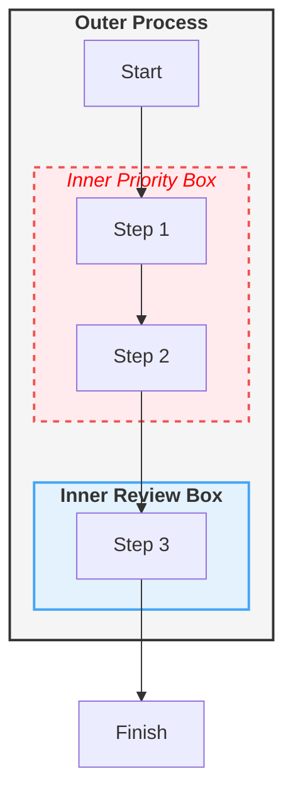

 flowchart TD
    A[Step 1] --> B[Step 2]
    B --> C{Decision point?}
    C -->|Yes| D[Outcome A]
    C -->|No| E[Outcome B] 

flowchart TD
    A[Insulin deficiency] --> B[Increased lipolysis]
    A --> C[Decreased glucose uptake by cells]
    B --> D[Free fatty acids to liver]
    D --> E[Ketogenesis]
    E --> F[Ketoacidemia]
    C --> G[Hyperglycemia]
    G --> H[Osmotic diuresis]
    H --> I[Dehydration and electrolyte loss]
    F --> J{pH less than 7.3?}
    J -->|Yes| K[Diagnosis: DKA confirmed]
    J -->|No| L[Reassess - consider other cause]

